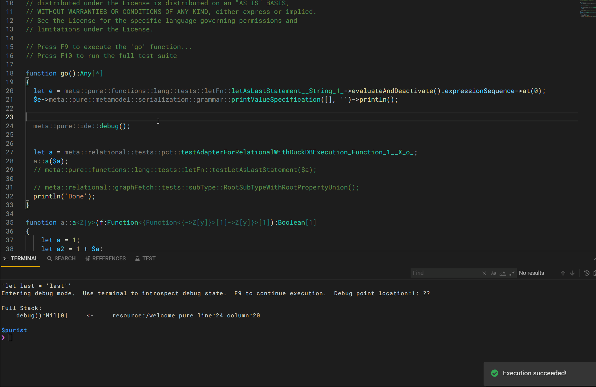

# legend-engine

Execution engine for Legend. It provides:
- A Pure parser and compiler.
- An execution engine, generating and/or executing execution plans when provided with a Pure function, a Mapping and a Runtime.
- Access point for model transformers written using the Pure language (soon to come).

## Development setup

- This application uses Maven 3.6+ and JDK 11. Run `mvn install` to compile.
- To start the server, please use the `Main` class `org.finos.legend.engine.server.Server` with the parameters: `server legend-engine-config/legend-engine-server/legend-engine-server-http-server/src/test/resources/org/finos/legend/engine/server/test/userTestConfig.json`.
- You can test by trying http://127.0.0.1:6300 on a web browser. The swagger page can be accessed at http://127.0.0.1:6300/api/swagger

> Given the size of the project, developers should consider using parallelism to speed up build times, given enough RAM is provided.
> In IntelliJ IDEA, this can be done by setting `Thread Count` (in `Preferences > Build, Execution, Deployment > Build Tools > Maven`) and `Shared build process heap size (Mbytes)` (in `Preferences > Build, Execution, Deployment > Compiler > Java Compiler`).
> For example, setting `Thread Count` to `4` and `Shared build process heap size (Mbytes)` to `30000` can significantly reduce build times, you need to fine-tune this to match your machine's specs.
> 
> ⚠️ It's also important to disable the `Clear output directory on rebuild` in `Preferences > Build, Execution, Deployment > Complier` as this removes generated resources needed to run the servers from the IDE.

### Starting Pure IDE

If you're making changes to the `Pure` codebase, it's highly recommended that you also spin up our `Pure IDE` application:

- To start the server, please use the `Main` class `org.finos.legend.engine.ide.PureIDELight` with the parameters: `server legend-engine-pure/legend-engine-pure-ide/legend-engine-pure-ide-light-http-server/src/main/resources/ideLightConfig.json`.
- You can now access the IDE at http://127.0.0.1:9200/ide in a web browser.

#### Debugging Pure Code

To debug your `Pure` code, you need to use the `meta::pure::ide::debug()` function to create breakpoints.

When you execute the `go` function using _F9_, the execution will be paused at the breakpoint, and a **_summary_** will be printed.

This **_summary_** include the current stack (for easy navigation to the current breakpoint point) and the variables accessible on such breakpoint.   
 
Once in a breakpoint, using the Pure IDE terminal, you can take certain debugging actions:

- `debug` or `debug summary`: print the aforementioned **_summary_**.
- `debug <pure expression>`: evaluate the given expression.  All variables on the current breakpoint are available.
  - ie. `debug $f->map(x | $x->type())`: introspect variable `f` and apply some functions to it.
- `debug abort`: stop the current execution.  Pressing _F9_ after an abort command will start the execution from the beginning (ie. from the `go` function) 

To resume the execution to next breakpoint or to completion, just press _F9_ again.

Caveats:
- Editing the code while on a breakpoint will lead to evaluation errors.  You need to complete or abort current execution to pick new changes.
- Print commands within the debug expressions won't show on console.  Avoid the print and evaluate to a string value instead.

## Roadmap

Visit our [roadmap](https://github.com/finos/legend#roadmap) to know more about the upcoming features.

## Contributing

Visit Legend [Contribution Guide](https://github.com/finos/legend/blob/master/CONTRIBUTING.md) to learn how to contribute to Legend.

## License

Copyright 2020 Goldman Sachs

Distributed under the [Apache License, Version 2.0](http://www.apache.org/licenses/LICENSE-2.0).

SPDX-License-Identifier: [Apache-2.0](https://spdx.org/licenses/Apache-2.0)

