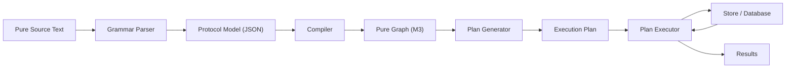
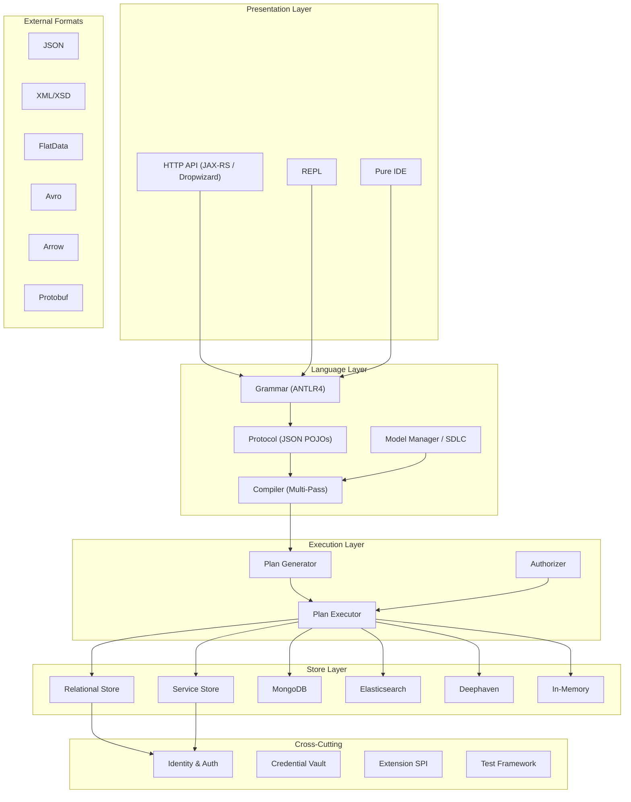
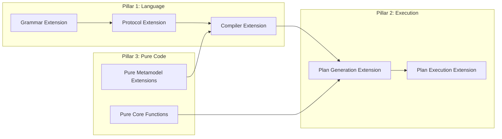
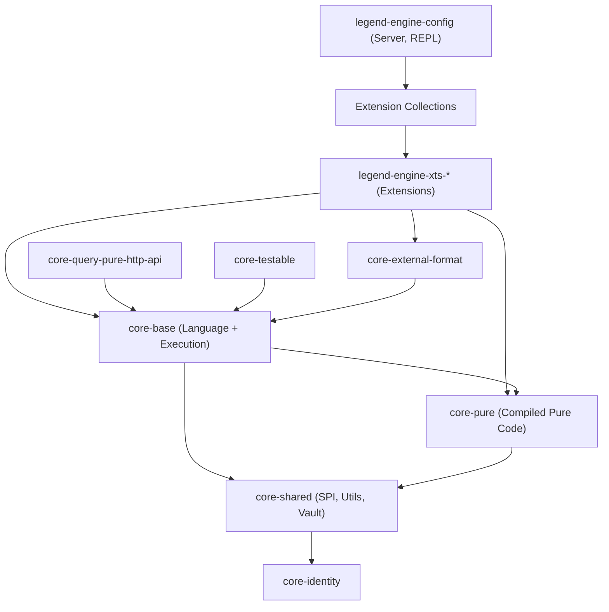
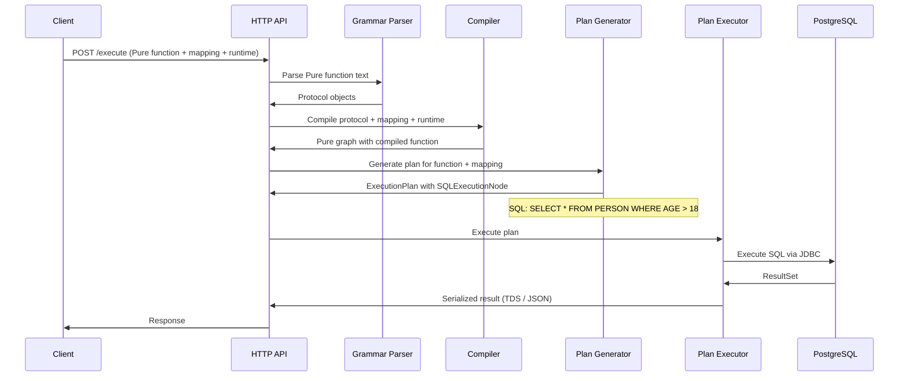

# 02 — Architecture Overview

## End-to-End Data Flow

Legend Engine processes data through a well-defined pipeline. Understanding this pipeline is essential to re-engineering any component:

Each stage is independently extensible:

| Stage | Module Area | What Happens |
|-------|-------------|--------------|
| **Parse** | `legend-engine-language-pure-grammar` | ANTLR4 turns Pure text into a parse tree, then into protocol objects |
| **Protocol** | `legend-engine-protocol-pure` | JSON-serializable Java POJOs representing every Pure element |
| **Compile** | `legend-engine-language-pure-compiler` | Multi-pass transformation from protocol objects to Pure graph (M3 metamodel) |
| **Plan Generation** | `legend-engine-executionPlan-generation` | Given a Pure function + Mapping + Runtime, produce an execution plan tree |
| **Plan Execution** | `legend-engine-executionPlan-execution` | Walk the plan tree, dispatch to store-specific executors, assemble results |

## Layer Architecture

The system is organized into horizontal layers, each with clear responsibilities:

## Key Abstraction: The "Three Pillars"

Every new feature in Legend (a new store, format, or deployment target) plugs into the platform through **three pillars** that map to the three pipeline stages:

For example, adding support for a new database (say, MySQL) requires:
1. **Grammar extension** — new DSL syntax for MySQL-specific connection config
2. **Protocol extension** — Java POJOs for MySQL connection, datasource spec
3. **Compiler extension** — compiling MySQL protocol objects into Pure graph objects
4. **Plan generation extension** — generating SQL specifically for MySQL dialect
5. **Plan execution extension** — connecting to MySQL and executing the generated SQL
6. **Pure code** — any MySQL-specific Pure functions or metamodel entries

## Module Dependency Hierarchy

The dependency flow is **strictly top-down** — lower layers never depend on higher layers:

## Design Principles

### 1. Extension-First Architecture
Every major feature area (stores, formats, activators, query protocols) is an **extension**. The core platform defines SPIs and contracts; concrete implementations live in `xts-*` modules. This keeps the core small and allows independent evolution of each extension.

### 2. Separation of Grammar / Compiler / Execution
These three concerns are cleanly separated into distinct modules and phases. Grammar modules know nothing about execution. Compiler modules know nothing about SQL generation. This separation enables:
- Independent testing of each phase
- Swapping parsers or compilers without affecting execution
- Clear ownership boundaries for large teams

### 3. Protocol as the Interchange Format
The **protocol model** (`legend-engine-protocol-pure`) serves as the universal interchange format. Pure source text is parsed into protocol. SDLC stores protocol. The compiler reads protocol. APIs accept and return protocol. This means any tool that can produce or consume protocol JSON can integrate with Legend Engine.

### 4. Pure / Java Duality
Many concepts exist in both Pure and Java:
- **Pure metamodel** — the type-theoretic model (classes, properties, functions) living in the Pure graph
- **Protocol model** — Java POJOs for JSON serialization
- **Runtime implementations** — Java code that actually executes (SQL generation, connection management)

The compiler bridges from protocol (Java) to Pure graph (M3). Plan generation bridges from Pure graph back to Java execution code.

### 5. Protocol Versioning
Protocol models are versioned (e.g., `v1`) to support backward compatibility. When the metamodel evolves, new protocol versions can be introduced without breaking existing clients. The API layer accepts a `clientVersion` parameter to negotiate which protocol to use.

### 6. Store-Agnostic Execution Plans
Execution plans are **abstract** — they describe *what* to compute, not how. Store-specific plan nodes (e.g., `SQLExecutionNode`, `InMemoryExecutionNode`) handle the *how*. This allows the plan generator to compose operations across multiple stores in a single plan.

## Data Model Concepts

To understand how Legend Engine works, you need to understand the key modeling concepts:

| Concept | Purpose | Example |
|---------|---------|---------|
| **Class** | A data model type with properties | `Person { name: String, age: Integer }` |
| **Mapping** | Rules for transforming between models or from store to model | `Mapping PersonMapping { Person: Relational { ... } }` |
| **Runtime** | Configuration specifying which stores and connections to use | `Runtime { mappings: [...], connections: [...] }` |
| **Store** | Physical data storage definition | `Database MyDB { Table PERSON (...) }` |
| **Connection** | How to connect to a store | `RelationalDatabaseConnection { type: Postgres, ... }` |
| **Function** | A Pure function expressing business logic | `|Person.all()->filter(p | $p.age > 18)` |
| **Service** | A packaged, tested, deployable function | `Service GetAdults { ... }` |
| **Binding** | Links an external format schema to a model | `Binding PersonBinding { ... }` |

## Execution Example: End-to-End

Here's what happens when a user executes `|Person.all()->filter(p | $p.age > 18)` with a relational mapping:

## Next

→ [03 — Pure Language Pipeline](03-pure-language-pipeline.md)
