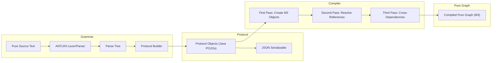
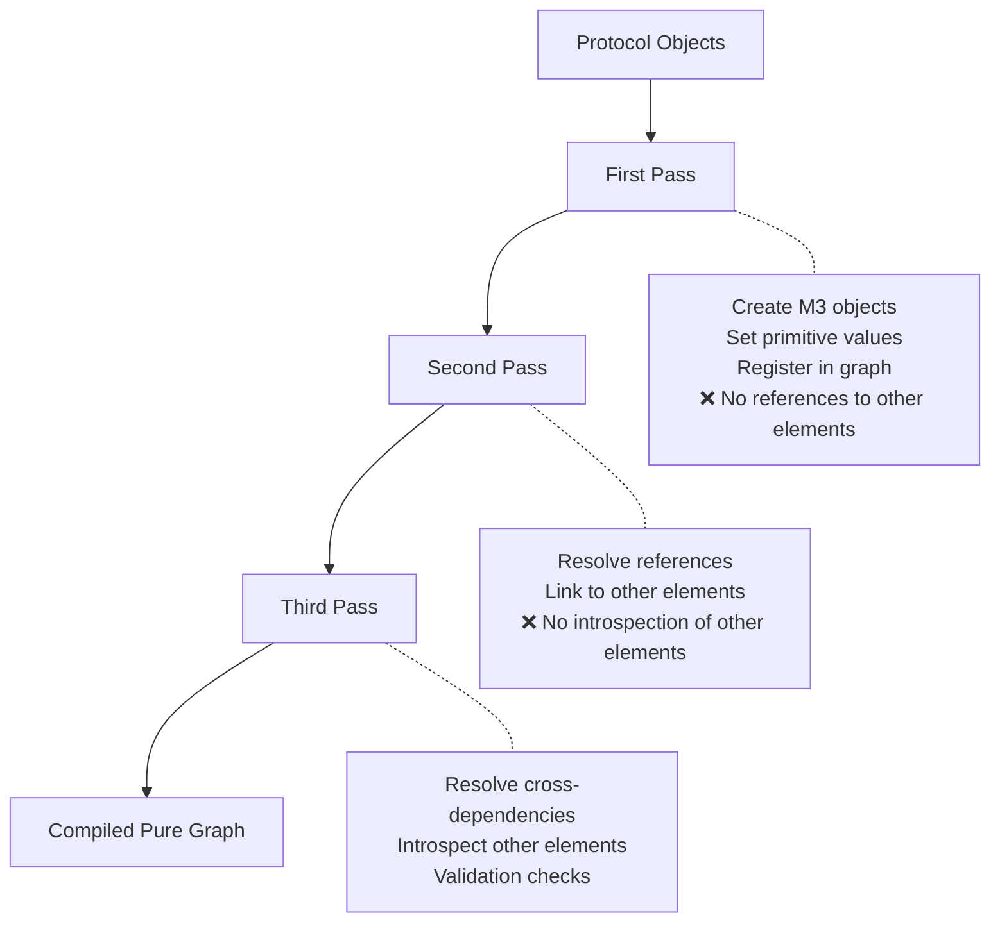

# 03 — Pure Language Pipeline

The Pure Language Pipeline is the heart of Legend Engine's frontend — it transforms human-authored Pure source text into a compiled, executable in-memory graph. This pipeline has four major stages: **Grammar**, **Protocol**, **Compiler**, and **Model Manager**.

## Pipeline Overview



## Module Reference

| Module | Path | Purpose |
|--------|------|---------|
| Grammar | `legend-engine-core-language-pure/legend-engine-language-pure-grammar` | ANTLR4 parsing of Pure text |
| Grammar HTTP API | `legend-engine-core-language-pure/legend-engine-language-pure-grammar-http-api` | REST endpoints for parsing |
| Compiler | `legend-engine-core-language-pure/legend-engine-language-pure-compiler` | Multi-pass compilation to Pure graph |
| Compiler HTTP API | `legend-engine-core-language-pure/legend-engine-language-pure-compiler-http-api` | REST endpoints for compilation |
| Protocol | `legend-engine-core-language-pure/legend-engine-protocol-pure` | Versioned protocol model (POJOs) |
| Protocol HTTP API | `legend-engine-core-language-pure/legend-engine-protocol-http-api` | Protocol-level REST endpoints |
| Model Manager | `legend-engine-core-language-pure/legend-engine-language-pure-modelManager` | Model composition and loading |
| Model Manager SDLC | `legend-engine-core-language-pure/legend-engine-language-pure-modelManager-sdlc` | SDLC-backed model loading |

---

## Stage 1: Grammar (Parsing)

### What It Does
The grammar layer transforms Pure source text into protocol objects. Pure uses a **section-based grammar** — different sections of a Pure file use different DSLs, each introduced by a `###` header:

```pure
###Pure
Class model::Person
{
  name: String[1];
  age: Integer[1];
}

###Relational
Database store::MyDB
(
  Table PERSON (NAME VARCHAR(200), AGE INTEGER)
)

###Mapping
Mapping mapping::PersonMapping
(
  model::Person: Relational
  {
    name: [store::MyDB]PERSON.NAME,
    age: [store::MyDB]PERSON.AGE
  }
)
```

### How It Works

1. **Top-level parser** identifies sections by their `###SectionName` headers
2. **Section-specific parsers** (grammar extensions) parse the content of each section
3. Each parser produces **protocol objects** — Java POJOs representing the parsed elements
4. Grammar extensions are discovered via `ServiceLoader` — each extension registers the section names it handles

### Extension Point: Grammar Extensions

To add a new DSL section, you implement a grammar extension that provides:
- A **parser** — ANTLR4 grammar or hand-written parser for the section
- A **composer** — turns protocol objects back into Pure text (round-trip support)
- Section name registration (e.g., `###MyNewSection`)

Grammar extensions are plugged in via Java's `ServiceLoader` mechanism, meaning new sections can be added without modifying core grammar code.

### Key Classes
- Grammar parsers are typically under `org.finos.legend.engine.language.pure.grammar.from`
- Grammar composers are under `org.finos.legend.engine.language.pure.grammar.to`

---

## Stage 2: Protocol (Interchange Format)

### What It Does
The protocol model is a set of **plain Java POJOs** that serve as the universal interchange format across the entire platform. Every tool that interacts with Legend Engine — Studio, SDLC, CLI, HTTP API — communicates through protocol objects serialized as JSON.

### Key Characteristics

- **Versioned**: Protocol models live under version namespaces (e.g., `v1`). This allows backward-compatible evolution.
- **JSON-serializable**: Uses Jackson for serialization/deserialization with type discriminators for polymorphism.
- **Flat hierarchy**: Protocol objects are intentionally "flat" compared to the rich Pure metamodel — they are optimized for serialization, not computation.
- **Extensible**: Extension modules add protocol subtypes registered through `ProtocolSubTypeInfo`.

### Base Types

All protocol packageable elements extend from `PackageableElement`, which provides:
- `package` — the Pure package path (e.g., `model::domain`)
- `name` — the element name
- `sourceInformation` — line/column tracking for error reporting

### Protocol vs. Pure Metamodel

| Protocol | Pure Metamodel (M3) |
|----------|---------------------|
| Java POJOs | Pure graph instances (Java wrappers around M3 core instances) |
| Optimized for serialization | Optimized for computation and type checking |
| Flat, string-based references | Resolved object references |
| Versioned | Single canonical model |

---

## Stage 3: Compiler (Multi-Pass Compilation)

### What It Does
The compiler transforms protocol objects into a **Pure graph** — a rich, typed, interlinked in-memory representation based on the Pure M3 metamodel. The Pure graph is what the execution engine ultimately operates on.

### Multi-Pass Architecture

Compilation proceeds in **three passes**, each with strict rules about what operations are permitted:



#### First Pass: Object Creation
- Creates Pure metamodel (M3) objects and registers them in the Pure graph
- Sets only primitive/scalar values (strings, numbers, booleans)
- **Must not** reference any other elements in the graph
- Outputs: graph is populated with "skeleton" objects

#### Second Pass: Reference Resolution
- Resolves references to other elements (e.g., a class property's type points to another class)
- Populates complex fields that depend on other elements existing
- **Must not** introspect the *content* of other elements or validate correctness

#### Third Pass: Cross-Dependency Resolution
- Resolves cross-dependencies between elements
- Can introspect other elements' content (e.g., check that a mapping's source class has the expected properties)
- Performs validation and correctness checks

### Prerequisite Ordering

The compiler uses two mechanisms to determine compilation order:

1. **Prerequisite Classes** (passes 1 & 2): You declare which element types your element depends on (e.g., `Database` depends on `Mapping`). All elements of prerequisite types are compiled first.

2. **Prerequisite Elements** (pass 3): You declare specific element instances your element depends on. This enables fine-grained ordering within a single element type.

Circular dependencies are detected and reported as `EngineException`.

### Extension Point: Compiler Processors

Each packageable element type has a `Processor<T>` that defines its compilation behavior across all three passes:

```java
Processor.newProcessor(
    MyElement.class,                    // Element class
    List.of(Mapping.class),            // Prerequisite classes
    (element, context) -> { ... },     // First pass
    (element, context) -> { ... },     // Second pass  
    (element, context) -> { ... },     // Third pass
    (element, context) -> { ... }      // Prerequisite elements pass
);
```

> **See also**: [Compiler Extension Processor docs](../compiler/compiler-extension-processor.md)

### CompileContext

The `CompileContext` object provides access to:
- The current state of the Pure graph
- Helper methods for resolving elements by path
- Type resolution utilities
- Source information for error reporting

---

## Stage 4: Model Manager

### What It Does
The Model Manager is responsible for **loading and composing** Pure models from various sources. It serves as the bridge between model storage (SDLC, local files) and the compiler.

### Model Sources

| Source | Module | Description |
|--------|--------|-------------|
| SDLC | `legend-engine-language-pure-modelManager-sdlc` | Loads models from the Legend SDLC (versioned, reviewed models) |
| Local | (base model manager) | Loads models provided directly in the request |
| Composite | (model composition) | Combines models from multiple sources |

### How Models Are Composed

When a request comes in (e.g., execute a function), the model manager:

1. Loads the **platform model** (built-in Pure types and functions)
2. Loads the **user model** from SDLC or from the request payload
3. Combines them into a single set of protocol objects
4. Passes the combined model to the compiler

This composition allows users to work with models that depend on platform-provided types and on models from other SDLC projects.

---

## Round-Trip Capability

The grammar layer supports **round-trip** transformation:

```
Pure text → parse → protocol → compose → Pure text (semantically identical)
```

This is critical for tools like Legend Studio, which need to display Pure text, let users edit it, parse the edits, and then re-compose the full text.

Round-trip fidelity is tested extensively — the composed output should be semantically identical to the original input (though formatting may differ).

---

## Key Takeaways for Re-Engineering

1. **To add a new DSL section**: Implement a grammar extension (parser + composer), protocol types, and compiler processor.
2. **To modify compilation behavior**: Look at the `Processor<T>` for the relevant element type. Understand which pass your change belongs in.
3. **To change serialization format**: Modify the protocol model. Consider protocol versioning implications.
4. **To add a new model source**: Extend the Model Manager. Follow the SDLC model manager as a reference.

## Next

→ [04 — Execution Pipeline](04-execution-pipeline.md)
