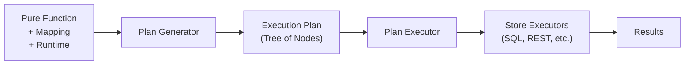
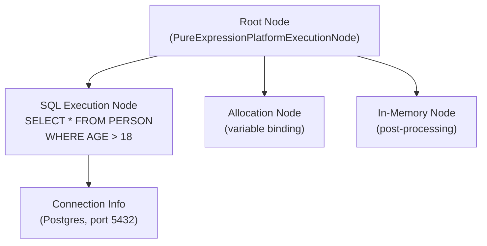
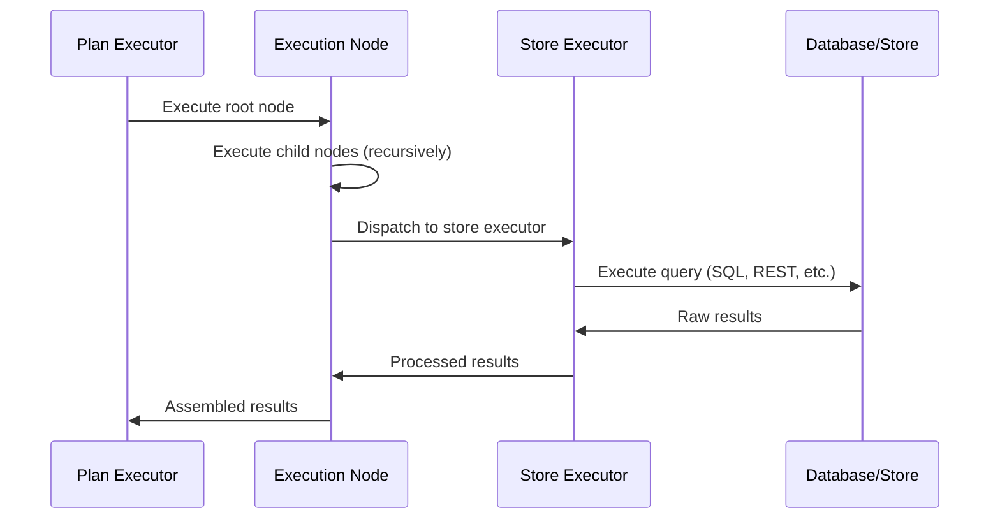

# 04 — Execution Pipeline

The execution pipeline takes a compiled Pure function (with its mapping and runtime) and produces concrete results by executing against real data stores. It operates in two major phases: **Plan Generation** and **Plan Execution**.

## Pipeline Overview



## Module Reference

| Module | Path | Purpose |
|--------|------|---------|
| Plan Generation | `core-base/legend-engine-core-executionPlan-generation/legend-engine-executionPlan-generation` | Generates execution plans from Pure functions |
| Plan Execution | `core-base/legend-engine-core-executionPlan-execution/legend-engine-executionPlan-execution` | Executes plans by dispatching to store executors |
| Execution HTTP API | `core-base/legend-engine-core-executionPlan-execution/legend-engine-executionPlan-execution-http-api` | REST endpoints for plan execution |
| Authorizer | `core-base/legend-engine-core-executionPlan-execution/legend-engine-executionPlan-execution-authorizer` | Authorization checks on execution plans |
| In-Memory Store | `core-base/legend-engine-core-executionPlan-execution/legend-engine-executionPlan-execution-store-inMemory` | In-memory data processing executor |
| Dependencies | `core-base/legend-engine-core-executionPlan-execution/legend-engine-executionPlan-dependencies` | Shared types for execution plan nodes |

---

## Phase 1: Plan Generation

### What It Does
The plan generator takes three inputs and produces an **execution plan**:

| Input | Description |
|-------|-------------|
| **Pure Function** | The query to execute (e.g., `Person.all()->filter(p \| $p.age > 18)`) |
| **Mapping** | Rules for how model properties map to store columns/fields |
| **Runtime** | Configuration specifying which stores and connections to use |

### How It Works

1. **Analyze the function**: Determine what data is needed, which model elements are referenced
2. **Resolve through mapping**: Follow the mapping to determine which stores hold the data
3. **Generate store-specific nodes**: For each store, generate the appropriate query (SQL for relational, REST calls for service store, etc.)
4. **Compose the plan tree**: Assemble nodes into a tree structure, handling cross-store joins, in-memory processing, and result assembly

### Execution Plan Structure

An execution plan is a **tree of nodes**, where each node represents a single operation:



#### Common Node Types

| Node Type | Purpose |
|-----------|---------|
| `SQLExecutionNode` | Execute SQL against a relational database |
| `InMemoryExecutionNode` | Process data in-memory (filter, transform, aggregate) |
| `AllocationExecutionNode` | Bind intermediate results to variables |
| `ConstantExecutionNode` | Provide constant values |
| `PureExpressionPlatformExecutionNode` | Evaluate Pure expressions in the Java runtime |
| `SequenceExecutionNode` | Execute child nodes in sequence |
| `GraphFetchExecutionNode` | Execute graph fetch queries (tree-structured data retrieval) |
| `ExternalFormatExternalizeExecutionNode` | Serialize results to an external format |
| `ExternalFormatInternalizeExecutionNode` | Deserialize input from an external format |

### Extension Point: Plan Generation Extensions

Store-specific plan generation is plugged in through extensions. Each store module provides:
- Logic to translate Pure function operations into store-specific queries
- Node types specific to that store (e.g., `SQLExecutionNode` for relational)
- Optimization passes for the generated plan

---

## Phase 2: Plan Execution

### What It Does
The plan executor walks the execution plan tree and dispatches each node to the appropriate executor. Results flow back up the tree, are assembled, and returned to the caller.

### How It Works



### Execution Context

The executor maintains an **execution state** that includes:
- **Variable bindings** — results from allocation nodes
- **Connection pool** — active database connections
- **Identity** — the user's identity for authentication
- **Execution options** — timeout, fetch size, etc.

### Results

Execution produces results in one of several formats:

| Result Type | Description |
|-------------|-------------|
| **TDS (Tabular Data Set)** | Rows and columns — the most common result for relational queries |
| **JSON** | Serialized object structures for graph fetch queries |
| **Streaming** | Large result sets streamed without full materialization |
| **Void** | Side-effect-only operations (e.g., data writes) |

---

## Plan Serialization

Execution plans are **serializable to JSON**. This enables:

- **Plan caching** — generate once, execute many times
- **Remote execution** — send a plan to a different engine instance for execution
- **Debugging** — inspect the plan to understand what will be executed
- **Plan comparison** — compare plans across engine versions for regression testing

```json
{
  "rootExecutionNode": {
    "_type": "sql",
    "sqlQuery": "SELECT \"root\".NAME, \"root\".AGE FROM PERSON AS \"root\" WHERE \"root\".AGE > 18",
    "connection": {
      "_type": "RelationalDatabaseConnection",
      "type": "Postgres",
      "datasourceSpecification": { ... },
      "authenticationStrategy": { ... }
    },
    "resultType": {
      "_type": "tds",
      "tdsColumns": [
        { "name": "NAME", "type": "String" },
        { "name": "AGE", "type": "Integer" }
      ]
    }
  }
}
```

---

## Authorizer

The authorizer performs **plan-level authorization checks** before execution. This allows organizations to enforce policies such as:

- Restricting which users can query which databases
- Limiting the scope of data accessible through certain connections
- Enforcing row-level or column-level security

The authorizer operates on the generated plan tree, inspecting nodes and their connection metadata before allowing execution to proceed.

---

## In-Memory Execution

Not all operations can be pushed down to a store. The **in-memory executor** handles:

- **Cross-store joins** — when data comes from multiple stores, joins happen in-memory
- **Post-processing** — operations that can't be expressed in a store's query language
- **Pure function evaluation** — evaluating Pure expressions that have no store equivalent
- **Aggregation** — when the store lacks certain aggregation capabilities

The in-memory executor uses a column-oriented data model for efficiency.

---

## Relation Functions and TDS

Legend Engine supports **relation functions** — a set of operations on tabular data:

| Function | Description |
|----------|-------------|
| `filter` | Filter rows by predicate |
| `map` | Transform columns |
| `extend` | Add computed columns |
| `groupBy` | Group and aggregate |
| `sort` | Order rows |
| `limit` / `drop` / `take` / `slice` | Control result set size |
| `join` | Combine relations |
| `rename` | Rename columns |
| `select` | Project specific columns |
| `pivot` / `unpivot` | Reshape data |
| `reduce` | Window-based aggregation |

These functions work across all stores — the plan generator translates them to the appropriate store-specific operations (SQL, REST, in-memory).

---

## Key Takeaways for Re-Engineering

1. **To add a new execution node type**: Define a new `ExecutionNode` subclass, a corresponding `ExecutionNodeExecutor`, and wire it into the plan generation logic.
2. **To modify SQL generation**: Look at the relational store's plan generation extension — SQL generation is store-specific, not part of the core pipeline.
3. **To change how results are assembled**: Modify the result processing in the plan executor for the relevant node type.
4. **To add a new result format**: Extend the result type hierarchy and add serialization logic.

## Next

→ [05 — Extension System & SPI](05-extension-system.md)
