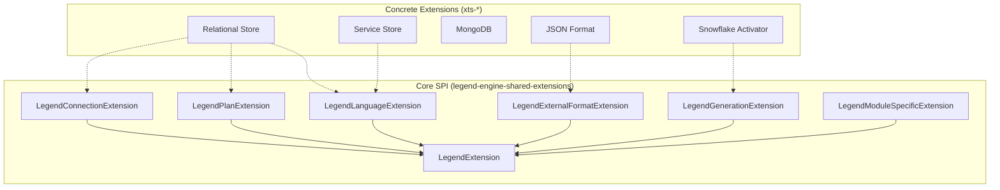

# 05 — Extension System & SPI

Legend Engine's architecture is fundamentally **extension-driven**. The core defines contracts and SPIs (Service Provider Interfaces); all concrete store, format, and activator implementations live in extension modules (`legend-engine-xts-*`). This document explains how the extension system works and how to create new extensions.

## Extension Architecture



## Extension Interfaces

All extension interfaces live in `legend-engine-core-shared/legend-engine-shared-extensions`:

| Interface | Type Group | Purpose |
|-----------|-----------|---------|
| `LegendExtension` | (base) | Root interface; provides `group()`, `type()`, `typeGroup()` |
| `LegendLanguageExtension` | `Lang` | Grammar parsing, protocol types, compiler processors |
| `LegendPlanExtension` | `Plan` | Execution plan generation and execution |
| `LegendConnectionExtension` | `Connection` | Connection management for stores |
| `LegendExternalFormatExtension` | (varies) | External format serialization/deserialization |
| `LegendGenerationExtension` | (varies) | Code generation and artifact generation |
| `LegendModuleSpecificExtension` | (varies) | Module-specific concerns not covered by other interfaces |

### LegendExtension (Base)

```java
public interface LegendExtension {
    default MutableList<String> group()     { return Lists.mutable.empty(); }
    default String type()                   { return "Unknown Type " + this.getClass().getName(); }
    default MutableList<String> typeGroup() { return Lists.mutable.empty(); }
}
```

The `typeGroup()` method categorizes extensions for runtime organization: `"Lang"`, `"Plan"`, `"Connection"`, etc.

---

## Discovery: ServiceLoader

Extensions are discovered at runtime using Java's **`ServiceLoader`** mechanism. Each extension module provides a `META-INF/services` file that registers its implementation:

```
# META-INF/services/org.finos.legend.engine.shared.core.extension.LegendExtension
org.finos.legend.engine.language.pure.grammar.from.RelationalGrammarParserExtension
```

The `Extensions` utility class in `legend-engine-shared-core` loads all registered extensions at startup:

```java
ServiceLoader<LegendExtension> extensions = ServiceLoader.load(LegendExtension.class);
```

This means:
- No compile-time coupling between core and extensions
- Extensions are included simply by adding them to the classpath
- New extensions can be added without modifying any core code

---

## Extension Collections

Extension collections are **assembly modules** that aggregate all extensions for a deployment:

| Module | Path | Purpose |
|--------|------|---------|
| Execution Collection | `legend-engine-config/legend-engine-extensions-collection-execution` | All extensions needed for plan execution |
| Generation Collection | `legend-engine-config/legend-engine-extensions-collection-generation` | All extensions needed for code generation |

These modules have no code — they simply declare Maven dependencies on all extension modules. This provides a single dependency for applications that need "everything."

For a minimal deployment, an application can instead depend on only the specific extension modules it needs.

---

## Anatomy of an Extension Module

A typical extension module (e.g., `legend-engine-xts-myFeature`) contains these sub-modules:

```
legend-engine-xts-myFeature/
├── legend-engine-xt-myFeature-pure/       # Pure code (.pure files, PARs)
├── legend-engine-xt-myFeature-protocol/   # Protocol model (Java POJOs)
├── legend-engine-xt-myFeature-grammar/    # Grammar parser & composer
├── legend-engine-xt-myFeature-compiler/   # Compiler processor
├── legend-engine-xt-myFeature-execution/  # Plan generation & execution
├── legend-engine-xt-myFeature-http-api/   # REST endpoints (optional)
├── legend-engine-xt-myFeature-generation/ # Code generation (optional)
└── pom.xml
```

Not all sub-modules are required — a simple extension might only need grammar + protocol + compiler.

---

## How to Create a New Extension

### Step 1: Define Protocol Types
Create protocol POJOs for your new element type in a `*-protocol` module:
```java
public class MyElement extends PackageableElement {
    public String myProperty;
    // ... JSON-serializable fields
}
```

### Step 2: Write a Grammar Extension
Create an ANTLR4 grammar or hand-written parser in a `*-grammar` module:
- Register a new section name (e.g., `###MySection`)
- Implement `MyGrammarParserExtension` to parse section content into protocol objects
- Implement `MyGrammarComposerExtension` to compose protocol objects back to text

### Step 3: Write a Compiler Processor
Define a `Processor<MyElement>` in a `*-compiler` module that handles three-pass compilation:
- First pass: create M3 objects
- Second pass: resolve references
- Third pass: validate and cross-reference

### Step 4: (Optional) Write Plan Generation/Execution
If your extension is a store or has execution semantics, add plan generation and execution logic.

### Step 5: Register via ServiceLoader
Create `META-INF/services` files registering your extension classes.

### Step 6: Add to Extension Collections
Add your module as a dependency in the appropriate extension collection modules.

---

## Key Takeaways for Re-Engineering

1. **Extension discovery is classpath-based**: Including or excluding extensions is a dependency management concern, not a code change.
2. **All major features are extensions**: Even the relational store is an extension, not core code. This means any feature can be studied, replaced, or reimplemented independently.
3. **The SPI contracts are lightweight**: Most extension interfaces simply categorize; the real contracts are in the grammar, protocol, and compiler sub-systems.
4. **Extension collections are optional**: You can build a minimal Legend Engine with only the extensions you need.

## Next

→ [06 — Store Extensions](06-store-extensions.md)
