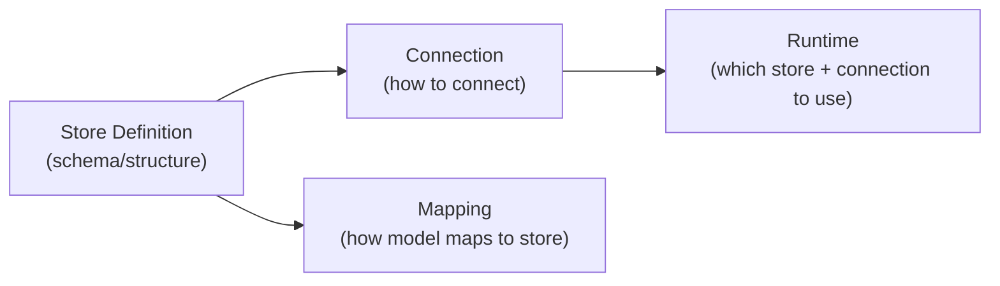

# 06 — Store Extensions

Stores are central to Legend Engine — they represent physical data sources against which queries are executed. Legend supports multiple store types, each implemented as an extension module. The **relational store** is by far the largest and most mature.

## Store Abstraction

In Legend, a **store** is a triple concept:



| Concept | Description | Example |
|---------|-------------|---------|
| **Store** | Defines the schema/structure of the physical data source | `Database MyDB ( Table PERSON (...) )` |
| **Connection** | Specifies how to connect to the store | `RelationalDatabaseConnection { type: Postgres, ... }` |
| **Mapping** | Rules mapping model properties to store fields | `Person: Relational { name: [MyDB]PERSON.NAME }` |
| **Runtime** | Bundles mappings with their connections for execution | `Runtime { mappings: [...], connections: [...] }` |

---

## Store Types

### Relational Store (`legend-engine-xts-relationalStore`)

The relational store is Legend Engine's flagship extension. It translates Pure functions into SQL for execution against relational databases.

#### Module Structure

```
legend-engine-xts-relationalStore/
├── legend-engine-xt-relationalStore-execution/     # Core relational execution
│   ├── legend-engine-xt-relationalStore-executionPlan/
│   ├── legend-engine-xt-relationalStore-executionPlan-connection/
│   └── legend-engine-xt-relationalStore-executionPlan-connection-authentication*/
├── legend-engine-xt-relationalStore-generation/     # Grammar, protocol, compiler
│   ├── legend-engine-xt-relationalStore-grammar/
│   ├── legend-engine-xt-relationalStore-protocol/
│   └── legend-engine-xt-relationalStore-compiler/
├── legend-engine-xt-relationalStore-dbExtension/    # Database-specific extensions
│   ├── legend-engine-xt-relationalStore-postgres/
│   ├── legend-engine-xt-relationalStore-snowflake/
│   ├── legend-engine-xt-relationalStore-duckdb/
│   ├── legend-engine-xt-relationalStore-h2/
│   └── ... (19 database extensions total)
├── legend-engine-xt-relationalStore-analytics/      # Relational analytics
├── legend-engine-xt-relationalStore-PCT/            # Platform Compatibility Tests
└── legend-engine-xt-relationalStore-MFT-pure/       # Multi-Function Tests
```

#### Supported Databases

| Database | Module | Status |
|----------|--------|--------|
| PostgreSQL | `legend-engine-xt-relationalStore-postgres` | Mature |
| Snowflake | `legend-engine-xt-relationalStore-snowflake` | Mature |
| DuckDB | `legend-engine-xt-relationalStore-duckdb` | Active |
| H2 | `legend-engine-xt-relationalStore-h2` | Mature (default test DB) |
| BigQuery | `legend-engine-xt-relationalStore-bigquery` | Supported |
| Databricks | `legend-engine-xt-relationalStore-databricks` | Supported |
| ClickHouse | `legend-engine-xt-relationalStore-clickhouse` | Supported |
| Oracle | `legend-engine-xt-relationalStore-oracle` | Supported |
| SQL Server | `legend-engine-xt-relationalStore-sqlserver` | Supported |
| Redshift | `legend-engine-xt-relationalStore-redshift` | Supported |
| Spanner | `legend-engine-xt-relationalStore-spanner` | Supported |
| Athena | `legend-engine-xt-relationalStore-athena` | Supported |
| Presto | `legend-engine-xt-relationalStore-presto` | Supported |
| Trino | `legend-engine-xt-relationalStore-trino` | Supported |
| Hive | `legend-engine-xt-relationalStore-hive` | Supported |
| MemSQL/SingleStore | `legend-engine-xt-relationalStore-memsql` | Supported |
| Sybase | `legend-engine-xt-relationalStore-sybase` | Supported |
| SybaseIQ | `legend-engine-xt-relationalStore-sybaseiq` | Supported |
| SparkSQL | `legend-engine-xt-relationalStore-sparksql` | Supported |

#### Key Concepts

- **SQL Generation**: The relational plan generator translates Pure relation functions into SQL. Each database extension customizes SQL dialect differences (data types, function syntax, window frame semantics).
- **Connection Management**: JDBC connections are managed through `ConnectionManagerSelector`, with connection pooling via HikariCP.
- **Semistructured Data**: Support for JSON/variant columns (e.g., Snowflake VARIANT), enabling queries into nested document data within relational tables.
- **Database Extension Pattern**: Each database provides a "db extension" that registers its SQL dialect, supported data types, and function mappings.

#### Adding a New Database

To add support for a new relational database:
1. Create a new module under `legend-engine-xt-relationalStore-dbExtension/`
2. Implement the database's SQL dialect (data types, function mappings, quoting rules)
3. Implement a connection factory for the database
4. Add PCT tests to verify function compatibility
5. Register the extension via ServiceLoader

---

### Service Store (`legend-engine-xts-serviceStore`)

The service store allows Legend to use **REST APIs as data sources**. Instead of connecting to a database, it makes HTTP calls and deserializes the responses.

#### Key Concepts
- **Service Store definition**: Describes available REST endpoints, their parameters, and response schemas
- **Mapping**: Maps model properties to fields in the API response
- **Connection**: Specifies the base URL and authentication for the REST API
- **Integration with External Formats**: Response deserialization uses the external format framework (JSON, XML, etc.)

---

### MongoDB (`legend-engine-xts-mongodb`)

MongoDB support allows Legend to query **document stores**. Documents are mapped to Pure models through document mappings.

#### Key Concepts
- **MongoDB Store**: Defines collections and their document schemas
- **Document Mapping**: Maps model properties to document field paths
- **Aggregation Pipeline**: Pure functions are translated to MongoDB aggregation pipeline stages
- **Connection**: MongoDB connection string and authentication

---

### Elasticsearch (`legend-engine-xts-elasticsearch`)

Elasticsearch support enables querying **search indices** as data sources.

#### Key Concepts
- **Elasticsearch Store**: Defines indices and their mappings
- **Query Translation**: Pure functions translated to Elasticsearch DSL queries
- **Connection**: Elasticsearch cluster URL and authentication

---

### Deephaven (`legend-engine-xts-deephaven`)

Deephaven support enables querying **real-time data grids** for streaming/ticking data scenarios.

#### Key Concepts
- **Deephaven Store**: Defines tables available in the Deephaven instance
- **gRPC Connection**: Uses gRPC protocol for communication
- **Real-time semantics**: Supports ticking data and live queries

---

## Common Store Patterns

All store extensions follow these common patterns:

### Grammar
Each store defines a `###SectionName` DSL. For example:
- `###Relational` for relational databases
- `###ServiceStore` for REST APIs
- `###MongoDB` for document stores

### Mapping Types
Each store defines how model-to-store mappings work:
- `Relational` mapping: model properties → table columns
- `ServiceStore` mapping: model properties → API response fields
- `MongoDB` mapping: model properties → document paths

### Connection Types
Each store has its own connection type with store-specific configuration:
- Host, port, credentials for databases
- Base URL, authentication for REST APIs
- Connection string for document stores

### Plan Generation
Each store translates Pure operations into store-specific queries:
- SQL for relational
- HTTP requests for service store
- Aggregation pipelines for MongoDB

---

## Key Takeaways for Re-Engineering

1. **The relational store is the reference implementation**: Study it to understand how all store pieces fit together.
2. **Database extensions are self-contained**: Each database lives in its own module and can be studied independently.
3. **SQL generation is the critical path**: Most relational work involves getting SQL generation right for specific databases and function combinations.
4. **PCT tests are the specification**: Platform Compatibility Tests define what each database must support. Start there when understanding database capabilities.
5. **Non-relational stores follow the same pattern**: Even though they query different systems, they plug into the same grammar → compiler → plan generation → execution pipeline.

> **See also**: [Existing store documentation](../store/)

## Next

→ [07 — External Format Framework](07-external-format-framework.md)
