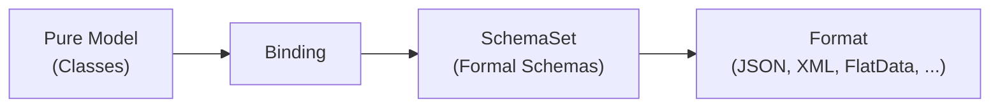

# 07 — External Format Framework

The External Format Framework enables Legend to **serialize and deserialize** data in various formats (JSON, XML, CSV, Avro, etc.) by defining formal schemas and binding them to Pure models.

## Core Concepts



| Concept | Description | Example |
|---------|-------------|---------|
| **SchemaSet** | A collection of related schemas in a specific format | A JSON Schema defining `Person` |
| **Schema** | A single schema definition within a SchemaSet | `{ "type": "object", "properties": { "name": ... } }` |
| **Binding** | Links a SchemaSet to Pure model classes | `Binding PersonBinding { schemaSet: ...; models: [Person] }` |
| **Format** | The type of schema (JSON Schema, XSD, FlatData, etc.) | `JSON`, `XML`, `FlatData` |

### SchemaSet

A packageable element defined in `###ExternalFormat` that holds schemas:

```pure
###ExternalFormat
SchemaSet model::PersonSchema
{
  format: JSON;
  schemas: [
    {
      content: '{ "type": "object", "properties": { "name": { "type": "string" } } }';
    }
  ];
}
```

### Binding

Links schemas to models, enabling automatic serialization/deserialization:

```pure
Binding model::PersonBinding
{
  schemaSet: model::PersonSchema;
  contentType: 'application/json';
  modelIncludes: [ model::Person ];
}
```

---

## External Format vs. Store

| External Format | Store |
|-----------------|-------|
| Models the **schema of data** | Models a **physical entity** storing data |
| Does not represent a physical entity | Represents a physical entity (database, API) |
| No execution capabilities on its own | Has execution capabilities (SQL, HTTP) |
| User provides data; platform deserializes | Platform connects to store and queries data |

External formats often work **with** stores — for example, deserializing JSON responses from a Service Store, or handling semistructured data in relational stores.

---

## Supported Formats

| Format | Module | Schema Type |
|--------|--------|-------------|
| **JSON Schema** | `legend-engine-xts-json` | JSON Schema (draft-04, etc.) |
| **XML/XSD** | `legend-engine-xts-xml` | W3C XML Schema Definition |
| **FlatData** | `legend-engine-xts-flatdata` | Custom DSL for CSV, fixed-width, and other flat files |
| **Avro** | `legend-engine-xts-avro` | Apache Avro schema |
| **Arrow** | `legend-engine-xts-arrow` | Apache Arrow schema |
| **Protobuf** | `legend-engine-xts-protobuf` | Protocol Buffers schema |
| **PowerBI** | `legend-engine-xts-powerbi` | Power BI format support |

---

## Use Cases

External formats are used when:

1. **Deserializing incoming data**: Parse JSON/XML/CSV into Pure model instances
2. **Serializing outgoing data**: Convert Pure model instances to JSON/XML/CSV
3. **Format conversion**: Deserialize from format A, serialize to format B
4. **Data validation**: Deserialize and validate against modeled constraints
5. **Service Store integration**: Deserialize REST API responses
6. **Semistructured relational data**: Query JSON columns in databases (e.g., Snowflake VARIANT)

### Execution Plan Integration

External formats integrate with the execution pipeline through two node types:

| Node | Purpose |
|------|---------|
| `ExternalFormatInternalizeExecutionNode` | Deserialize external data into Pure model instances |
| `ExternalFormatExternalizeExecutionNode` | Serialize Pure model instances to external format |

---

## Extending: Adding a New Format

The framework is designed for extensibility. To add a new format:

1. **Define the format**: Register format identifier and content types
2. **Schema parsing**: Implement parsing of the format's schema language
3. **Model generation**: Generate Pure model classes from schemas (optional)
4. **Serialization**: Implement serialization of Pure instances to the format
5. **Deserialization**: Implement deserialization from the format to Pure instances
6. **Compilation**: Implement compiler support for the format's schema types

> **See also**: [Steps to add a new external format](../externalFormat/steps-to-add-new-external-format.md) | [External Format README](../externalFormat/README.md) | [Binding documentation](../externalFormat/bindings/README.md)

---

## Key Takeaways for Re-Engineering

1. **SchemaSet is the packaging unit**: Group related schemas in a SchemaSet, unrelated schemas in separate sets.
2. **Bindings are the bridge**: The Binding is what connects external schemas to the Pure type system.
3. **Formats are independent plugins**: Each format module is self-contained and follows the same contract.
4. **External formats complement stores**: They handle data shape; stores handle data access.

## Next

→ [08 — Function Activators & Deployment](08-function-activators.md)
