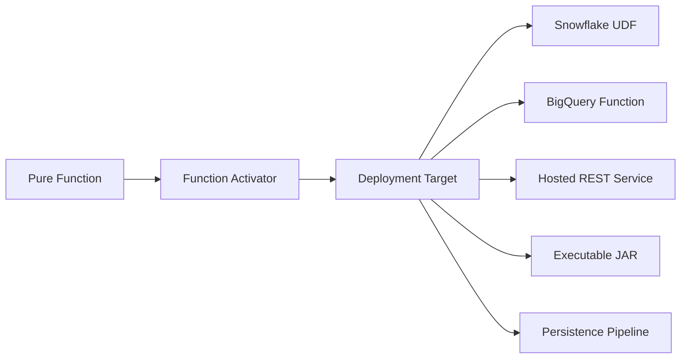
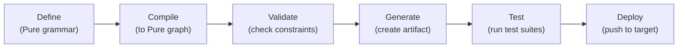

# 08 — Function Activators & Deployment

Function Activators are Legend Engine's mechanism for **packaging Pure functions and deploying them to external platforms**. They bridge the gap between model-driven development (writing Pure) and real-world deployment (Snowflake UDFs, REST APIs, cloud functions).

## Concept



A function activator:
1. Takes a **Pure function** as input
2. Generates the **deployment artifact** (SQL UDF, REST service definition, etc.)
3. Can **deploy** the artifact to the target platform
4. Supports **testing** through built-in test suites

---

## Function Activator Types

### Base Framework (`legend-engine-xts-functionActivator`)

The base module defines:
- `FunctionActivator` metamodel — base packageable element for all activators
- Validation infrastructure — checking that functions meet deployment requirements
- Generation pipeline — producing deployment artifacts from Pure functions
- Deployment pipeline — pushing artifacts to target platforms

```
legend-engine-xts-functionActivator/
├── legend-engine-xt-functionActivator-pure/        # Pure metamodel
├── legend-engine-xt-functionActivator-protocol/    # Protocol POJOs
├── legend-engine-xt-functionActivator-grammar/     # Grammar parser
├── legend-engine-xt-functionActivator-compiler/    # Compiler processor
├── legend-engine-xt-functionActivator-http-api/    # REST endpoints
├── legend-engine-xt-functionActivator-deployment/  # Deployment framework
└── legend-engine-xt-functionActivator-generation/  # Artifact generation
```

---

### Snowflake Activator (`legend-engine-xts-snowflake`)

Deploys Pure functions as **Snowflake User-Defined Functions (UDFs)**.

| Aspect | Details |
|--------|---------|
| **Target** | Snowflake database |
| **Output** | SQL UDF definition |
| **Use case** | Run Pure business logic directly in Snowflake |
| **Grammar** | `###Snowflake` section |

---

### BigQuery Activator (`legend-engine-xts-bigqueryFunction`)

Deploys Pure functions as **BigQuery routines**.

| Aspect | Details |
|--------|---------|
| **Target** | Google BigQuery |
| **Output** | BigQuery SQL function |
| **Use case** | Run Pure logic in BigQuery |
| **Grammar** | `###BigQuery` section |

---

### MemSQL/SingleStore Activator (`legend-engine-xts-memsqlFunction`)

Deploys Pure functions as **MemSQL (SingleStore) functions**.

| Aspect | Details |
|--------|---------|
| **Target** | SingleStore/MemSQL |
| **Output** | MemSQL SQL function |
| **Use case** | Run Pure logic in SingleStore |

---

### Hosted Service (`legend-engine-xts-hostedService`)

Deploys Pure functions as **managed REST API endpoints**.

| Aspect | Details |
|--------|---------|
| **Target** | Legend platform (hosted REST service) |
| **Output** | REST API endpoint |
| **Use case** | Expose Pure functions as HTTP APIs |
| **Grammar** | `###HostedService` section |

---

### Service (`legend-engine-xts-service`)

Legend Services are **packaged, tested, versioned Pure functions** with rich metadata. Unlike function activators, services are primarily a governance and testing construct.

| Aspect | Details |
|--------|---------|
| **Grammar** | `###Service` section |
| **Test suites** | Built-in test infrastructure with test data |
| **Execution** | Runs through the standard execution pipeline |
| **Versioning** | Tracked through SDLC |

```pure
###Service
Service service::GetAdults
{
  pattern: '/api/adults';
  owners: ['user1'];
  documentation: 'Returns all adults';
  execution: Single
  {
    query: |model::Person.all()->filter(p | $p.age >= 18);
    mapping: mapping::PersonMapping;
    runtime: runtime::MyRuntime;
  }
  testSuites:
  [
    testSuite1:
    {
      tests:
      [
        test1:
        {
          asserts:
          [
            assert1: { /* ... */ }
          ]
        }
      ]
    }
  ]
}
```

---

### Persistence (`legend-engine-xts-persistence`)

Persistence defines **data pipelines** for loading data into target stores.

| Aspect | Details |
|--------|---------|
| **Grammar** | `###Persistence` section |
| **Use case** | ETL/ELT pipelines, incremental data loading |
| **Modes** | Full (snapshot), Delta (incremental), Bitemporal |
| **Targets** | Relational databases |

---

### Function JAR (`legend-engine-xts-functionJar`)

Packages Pure functions as **executable JAR files** that can be run independently.

| Aspect | Details |
|--------|---------|
| **Output** | Standalone Java JAR |
| **Use case** | Batch processing, CLI tools, embedded execution |

---

## Lifecycle

All function activators follow a common lifecycle:



---

## Key Takeaways for Re-Engineering

1. **Activators are Pure → Target bridges**: They transform platform-independent Pure functions into platform-specific artifacts.
2. **The base framework is reusable**: The `xts-functionActivator` module provides common infrastructure; specific activators add target-specific logic.
3. **Services are the governance layer**: They add testing, documentation, and versioning on top of raw function execution.
4. **Persistence is about pipelines**: Unlike other activators that package functions, persistence defines ongoing data movement processes.

## Next

→ [09 — Query Protocols](09-query-protocols.md)
