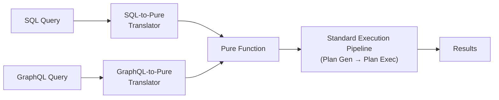
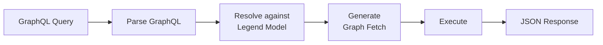

# 09 — Query Protocols (SQL & GraphQL)

Query protocols provide **alternative entry points** to Legend Engine's execution pipeline. Instead of writing Pure, users can query Legend models using familiar languages like SQL or GraphQL. These protocols translate incoming queries into Pure functions that then flow through the standard execution pipeline.

## Concept



---

## SQL Protocol (`legend-engine-xts-sql`)

### Purpose
Enables users and tools (BI platforms, notebooks, SQL clients) to query Legend models using **standard SQL**. The SQL translator parses incoming SQL statements and converts them into equivalent Pure functions.

### How It Works

1. **Parse SQL**: Incoming SQL is parsed into an AST (Abstract Syntax Tree)
2. **Resolve tables**: SQL table references are mapped to Legend model classes via registered "database schemas"
3. **Translate to Pure**: SQL operations (`SELECT`, `WHERE`, `GROUP BY`, `JOIN`, etc.) are translated to Pure function chains
4. **Execute**: The resulting Pure function flows through the standard pipeline (plan generation → execution)

### Example

```sql
-- SQL input
SELECT name, age FROM Person WHERE age > 18 ORDER BY name

-- Translates to (conceptually):
-- |Person.all()->filter(p | $p.age > 18)->project([p|$p.name, p|$p.age])->sort(asc('name'))
```

### Use Cases
- Connecting BI tools (Tableau, Power BI) to Legend models
- Ad-hoc querying from SQL notebooks or CLI tools
- Enabling users familiar with SQL to leverage Legend without learning Pure

---

## GraphQL Protocol (`legend-engine-xts-graphQL`)

### Purpose
Enables querying Legend models using **GraphQL**, supporting both data queries and schema introspection.

### How It Works



1. **Parse GraphQL**: Standard GraphQL parsing into query AST
2. **Resolve types**: GraphQL types are mapped to Legend model classes
3. **Generate Graph Fetch**: GraphQL tree queries map naturally to Legend's graph fetch execution mode
4. **Execute**: Graph fetch executes against the configured store
5. **Return JSON**: Results serialized as standard GraphQL JSON responses

### Introspection
The GraphQL module supports **introspection queries**, allowing GraphQL clients to discover the available schema derived from Legend models. This means standard GraphQL tools (GraphiQL, Apollo Studio) can explore the API automatically.

### Key Mapping

| GraphQL | Legend |
|---------|--------|
| Type | Pure Class |
| Field | Pure Property |
| Query | Pure Function |
| Argument | Function Parameter |

> **See also**: [GraphQL documentation](../graphQL/graphQL.md)

---

## Key Takeaways for Re-Engineering

1. **Query protocols are translators, not executors**: They convert external query languages to Pure, then leverage the existing execution pipeline.
2. **Adding a new query protocol**: Implement a parser for the source language and a translator to Pure functions. No changes to the execution engine needed.
3. **SQL support is selective**: Not all SQL features may be supported — the translator handles the subset that maps to Legend's capabilities.
4. **GraphQL leverages graph fetch**: Legend's graph fetch mode is a natural fit for GraphQL's tree-shaped query model.

## Next

→ [10 — Identity, Auth & Security](10-identity-auth-security.md)
