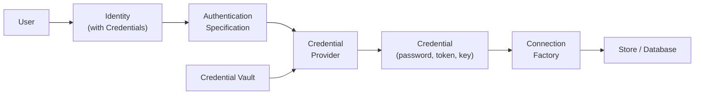
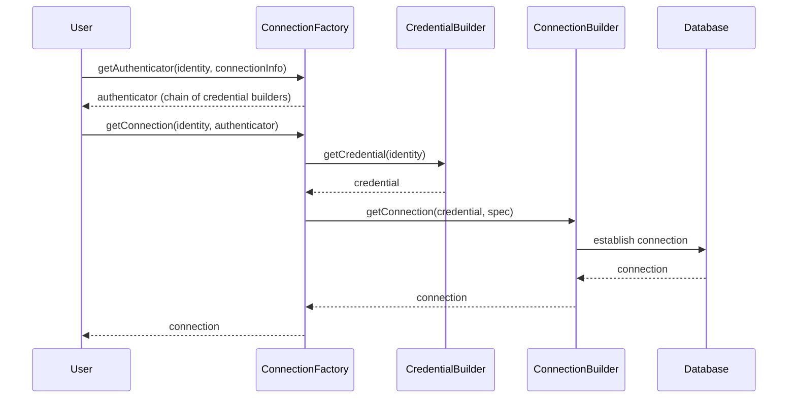

# 10 — Identity, Authentication & Security

This document covers how Legend Engine manages **user identity**, **authentication** with external systems, and **credential/secret management**. These concerns are critical for connecting to databases, APIs, and other secured resources.

## Architecture Overview



---

## Core Concepts

### Identity (`legend-engine-core-identity`)

An `Identity` represents the current user — human or system. It carries one or more `Credential`s as proof of identity.

```java
public class Identity {
    private String name;
    private List<Credential> credentials;
}
```

---

### Credential

A `Credential` is proof associated with an identity. Types include:
- Kerberos ticket
- Username/password
- OAuth token
- API key
- Key pair

---

### Authentication Specification (Pure & Java)

Describes **what type of authentication to perform** when connecting to a target system. Each store connection includes an authentication specification:

```pure
RelationalDatabaseConnection myDB
{
  type: Postgres;
  specification: LocalH2 {};
  auth: UserNamePassword
  {
    userName: 'admin';
    password: PropertiesFileSecret { propertyName: 'db.password'; };
  };
}
```

---

### Credential Provider

Consumes an `AuthenticationSpecification` and produces a `Credential`. The provider may:
- Extract credentials directly from the current `Identity`
- Compute/fetch new credentials (e.g., exchange a Kerberos ticket for an OAuth token)

---

### Intermediation Rules

When there are **multiple paths** from a specification to a credential, each path is an `IntermediationRule`. A `CredentialProvider` composes multiple rules.

---

### Credential Vault & Secrets

Secrets (passwords, keys, tokens) are **never inlined** in Legend models. Instead, model elements reference secrets stored in a vault:

| Secret Type | Description |
|-------------|-------------|
| `PropertiesFileSecret` | Secret stored in a properties file |
| `EnvironmentCredentialVaultSecret` | Secret stored in an environment variable |
| (Custom) | Organizations can implement custom vault integrations |

```java
public abstract class CredentialVaultSecret {
    // Base type for all vault references
}
```

---

## Authentication Framework (`legend-engine-xts-authentication`)

The authentication module provides a pluggable framework:

```
legend-engine-xts-authentication/
├── legend-engine-xt-authentication-protocol/     # Protocol types
├── legend-engine-xt-authentication-grammar/      # Grammar for auth specs
├── legend-engine-xt-authentication-compiler/     # Compiler support
├── legend-engine-xt-authentication-implementation-core/ # Core impl
└── legend-engine-xt-authentication-pure/         # Pure metamodel
```

### Supported Authentication Mechanisms

| Mechanism | Use Case |
|-----------|----------|
| Username/Password | Database basic auth |
| OAuth 2.0 | Cloud databases (Snowflake, BigQuery) |
| Key Pair | Snowflake key-pair authentication |
| Kerberos | Enterprise SSO |
| API Key | REST API authentication |
| GCP Application Default Credentials | Google Cloud services |
| AWS Credentials | Amazon services |

---

## New Connection Framework (PoC)

A newer, more extensible connection framework designed to unify connection management across all store types:

### Key Components

| Component | Purpose |
|-----------|---------|
| `ConnectionFactory` | Central API — given an identity and connection info, obtain a connection |
| `CredentialBuilder` | Produces credentials from identity + auth config (chainable) |
| `ConnectionBuilder` | Uses credentials to establish actual connections |
| `ConnectionPool` | Manages connection lifecycle and reuse |

### Flow



### Design Goals
1. **Consistent across store types** — same pattern for relational, MongoDB, Elasticsearch
2. **Declarative** — explicitly state which authentication flows are supported
3. **Composable** — credential builders can be chained for complex flows (e.g., Kerberos → vault → OAuth)
4. **Simplified pooling** — clean connection pool with credential-aware recycling

> **See also**: [Connection framework docs](../connection/new-connection-framework.md) | [Authentication concepts](../authentication/concepts.md) | [Authentication code organization](../authentication/code-organization.md)

---

## Key Takeaways for Re-Engineering

1. **Secrets are always externalized**: Never hardcode credentials — always reference vaults.
2. **Authentication is pluggable**: Add new mechanisms by implementing `CredentialProvider` and `IntermediationRule`.
3. **The new connection framework is the future direction**: Study it for new store integrations.
4. **Identity flows through the entire pipeline**: From HTTP request through plan execution to database connection.

## Next

→ [11 — PCT Framework](11-pct-framework.md)
