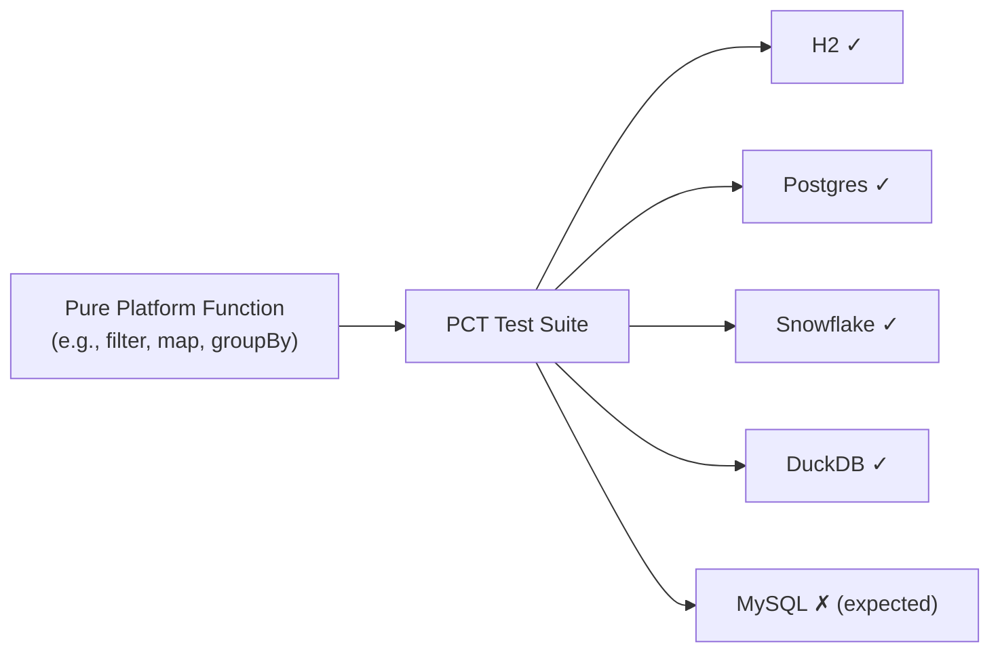

# 11 — Platform Compatibility Testing (PCT)

The PCT framework is Legend Engine's system for **verifying that Pure platform functions work correctly across all target stores and databases**. It's the specification layer that defines what each database must support.

## Concept



Pure functions are the platform's API. PCT ensures these functions behave consistently — or documents where they differ — across all supported databases.

---

## Key Concepts

| Concept | Description |
|---------|-------------|
| **Platform Function** | A Pure function available in the standard library (e.g., `filter`, `map`, `joinStrings`) |
| **PCT Test** | A test that executes a platform function against a specific database |
| **Expected Failure** | A documented case where a database doesn't support a function or has known differences |
| **Function Taxonomy** | Classification of functions into categories (Essential, Grammar, Standard) |

---

## Function Taxonomy

Platform functions are organized into three categories:

| Category | Description | Examples |
|----------|-------------|---------|
| **Essential** | Core functions that all databases should support | `filter`, `map`, `project` |
| **Grammar** | Functions tied to Pure grammar constructs | `if`, `match`, `let` |
| **Standard** | Extended standard library functions | `joinStrings`, `substring`, `toFloat` |

---

## How PCT Works

### Test Structure

Each database has a PCT test module (e.g., `legend-engine-xt-relationalStore-postgres-PCT`) containing test classes:

```java
public class Test_Relational_Postgres_EssentialFunctions_PCT { ... }
public class Test_Relational_Postgres_GrammarFunctions_PCT { ... }
public class Test_Relational_Postgres_StandardFunctions_PCT { ... }
```

### Expected Failures

When a function doesn't work on a specific database, it's annotated as an **expected failure** with a reason:

```java
@PCTExpectedFailure(reason = "Postgres does not support this function natively")
```

This approach:
- **Documents limitations** explicitly
- **Prevents false negatives** — the test suite stays green
- **Tracks progress** — removing expected failures as support is added

### Running PCT Tests

```bash
# Run PCT tests for a specific database
cd legend-engine-xts-relationalStore/legend-engine-xt-relationalStore-dbExtension/legend-engine-xt-relationalStore-postgres/legend-engine-xt-relationalStore-postgres-PCT
mvn test
```

---

## Module Structure

```
legend-engine-xts-relationalStore/
├── legend-engine-xt-relationalStore-PCT/     # Base PCT infrastructure
├── legend-engine-xt-relationalStore-dbExtension/
│   ├── legend-engine-xt-relationalStore-postgres/
│   │   └── legend-engine-xt-relationalStore-postgres-PCT/   # Postgres-specific tests
│   ├── legend-engine-xt-relationalStore-snowflake/
│   │   └── legend-engine-xt-relationalStore-snowflake-PCT/  # Snowflake-specific tests
│   └── ... (each DB has its own PCT module)
└── legend-engine-xt-relationalStore-MFT-pure/  # Multi-Function Tests (Pure)
```

---

## Adding PCT Coverage

When you add a new platform function or support an existing function on a new database:

1. **Define the Pure function** (if new) — see [Pure Function How-To](../pct/purefunction-howto.md)
2. **Wire to the database** (if relational) — see [Wiring How-To](../pct/wiring-howto.md)
3. **Run PCT tests** — execute the database-specific PCT suite
4. **Handle failures** — either fix the implementation or document as expected failure

---

## Multi-Function Tests (MFT)

MFT tests verify **composed function behavior** — testing that combinations of functions work together, not just individual functions in isolation. MFT Pure tests live in `legend-engine-xt-relationalStore-MFT-pure`.

---

## PCT vs. Unit Tests

| PCT | Unit Tests |
|-----|------------|
| Cross-database compatibility | Single-implementation correctness |
| Runs against real databases (via Testcontainers) | Often use mocks or in-memory |
| Documents database-specific limitations | Tests expected behavior |
| Part of the platform specification | Part of module implementation |

> **See also**: [PCT Overview](../pct/overview.md) | [Taxonomy](../pct/taxonomy.md) | [Conventions](../pct/conventions.md) | [Expected Failures How-To](../pct/expected-failures-howto.md)

---

## Key Takeaways for Re-Engineering

1. **PCT is the spec**: If you want to know what a database supports, look at its PCT expected failures.
2. **Expected failures are documentation, not bugs**: They explicitly document platform limitations.
3. **Adding database support = removing expected failures**: Progress is measured by removing expected failure annotations.
4. **MFT tests compound correctness**: Individual function PCT passing doesn't guarantee compositions work.

## Next

→ [12 — Runtime, Server & REPL](12-runtime-server-repl.md)
