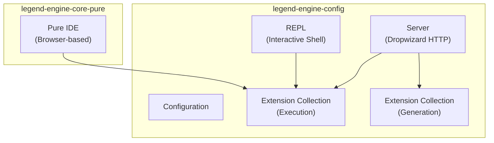

# 12 — Runtime, Server & REPL

This document covers the runtime components that bring Legend Engine to life — the HTTP server, interactive REPL, Pure IDE, and configuration system.

## Components Overview



---

## Server (`legend-engine-config/legend-engine-server`)

### Architecture

Legend Engine's HTTP server is built on **Dropwizard** — a Java framework for building RESTful web services. It bundles:

- **Jetty** for HTTP serving
- **Jersey** (JAX-RS) for REST endpoints
- **Jackson** for JSON serialization
- **Swagger** for API documentation

### Module Structure

```
legend-engine-server/
├── legend-engine-server-http-server/         # Main server application
├── legend-engine-server-integration-tests/   # Integration test suite
└── legend-engine-server-support-core/        # Shared server utilities
```

### Key Entry Point

```java
// Main class
org.finos.legend.engine.server.Server

// Start command
java -cp ... org.finos.legend.engine.server.Server server <config.json>
```

### Configuration

The server reads a JSON configuration file specifying:
- Port and host bindings
- Authentication settings (Pac4j)
- Metadata/SDLC server connections
- Vault configuration
- Logging settings

### API Endpoints

The server exposes REST endpoints registered by all loaded extensions, organized by concern:

| Area | Description |
|------|-------------|
| `/api/pure/v1/execution/execute` | Execute Pure functions |
| `/api/pure/v1/grammar/*` | Parse/compose Pure text |
| `/api/pure/v1/compilation/compile` | Compile Pure models |
| `/api/pure/v1/query/*` | Query management |
| `/api/sql/v1/execution/*` | SQL protocol execution |
| `/api/graphQL/v1/*` | GraphQL protocol |
| `/api/swagger` | API documentation |

---

## REPL (`legend-engine-config/legend-engine-repl`)

### Purpose
The REPL (Read-Eval-Print Loop) provides an **interactive command-line interface** for executing Pure expressions, querying data, and exploring models.

### Module Structure

```
legend-engine-repl/
├── legend-engine-repl-client/        # REPL client (terminal UI)
├── legend-engine-repl-relational/    # Relational-specific REPL features
├── legend-engine-repl-data-cube/     # DataCube integration
├── legend-engine-repl-interface/     # REPL interface contracts
├── legend-engine-repl-light/         # Lightweight REPL variant
└── legend-engine-repl-local/         # Local execution REPL
```

### Features
- Execute Pure expressions interactively
- Query databases and display results as tables
- Tab completion for Pure elements
- History and command editing (via JLine)
- DataCube integration for visual data exploration

---

## Pure IDE (`legend-engine-core-pure/legend-engine-pure-ide`)

### Purpose
The Pure IDE is a **browser-based development environment** for authoring and debugging Pure code. It's a lightweight alternative to Legend Studio for Pure-focused development.

### Access

```bash
# Start Pure IDE server
java -cp ... org.finos.legend.engine.ide.PureIDELight server ideLightConfig.json

# Open in browser
open http://127.0.0.1:9200/ide
```

### Features
- Pure source editing with syntax highlighting
- Execute Pure functions (F9)
- Debugging with breakpoints (`meta::pure::ide::debug()`)
- Console output
- Test execution

### Debugging
The Pure IDE supports step-through debugging:
1. Insert `meta::pure::ide::debug()` breakpoints in Pure code
2. Execute with F9
3. At breakpoints: inspect variables, evaluate expressions, abort/continue
4. Commands: `debug summary`, `debug <expression>`, `debug abort`

---

## Configuration (`legend-engine-config/legend-engine-configuration`)

### Purpose
Provides configuration classes and utilities used across the server and REPL.

### Configuration Files
Server configuration is JSON-based, typically containing:

```json
{
  "applicationName": "Legend Engine",
  "deployment": { "mode": "TEST" },
  "server": {
    "applicationConnectors": [{ "type": "http", "port": 6300 }]
  },
  "metadataserver": { ... },
  "vaults": [ ... ],
  "activators": { ... }
}
```

---

## Extension Collections

Extension collections are the **assembly point** where all needed extensions are bundled for a deployment:

| Module | Purpose |
|--------|---------|
| `legend-engine-extensions-collection-execution` | All extensions needed to execute plans |
| `legend-engine-extensions-collection-generation` | All extensions needed for code generation |

These modules contain no code — only Maven dependency declarations that pull in all extension modules. Applications can either:
- Depend on the full collection (include everything)
- Cherry-pick specific extension modules (minimal deployment)

---

## Key Takeaways for Re-Engineering

1. **The server is Dropwizard-standard**: REST endpoint patterns, configuration, and lifecycle follow Dropwizard conventions.
2. **Extension collections control what's available**: The classpath determines which features are available at runtime.
3. **The REPL is a local-first tool**: It's designed for developer productivity, not production use.
4. **Pure IDE is for Pure development**: Use it when working on Pure code; use Legend Studio for full model authoring.
5. **Configuration is JSON-based**: Server behavior is controlled through config files, not code changes.

## Next

→ [13 — Non-Functional Requirements](13-non-functional-requirements.md)
