# Grammar Extensions Reference

This document catalogs **every grammar extension** in Legend Engine — the DSL sections (introduced by `###SectionName`) that make up the Pure language. Each section has a grammar parser, a composer (for round-trip), protocol types, and a compiler processor.

## How Grammar Sections Work

A Pure file is divided into **sections**, each introduced by a `###` header. The core parser identifies section boundaries, then delegates to **section-specific grammar extensions** for parsing:

```pure
###Pure                    ← Core: classes, functions, enums, profiles, etc.
Class model::Person { ... }

###Relational              ← Store: relational database definitions
Database store::MyDB ( ... )

###Mapping                 ← Core: model-to-store mappings
Mapping mapping::MyMapping ( ... )

###Service                 ← Activator: packaged, testable functions
Service service::MyService { ... }
```

Each grammar extension implements `PureGrammarParserExtension` (or a sub-interface) and registers its section names.

---

## Core Grammar Extensions

These are always available — they ship with `legend-engine-core`.

### `###Pure` — Core Pure Language

| Aspect | Details |
|--------|---------|
| **Section Name** | `Pure` |
| **Module** | `legend-engine-core-language-pure/legend-engine-language-pure-grammar` |
| **Class** | `CorePureGrammarParser` |
| **Purpose** | The fundamental Pure language section — defines all core model elements |

**Elements defined:**
- `Class` — data model types with properties and constraints
- `Association` — bidirectional property links between classes
- `Enumeration` — fixed sets of named values
- `Function` — Pure functions with typed parameters and bodies
- `Profile` — stereotype and tag definitions for model annotations
- `Measure` — units of measurement (e.g., mass, length)

**Example:**
```pure
###Pure
Class model::Person
{
  name: String[1];
  age: Integer[1];
  addresses: model::Address[*];
}

Enumeration model::AddressType
{
  HOME, WORK
}

function model::getAdults(): model::Person[*]
{
  model::Person.all()->filter(p | $p.age >= 18)
}
```

---

### `###Data` — Embedded Data Sets

| Aspect | Details |
|--------|---------|
| **Section Name** | `Data` |
| **Module** | `legend-engine-core-language-pure/legend-engine-language-pure-grammar` |
| **Class** | `CorePureGrammarParser` (registered as additional section) |
| **Purpose** | Defines reusable, named data sets for testing |

**Example:**
```pure
###Data
Data test::PersonData
{
  ExternalFormat
  #{
    contentType: 'application/json';
    data: '[{"name": "Alice", "age": 30}]';
  }#
}
```

---

### `###Mapping` — Model-to-Store Mappings

| Aspect | Details |
|--------|---------|
| **Section Name** | `Mapping` |
| **Module** | `legend-engine-core-language-pure/legend-engine-language-pure-grammar` |
| **Class** | `CorePureGrammarParser` |
| **Purpose** | Defines how Pure model properties map to store fields/columns |

Mappings are extensible — each store adds its own mapping type (Relational, ServiceStore, MongoDB, etc.).

**Example:**
```pure
###Mapping
Mapping mapping::PersonMapping
(
  model::Person: Relational
  {
    ~primaryKey ([store::MyDB]PERSON.ID)
    name: [store::MyDB]PERSON.NAME,
    age: [store::MyDB]PERSON.AGE
  }
)
```

---

### `###Connection` — Store Connections

| Aspect | Details |
|--------|---------|
| **Section Name** | `Connection` |
| **Module** | `legend-engine-core-language-pure/legend-engine-language-pure-grammar` |
| **Class** | `CorePureGrammarParser` |
| **Purpose** | Defines named, reusable connections to stores |

Each store extension registers its own connection types.

---

### `###Runtime` — Execution Runtimes

| Aspect | Details |
|--------|---------|
| **Section Name** | `Runtime` |
| **Module** | `legend-engine-core-language-pure/legend-engine-language-pure-grammar` |
| **Class** | `CorePureGrammarParser` |
| **Purpose** | Bundles mappings with specific connections for execution |

---

## Store Grammar Extensions

### `###Relational` — Relational Database Definitions

| Aspect | Details |
|--------|---------|
| **Section Name** | `Relational` |
| **Module** | `legend-engine-xts-relationalStore/.../legend-engine-xt-relationalStore-grammar` |
| **Class** | `RelationalGrammarParserExtension` (implements `IRelationalGrammarParserExtension`) |
| **Purpose** | Defines relational database schemas (tables, columns, joins, views) |

**Sub-extension SPI**: `IRelationalGrammarParserExtension` is itself extensible — each database type (Snowflake, Postgres, etc.) can add database-specific grammar for datasource specifications, authentication strategies, post-processors, and milestoning.

**Elements defined:**
- `Database` — tables, columns, joins, views, filters
- `RelationalDatabaseConnection` — connection type with datasource spec + auth strategy
- Relational mapping class mappings

**Example:**
```pure
###Relational
Database store::MyDB
(
  Table PERSON
  (
    ID INTEGER PRIMARY KEY,
    NAME VARCHAR(200),
    AGE INTEGER,
    ADDRESS_ID INTEGER
  )

  Table ADDRESS
  (
    ID INTEGER PRIMARY KEY,
    STREET VARCHAR(200)
  )

  Join PersonAddress(PERSON.ADDRESS_ID = ADDRESS.ID)
)
```

---

### `###RelationalMapper` — Query Post-Processors

| Aspect | Details |
|--------|---------|
| **Section Name** | `RelationalMapper` |
| **Module** | `legend-engine-xts-relationalStore/.../legend-engine-xt-relationalStore-grammar` |
| **Class** | `RelationalGrammarParserExtension` (second section) |
| **Purpose** | Defines relational query post-processing rules (e.g., SQL rewriting) |

---

### `###ServiceStore` — Service Store (REST APIs)

| Aspect | Details |
|--------|---------|
| **Section Name** | `ServiceStore` |
| **Module** | `legend-engine-xts-serviceStore/legend-engine-xt-serviceStore-grammar` |
| **Class** | `ServiceStoreGrammarParserExtension` (implements `IServiceStoreGrammarParserExtension`) |
| **Purpose** | Defines REST API endpoints as data sources |

**Elements defined:**
- `ServiceStore` — service groups with REST endpoint definitions (path, method, parameters, response)
- `ServiceStoreConnection` — connection type with base URL
- ServiceStore mapping class mappings

---

### `###MongoDB` — MongoDB Document Store

| Aspect | Details |
|--------|---------|
| **Section Name** | `MongoDB` |
| **Module** | `legend-engine-xts-mongodb/.../legend-engine-xt-nonrelationalStore-mongodb-grammar-integration` |
| **Class** | `MongoDBGrammarParserExtension` (implements `IMongoDBGrammarParserExtension`) |
| **Purpose** | Defines MongoDB database collections and schemas |

**Elements defined:**
- `MongoDatabase` — collections with JSON schemas
- `MongoDBConnection` — connection type
- MongoDB mapping class mappings

---

### `###Elasticsearch` — Elasticsearch Store

| Aspect | Details |
|--------|---------|
| **Section Name** | `Elasticsearch` (V7) |
| **Module** | `legend-engine-xts-elasticsearch/legend-engine-xt-elasticsearch-V7-grammar` |
| **Class** | `ElasticsearchGrammarParserExtension` |
| **Purpose** | Defines Elasticsearch indices and their mappings |

---

### `###Deephaven` — Deephaven Real-Time Store

| Aspect | Details |
|--------|---------|
| **Section Name** | `Deephaven` |
| **Module** | `legend-engine-xts-deephaven/legend-engine-xt-deephaven-grammar` |
| **Class** | `DeephavenGrammarParserExtension` |
| **Purpose** | Defines Deephaven tables for real-time data querying |

---

## External Format Grammar Extension

### `###ExternalFormat` — Schema Sets & Bindings

| Aspect | Details |
|--------|---------|
| **Section Name** | `ExternalFormat` |
| **Module** | `legend-engine-core-external-format/legend-engine-external-format-language/legend-engine-external-format-grammar` |
| **Class** | `ExternalFormatGrammarParserExtension` |
| **Purpose** | Defines formal schemas (JSON Schema, XSD, FlatData, etc.) and bindings to Pure models |

**Elements defined:**
- `SchemaSet` — a collection of schemas in a specific format
- `Binding` — links a SchemaSet to Pure model classes

Individual formats (JSON Schema, XSD, FlatData, Avro, Protobuf) register as sub-extensions of the external format framework rather than as independent section parsers.

---

## Function Activator Grammar Extensions

### `###Snowflake` — Snowflake Function Activator

| Aspect | Details |
|--------|---------|
| **Section Name** | `Snowflake` |
| **Module** | `legend-engine-xts-snowflake/legend-engine-xt-snowflake-grammar` |
| **Class** | `SnowflakeGrammarParserExtension` |
| **Purpose** | Defines Pure functions to be deployed as Snowflake UDFs |

**Example:**
```pure
###Snowflake
SnowflakeApp app::MySnowflakeApp
{
  applicationName: 'MyApp';
  function: model::myFunction():TabularDataSet[1];
  ownership: Deployment { identifier: 'owner1'; };
}
```

---

### `###BigQuery` — BigQuery Function Activator

| Aspect | Details |
|--------|---------|
| **Section Name** | `BigQuery` |
| **Module** | `legend-engine-xts-bigqueryFunction/legend-engine-xt-bigqueryFunction-grammar` |
| **Class** | `BigQueryFunctionGrammarParserExtension` |
| **Purpose** | Defines Pure functions to be deployed as BigQuery routines |

---

### `###MemSql` — MemSQL/SingleStore Function Activator

| Aspect | Details |
|--------|---------|
| **Section Name** | `MemSql` |
| **Module** | `legend-engine-xts-memsqlFunction/legend-engine-xt-memsqlFunction-grammar` |
| **Class** | `MemSqlFunctionGrammarParserExtension` |
| **Purpose** | Defines Pure functions to be deployed as SingleStore functions |

---

### `###HostedService` — Hosted REST Service Activator

| Aspect | Details |
|--------|---------|
| **Section Name** | `HostedService` |
| **Module** | `legend-engine-xts-hostedService/legend-engine-xt-hostedService-grammar` |
| **Class** | `HostedServiceGrammarParserExtension` |
| **Purpose** | Defines Pure functions to be deployed as managed REST APIs |

---

### `###FunctionJar` — Function JAR Activator

| Aspect | Details |
|--------|---------|
| **Section Name** | `FunctionJar` |
| **Module** | `legend-engine-xts-functionJar/legend-engine-xt-functionJar-grammar` |
| **Class** | `FunctionJarGrammarParserExtension` |
| **Purpose** | Defines Pure functions to be packaged as executable JARs |

---

### `###Service` — Legend Services

| Aspect | Details |
|--------|---------|
| **Section Name** | `Service` |
| **Module** | `legend-engine-xts-service/legend-engine-language-pure-dsl-service` |
| **Class** | `ServiceParserExtension` |
| **Purpose** | Defines packaged, testable, deployable functions with metadata |

**Elements defined:**
- `Service` — function + pattern (URL) + owners + documentation + execution parameters + test suites

---

### `###Persistence` — Data Persistence Pipelines

| Aspect | Details |
|--------|---------|
| **Section Name** | `Persistence` |
| **Module** | `legend-engine-xts-persistence/legend-engine-xt-persistence-grammar` |
| **Class** | `PersistenceParserExtension` (implements `IPersistenceParserExtension`) |
| **Purpose** | Defines data ingestion/persistence pipelines |

**Elements defined:**
- `Persistence` — pipeline definition with source, sink, target, auditing, deduplication config

---

## Modeling & Governance Grammar Extensions

### `###Diagram` — Visual Diagrams

| Aspect | Details |
|--------|---------|
| **Section Name** | `Diagram` |
| **Module** | `legend-engine-xts-diagram/legend-engine-xt-diagram-grammar` |
| **Class** | `DiagramParserExtension` |
| **Purpose** | Defines class diagrams for visual model documentation |

---

### `###Text` — Text Elements

| Aspect | Details |
|--------|---------|
| **Section Name** | `Text` |
| **Module** | `legend-engine-xts-text/legend-engine-xt-text-grammar` |
| **Class** | `TextParserExtension` |
| **Purpose** | Defines rich text documentation elements within the model |

---

### `###DataSpace` — Data Spaces

| Aspect | Details |
|--------|---------|
| **Section Name** | `DataSpace` |
| **Module** | `legend-engine-xts-data-space/legend-engine-xt-data-space-grammar` |
| **Class** | `DataSpaceParserExtension` |
| **Purpose** | Defines curated data discovery and access contexts (execution context, description, featured queries) |

---

### `###DataQualityValidation` — Data Quality Rules

| Aspect | Details |
|--------|---------|
| **Section Name** | `DataQualityValidation` |
| **Module** | `legend-engine-xts-dataquality/legend-engine-xt-dataquality-grammar` |
| **Class** | `DataQualityGrammarParserExtension` |
| **Purpose** | Defines data quality validation rules and constraints |

---

### `###Generation` — Artifact Generation

| Aspect | Details |
|--------|---------|
| **Section Name** | `GenerationSpecification` |
| **Module** | `legend-engine-xts-generation/legend-engine-language-pure-dsl-generation` |
| **Class** | `GenerationParserExtension` |
| **Purpose** | Defines specifications for code/artifact generation from models |

---

## Query Protocol Grammar Extensions

### `###GraphQL` — GraphQL Schema Integration

| Aspect | Details |
|--------|---------|
| **Section Name** | `GraphQL` |
| **Module** | `legend-engine-xts-graphQL/legend-engine-xt-graphQL-grammar-integration` |
| **Class** | `GraphQLGrammarParserExtension` |
| **Purpose** | Defines GraphQL schemas within Pure for use with the GraphQL query protocol |

---

## Utility Grammar Extensions

### SQL Expression — Inline SQL

| Aspect | Details |
|--------|---------|
| **Module** | `legend-engine-xts-sql/legend-engine-xt-sql-expression/legend-engine-xt-sql-expression-grammar` |
| **Class** | `SQLExpressionGrammarParserExtension` |
| **Purpose** | Parses inline SQL expressions |

---

### TDS Relation Accessor

| Aspect | Details |
|--------|---------|
| **Module** | `legend-engine-xts-tds/legend-engine-xt-tds-grammar` |
| **Class** | `TDSRelationAccessorGrammarExtension` |
| **Purpose** | Provides grammar for TDS (Tabular Data Set) relation access patterns |

---

### Authentication — Authentication Specs

| Aspect | Details |
|--------|---------|
| **Module** | `legend-engine-xts-authentication/legend-engine-xt-authentication-grammar` |
| **Class** | `AuthenticationGrammarParserExtension` (implements `IAuthenticationGrammarParserExtension`) |
| **Purpose** | Parses authentication specifications used within connection definitions |

This extension doesn't define its own `###` section — instead, it provides parsers for authentication blocks embedded within other sections (connections).

---

## Extension Hierarchy Summary

```mermaid
graph TD
    PureGrammarParserExtension["PureGrammarParserExtension\n(SPI Interface)"]

    Core["CorePureGrammarParser\n###Pure, ###Data, ###Mapping,\n###Connection, ###Runtime"]
    Relational["IRelationalGrammarParserExtension\n###Relational, ###RelationalMapper"]
    ServiceStore["IServiceStoreGrammarParserExtension\n###ServiceStore"]
    MongoDB["IMongoDBGrammarParserExtension\n###MongoDB"]
    Persistence["IPersistenceParserExtension\n###Persistence"]
    Auth["IAuthenticationGrammarParserExtension\n(embedded auth blocks)"]

    ExtFormat["ExternalFormatGrammarParserExtension\n###ExternalFormat"]
    Service["ServiceParserExtension\n###Service"]
    Snowflake["SnowflakeGrammarParserExtension\n###Snowflake"]
    BigQuery["BigQueryFunctionGrammarParserExtension\n###BigQuery"]
    MemSql["MemSqlFunctionGrammarParserExtension\n###MemSql"]
    HostedSvc["HostedServiceGrammarParserExtension\n###HostedService"]
    FuncJar["FunctionJarGrammarParserExtension\n###FunctionJar"]
    Diagram["DiagramParserExtension\n###Diagram"]
    Text["TextParserExtension\n###Text"]
    DataSpace["DataSpaceParserExtension\n###DataSpace"]
    DataQuality["DataQualityGrammarParserExtension\n###DataQualityValidation"]
    Generation["GenerationParserExtension\n###GenerationSpecification"]
    GraphQL["GraphQLGrammarParserExtension\n###GraphQL"]
    ES["ElasticsearchGrammarParserExtension\n###Elasticsearch"]
    DH["DeephavenGrammarParserExtension\n###Deephaven"]

    PureGrammarParserExtension --> Core
    PureGrammarParserExtension --> Relational
    PureGrammarParserExtension --> ServiceStore
    PureGrammarParserExtension --> MongoDB
    PureGrammarParserExtension --> Persistence
    PureGrammarParserExtension --> Auth
    PureGrammarParserExtension --> ExtFormat
    PureGrammarParserExtension --> Service
    PureGrammarParserExtension --> Snowflake
    PureGrammarParserExtension --> BigQuery
    PureGrammarParserExtension --> MemSql
    PureGrammarParserExtension --> HostedSvc
    PureGrammarParserExtension --> FuncJar
    PureGrammarParserExtension --> Diagram
    PureGrammarParserExtension --> Text
    PureGrammarParserExtension --> DataSpace
    PureGrammarParserExtension --> DataQuality
    PureGrammarParserExtension --> Generation
    PureGrammarParserExtension --> GraphQL
    PureGrammarParserExtension --> ES
    PureGrammarParserExtension --> DH
```



---

## Quick Reference: All Section Names

| Section | Category | Purpose |
|---------|----------|---------|
| `###Pure` | Core | Classes, functions, enums, profiles, measures |
| `###Data` | Core | Reusable named data sets for testing |
| `###Mapping` | Core | Model-to-store property mappings |
| `###Connection` | Core | Named store connections |
| `###Runtime` | Core | Mapping + connection bundles for execution |
| `###Relational` | Store | Relational database schemas (tables, joins, views) |
| `###RelationalMapper` | Store | SQL query post-processing rules |
| `###ServiceStore` | Store | REST API endpoint definitions |
| `###MongoDB` | Store | MongoDB collections and document schemas |
| `###Elasticsearch` | Store | Elasticsearch indices and mappings |
| `###Deephaven` | Store | Deephaven real-time tables |
| `###ExternalFormat` | Format | Schema sets (JSON Schema, XSD, FlatData, Avro, etc.) and bindings |
| `###Service` | Activator | Packaged, testable functions with metadata |
| `###Persistence` | Activator | Data persistence/ingestion pipelines |
| `###Snowflake` | Activator | Snowflake UDF deployments |
| `###BigQuery` | Activator | BigQuery function deployments |
| `###MemSql` | Activator | SingleStore function deployments |
| `###HostedService` | Activator | Hosted REST service deployments |
| `###FunctionJar` | Activator | Executable JAR packaging |
| `###GraphQL` | Protocol | GraphQL schema definitions |
| `###Diagram` | Modeling | Visual class diagrams |
| `###Text` | Modeling | Rich text documentation elements |
| `###DataSpace` | Modeling | Data discovery and access contexts |
| `###DataQualityValidation` | Quality | Data quality validation rules |
| `###GenerationSpecification` | Generation | Code/artifact generation specs |

---

## Key Takeaways for Re-Engineering

1. **Each `###Section` is an independently replaceable plugin**: You can swap out or rewrite any grammar extension without affecting others.
2. **Stores have hierarchical extension SPIs**: The relational store, service store, and MongoDB define sub-extension interfaces (`IRelationalGrammarParserExtension`, etc.) that allow database-specific grammar (auth strategies, datasource specs) to be plugged in.
3. **Grammar and composer must stay in sync**: Every grammar parser must have a matching composer to support round-tripping.
4. **Authentication is embedded, not sectioned**: Auth grammar is parsed inline within connection blocks, not as its own section.
5. **External formats are nested under `###ExternalFormat`**: Individual formats (JSON, XML, etc.) don't have their own sections — they plug into the ExternalFormat framework.
