# Compiler Extensions Reference

This document catalogs **every compiler extension** in Legend Engine — the components that transform protocol objects into the compiled Pure graph (M3 metamodel). Each compiler extension provides `Processor<T>` instances that define the three-pass compilation behavior for specific element types.

## CompilerExtension Interface

The `CompilerExtension` interface (`legend-engine-language-pure-compiler`) defines the contract that all compiler extensions must implement. It extends `LegendLanguageExtension` (type group: `"Lang"`).

### Core Method: `getExtraProcessors()`

Every compiler extension must provide an `Iterable<Processor<?>>` — the set of element processors it contributes to the compilation pipeline. Each `Processor<T>` defines how a specific protocol element type is compiled across three passes:

```java
Processor.newProcessor(
    MyElement.class,                         // Protocol element type
    Lists.fixedSize.of(Mapping.class),      // Prerequisite types
    (element, context) -> { ... },           // First pass:  create M3 objects
    (element, context) -> { ... },           // Second pass: resolve references
    (element, context) -> { ... },           // Third pass:  validate & cross-ref
    (element, context) -> { ... }            // Prerequisite elements pass
);
```

### Additional Extension Points

Beyond processors, `CompilerExtension` provides 25+ optional hooks:

| Hook | Purpose |
|------|---------|
| `getExtraConnectionValueProcessors` | Compile connection protocol objects to M3 |
| `getExtraConnectionSecondPassProcessors` | Second-pass processing for connections |
| `getExtraClassMappingFirstPassProcessors` | First-pass for store-specific class mappings |
| `getExtraClassMappingSecondPassProcessors` | Second-pass for store-specific class mappings |
| `getExtraAssociationMappingProcessors` | Compile association mappings |
| `getExtraClassInstanceProcessors` | Compile class instance value specifications |
| `getExtraFunctionHandlerRegistrationInfoCollectors` | Register Pure function handlers |
| `getExtraFunctionExpressionBuilderRegistrationInfoCollectors` | Register function expression builders |
| `getExtraEmbeddedDataProcessors` | Compile embedded test data |
| `getExtraTestProcessors` | Compile test definitions |
| `getExtraTestAssertionProcessors` | Compile test assertions |
| `getExtraExecutionContextProcessors` | Compile execution contexts |
| `getExtraExecutionOptionProcessors` | Compile execution options |
| `getExtraRelationStoreAccessorProcessors` | Compile relation store accessors (e.g., `#>{db.table}#`) |
| `getExtraPostValidators` | Post-compilation validation |
| `getExtraMappingPostValidators` | Post-compilation mapping validation |
| `getExtraRuntimeValueProcessors` | Compile runtime values |
| `getExtraIncludedMappingHandlers` | Handle mapping includes |

---

## Core Compiler Extensions

These ship with `legend-engine-core` and handle the fundamental Pure language elements.

| Extension | Module | Elements Compiled |
|-----------|--------|-------------------|
| `CoreCompilerExtension` | `legend-engine-language-pure-compiler` | Core function dispatch, embedded data (ModelStore, DataElement, ExternalFormat), store providers (ModelStore) |
| `ClassCompilerExtension` | `legend-engine-language-pure-compiler` | `Class` — properties, constraints, derived properties, generalizations |
| `AssociationCompilerExtension` | `legend-engine-language-pure-compiler` | `Association` — bidirectional property links between classes |
| `EnumerationCompilerExtension` | `legend-engine-language-pure-compiler` | `Enumeration` — enum values and tagged values |
| `FunctionCompilerExtension` | `legend-engine-language-pure-compiler` | `Function` — function bodies, parameters, return types, tests |
| `ProfileCompilerExtension` | `legend-engine-language-pure-compiler` | `Profile` — stereotypes and tags |
| `MeasureCompilerExtension` | `legend-engine-language-pure-compiler` | `Measure` — units and conversion functions |
| `MappingCompilerExtension` | `legend-engine-language-pure-compiler` | `Mapping` — mapping includes, enumeration mappings, test suites |
| `PackageableConnectionCompilerExtension` | `legend-engine-language-pure-compiler` | `PackageableConnection` — named reusable connections |
| `PackageableRuntimeCompilerExtension` | `legend-engine-language-pure-compiler` | `PackageableRuntime` — named runtimes with connection bindings |
| `DataElementCompilerExtension` | `legend-engine-language-pure-compiler` | `DataElement` — reusable test data sets |
| `SectionIndexCompilerExtension` | `legend-engine-language-pure-compiler` | `SectionIndex` — section metadata tracking |

---

## External Format Compiler Extension

| Extension | Module | Elements Compiled |
|-----------|--------|-------------------|
| `ExternalFormatCompilerExtension` | `legend-engine-external-format-compiler` | `SchemaSet`, `Binding` — external format schemas and model bindings |
| `JsonSchemaCompiler` | `legend-engine-xts-json/legend-engine-xt-json-model` | JSON Schema–specific compilation |

---

## Store Compiler Extensions

Store compiler extensions compile store definitions, connections, and mapping class mappings. They often use **hierarchical sub-interfaces** to allow database/store-specific sub-extensions.

### Relational Store

| Extension | Module | Elements Compiled |
|-----------|--------|-------------------|
| `RelationalCompilerExtension` | `legend-engine-xt-relationalStore-grammar` | `Database` (tables, columns, joins, views, filters), `RelationalDatabaseConnection`, relational class mappings, semistructured mappings |

**Sub-interface**: `IRelationalCompilerExtension` — allows database-specific extensions to provide:
- Extra datasource specification compilers
- Extra authentication strategy compilers
- Extra post-processor compilers  
- Extra milestoning compilers

### Service Store

| Extension | Module | Elements Compiled |
|-----------|--------|-------------------|
| `ServiceStoreCompilerExtension` | `legend-engine-xt-serviceStore-grammar` | `ServiceStore` (services, service groups), `ServiceStoreConnection`, ServiceStore class mappings |

**Sub-interface**: `IServiceStoreCompilerExtension`

### MongoDB

| Extension | Module | Elements Compiled |
|-----------|--------|-------------------|
| `MongoDBCompilerExtension` | `legend-engine-xt-nonrelationalStore-mongodb-grammar-integration` | `MongoDatabase`, `MongoDBConnection`, MongoDB class mappings |

**Sub-interface**: `IMongoDBStoreCompilerExtension`

### Elasticsearch

| Extension | Module | Elements Compiled |
|-----------|--------|-------------------|
| `ElasticsearchCompilerExtension` | `legend-engine-xt-elasticsearch-V7-grammar` | Elasticsearch V7 indices, mappings, connections |

### Deephaven

| Extension | Module | Elements Compiled |
|-----------|--------|-------------------|
| `DeephavenCompilerExtension` | `legend-engine-xt-deephaven-grammar` | Deephaven tables and connections |

---

## Function Activator Compiler Extensions

| Extension | Module | Elements Compiled |
|-----------|--------|-------------------|
| `SnowflakeCompilerExtension` | `legend-engine-xt-snowflake-compiler` | `SnowflakeApp` — Snowflake UDF activator |
| `BigQueryFunctionCompilerExtension` | `legend-engine-xt-bigqueryFunction-compiler` | `BigQueryFunction` — BigQuery function activator |
| `MemSqlFunctionCompilerExtension` | `legend-engine-xt-memsqlFunction-compiler` | `MemSqlFunction` — SingleStore function activator |
| `HostedServiceCompilerExtension` | `legend-engine-xt-hostedService-compiler` | `HostedService` — managed REST API activator |
| `FunctionJarCompilerExtension` | `legend-engine-xt-functionJar-compiler` | `FunctionJar` — executable JAR activator |

---

## Service & Persistence Compiler Extensions

| Extension | Module | Elements Compiled |
|-----------|--------|-------------------|
| `ServiceCompilerExtensionImpl` | `legend-engine-language-pure-dsl-service` | `Service` — execution, test suites, ownership |
| `PersistenceCompilerExtension` | `legend-engine-xt-persistence-grammar` | `Persistence` — pipeline definitions |
| `PersistenceRelationalCompilerExtension` | `legend-engine-xt-persistence-target-relational-grammar` | Relational persistence targets |
| `PersistenceCloudCompilerExtension` | `legend-engine-xt-persistence-cloud-grammar` | Cloud persistence targets |

**Sub-interface**: `IPersistenceCompilerExtension` — allows target-specific compilation

---

## Modeling & Governance Compiler Extensions

| Extension | Module | Elements Compiled |
|-----------|--------|-------------------|
| `DiagramCompilerExtension` | `legend-engine-xt-diagram-compiler` | `Diagram` — class views, property views, generalization views |
| `TextCompilerExtension` | `legend-engine-xt-text-compiler` | `Text` — rich text elements |
| `DataSpaceCompilerExtension` | `legend-engine-xt-data-space-compiler` | `DataSpace` — execution contexts, featured queries |
| `DataQualityCompilerExtension` | `legend-engine-xt-dataquality-compiler` | `DataQualityValidation` — data quality constraints |

---

## Query Protocol Compiler Extensions

| Extension | Module | Elements Compiled |
|-----------|--------|-------------------|
| `GraphQLCompilerExtension` | `legend-engine-xt-graphQL-grammar-integration` | GraphQL schema elements |
| `SQLCompilerExtension` | `legend-engine-xt-sql-expression-compiler` | SQL expression compilation |

---

## Utility Compiler Extensions

| Extension | Module | Elements Compiled |
|-----------|--------|-------------------|
| `TDSAccessorCompilerExtension` | `legend-engine-xt-tds-compiler` | TDS relation accessor expressions |
| `AuthenticationCompilerExtension` | `legend-engine-xt-authentication-grammar` | Authentication specifications (embedded in connections) |

**Sub-interface**: `IAuthenticationCompilerExtension`

---

## Extension Hierarchy

```mermaid
graph TD
    CompilerExtension["CompilerExtension\n(SPI Interface)"]

    subgraph "Core (12)"
        Core["CoreCompilerExtension"]
        Class["ClassCompilerExtension"]
        Assoc["AssociationCompilerExtension"]
        Enum["EnumerationCompilerExtension"]
        Func["FunctionCompilerExtension"]
        Prof["ProfileCompilerExtension"]
        Meas["MeasureCompilerExtension"]
        Map["MappingCompilerExtension"]
        Conn["PackageableConnectionCompilerExtension"]
        Rt["PackageableRuntimeCompilerExtension"]
        Data["DataElementCompilerExtension"]
        Sec["SectionIndexCompilerExtension"]
    end

    subgraph "Stores (hierarchical)"
        IRelC["IRelationalCompilerExtension"]
        ISSC["IServiceStoreCompilerExtension"]
        IMDB["IMongoDBStoreCompilerExtension"]
        ESC["ElasticsearchCompilerExtension"]
        DHC["DeephavenCompilerExtension"]
    end

    subgraph "Activators"
        SnC["SnowflakeCompilerExtension"]
        BQC["BigQueryFunctionCompilerExtension"]
        MSC["MemSqlFunctionCompilerExtension"]
        HSC["HostedServiceCompilerExtension"]
        FJC["FunctionJarCompilerExtension"]
    end

    CompilerExtension --> Core
    CompilerExtension --> Class
    CompilerExtension --> IRelC
    CompilerExtension --> ISSC
    CompilerExtension --> IMDB
    CompilerExtension --> ESC
    CompilerExtension --> SnC
```



---

## Key Takeaways for Re-Engineering

1. **`getExtraProcessors()` is the primary method**: Every compiler extension must return its `Processor<T>` instances.
2. **Stores use hierarchical sub-interfaces**: `IRelationalCompilerExtension`, `IServiceStoreCompilerExtension`, etc. allow database-specific or target-specific sub-extensions.
3. **The 25+ hook methods enable fine-grained participation**: An extension can participate in connection compilation, mapping compilation, function handling, test compilation, and more without owning a full element type.
4. **Prerequisite ordering prevents compilation errors**: Processors declare dependency types so the compiler resolves elements in the correct order.
5. **One extension per element type is typical, but not required**: Some extensions (like `CoreCompilerExtension`) provide cross-cutting behavior rather than compiling specific elements.
