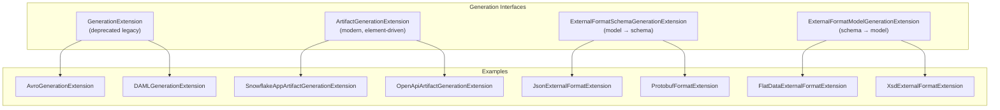
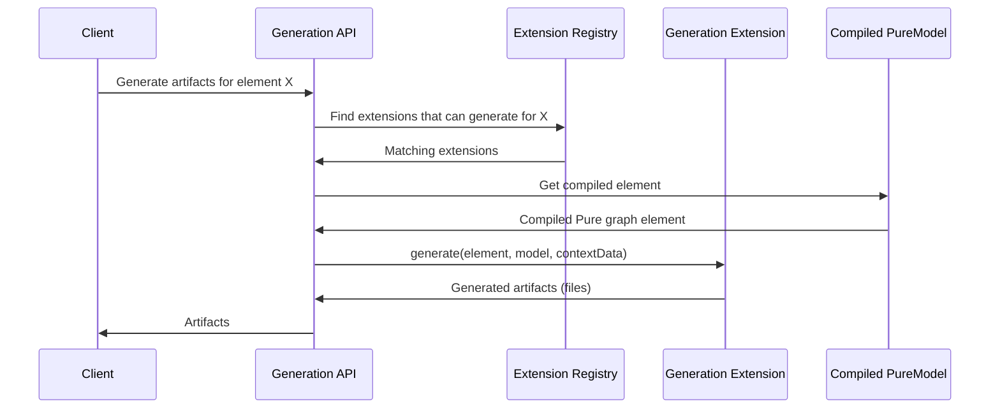

# Artifact Generation Extensions Reference

This document catalogs **every artifact generation extension** in Legend Engine — the components that produce output artifacts (code, schemas, API specs, analytics) from compiled Pure models. There are four distinct generation extension types.

## Generation Extension Types

### 1. `GenerationExtension` (Legacy)

The original generation interface. Used by older extensions that generate output from a `GenerationSpecification` element.

- **Trigger**: Invoked when the model contains a `GenerationSpecification` referencing this extension
- **Pattern**: Takes a `PureModel` and configuration, produces file artifacts

### 2. `ArtifactGenerationExtension` (Modern)

The modern, element-driven generation interface. Extensions inspect the compiled Pure graph and generate artifacts for specific element types they understand.

- **Trigger**: The extension's `canGenerate(PackageableElement)` method determines if it applies
- **Pattern**: Walks the compiled graph, finds matching elements, produces artifacts
- **Key method**: `generate(Root_meta_pure_metamodel_PackageableElement, PureModel, PureModelContextData)`

### 3. `ExternalFormatSchemaGenerationExtension`

Generates **schemas from Pure models** (model → schema direction).

- **Trigger**: Invoked against a model and a format-specific configuration
- **Example**: Generate JSON Schema from Pure classes, generate Protobuf `.proto` from Pure types

### 4. `ExternalFormatModelGenerationExtension`

Generates **Pure models from schemas** (schema → model direction).

- **Trigger**: Invoked against a SchemaSet with a format-specific configuration
- **Example**: Generate Pure classes from a JSON Schema, generate Pure types from an XSD

---

## Artifact Generation Extensions (`ArtifactGenerationExtension`)

### Function Activator Generators

These generate deployment artifacts for function activators:

| Extension | Module | Output |
|-----------|--------|--------|
| `FunctionActivatorArtifactGenerationExtension` | `legend-engine-xt-functionActivator-generation` | Base function activator artifacts |
| `SnowflakeAppArtifactGenerationExtension` | `legend-engine-xt-snowflake-generator` | Snowflake UDF SQL definitions |
| `SnowflakeM2MUdfArtifactGenerationExtension` | `legend-engine-xt-snowflake-generator` | Snowflake M2M UDF definitions |
| `BigQueryFunctionArtifactGenerationExtension` | `legend-engine-xt-bigqueryFunction-api` | BigQuery function SQL definitions |
| `MemSQLFunctionArtifactGenerationExtension` | `legend-engine-xt-memsqlFunction-generator` | MemSQL/SingleStore function SQL |
| `HostedServiceArtifactGenerationExtension` | `legend-engine-xt-hostedService-generation` | Hosted REST service deployment descriptors |
| `DeephavenAppArtifactGenerationExtension` | `legend-engine-xt-deephaven-generator` | Deephaven application artifacts |

### API & Documentation Generators

| Extension | Module | Output |
|-----------|--------|--------|
| `OpenApiArtifactGenerationExtension` | `legend-engine-xt-openapi-generation` | OpenAPI / Swagger specifications from Legend Services |
| `PowerBIArtifactGenerationExtension` | `legend-engine-xt-powerbi-generation` | Power BI artifacts from Legend models |

### Analytics & Governance Generators

| Extension | Module | Output |
|-----------|--------|--------|
| `DataSpaceAnalyticsArtifactGenerationExtension` | `legend-engine-xt-data-space-generation` | DataSpace analytics (execution contexts, documentation, queries) |
| `DataQualityValidationArtifactGenerationExtension` | `legend-engine-xt-dataquality-generation` | Data quality validation artifacts |
| `SearchDocumentArtifactGenerationExtension` | `legend-engine-xt-analytics-search-generation` | Search index documents for model discoverability |

---

## Legacy Generation Extensions (`GenerationExtension`)

These older extensions are invoked through `###GenerationSpecification` sections:

| Extension | Module | Output |
|-----------|--------|--------|
| `AvroGenerationExtension` | `legend-engine-xts-avro/legend-engine-xt-avro` | Apache Avro `.avsc` schemas from Pure models |
| `JSONSchemaGenerationExtension` | `legend-engine-xts-json/legend-engine-external-format-jsonSchema` | JSON Schema files from Pure models |
| `ProtobufGenerationExtension` | `legend-engine-xts-protobuf/legend-engine-xt-protobuf` | Protocol Buffer `.proto` files from Pure models |
| `DAMLGenerationExtension` | `legend-engine-xts-daml/legend-engine-xt-daml-model` | DAML smart contract templates from Pure models |
| `MorphirGenerationExtension` | `legend-engine-xts-morphir/legend-engine-xt-morphir` | Morphir IR from Pure models |
| `GraphQLGenerationExtension` | `legend-engine-xt-graphQL-http-api` | GraphQL SDL schemas from Pure models |

---

## External Format Schema Generation Extensions

Generate schemas **from** Pure models (model → schema):

| Extension | Module | Format | Direction |
|-----------|--------|--------|-----------|
| `JsonExternalFormatExtension` | `legend-engine-xt-json-model` | JSON Schema | model → JSON Schema |
| `ProtobufFormatExtension` | `legend-engine-xt-protobuf` | Protocol Buffers | model → `.proto` |
| `FlatDataExternalFormatExtension` | `legend-engine-xt-flatdata-model` | FlatData (CSV/fixed-width) | model → FlatData schema |
| `DamlFormatExtension` | `legend-engine-xt-daml-model` | DAML/Haskell | model → DAML |
| `GraphQLSDLFormatExtension` | `legend-engine-xt-graphQL-http-api` | GraphQL SDL | model → GraphQL schema |

---

## External Format Model Generation Extensions

Generate Pure models **from** schemas (schema → model):

| Extension | Module | Format | Direction |
|-----------|--------|--------|-----------|
| `JsonExternalFormatExtension` | `legend-engine-xt-json-model` | JSON Schema | JSON Schema → model |
| `XsdExternalFormatExtension` | `legend-engine-xt-xml-model` | XML/XSD | XSD → model |
| `FlatDataExternalFormatExtension` | `legend-engine-xt-flatdata-model` | FlatData | FlatData schema → model |
| `GraphQLFormatExtension` | `legend-engine-xt-graphQL-http-api` | GraphQL | GraphQL introspection → model |

> **Note**: Some extensions implement both `ExternalFormatSchemaGenerationExtension` and `ExternalFormatModelGenerationExtension`, supporting bidirectional generation. JSON and FlatData are examples of this.

---

## Generation Pipeline

### How `ArtifactGenerationExtension` Works

1. **Discovery**: All `ArtifactGenerationExtension` implementations are loaded via `ServiceLoader`
2. **Matching**: For each packageable element, each extension's `canGenerate()` is called
3. **Generation**: Matching extensions produce a list of `GenerationOutput` (filename + content pairs)
4. **Assembly**: All outputs are collected and returned to the caller

### How `GenerationExtension` (Legacy) Works

1. A `###GenerationSpecification` element in the model references a generation type
2. The corresponding `GenerationExtension` is found and invoked
3. The extension receives the full model and produces output files

---

## Quick Reference: All Generation Extensions

| Extension | Type | Output |
|-----------|------|--------|
| **Function Activator** (base) | Artifact | Activator deployment descriptors |
| **Snowflake App** | Artifact | Snowflake UDF SQL |
| **Snowflake M2M UDF** | Artifact | Snowflake M2M UDF SQL |
| **BigQuery Function** | Artifact | BigQuery SQL |
| **MemSQL Function** | Artifact | SingleStore SQL |
| **Hosted Service** | Artifact | REST service descriptors |
| **Deephaven App** | Artifact | Deephaven artifacts |
| **OpenAPI** | Artifact | Swagger/OpenAPI specs |
| **Power BI** | Artifact | Power BI artifacts |
| **DataSpace Analytics** | Artifact | DataSpace analytics |
| **Data Quality** | Artifact | Validation artifacts |
| **Search Document** | Artifact | Search index documents |
| **Avro** | Legacy | `.avsc` schemas |
| **JSON Schema** | Legacy | JSON Schema files |
| **Protobuf** | Legacy | `.proto` files |
| **DAML** | Legacy | DAML templates |
| **Morphir** | Legacy | Morphir IR |
| **GraphQL** | Legacy | GraphQL SDL |
| **JSON** (bidirectional) | External Format | JSON Schema ↔ Pure model |
| **XSD** | External Format | XSD → Pure model |
| **FlatData** (bidirectional) | External Format | FlatData ↔ Pure model |
| **Protobuf** | External Format | Pure model → `.proto` |
| **DAML** | External Format | Pure model → DAML |
| **GraphQL SDL** | External Format | Pure model → GraphQL schema |
| **GraphQL Introspection** | External Format | GraphQL → Pure model |

---

## Key Takeaways for Re-Engineering

1. **Use `ArtifactGenerationExtension` for new generators**: The modern interface is element-driven and more flexible than the legacy `GenerationExtension`.
2. **External format extensions are bidirectional**: The same extension often supports both model-to-schema and schema-to-model generation.
3. **Artifact generation runs during build/deploy, not compile**: Generation happens after compilation, against the compiled Pure graph.
4. **Legacy extensions are being superseded**: New generators should implement `ArtifactGenerationExtension`; legacy `GenerationExtension` is maintained for backward compatibility.
5. **Search document generation enables model discoverability**: `SearchDocumentArtifactGenerationExtension` indexes models for the Legend platform search feature.
