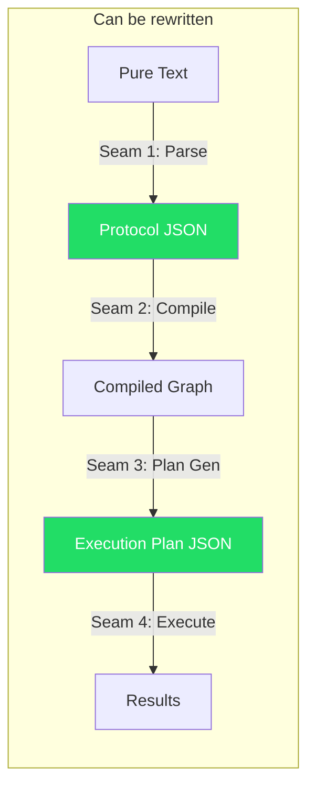
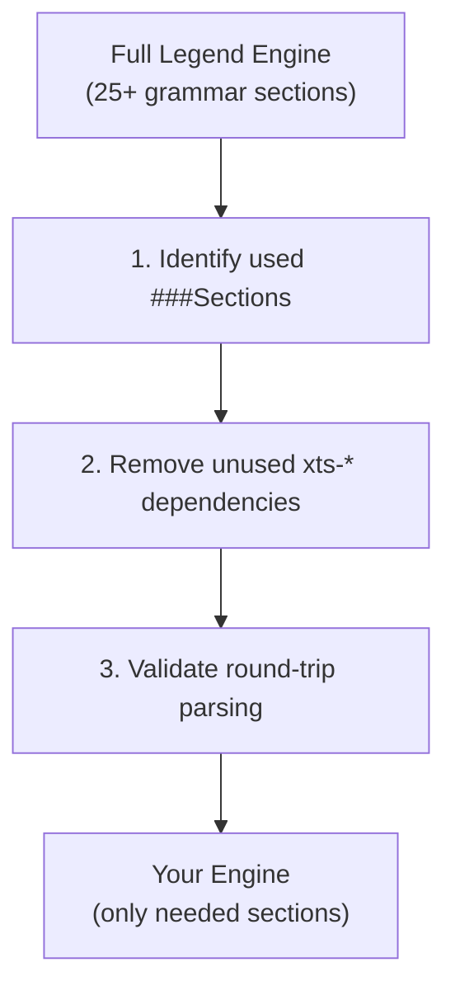
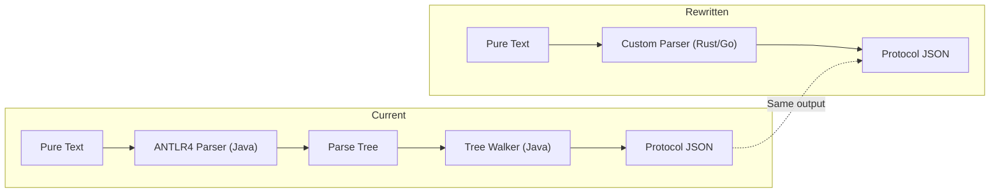
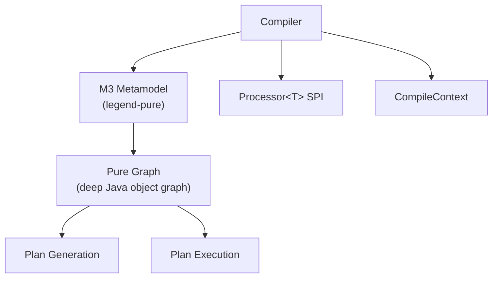
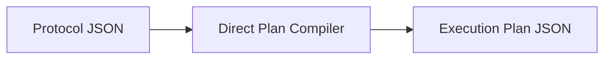
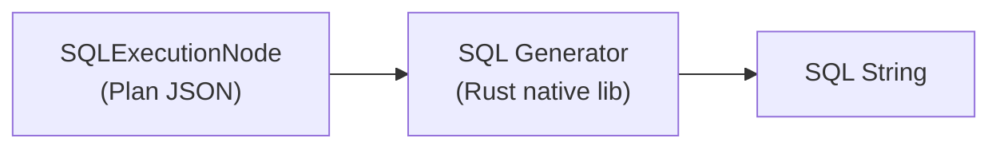
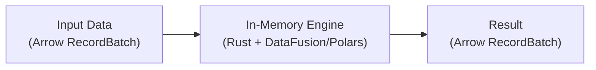
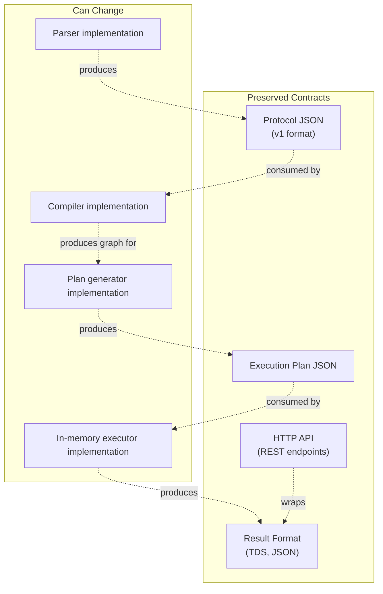
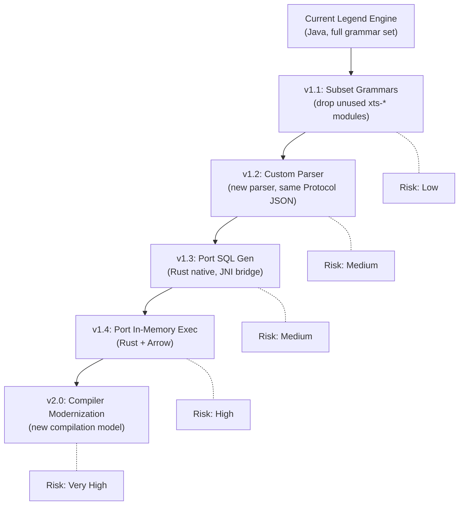

# A4 — Re-Engineering Strategy Guide

A comprehensive guide for re-engineering Legend Engine: subsetting grammars, rewriting parsers and compilers, porting critical paths to performant languages, and ensuring backward compatibility throughout.

---

## 1. Vision & Scope

The re-engineering goal is to take the Legend Engine architecture and:

1. **Subset the grammars** — keep only the DSL sections your users leverage, discard the rest
2. **Rewrite the parser/compiler** — replace ANTLR4/Java-based parsing and multi-pass compilation with potentially faster, more maintainable implementations
3. **Port performance-critical logic** — move hot paths (SQL generation, plan execution, in-memory processing) to a more performant language (Rust, Go, C++, etc.)
4. **Maintain backward compatibility** — ensure existing models, APIs, and tooling continue to work

---

## 2. Architectural Seams: Where You Can Cut

Legend Engine has well-defined **seams** where components communicate through serializable contracts. These are your re-engineering boundaries:



> [!IMPORTANT]
> **Protocol JSON** and **Execution Plan JSON** are the two critical interchange formats. Any component that produces or consumes these can be independently rewritten without affecting the rest.

### Seam 1: Grammar → Protocol (The Parser)

| Current | Boundary Format | Rewrite Freedom |
|---------|----------------|-----------------|
| ANTLR4 lexer/parser → Java tree walker → Protocol POJOs | **Protocol JSON** | Total — any parser that produces valid protocol JSON is a drop-in replacement |

### Seam 2: Protocol → Compiled Graph (The Compiler)

| Current | Boundary Format | Rewrite Freedom |
|---------|----------------|-----------------|
| Multi-pass Java `Processor<T>` pipeline → M3 metamodel | **Compiled in-memory graph** | High — but the M3 metamodel interface is tightly coupled to `legend-pure`. Requires defining a new graph representation or wrapping/reimplementing M3 |

### Seam 3: Compiled Graph → Execution Plan (Plan Generation)

| Current | Boundary Format | Rewrite Freedom |
|---------|----------------|-----------------|
| Java plan generators → store-specific nodes | **Execution Plan JSON** | High — the plan is a serializable tree. A plan generator in any language can produce this JSON |

### Seam 4: Execution Plan → Results (Plan Execution)

| Current | Boundary Format | Rewrite Freedom |
|---------|----------------|-----------------|
| Java executor dispatches to store executors (JDBC, HTTP, etc.) | **Result streams (TDS, JSON)** | Moderate — executor needs access to database drivers. This is the most I/O-bound layer |

---

## 3. Phase 1: Grammar Subsetting

### Approach

The grammar system is fully modular via `ServiceLoader`. Subsetting is primarily a **dependency management** exercise:



**Step-by-step:**

1. **Audit your models**: Scan all `.pure` files and protocol JSON to identify which `###Section` types are actually used
2. **Map sections to modules**: Use [A1 — Grammar Extensions Reference](A1-grammar-extensions-reference.md) to identify the modules for each section
3. **Create a custom extension collection**: Replace `legend-engine-extensions-collection-execution` with a custom POM that includes only your sections
4. **Remove unused xts-\* modules**: Un-used grammar/compiler/execution modules simply aren't on the classpath
5. **Test**: Run your existing test suites — everything should pass since unused extensions were never invoked

### Minimum Viable Section Set

For a typical relational-focused deployment:

| Section | Required | Why |
|---------|----------|-----|
| `###Pure` | **Always** | Core classes, functions, enums |
| `###Mapping` | **Always** | Model-to-store mappings |
| `###Connection` | **Always** | Store connections |
| `###Runtime` | **Always** | Execution runtimes |
| `###Relational` | If using SQL stores | Database definitions |
| `###Service` | If using services | Packaged functions with tests |
| `###ExternalFormat` | If using JSON/XML/CSV | Schema definitions and bindings |
| `###Data` | If using test suites | Test data sets |

Everything else (`###Diagram`, `###Text`, `###DataSpace`, `###Snowflake`, `###Persistence`, etc.) can be dropped with zero impact if not used.

### Risk: Low
Subsetting is the safest re-engineering step. The `ServiceLoader` mechanism means unused extensions are simply absent — no code changes required.

---

## 4. Phase 2: Parser Rewrite

### Why Rewrite?

| Current Limitation | Potential Improvement |
|--------------------|-----------------------|
| ANTLR4 generates large Java parser classes | Custom parser can be smaller and faster |
| Java startup time for parsing | Native parser (Rust/Go) can be orders of magnitude faster for large models |
| Grammar changes require ANTLR4 expertise | Hand-written recursive descent can be more accessible |
| Parse tree → Protocol walker is an extra translation step | Direct-to-protocol parser eliminates the intermediate representation |

### Approach A: Protocol-Compatible Parser (Recommended)

Write a new parser in your target language that **outputs Protocol JSON**:



**Advantages:**
- Protocol JSON is the **proven interchange format** — Studio, SDLC, and all tooling consume it
- The rest of the pipeline (compiler, plan gen, execution) is untouched
- Can be validated by comparing JSON output against the existing parser
- Can be implemented incrementally, section by section

**Implementation strategy:**

1. **Start with `###Pure`**: The most complex section (classes, functions, enums, expressions). Get this right first.
2. **Add `###Relational`**: The largest store grammar.
3. **Add `###Mapping`**: Depends on store-specific mapping types being parseable.
4. **Add other sections**: One by one, validating against the existing parser each time.

**Validation approach:**
```
For each .pure file in your corpus:
  1. Parse with existing ANTLR4 parser → Protocol JSON (reference)
  2. Parse with new parser → Protocol JSON (candidate)
  3. Diff the two JSON outputs (ignoring sourceInformation)
  4. Assert semantic equivalence
```

### Approach B: AST-Compatible Parser

Write a parser that produces a **custom AST** instead of Protocol JSON, then build a new compiler that consumes that AST:

- Higher risk — you're rewriting two components
- Higher reward — can optimize the AST for your compiler's needs
- Only makes sense if you're also rewriting the compiler (Phase 3)

### Language Considerations for the Parser

| Language | Parse Speed | Ecosystem | FFI to Java | Recommendation |
|----------|------------|-----------|-------------|----------------|
| **Rust** | Excellent | `nom`, `pest`, `lalrpop`, `tree-sitter` | JNI/JNA, process boundary | Best for pure performance |
| **Go** | Very Good | `participle`, hand-written | CGo, process boundary | Good balance of speed and simplicity |
| **Kotlin** | Good | Same JVM target | Native JVM integration | Lowest migration cost, moderate speedup |
| **TypeScript** | Moderate | Rich tooling, same as Studio | Process boundary | Good if aligning with frontend team |

> [!WARNING]
> If using a non-JVM language, you'll need a **process boundary** (CLI, gRPC, or shared-memory IPC) between the parser and the rest of the Java pipeline. The overhead is negligible for batch parsing but matters for interactive/IDE use cases.

---

## 5. Phase 3: Compiler Rewrite

### Why This Is Harder

The compiler is the most **tightly coupled** component:



The M3 metamodel (`legend-pure`) is a deep dependency:
- Plan generation reads the Pure graph directly via M3 Java interfaces
- Plan execution references M3 types for runtime type checking
- The graph is an in-memory Java object graph — not serializable in a standard format

### Approach A: Keep the M3 Metamodel, Rewrite the Passes (Recommended)

Keep the output format (M3 graph) but rewrite the compilation logic:

1. **Replace the multi-pass algorithm** with a dependency-graph-driven approach (topological sort + parallel compilation)
2. **Replace `Processor<T>`** with a simpler visitor pattern or strategy pattern
3. **Optimize reference resolution** — the current multi-pass approach rescans elements; a single-pass with lazy resolution could be faster

**Advantages:** Minimal downstream impact — plan generation and execution are unchanged.

### Approach B: New Graph Representation

Define a custom, more efficient graph representation and rewrite plan generation to consume it:

1. Design a **column-oriented** or **flat-array** graph representation optimized for plan generation queries
2. Define a serialization format (e.g., FlatBuffers, Cap'n Proto) for the compiled graph
3. Rewrite plan generation to work against this new representation

**Advantages:** Full control over memory layout and access patterns.  
**Risk:** Very high — plan generation is deeply interwoven with M3 types.

### Approach C: Compile Directly to Execution Plans

Skip the Pure graph entirely — compile from Protocol JSON directly to execution plans:



**Advantages:** Eliminates the entire M3 dependency.  
**Risk:** You lose the Pure graph's type checking and validation. Mapping resolution becomes much more complex without the graph.

> [!CAUTION]
> Approach C is the most radical. The Pure graph provides rich type information that the plan generator relies on. Going directly from protocol to plan means reimplementing type resolution, property navigation, and mapping routing — essentially reimplementing the compiler's role inside the plan generator.

---

## 6. Phase 4: Porting Critical Business Logic

### Hot Path Analysis

The performance-critical paths in order of impact:

| Component | Hotness | Current | Why It's Hot |
|-----------|---------|---------|--------------|
| **SQL Generation** | 🔥🔥🔥 | Java string building | Called for every query; complex dialect-specific logic |
| **In-Memory Execution** | 🔥🔥🔥 | Java column-oriented | Processes large datasets for cross-store joins, post-processing |
| **Plan Generation** | 🔥🔥 | Java graph traversal | Walks the Pure graph, resolves mappings, generates plan tree |
| **Grammar Parsing** | 🔥🔥 | ANTLR4 (Java) | Large models can have 100K+ lines to parse |
| **Multi-Pass Compilation** | 🔥🔥 | Java hash maps + graph | Three passes over all elements; reference resolution uses maps |
| **Plan Serialization** | 🔥 | Jackson JSON | Plans can be large for complex queries |
| **JDBC Execution** | 🔥 | Java JDBC | I/O bound, not CPU bound — porting language won't help much |

### What to Port

#### SQL Generation → Rust/Go



- SQL generation is pure computation: input is a plan node, output is a SQL string
- No I/O, no database access, no JVM dependencies
- Can be exposed as a **native library (JNI)** or a **CLI tool**
- Dialect handling (Postgres vs. Snowflake vs. DuckDB) maps naturally to Rust traits/Go interfaces
- **Validation**: Compare generated SQL against the current Java implementation for the same plan nodes

#### In-Memory Execution → Rust (with Arrow)



- Replace the Java in-memory executor with **Apache DataFusion** (Rust) or **Polars**
- Use **Apache Arrow** as the interchange format (zero-copy between Java and Rust)
- Filter, join, aggregate, sort — all available as optimized vectorized operations
- **Massive** performance improvement for cross-store joins and heavy post-processing

#### Grammar Parsing → Rust (with tree-sitter or custom PEG)

- As described in Phase 2
- Rust parsers (`nom`, `pest`, `tree-sitter`) are 10-100x faster than ANTLR4 Java
- Output Protocol JSON for backward compatibility

### What NOT to Port

| Component | Why Keep in Java |
|-----------|-----------------|
| **Compiler (M3 graph construction)** | Deeply coupled to M3 Java types; porting loses type safety without massive effort |
| **JDBC execution** | I/O bound — language won't help; Java's JDBC ecosystem is mature |
| **HTTP API layer** | Dropwizard/JAX-RS is fine; HTTP overhead dwarfs any language perf difference |
| **Authentication/Vault** | Security code benefits from Java's mature TLS/crypto libraries |
| **ServiceLoader/Extension discovery** | JVM facility; replaced by build-time configuration in a new system |

---

## 7. Backward Compatibility Strategy

### The Protocol JSON Contract

> [!IMPORTANT]
> **Protocol JSON is your backward compatibility lifeline.** Any tool that produces or consumes protocol JSON today will continue to work if you preserve this format.

Backward compatibility layers:



### Compatibility Checklist

| Contract | Strategy | Validation |
|----------|----------|------------|
| **Protocol JSON schema** | Freeze `v1` schema; new features use `v2` | JSON schema validation against corpus of existing models |
| **Execution Plan JSON schema** | Freeze node type schemas | Compare plan output for same inputs |
| **HTTP API endpoints** | Maintain same paths, request/response shapes | Integration test suite against API |
| **Grammar syntax** | Subset is safe; syntax changes need migration tooling | Round-trip test: `parse → compose → parse` |
| **Service test suites** | Must continue to pass | Run existing service tests against new engine |
| **PCT results** | Same or better pass rates | Run PCT suites against new engine |

### Migration Path



Each step is independently valuable and can be stopped at any point:
- **v1.1** reduces build time and deployment footprint
- **v1.2** enables polyglot development and faster parsing
- **v1.3** improves query generation performance
- **v1.4** dramatically improves in-memory processing
- **v2.0** is the full re-architecture (optional)

### Cross-Validation Framework

At each stage, run this validation:

```
1. Corpus Validation
   - Parse all existing .pure files → compare Protocol JSON output (old vs new)
   - Compile all models → compare compiled graph state
   - Generate plans for all services → compare Plan JSON output
   - Execute all services → compare results

2. PCT Regression
   - Run PCT suites for all supported databases
   - Compare pass/fail status against baseline
   - Any new failures must be root-caused before release

3. Round-Trip Fidelity
   - parse → compose → parse: output should be semantically identical
   - Tests exist for this in the current codebase

4. API Contract Testing
   - Record HTTP request/response pairs from current engine
   - Replay against new engine, assert identical responses
```

---

## 8. Considerations & Risks

### Technical Risks

| Risk | Severity | Mitigation |
|------|----------|------------|
| M3 metamodel coupling | **High** | Don't try to replace M3 early; work around it |
| `legend-pure` dependency | **High** | This JAR contains the Pure type system; keep it until compiler rewrite |
| ANTLR4 grammar edge cases | **Medium** | Fuzz-test new parser against existing parser with random valid Pure programs |
| JNI overhead for native libs | **Low** | Profile early; batch calls to amortize overhead |
| Arrow/Java memory interop | **Medium** | Use `arrow-java` for zero-copy integration |
| Protocol version drift | **Medium** | Version-lock protocol schema; separate protocol evolution from engine evolution |

### Organizational Considerations

| Concern | Recommendation |
|---------|----------------|
| **Team skills** | Don't port to Rust/Go unless the team has strong expertise; Kotlin is a safer JVM-compatible choice |
| **Incremental delivery** | Follow the v1.1 → v1.2 → v1.3 → v1.4 path; each version is independently shippable |
| **Testing investment** | The cross-validation framework is non-negotiable; build it before starting any rewrite |
| **Upstream tracking** | If you still pull updates from FINOS Legend Engine, grammar subsetting keeps merge conflicts minimal; deep rewrites make upstream tracking impractical |
| **Community alignment** | If contributing back to FINOS, align on protocol JSON schema stability |

### What Will Break (And How to Handle It)

| What Breaks | When | Mitigation |
|-------------|------|------------|
| Extensions that rely on Java ServiceLoader | When moving parsing to non-JVM | Build-time extension registration instead of runtime discovery |
| Code that directly calls ANTLR4 parse tree nodes | When replacing the parser | Ensure all consumers use Protocol JSON, not parse trees |
| Code that directly manipulates M3 graph objects | When changing the graph representation | Introduce an abstraction layer (`ICompiledGraph`) before the rewrite |
| Existing ANTLR4 `.g4` files | When replacing the parser | These become the specification for the new parser — keep them as reference |
| CompilerExtension implementations | When changing the compiler | Define a compatibility adapter layer; deprecate gradually |

---

## 9. Recommended Approach

For a team looking to re-engineer Legend Engine **pragmatically**:

| Phase | Effort | Impact | Risk |
|-------|--------|--------|------|
| **1. Grammar Subset** | Days | Reduced build/deploy size | Negligible |
| **2. Custom Parser** (Protocol-compatible) | Weeks–Months | Faster parsing, polyglot option | Low–Medium |
| **3. SQL Gen Port** (Rust/Go native lib) | Months | Faster query generation | Medium |
| **4. In-Memory Exec Port** (Rust + Arrow) | Months | Dramatically faster post-processing | Medium–High |
| **5. Compiler Modernize** | Quarters | Full architectural freedom | High |

> [!TIP]
> **Start with Phase 1 today** — it requires zero code changes and immediately reduces your surface area. Build the cross-validation framework during Phase 1, then use it as your safety net for every subsequent phase.

The key insight is: **Protocol JSON is the seam that gives you freedom.** As long as you preserve this contract, you can replace everything upstream (parser) and downstream (plan generation, execution) independently and incrementally.
