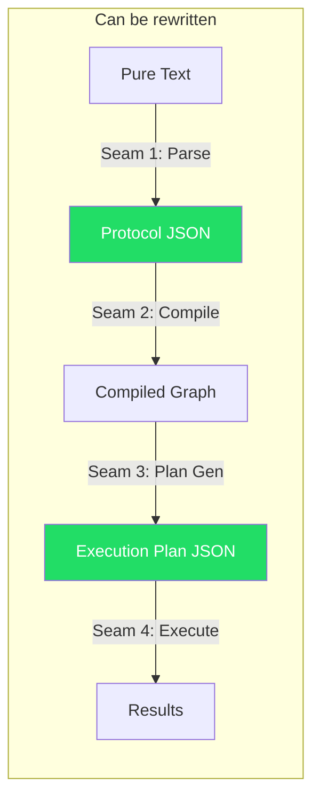
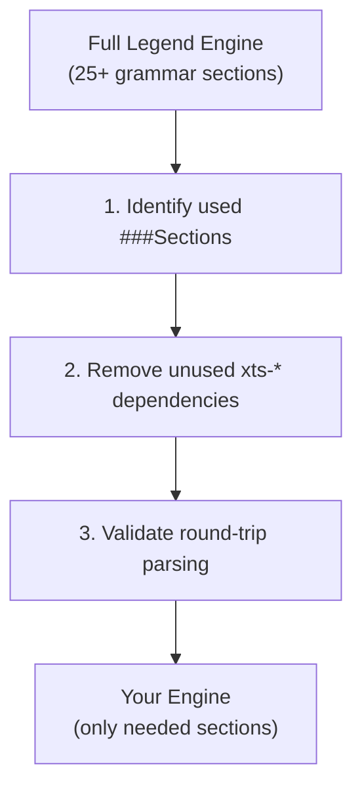
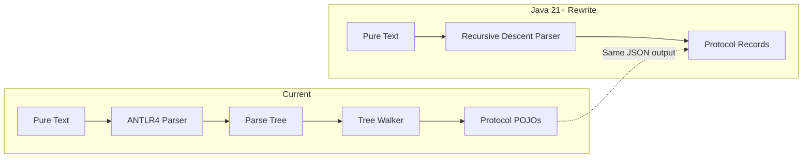
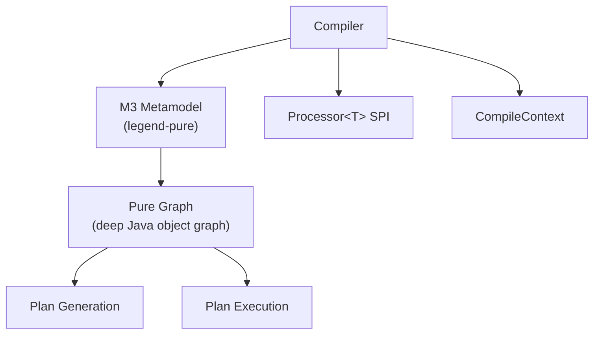
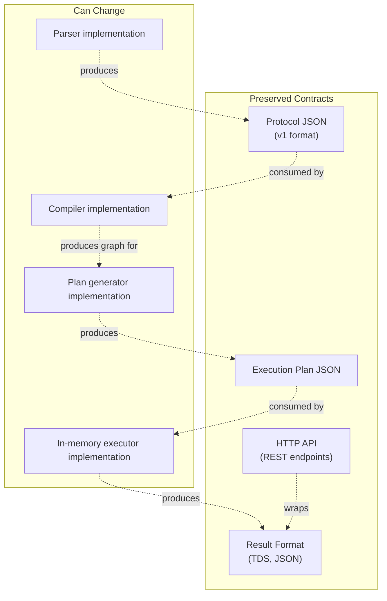
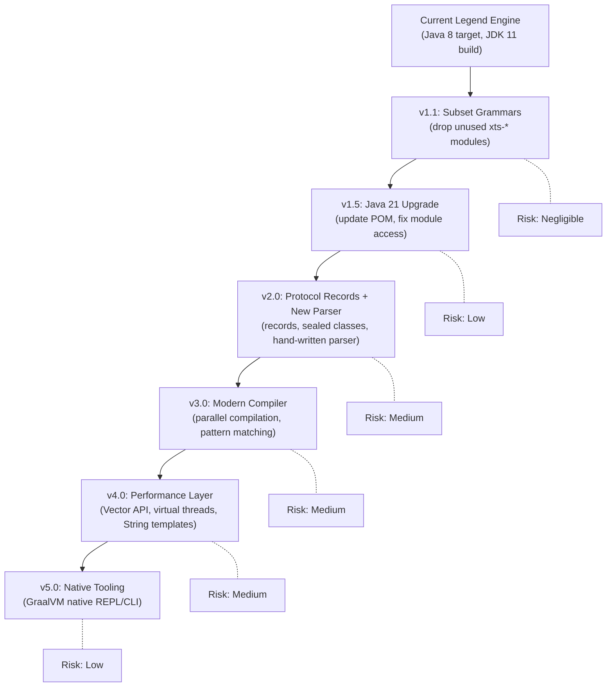

# A5 — Re-Engineering Strategy Guide

A comprehensive guide for re-engineering Legend Engine on **Java 21+**: subsetting grammars, rewriting parsers and compilers with modern Java features, dramatically improving performance without leaving the JVM, and ensuring backward compatibility throughout.

---

## 1. Vision & Scope

The re-engineering goal is to take the Legend Engine architecture and:

1. **Subset the grammars** — keep only the DSL sections your users leverage, discard the rest
2. **Rewrite the parser/compiler** — replace ANTLR4 parsing and the multi-pass compiler with modern Java 21+ implementations using records, sealed classes, and pattern matching
3. **Optimize performance-critical logic** — leverage Java 21+ virtual threads, Vector API, and modern JVM features to dramatically improve hot paths without leaving the JVM
4. **Maintain backward compatibility** — ensure existing models, APIs, and tooling continue to work

---

## 2. Java 21+ Advantage

Staying on Java 21+ is a **strategic advantage**, not a compromise. The current Legend Engine targets Java 8 bytecode and builds on JDK 11 — upgrading to 21+ unlocks transformative features:

| Java 21+ Feature | Re-Engineering Impact |
|-------------------|----------------------|
| **Records** | Replace verbose protocol POJOs with immutable, compact records |
| **Sealed Classes** | Model element type hierarchies with exhaustive pattern matching |
| **Pattern Matching** (`switch` expressions) | Replace `instanceof` chains in compiler processors with elegant dispatching |
| **Virtual Threads** (Project Loom) | Massively parallel plan execution, concurrent compilation, non-blocking I/O — all without thread pool tuning |
| **Vector API** (incubating) | SIMD-accelerated in-memory data processing (filter, aggregate, join) |
| **Foreign Function & Memory API** (Panama) | Zero-overhead access to off-heap memory for large datasets, Arrow integration |
| **String Templates** (preview) | Cleaner SQL generation — template strings replace string concatenation |
| **GraalVM Native Image** | AOT compilation for instant startup (CLI tools, REPL, serverless) |
| **Structured Concurrency** | Safe, scoped parallelism for plan execution graphs |
| **Scoped Values** | Replace `ThreadLocal` for compile context propagation |

---

## 3. Architectural Seams: Where You Can Cut

Legend Engine has well-defined **seams** where components communicate through serializable contracts. These are your re-engineering boundaries:



> [!IMPORTANT]
> **Protocol JSON** and **Execution Plan JSON** are the two critical interchange formats. Any component that produces or consumes these can be independently rewritten without affecting the rest.

### Seam 1: Grammar → Protocol (The Parser)

| Current | Boundary Format | Rewrite Freedom |
|---------|----------------|-----------------|
| ANTLR4 lexer/parser → Java tree walker → Protocol POJOs | **Protocol JSON** | Total — any parser that produces valid protocol JSON is a drop-in replacement |

### Seam 2: Protocol → Compiled Graph (The Compiler)

| Current | Boundary Format | Rewrite Freedom |
|---------|----------------|-----------------|
| Multi-pass Java `Processor<T>` pipeline → M3 metamodel | **Compiled in-memory graph** | High — but the M3 metamodel interface is tightly coupled to `legend-pure`. Requires defining a new graph representation or wrapping/reimplementing M3 |

### Seam 3: Compiled Graph → Execution Plan (Plan Generation)

| Current | Boundary Format | Rewrite Freedom |
|---------|----------------|-----------------|
| Java plan generators → store-specific nodes | **Execution Plan JSON** | High — the plan is a serializable tree. A plan generator in any language can produce this JSON |

### Seam 4: Execution Plan → Results (Plan Execution)

| Current | Boundary Format | Rewrite Freedom |
|---------|----------------|-----------------|
| Java executor dispatches to store executors (JDBC, HTTP, etc.) | **Result streams (TDS, JSON)** | Moderate — executor needs access to database drivers. This is the most I/O-bound layer |

---

## 4. Phase 1: Grammar Subsetting

### Approach

The grammar system is fully modular via `ServiceLoader`. Subsetting is primarily a **dependency management** exercise:



**Step-by-step:**

1. **Audit your models**: Scan all `.pure` files and protocol JSON to identify which `###Section` types are actually used
2. **Map sections to modules**: Use [A1 — Grammar Extensions Reference](A1-grammar-extensions-reference.md) to identify the modules for each section
3. **Create a custom extension collection**: Replace `legend-engine-extensions-collection-execution` with a custom POM that includes only your sections
4. **Remove unused xts-\* modules**: Un-used grammar/compiler/execution modules simply aren't on the classpath
5. **Test**: Run your existing test suites — everything should pass since unused extensions were never invoked

### Minimum Viable Section Set

For a typical relational-focused deployment:

| Section | Required | Why |
|---------|----------|-----|
| `###Pure` | **Always** | Core classes, functions, enums |
| `###Mapping` | **Always** | Model-to-store mappings |
| `###Connection` | **Always** | Store connections |
| `###Runtime` | **Always** | Execution runtimes |
| `###Relational` | If using SQL stores | Database definitions |
| `###Service` | If using services | Packaged functions with tests |
| `###ExternalFormat` | If using JSON/XML/CSV | Schema definitions and bindings |
| `###Data` | If using test suites | Test data sets |

Everything else (`###Diagram`, `###Text`, `###DataSpace`, `###Snowflake`, `###Persistence`, etc.) can be dropped with zero impact if not used.

### Risk: Low
Subsetting is the safest re-engineering step. The `ServiceLoader` mechanism means unused extensions are simply absent — no code changes required.

---

## 5. Phase 2: Parser Rewrite (Java 21+)

### Why Rewrite?

| Current Limitation | Java 21+ Improvement |
|--------------------|-----------------------|
| ANTLR4 generates large, opaque parser classes | Hand-written recursive descent with **sealed class** AST nodes is more debuggable and maintainable |
| Parse tree → Protocol walker is an extra translation step | Direct-to-**record** parser eliminates the intermediate representation |
| Grammar changes require ANTLR4 expertise | Standard Java code is more accessible to the whole team |
| Protocol POJOs are verbose, mutable | **Records** are compact, immutable, with built-in `equals`/`hashCode`/`toString` |

### Approach: Protocol-Compatible Recursive Descent Parser

Write a hand-written recursive descent parser in Java 21+ that **directly produces protocol records**:



### Modern Java Protocol Model

Replace the current mutable POJOs with a sealed record hierarchy:

```java
// Current: verbose, mutable POJOs
public class org.finos.legend.engine.protocol.pure.v1.model.packageableElement.domain.Class
    extends PackageableElement {
    public List<Property> properties = new ArrayList<>();
    public List<QualifiedProperty> qualifiedProperties = new ArrayList<>();
    public List<Constraint> constraints = new ArrayList<>();
    // ... many more mutable fields
}

// Java 21+: compact, immutable records with sealed hierarchy
public sealed interface Element permits ClassElement, EnumElement, FunctionElement,
    MappingElement, DatabaseElement, ServiceElement, ConnectionElement { }

public record ClassElement(
    String packagePath,
    String name,
    List<Property> properties,
    List<QualifiedProperty> qualifiedProperties,
    List<Constraint> constraints,
    List<String> superTypes,
    SourceInfo sourceInfo
) implements Element { }

public record Property(
    String name,
    String type,
    Multiplicity multiplicity
) { }
```

**Advantages:**
- Records are **immutable** — no accidental mutation during compilation
- `sealed` enables **exhaustive `switch`** — compiler warns if you miss a case
- 50-70% less boilerplate compared to current POJOs
- Built-in serialization support via Jackson's record module
- **Pattern matching** makes dispatch elegant:

```java
// Current: instanceof chains
if (element instanceof Class) { ... }
else if (element instanceof Enumeration) { ... }
else if (element instanceof Function) { ... }

// Java 21+: exhaustive pattern matching
switch (element) {
    case ClassElement c     -> compileClass(c, context);
    case EnumElement e      -> compileEnum(e, context);
    case FunctionElement f  -> compileFunction(f, context);
    // compiler error if you miss a case!
}
```

### Recursive Descent Parser Design

```java
public class PureParser {
    private final String source;
    private int pos;

    public List<Element> parseFile() {
        var elements = new ArrayList<Element>();
        while (!atEnd()) {
            var section = expectSection();  // ###Pure, ###Relational, etc.
            elements.addAll(switch (section) {
                case "Pure"       -> parsePureSection();
                case "Relational" -> parseRelationalSection();
                case "Mapping"    -> parseMappingSection();
                case "Service"    -> parseServiceSection();
                default           -> throw new ParseException("Unknown section: " + section);
            });
        }
        return elements;
    }
}
```

**Implementation strategy:**

1. **Start with `###Pure`**: Classes, functions, enums, expressions — the most complex section
2. **Add `###Relational`**: Tables, columns, joins — the largest store grammar
3. **Add `###Mapping`**: Store-specific mapping types
4. **Add remaining sections**: One by one, validating against the existing parser

**Validation approach:**
```
For each .pure file in your corpus:
  1. Parse with existing ANTLR4 parser → Protocol JSON (reference)
  2. Parse with new parser → Protocol JSON (candidate)
  3. Diff the two JSON outputs (ignoring sourceInformation)
  4. Assert semantic equivalence
```

> [!TIP]
> If you need a parser generator on Java 21+, consider **ANTLR4 with records** as a stepping stone — keep the grammar, but replace the tree walker with a visitor that produces records directly. This gives you the modern protocol model without rewriting the parser from scratch.

---

## 6. Phase 3: Compiler Rewrite (Java 21+)

### Why This Is the Highest-Impact Rewrite

The compiler is the most **tightly coupled** component, but also the one that benefits most from Java 21+ features:



### What Java 21+ Unlocks for the Compiler

#### Replace `Processor<T>` with Sealed Switch

The current `Processor<T>` SPI uses runtime type checking and functional interfaces. Java 21+ `sealed` classes with pattern-matching `switch` provides **compile-time exhaustiveness**:

```java
// Current: runtime dispatch via Processor<T>
Processor.newProcessor(
    MyElement.class,
    (element, context) -> { /* first pass */ },
    (element, context) -> { /* second pass */ },
    (element, context) -> { /* third pass */ }
);

// Java 21+: sealed dispatch with exhaustive matching
public sealed interface CompilationPhase permits FirstPass, SecondPass, ThirdPass {}

public org.finos.legend.pure.m3.coreinstance.meta.pure.metamodel.PackageableElement
    compile(Element element, CompileContext context) {
    return switch (element) {
        case ClassElement c    -> compileClass(c, context);
        case EnumElement e     -> compileEnum(e, context);
        case DatabaseElement d -> compileDatabase(d, context);
        // exhaustive — compiler enforces all cases
    };
}
```

#### Parallel Compilation with Virtual Threads

The current three-pass compiler is **sequential**. Virtual threads enable easy parallelism:

```java
// Current: sequential three-pass
for (var element : elements) { firstPass(element); }     // Pass 1
for (var element : elements) { secondPass(element); }    // Pass 2
for (var element : elements) { thirdPass(element); }     // Pass 3

// Java 21+: parallel within each pass using virtual threads
try (var scope = new StructuredTaskScope.ShutdownOnFailure()) {
    // Compile independent elements in parallel (respecting prerequisite ordering)
    for (var group : topologicallySorted(elements)) {
        for (var element : group) {
            scope.fork(() -> { firstPass(element); return null; });
        }
        scope.join();  // wait for group to complete before next group
    }
}
```

Virtual threads are **perfect** here because:
- Compilation is CPU-bound with occasional I/O (reading Pure code from SDLC)
- Independent elements within the same prerequisite group can compile in parallel
- No thread pool tuning needed — create millions of virtual threads if necessary
- `StructuredConcurrency` ensures clean error propagation

#### Scoped Values for Compile Context

Replace `ThreadLocal` or parameter-passing for `CompileContext`:

```java
// Java 21+: Scoped values for compile context
private static final ScopedValue<CompileContext> CONTEXT = ScopedValue.newInstance();

ScopedValue.runWhere(CONTEXT, context, () -> {
    compile(elements);  // context available everywhere without threading it through
});
```

### Recommended Compiler Approach

**Keep the M3 metamodel output** but rewrite the compilation algorithm:

1. **Replace multi-pass with dependency-graph-driven compilation** — topological sort of elements by prerequisite types, then parallel compile within each level
2. **Replace `Processor<T>` with sealed pattern matching** — compile-time safety, cleaner code
3. **Use virtual threads for parallelism** — compile independent elements concurrently
4. **Use `ScopedValue` for context** — cleaner than parameter-threading
5. **Keep M3 output** — plan generation and execution stay unchanged

---

## 7. Phase 4: Performance-Critical Logic (Java 21+)

### Hot Path Analysis

The performance-critical paths in order of impact:

| Component | Hotness | Current | Java 21+ Opportunity |
|-----------|---------|---------|----------------------|
| **SQL Generation** | 🔥🔥🔥 | Java string building | String templates, sealed dialect hierarchy |
| **In-Memory Execution** | 🔥🔥🔥 | Java column-oriented | Vector API (SIMD), Foreign Memory API (off-heap) |
| **Plan Generation** | 🔥🔥 | Java graph traversal | Virtual threads for parallel plan gen, pattern matching |
| **Grammar Parsing** | 🔥🔥 | ANTLR4 | Hand-written parser with records (Phase 2) |
| **Multi-Pass Compilation** | 🔥🔥 | Sequential passes | Parallel compilation with virtual threads (Phase 3) |
| **Plan Serialization** | 🔥 | Jackson JSON | Records serialize faster; consider binary format |
| **JDBC Execution** | 🔥 | JDBC blocking I/O | Virtual threads make blocking JDBC non-blocking |

### SQL Generation with String Templates

```java
// Current: painful string concatenation
sqlBuilder.append("SELECT ");
sqlBuilder.append(String.join(", ", columns));
sqlBuilder.append(" FROM ");
sqlBuilder.append(quoteIdentifier(tableName));
if (whereClause != null) {
    sqlBuilder.append(" WHERE ");
    sqlBuilder.append(whereClause);
}

// Java 21+ (preview): string templates
var sql = STR."""
    SELECT \{String.join(", ", columns)}
    FROM \{quoteIdentifier(tableName)}
    \{whereClause != null ? STR."WHERE \{whereClause}" : ""}
    """;
```

### SQL Dialect Hierarchy with Sealed Classes

```java
public sealed interface SQLDialect
    permits PostgresDialect, SnowflakeDialect, DuckDBDialect, H2Dialect {

    String quoteIdentifier(String name);
    String generateLimit(long limit);
    String generateWindowFrame(WindowFrame frame);
    String castExpression(String expr, String targetType);
}

// Exhaustive dispatch
String generateSQL(SQLExecutionNode node, SQLDialect dialect) {
    return switch (dialect) {
        case PostgresDialect pg   -> pg.generatePostgresSQL(node);
        case SnowflakeDialect sf  -> sf.generateSnowflakeSQL(node);
        case DuckDBDialect duck   -> duck.generateDuckDBSQL(node);
        case H2Dialect h2         -> h2.generateH2SQL(node);
    };
}
```

### In-Memory Execution with Vector API

```java
// Current: scalar loop for filtering
for (int i = 0; i < data.length; i++) {
    if (data[i] > threshold) {
        result[resultIdx++] = data[i];
    }
}

// Java 21+ (incubating): Vector API — SIMD acceleration
var species = IntVector.SPECIES_256; // 256-bit SIMD
var thresholdVec = IntVector.broadcast(species, threshold);
for (int i = 0; i < data.length; i += species.length()) {
    var vec = IntVector.fromArray(species, data, i);
    var mask = vec.compare(VectorOperators.GT, thresholdVec);
    vec.compress(mask).intoArray(result, resultIdx);
    resultIdx += mask.trueCount();
}
```

This gives **4-8x speedup** on filter, aggregate, and join operations for in-memory processing.

### Foreign Memory API for Large Datasets

```java
// Java 21+: off-heap memory for large datasets
try (var arena = Arena.ofConfined()) {
    var segment = arena.allocate(dataSize);
    // Load data directly from file/network into off-heap memory
    // Process without GC pressure
    // Memory automatically freed when arena closes
}
```

Benefits:
- **No GC pressure** — large datasets don't bloat the Java heap
- **Memory-mapped files** — process datasets larger than RAM
- **Arrow integration** — Apache Arrow Java uses the same memory model

### JDBC with Virtual Threads

```java
// Current: thread-pool-bound JDBC execution
ExecutorService pool = Executors.newFixedThreadPool(16); // limited!
Future<ResultSet> result = pool.submit(() -> connection.executeQuery(sql));

// Java 21+: virtual threads — unlimited concurrency
try (var executor = Executors.newVirtualThreadPerTaskExecutor()) {
    // Execute hundreds of database queries concurrently
    // Each virtual thread parks during JDBC I/O, releasing the carrier thread
    var futures = sqlNodes.stream()
        .map(node -> executor.submit(() -> executeSQL(node)))
        .toList();
    var results = futures.stream().map(CompletableFuture::join).toList();
}
```

Virtual threads make **blocking JDBC non-blocking** — you get the concurrency of async I/O with the simplicity of synchronous code.

### GraalVM Native Image for CLI/REPL

```bash
# Compile to native binary — instant startup
native-image --no-fallback \
  -jar legend-engine-repl.jar \
  -o legend-repl

# Result: <50ms startup instead of 5-10 seconds
./legend-repl
```

---

## 8. What the Java 21+ Strategy Eliminates

Staying on Java 21+ means you **don't need**:

| No Longer Needed | Why |
|------------------|-----|
| JNI/JNA bridges | Everything is native JVM |
| Process boundary IPC | Parser, compiler, executor all in-process |
| Polyglot build system | Single Maven/Gradle build |
| Multi-language debugging | Standard Java debuggers work everywhere |
| Cross-compilation | Single JVM target |
| Rust/Go team expertise | Java skills are sufficient |
| Memory safety concerns at FFI boundaries | No FFI |

This dramatically **reduces operational complexity** while still delivering massive performance improvements.

---

## 9. Backward Compatibility Strategy

### The Protocol JSON Contract

> [!IMPORTANT]
> **Protocol JSON is your backward compatibility lifeline.** Any tool that produces or consumes protocol JSON today will continue to work if you preserve this format.

Backward compatibility layers:



### Compatibility Checklist

| Contract | Strategy | Validation |
|----------|----------|------------|
| **Protocol JSON schema** | Freeze `v1` schema; new features use `v2` | JSON schema validation against corpus of existing models |
| **Execution Plan JSON schema** | Freeze node type schemas | Compare plan output for same inputs |
| **HTTP API endpoints** | Maintain same paths, request/response shapes | Integration test suite against API |
| **Grammar syntax** | Subset is safe; syntax changes need migration tooling | Round-trip test: `parse → compose → parse` |
| **Service test suites** | Must continue to pass | Run existing service tests against new engine |
| **PCT results** | Same or better pass rates | Run PCT suites against new engine |

### Migration Path



Each step is independently valuable and can be stopped at any point:
- **v1.1** reduces build time and deployment footprint
- **v1.5** unlocks all Java 21+ features for subsequent phases
- **v2.0** gives you immutable protocol model, faster parsing, exhaustive matching
- **v3.0** enables parallel compilation with compile-time dispatch safety
- **v4.0** brings SIMD-accelerated in-memory processing and non-blocking JDBC
- **v5.0** provides instant startup for CLI/REPL tools

### Cross-Validation Framework

At each stage, run this validation:

```
1. Corpus Validation
   - Parse all existing .pure files → compare Protocol JSON output (old vs new)
   - Compile all models → compare compiled graph state
   - Generate plans for all services → compare Plan JSON output
   - Execute all services → compare results

2. PCT Regression
   - Run PCT suites for all supported databases
   - Compare pass/fail status against baseline
   - Any new failures must be root-caused before release

3. Round-Trip Fidelity
   - parse → compose → parse: output should be semantically identical
   - Tests exist for this in the current codebase

4. API Contract Testing
   - Record HTTP request/response pairs from current engine
   - Replay against new engine, assert identical responses
```

---

## 10. Considerations & Risks

### Technical Risks

| Risk | Severity | Mitigation |
|------|----------|------------|
| M3 metamodel coupling | **High** | Don't try to replace M3 early; work around it |
| `legend-pure` dependency | **High** | This JAR contains the Pure type system; keep it until compiler rewrite |
| ANTLR4 grammar edge cases | **Medium** | Fuzz-test new parser against existing parser with random valid Pure programs |
| Java 21+ preview features stabilization | **Low** | String templates and Vector API are incubating — use `--enable-preview`; design for easy swap-in when they finalize |
| Protocol version drift | **Medium** | Version-lock protocol schema; separate protocol evolution from engine evolution |
| `legend-pure` compatibility with Java 21 | **Medium** | `legend-pure` targets Java 8 bytecode — test thoroughly on JVM 21 runtime; may need fork/patches |

### Organizational Considerations

| Concern | Recommendation |
|---------|----------------|
| **Java 21 readiness** | Ensure all dependencies (especially `legend-pure`, Eclipse Collections) run on JVM 21; some may need `--add-opens` flags |
| **Incremental delivery** | Follow the v1.1 → v1.2 → v1.3 → v1.4 path; each version is independently shippable |
| **Testing investment** | The cross-validation framework is non-negotiable; build it before starting any rewrite |
| **Upstream tracking** | If you still pull updates from FINOS Legend Engine, grammar subsetting keeps merge conflicts minimal; deep rewrites make upstream tracking impractical |
| **Community alignment** | If contributing back to FINOS, align on protocol JSON schema stability |
| **Preview features** | Use Java 21 LTS features for core code; preview features (String templates, Vector API) only in performance-critical, isolated modules |

### What Will Break (And How to Handle It)

| What Breaks | When | Mitigation |
|-------------|------|------------|
| Code that directly calls ANTLR4 parse tree nodes | When replacing the parser | Ensure all consumers use Protocol JSON/records, not parse trees |
| Code that directly manipulates M3 graph objects | When changing the graph representation | Introduce an abstraction layer (`ICompiledGraph`) before the rewrite |
| Existing ANTLR4 `.g4` files | When replacing the parser | These become the specification for the new parser — keep them as reference |
| `CompilerExtension` implementations | When changing the compiler | Define a compatibility adapter layer; deprecate gradually |
| Java 8 bytecode target | When upgrading to Java 21 source | All downstream consumers must also run on JVM 21+; no more Java 8 clients |
| Build plugins targeting old Java | When upgrading | `legend-pure-maven-generation-*` plugins may need updates for Java 21 |

---

## 11. Recommended Approach

For a team re-engineering Legend Engine on **Java 21+**:

| Phase | Effort | Impact | Risk |
|-------|--------|--------|------|
| **1. Grammar Subset** | Days | Reduced build/deploy size | Negligible |
| **1.5. Java 21 Upgrade** | Days–Weeks | Unlocks all subsequent phases | Low |
| **2. Protocol Records + Parser** | Weeks–Months | Immutable protocol model, faster parsing, exhaustive matching | Low–Medium |
| **3. Compiler Modernize** (sealed + virtual threads) | Months | Parallel compilation, clean dispatch, compile-time safety | Medium |
| **4. SQL Gen + In-Memory** (String templates + Vector API) | Months | Faster queries, SIMD-accelerated in-memory processing | Medium |
| **5. GraalVM Native** (REPL, CLI) | Weeks | Instant startup for developer tools | Low |


> [!TIP]
> **Start with Phase 1 today** — it requires zero code changes and immediately reduces your surface area. **Phase 1.5 (Java 21 upgrade)** is the critical enabler — do it next. Build the cross-validation framework during Phase 1, then use it as your safety net for every subsequent phase.

**The Java 21+ advantage**: You get 80% of the performance benefits of a Rust/Go rewrite with 20% of the risk, because you stay on the JVM — same debugging, same profiling, same ecosystem, same team skills. Virtual threads alone eliminate most concurrency bottlenecks, and the Vector API brings SIMD performance to pure Java code.

The key insight remains: **Protocol JSON is the seam that gives you freedom.** As long as you preserve this contract, you can replace everything upstream (parser) and downstream (plan generation, execution) independently and incrementally — all in Java.
