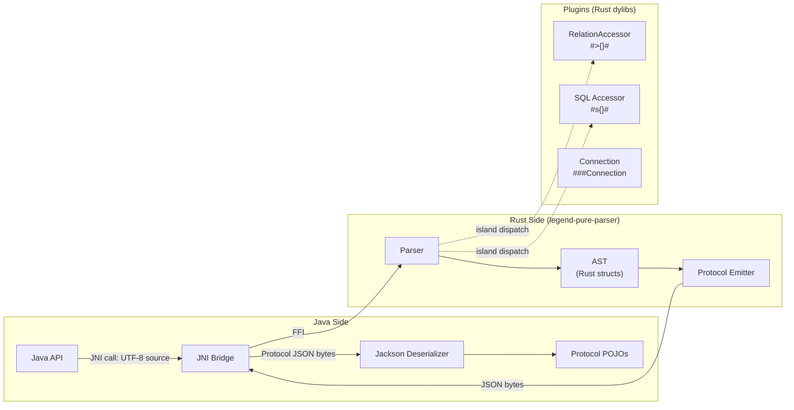
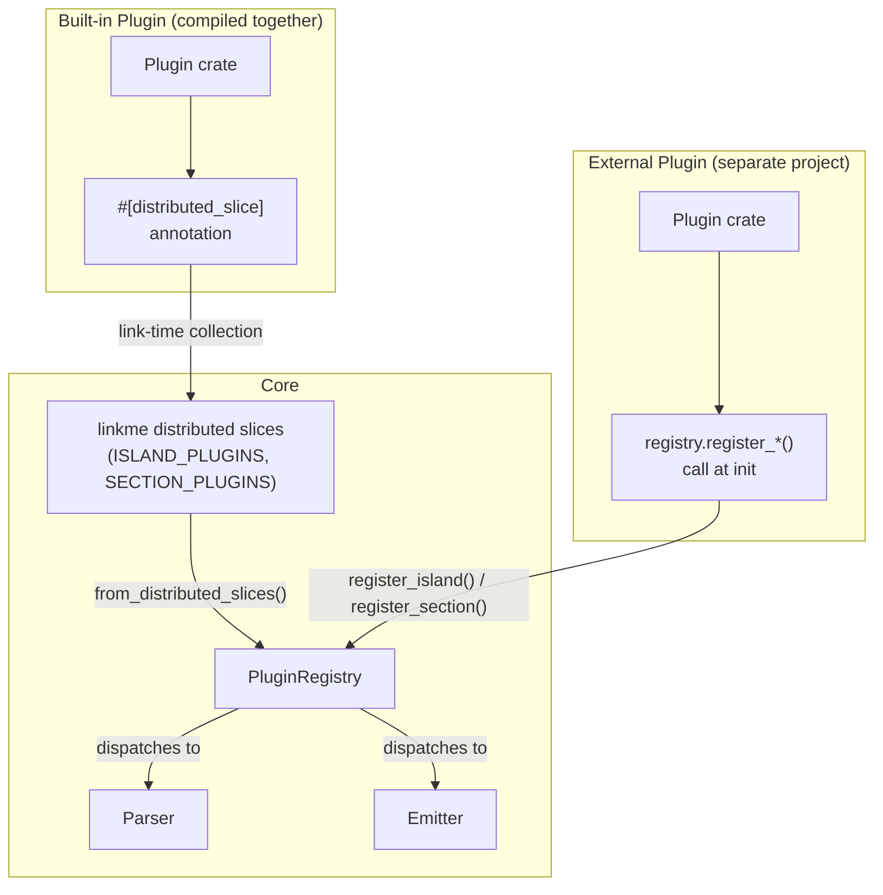
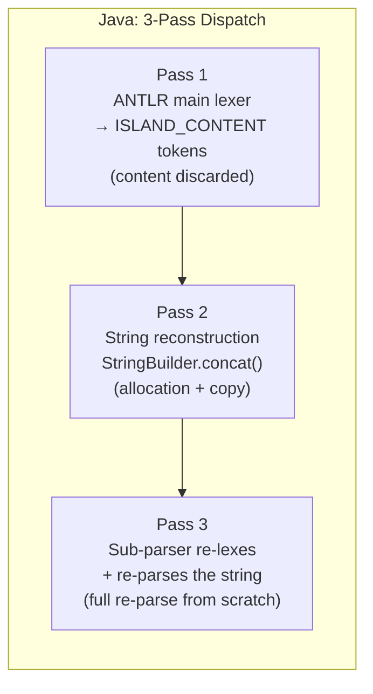
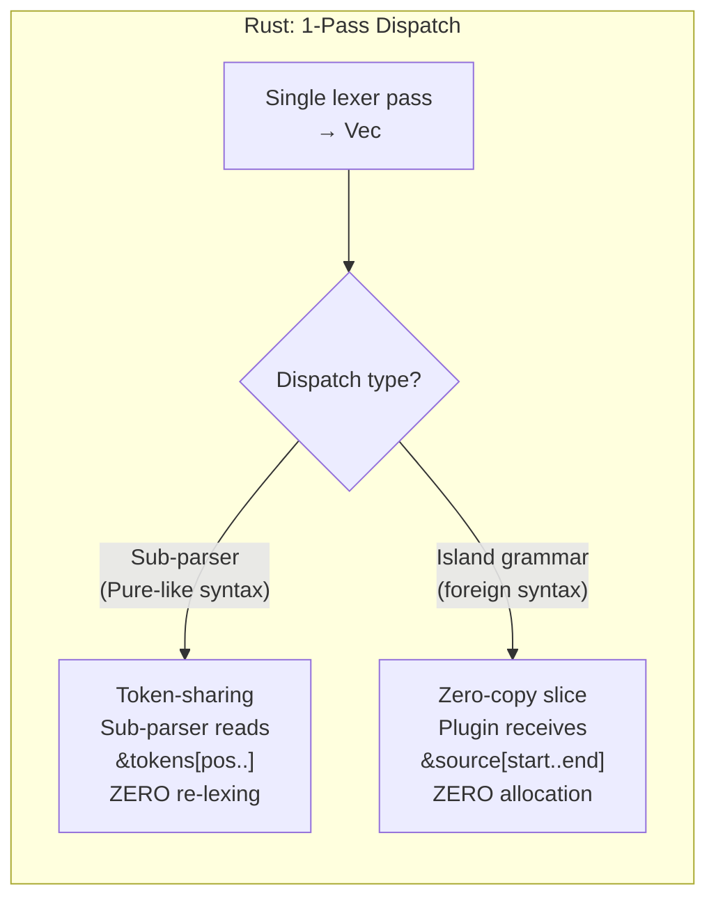
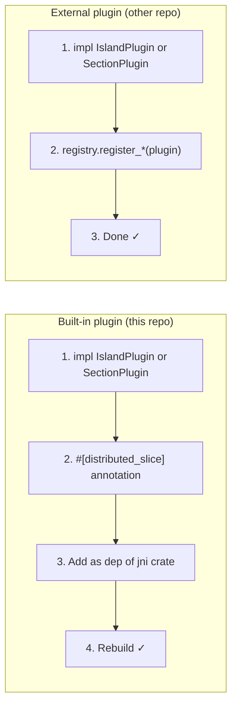

# Rust Pure Parser — Implementation Plan

## Goal

Build a **Rust-based Pure grammar parser** that replaces the current ANTLR4 Java parser. The architecture separates **parsing (→ AST)** from **output generation (→ Protocol JSON)** via JNI, with an extensible plugin system for island grammars (`#>{}#`, `#s{}#`, connections).

## Architecture



> [!IMPORTANT]
> **Key design decision**: The parser produces a Rust **AST** (not JSON). A separate **Emitter** layer converts AST → Protocol JSON. This separation ensures the AST can later be consumed directly by a Rust-based compiler/plan generator without JSON serialization overhead.

---

## Layered Architecture

```
┌─────────────────────────────────────────────┐
│  Layer 4: JNI Bridge (legend-pure-parser-jni)│  ← Java ↔ Rust FFI
├─────────────────────────────────────────────┤
│  Layer 3: Protocol Emitter                  │  ← AST → Protocol JSON
├─────────────────────────────────────────────┤
│  Layer 2: Parser (recursive descent)        │  ← Source → AST
├─────────────────────────────────────────────┤
│  Layer 1: Lexer (tokenizer)                 │  ← Source → Tokens
├─────────────────────────────────────────────┤
│  Layer 0: AST (data model)                  │  ← Shared types
└─────────────────────────────────────────────┘

Plugin boundary: Layers 1-2 dispatch to plugins for island grammars (#>{}#, #s{}#)
```

---

## Proposed Changes

### Rust Workspace (`legend-pure-parser/`)

New Rust workspace at project root with this structure:

#### [NEW] Workspace `Cargo.toml`

```
legend-pure-parser/
├── Cargo.toml                          # workspace root
├── crates/
│   ├── ast/                            # Layer 0: AST types
│   │   ├── Cargo.toml
│   │   └── src/
│   │       ├── lib.rs
│   │       ├── element.rs              # PackageableElement enum (Class, Enum, Function, etc.)
│   │       ├── expression.rs           # ValueSpecification / Expression types
│   │       ├── type_ref.rs             # Type, Multiplicity, PackagePath
│   │       └── source_info.rs          # SourceInformation (line, col, offsets)
│   │
│   ├── lexer/                          # Layer 1: Tokenizer
│   │   ├── Cargo.toml
│   │   └── src/
│   │       ├── lib.rs
│   │       ├── token.rs                # Token enum (keywords, operators, literals)
│   │       └── cursor.rs               # Source cursor with position tracking
│   │
│   ├── parser/                         # Layer 2: Recursive descent parser
│   │   ├── Cargo.toml
│   │   └── src/
│   │       ├── lib.rs
│   │       ├── section.rs              # ###Section dispatch + plugin registry
│   │       ├── domain.rs               # ###Pure: Class, Enum, Function, Profile, etc.
│   │       ├── expression.rs           # Expression / value spec parsing
│   │       ├── plugin.rs               # IslandParser trait + registration
│   │       └── error.rs                # ParseError with source spans
│   │
│   ├── emitter/                        # Layer 3: AST → Protocol JSON
│   │   ├── Cargo.toml
│   │   └── src/
│   │       ├── lib.rs
│   │       ├── protocol_v1.rs          # Protocol v1 JSON emitter
│   │       └── element.rs              # Per-element serialization
│   │
│   ├── jni/                            # Layer 4: JNI bridge
│   │   ├── Cargo.toml
│   │   └── src/
│   │       └── lib.rs                  # JNI exported functions
│   │
│   └── plugins/                        # Built-in plugins
│       ├── relation-accessor/          # #>{}# parser
│       │   ├── Cargo.toml
│       │   └── src/lib.rs
│       └── sql-accessor/              # #s{}# parser (future)
│           ├── Cargo.toml
│           └── src/lib.rs
│
└── tests/
    ├── corpus/                         # .pure files for validation
    └── golden/                         # Expected Protocol JSON outputs
```

---

### Layer 0: AST (`crates/ast/`)

The core data model — **zero dependencies**, used by all other crates.

```rust
// element.rs — Top-level elements
pub enum Element {
    Class(ClassDef),
    Enumeration(EnumDef),
    Function(FunctionDef),
    Profile(ProfileDef),
    Association(AssociationDef),
    Measure(MeasureDef),
}

pub struct ClassDef {
    pub package: PackagePath,
    pub name: String,
    pub super_types: Vec<TypeReference>,
    pub properties: Vec<Property>,
    pub qualified_properties: Vec<QualifiedProperty>,
    pub constraints: Vec<Constraint>,
    pub stereotypes: Vec<StereotypePtr>,
    pub tagged_values: Vec<TaggedValue>,
    pub source_info: SourceInfo,
}

// expression.rs — Value specifications
pub enum Expression {
    Variable(Variable),
    Lambda(Lambda),
    Application(FunctionApplication),
    Property(PropertyAccess),
    Literal(Literal),
    Collection(Vec<Expression>),
    ColumnSpec(ColumnSpec),
    ClassInstance(ClassInstance),  // Island grammar results (#>{}#, etc.)
    Let(LetExpression),
    Not(Box<Expression>),
    ArithmeticOp { op: ArithOp, left: Box<Expression>, right: Box<Expression> },
    BooleanOp { op: BoolOp, left: Box<Expression>, right: Box<Expression> },
    ComparisonOp { op: CompOp, left: Box<Expression>, right: Box<Expression> },
}

pub struct Lambda {
    pub params: Vec<LambdaParam>,
    pub body: Vec<Expression>,
    pub source_info: SourceInfo,
}
```

> [!NOTE]
> The AST is designed to be **1:1 with the grammar**, not 1:1 with Protocol JSON. The Emitter handles the translation. This means the AST is simpler and more natural for parser construction.

---

### Layer 1: Lexer (`crates/lexer/`)

Hand-written lexer producing a flat `Vec<Token>` with spans.

```rust
pub enum TokenKind {
    // Keywords
    Class, Enum, Function, Profile, Association, Measure,
    Native, Import, Extends, Let, As,
    // Types & literals
    Identifier(SmolStr), StringLiteral(String), Integer(i64),
    Float(f64), Decimal(String), Boolean(bool), Date(String),
    // Operators
    Dot, Arrow, Pipe, Colon, SemiColon, Comma, Eq, NotEq,
    Plus, Minus, Star, Slash,
    Lt, Gt, LtEq, GtEq, And, Or, Not, Dollar, Tilde, At, Percent,
    // Delimiters
    LParen, RParen, LBrace, RBrace, LBracket, RBracket,
    LtLt, GtGt,  // << >> for stereotypes
    // Island grammar
    IslandOpen,       // #{ or ISLAND_OPEN
    IslandClose,      // }# or ISLAND_END
    IslandContent(String),
    // Section
    SectionHeader(String),  // ###Pure, ###Relational, etc.
    // Special
    Eof, Newline, PathSeparator,  // ::
}

pub struct Token {
    pub kind: TokenKind,
    pub span: Span,  // byte offsets into source
}
```

---

### Layer 2: Parser (`crates/parser/`)

Recursive descent with **plugin dispatch** for island grammars and section grammars.

#### Plugin Trait

```rust
/// Extension point for island grammars (#>{}#, #s{}#, etc.)
pub trait IslandPlugin: Send + Sync {
    /// The dispatch character after `#` (e.g., '>' for #>{}#, 's' for #s{}#)
    fn island_type(&self) -> &str;

    /// Parse the island content into an AST node
    fn parse(&self, content: &str, source_info: SourceInfo) -> Result<ClassInstance, ParseError>;
}

/// Extension point for section grammars (###Relational, ###Mapping, etc.)
pub trait SectionPlugin: Send + Sync {
    /// The section name (e.g., "Relational", "Mapping")
    fn section_name(&self) -> &str;

    /// Parse the section content into elements
    fn parse_section(&self, lexer: &mut Lexer, registry: &PluginRegistry)
        -> Result<Vec<Element>, ParseError>;
}

/// Registry holding all plugins
pub struct PluginRegistry {
    island_plugins: HashMap<String, Box<dyn IslandPlugin>>,
    section_plugins: HashMap<String, Box<dyn SectionPlugin>>,
}
```

#### Parser Core

```rust
pub struct Parser<'src> {
    tokens: Vec<Token>,
    pos: usize,
    source: &'src str,
    registry: &'src PluginRegistry,
}

impl<'src> Parser<'src> {
    pub fn parse_file(&mut self) -> Result<ParseResult, ParseError> {
        let mut elements = Vec::new();
        while !self.at_eof() {
            match self.peek_section() {
                Some("Pure") => elements.extend(self.parse_pure_section()?),
                Some(name) => {
                    if let Some(plugin) = self.registry.section_plugin(name) {
                        elements.extend(plugin.parse_section(/* ... */)?);
                    } else {
                        return Err(ParseError::unknown_section(name));
                    }
                }
                None => return Err(ParseError::expected_section(self.current_span())),
            }
        }
        Ok(ParseResult { elements })
    }
}
```

---

### Layer 3: Protocol Emitter (`crates/emitter/`)

Converts AST → Protocol v1 JSON, matching the existing Jackson output byte-for-byte.

```rust
pub fn emit_protocol_json(result: &ParseResult) -> Result<String, EmitError> {
    let protocol = ProtocolV1Builder::new();
    for element in &result.elements {
        match element {
            Element::Class(c)       => protocol.emit_class(c)?,
            Element::Enumeration(e) => protocol.emit_enum(e)?,
            Element::Function(f)    => protocol.emit_function(f)?,
            // ...
        }
    }
    protocol.to_json()
}
```

The emitter produces `PureModelContextData` JSON matching the existing format:

```json
{
  "_type": "data",
  "serializer": { "name": "pure", "version": "vX_X_X" },
  "elements": [
    {
      "_type": "class",
      "package": "model",
      "name": "Person",
      "properties": [...],
      "superTypes": [...]
    }
  ]
}
```

---

### Layer 4: JNI Bridge (`crates/jni/`)

#### Rust Side

```rust
use jni::JNIEnv;
use jni::objects::{JClass, JString};
use jni::sys::jstring;

#[no_mangle]
pub extern "system" fn Java_org_finos_legend_engine_language_pure_grammar_from_RustPureParser_parseToProtocolJson(
    env: JNIEnv,
    _class: JClass,
    source: JString,
    section: JString,  // "Pure", "Relational", etc. or empty for auto-detect
) -> jstring {
    let source: String = env.get_string(source).unwrap().into();
    let section: String = env.get_string(section).unwrap().into();

    let registry = get_default_registry();  // built-in plugins
    let result = match parse_and_emit(&source, &section, &registry) {
        Ok(json) => json,
        Err(e) => format!(r#"{{"error":"{}","line":{},"column":{}}}"#,
                          e.message, e.line, e.column),
    };

    env.new_string(result).unwrap().into_inner()
}

fn parse_and_emit(source: &str, section: &str, registry: &PluginRegistry)
    -> Result<String, ParseError>
{
    let tokens = lexer::tokenize(source)?;
    let ast = parser::Parser::new(&tokens, source, registry).parse_file()?;
    emitter::emit_protocol_json(&ast)
}
```

#### Java Side

```java
// legend-engine-language-pure-grammar module
public class RustPureParser {
    static {
        System.loadLibrary("legend_pure_parser_jni");
    }

    public static native String parseToProtocolJson(String source, String section);

    // Integration with existing pipeline
    public static PureModelContextData parse(String source) {
        String json = parseToProtocolJson(source, "");
        return ObjectMapperFactory.getNewStandardObjectMapper()
            .readValue(json, PureModelContextData.class);
    }
}
```

---

## Implementation Phases

### Phase 1: Foundation (Weeks 1-2)

| Task | Deliverable |
|------|-------------|
| Set up Rust workspace with `cargo` | `Cargo.toml`, CI, clippy, fmt |
| Implement `crates/ast` | All AST types for `###Pure` elements and expressions |
| Implement `crates/lexer` | Tokenizer for Pure syntax (keywords, operators, literals, island markers) |
| Unit tests for lexer | Token stream validation against sample Pure files |

### Phase 2: Parser Core (Weeks 3-5)

| Task | Deliverable |
|------|-------------|
| Implement `crates/parser` — element parsing | Class, Enum, Function, Profile, Association, Measure |
| Implement expression parsing | Lambdas, property chains, function calls, operators, `let`, column builders |
| Implement island grammar dispatch | Plugin trait + registry, delegate `#>{}#` to plugins |
| Implement `crates/plugins/relation-accessor` | Parse `#>{db.schema.table}#` into `RelationStoreAccessor` AST node |
| Parser unit tests | Per-element and per-expression tests |

### Phase 3: Protocol Emitter (Week 6)

| Task | Deliverable |
|------|-------------|
| Implement `crates/emitter` | AST → Protocol v1 JSON conversion |
| Golden tests | Compare JSON output against existing ANTLR4 parser output for a corpus of `.pure` files |
| `sourceInformation` fidelity | Ensure line/column numbers match exactly |

### Phase 4: JNI Bridge (Week 7)

| Task | Deliverable |
|------|-------------|
| Implement `crates/jni` | JNI exported functions |
| Java wrapper class | `RustPureParser.java` in `legend-engine-language-pure-grammar` |
| Integration test | Parse `.pure` files via JNI, deserialize to `PureModelContextData`, compare with ANTLR4 output |
| Maven build integration | `maven-cargo-plugin` or pre-built native libs per platform |

### Phase 5: Validation & Integration (Week 8)

| Task | Deliverable |
|------|-------------|
| Corpus validation | Parse all existing `.pure` files in `legend-engine`, compare Protocol JSON |
| Round-trip test | Parse → Compose → Parse, verify semantic equivalence |
| Performance benchmark | Compare parse times: Rust vs ANTLR4 for large models |
| Feature flag | `LegendEngineServerConfiguration.useRustParser = true` |

---

## Extensibility Architecture

This is the core design question: **how does a new island grammar or section grammar propagate through all layers?**

The answer is a **paired plugin system** with **two registration paths**:

1. **`linkme` distributed slices** — for built-in plugins compiled into the same binary (zero boilerplate, auto-discovered at link time)
2. **Runtime `register_*()` API** — for external projects that depend on our library as a crate and want to add their own plugins

### Extension Bundle Pattern



> [!IMPORTANT]
> Each plugin provides **both** parsing and emission. When you add `#s{}#` parsing, you also add the emitter that serializes that AST node to Protocol JSON. Neither the core parser nor the core emitter has hardcoded knowledge of extensions.

### The Extension Contracts

```rust
use linkme::distributed_slice;

// ═══════════════════════════════════════════════════
// DISTRIBUTED SLICES — link-time plugin discovery
// ═══════════════════════════════════════════════════

#[distributed_slice]
pub static ISLAND_PLUGINS: [fn() -> Box<dyn IslandPlugin>];

#[distributed_slice]
pub static SECTION_PLUGINS: [fn() -> Box<dyn SectionPlugin>];

// ═══════════════════════════════════════════════════
// CONTRACT 1: Island Plugin (for #>{}#, #s{}#, etc.)
//
// Islands contain FOREIGN SYNTAX (not Pure tokens).
// The lexer captures island content as a raw byte range.
// The plugin receives a zero-copy &str slice — no allocation.
// ═══════════════════════════════════════════════════

pub trait IslandPlugin: Send + Sync {
    /// Dispatch character(s) after '#' (e.g., ">" for #>{}#, "s" for #s{}#)
    fn island_type(&self) -> &str;

    /// Parse island content into a ClassInstance AST node.
    /// `content` is a zero-copy &str slice of the original source — no allocation.
    fn parse(
        &self,
        content: &str,           // ← &source[start..end], zero-copy
        source_info: SourceInfo,
    ) -> Result<ClassInstance, ParseError>;

    /// Emit this island's ClassInstance to Protocol JSON
    /// Returns the `_type` discriminator and a serde_json::Value
    fn emit(&self, instance: &ClassInstance) -> Result<(String, serde_json::Value), EmitError>;
}

// ═══════════════════════════════════════════════════
// CONTRACT 2: Section Plugin (for ###Relational, ###Connection, etc.)
// ═══════════════════════════════════════════════════

pub trait SectionPlugin: Send + Sync {
    /// Section name (e.g., "Relational", "Connection", "Mapping")
    fn section_name(&self) -> &str;

    /// Parse section content into AST elements
    fn parse_section(
        &self,
        tokens: &[Token],
        pos: &mut usize,
        source: &str,
        registry: &PluginRegistry,
    ) -> Result<Vec<ExtensionElement>, ParseError>;

    /// Emit extension elements to Protocol JSON
    fn emit_elements(
        &self,
        elements: &[ExtensionElement],
    ) -> Result<Vec<serde_json::Value>, EmitError>;
}

// ═══════════════════════════════════════════════════
// CONTRACT 3: Sub-Parser (nested dispatch within sections)
// ═══════════════════════════════════════════════════

/// Categories of sub-parsers — each maps to a Java sub-parser interface.
/// Using an enum ensures compile-time tracking of all sub-parser features.
#[derive(Debug, Clone, Copy, PartialEq, Eq, Hash)]
pub enum SubParserCategory {
    /// Connection types (RelationalDatabaseConnection, MongoDBConnection, etc.)
    ConnectionValue,
    /// Mapping element types (Pure, Relational, XStore mapping class)
    MappingElement,
    /// Mapping include types
    MappingInclude,
    /// Embedded data parsers (ExternalFormat, ModelStore, Relation)
    EmbeddedData,
    /// Test assertion parsers
    TestAssertion,
}

pub trait SubParser: Send + Sync {
    /// Which category this sub-parser belongs to
    fn category(&self) -> SubParserCategory;

    /// The dispatch key within the category
    /// (e.g., "RelationalDatabaseConnection" for ConnectionValue)
    fn sub_type(&self) -> &str;

    /// Parse from the SHARED token stream — zero re-lexing.
    /// The sub-parser reads tokens starting at `pos` and advances the cursor.
    /// It receives the registry so it can chain-dispatch to further sub-parsers.
    fn parse_tokens(
        &self,
        tokens: &[Token],         // ← shared token stream, already lexed once
        pos: &mut usize,          // ← cursor, sub-parser advances as it consumes
        source: &str,             // ← original source for error messages
        registry: &PluginRegistry,
    ) -> Result<Box<dyn Any + Send + Sync>, ParseError>;

    /// Emit the parsed node to Protocol JSON
    fn emit(&self, data: &dyn Any) -> Result<serde_json::Value, EmitError>;
}

// ═══════════════════════════════════════════════════
// DISTRIBUTED SLICES — link-time sub-parser discovery
// ═══════════════════════════════════════════════════

#[distributed_slice]
pub static SUB_PARSERS: [fn() -> Box<dyn SubParser>];

// ═══════════════════════════════════════════════════
// CONTRACT 4: The Unified Registry (hybrid linkme + runtime)
// ═══════════════════════════════════════════════════

pub struct PluginRegistry {
    island_plugins: HashMap<String, Arc<dyn IslandPlugin>>,
    section_plugins: HashMap<String, Arc<dyn SectionPlugin>>,
    sub_parsers: HashMap<SubParserCategory, HashMap<String, Arc<dyn SubParser>>>,
}

impl PluginRegistry {
    /// Auto-discover all built-in plugins via linkme distributed slices.
    /// Called once at library load (JNI_OnLoad or first parse call).
    pub fn from_distributed_slices() -> Self {
        let mut registry = Self::new();
        for factory in ISLAND_PLUGINS {
            let plugin: Arc<dyn IslandPlugin> = factory().into();
            registry.island_plugins.insert(
                plugin.island_type().to_string(), plugin
            );
        }
        for factory in SECTION_PLUGINS {
            let plugin: Arc<dyn SectionPlugin> = factory().into();
            registry.section_plugins.insert(
                plugin.section_name().to_string(), plugin
            );
        }
        for factory in SUB_PARSERS {
            let sp: Arc<dyn SubParser> = factory().into();
            registry.sub_parsers
                .entry(sp.category())
                .or_default()
                .insert(sp.sub_type().to_string(), sp);
        }
        registry
    }

    /// Runtime registration — for external projects
    pub fn register_island(&mut self, plugin: Arc<dyn IslandPlugin>) {
        self.island_plugins.insert(plugin.island_type().to_string(), plugin);
    }

    pub fn register_section(&mut self, plugin: Arc<dyn SectionPlugin>) {
        self.section_plugins.insert(plugin.section_name().to_string(), plugin);
    }

    pub fn register_sub_parser(&mut self, sp: Arc<dyn SubParser>) {
        self.sub_parsers
            .entry(sp.category())
            .or_default()
            .insert(sp.sub_type().to_string(), sp);
    }

    /// Lookup a sub-parser by category + dispatch key
    pub fn get_sub_parser(
        &self,
        category: SubParserCategory,
        sub_type: &str,
    ) -> Option<&Arc<dyn SubParser>> {
        self.sub_parsers.get(&category)?.get(sub_type)
    }
}
```

---

### Single-Pass Token Sharing (Java vs Rust)

This is the key efficiency difference between the current Java parser and the Rust design.

#### The Java Problem: 3-Pass String Extraction

In Java (see [DomainParseTreeWalker.java:1458](file:///Users/cocobey73/Projects/legend-engine/legend-engine-core/legend-engine-core-base/legend-engine-core-language-pure/legend-engine-language-pure-grammar/src/main/java/org/finos/legend/engine/language/pure/grammar/from/domain/DomainParseTreeWalker.java#L1458)), the current dispatch works like this:



```java
// Java — Step 2: Reconstruct string by concatenating parse tree fragments
String content = ListIterate.collect(ctx.dslExtension().dslExtensionContent(),
    RuleContext::getText).makeString("");  // ← allocation + concatenation

// Java — Step 3: Sub-parser re-lexes and re-parses the extracted string
embeddedPureParser.parse(content.substring(0, content.length() - 2), ...);
// ↑ brand new lexer + parser created for the SAME text that was already lexed
```

#### The Rust Solution: Two Zero-Overhead Strategies



**Strategy A — Token Sharing** (for sub-parsers: connections, mappings, etc.)

Sub-parsers receive the **same token slice** the main parser is consuming. They just advance the shared cursor. No re-lexing, no allocation:

```rust
// The sub-parser gets the SAME tokens — just continues reading
fn parse_tokens(
    &self,
    tokens: &[Token],     // ← shared with parent, already lexed
    pos: &mut usize,      // ← cursor advances as sub-parser consumes
    source: &str,         // ← original source for error messages
    registry: &PluginRegistry,
) -> Result<Box<dyn Any + Send + Sync>, ParseError>;
```

**Strategy B — Zero-Copy Content Slice** (for island grammars: `#>{}#`, `#s{}#`)

Islands contain foreign syntax that can't share the Pure token vocabulary. But the content is a **zero-copy reference** into the original source — no `StringBuilder`, no allocation:

```rust
// The island plugin gets a &str slice — NOT a copy
fn parse(
    &self,
    content: &str,           // ← &source[start..end], zero-copy
    source_info: SourceInfo,
) -> Result<ClassInstance, ParseError>;
```

#### Comparison

| | Java (ANTLR) | Rust Token-Sharing | Rust Zero-Copy Slice |
|---|---|---|---|
| **Used for** | All dispatch | Sub-parsers (Connection, Mapping) | Islands (`#>{}#`, `#s{}#`) |
| **Lexing passes** | 2 (main + sub-parser) | **1** (shared tokens) | **1** (lexer records byte range) |
| **String alloc** | `StringBuilder.concat()` | **None** | **None** (`&str` reference) |
| **Parse tree** | Full ANTLR tree + walker | Direct token consumption | Direct string slice |
| **Memory** | O(n) extra per dispatch | O(0) extra | O(0) extra |

#### Runtime Walkthrough: Token Sharing in Action

```
Source:
###Connection
model::MyConn
{
  RelationalDatabaseConnection
  {
    store: model::MyDb;
    type: Postgres;
  }
}

─── Single Lexer Pass ───
Tokens: [ SectionHeader("Connection"), Ident("model"), PathSep, Ident("MyConn"),
          LBrace, Ident("RelationalDatabaseConnection"), LBrace,
          Ident("store"), Colon, Ident("model"), PathSep, Ident("MyDb"), Semi,
          Ident("type"), Colon, Ident("Postgres"), Semi, RBrace, RBrace ]
pos:      0                            1               2        3
          4      5                                      6
          7               8      9               10       11             12
          13             14     15                 16    17     18

─── Parser Flow ───
1. Parser reads tokens[0] = SectionHeader("Connection")
   → dispatches to ConnectionSectionPlugin.parse_section(tokens, pos=1, ...)

2. ConnectionSectionPlugin reads tokens[1..4]:
   - Ident("model"), PathSep, Ident("MyConn"), LBrace → connection name
   - pos now at 5

3. Reads tokens[5] = Ident("RelationalDatabaseConnection")
   → registry.get_sub_parser(ConnectionValue, "RelationalDatabaseConnection")
   → calls sub_parser.parse_tokens(tokens, pos=6, ...)
   ┌──────────────────────────────────────────────────────┐
   │ Sub-parser reads tokens[6..17] using SAME slice:     │
   │ LBrace, Ident("store"), Colon, Ident("model"),      │
   │ PathSep, Ident("MyDb"), Semi, Ident("type"),         │
   │ Colon, Ident("Postgres"), Semi, RBrace               │
   │ → returns ConnectionData { store, type, ... }        │
   │ → advances pos to 18                                 │
   └──────────────────────────────────────────────────────┘

4. ConnectionSectionPlugin reads tokens[18] = RBrace
   → connection parsing complete, pos = 19

Total lexer passes: 1       String allocations: 0       Token copies: 0
```

---

### Nested Dispatch: How `###Connection` Redispatches

This is the key pattern. A `SectionPlugin` for `###Connection` delegates to a `SubParser` for the connection type:

```
###Connection
model::MyConn
{
  RelationalDatabaseConnection      ← dispatch key
  {
    store: model::MyDb;
    type: Postgres;
    ...
  }
}

1. Parser sees ###Connection → dispatches to ConnectionSectionPlugin
2. ConnectionSectionPlugin reads connection name, parses until it finds the type keyword
3. Finds "RelationalDatabaseConnection" as the inner type
4. Calls: registry.get_sub_parser(ConnectionValue, "RelationalDatabaseConnection")
5. Gets RelationalConnectionSubParser (contributed by Relational extension via linkme)
6. Delegates: sub_parser.parse(inner_content, src_info, registry)
7. RelationalConnectionSubParser parses store, type, specification, auth → ConnectionData
8. On emit: same delegation chain in reverse
```

```rust
// crates/plugins/connection/src/lib.rs — the section plugin
impl SectionPlugin for ConnectionSectionPlugin {
    fn parse_section(&self, tokens: &[Token], pos: &mut usize,
                     source: &str, registry: &PluginRegistry)
        -> Result<Vec<ExtensionElement>, ParseError>
    {
        // ... parse connection header ...
        let conn_type = read_connection_type(tokens, pos)?;

        // Redispatch to the registered connection value sub-parser
        let sub = registry.get_sub_parser(
            SubParserCategory::ConnectionValue,
            &conn_type
        ).ok_or(ParseError::unknown_connection_type(&conn_type))?;

        let data = sub.parse(inner_content, source_info, registry)?;
        // ... wrap in ExtensionElement ...
    }
}
```

```rust
// In the Relational extension crate — auto-registered via linkme
pub struct RelationalConnectionSubParser;

impl SubParser for RelationalConnectionSubParser {
    fn category(&self) -> SubParserCategory { SubParserCategory::ConnectionValue }
    fn sub_type(&self) -> &str { "RelationalDatabaseConnection" }

    fn parse(&self, content: &str, source_info: SourceInfo,
             registry: &PluginRegistry)
        -> Result<Box<dyn Any + Send + Sync>, ParseError>
    {
        // Parse store, type, specification, auth...
        Ok(Box::new(RelationalConnectionData { /* ... */ }))
    }

    fn emit(&self, data: &dyn Any) -> Result<serde_json::Value, EmitError> {
        let conn = data.downcast_ref::<RelationalConnectionData>()
            .ok_or(EmitError::type_mismatch("RelationalDatabaseConnection"))?;
        Ok(json!({
            "_type": "RelationalDatabaseConnection",
            "store": conn.store,
            "type": conn.db_type,
            // ...
        }))
    }
}

#[distributed_slice(SUB_PARSERS)]
fn register_relational_conn() -> Box<dyn SubParser> {
    Box::new(RelationalConnectionSubParser)
}

### How the AST Stays Open for Extension

The AST uses an **open extension point** for plugin-produced nodes:

```rust
// ═══════════════════════════════════════════════════
// Core AST — Element is open to extension
// ═══════════════════════════════════════════════════

pub enum Element {
    // Built-in (###Pure)
    Class(ClassDef),
    Enumeration(EnumDef),
    Function(FunctionDef),
    Profile(ProfileDef),
    Association(AssociationDef),
    Measure(MeasureDef),

    // Extension elements — produced by SectionPlugins
    Extension(ExtensionElement),
}

/// Opaque container for plugin-produced elements
pub struct ExtensionElement {
    pub section: String,              // "Relational", "Connection", etc.
    pub element_type: String,         // "database", "connection", etc.
    pub package: PackagePath,
    pub name: String,
    pub data: Box<dyn std::any::Any + Send + Sync>,  // Plugin-specific data
    pub source_info: SourceInfo,
}

// ═══════════════════════════════════════════════════
// Core AST — Expression's ClassInstance is open to extension
// ═══════════════════════════════════════════════════

pub enum Expression {
    // ...all built-in variants...
    ClassInstance(ClassInstance),      // ← Island grammar results land here
}

/// Opaque container for island-grammar-produced values
pub struct ClassInstance {
    pub instance_type: String,        // "relationalStoreAccessor", "sqlExpression", etc.
    pub data: Box<dyn std::any::Any + Send + Sync>,  // Plugin-specific data
    pub source_info: SourceInfo,
}
```

> [!NOTE]
> Using `Box<dyn Any>` for extension data means the core AST crate has **zero knowledge** of plugin-specific types. The plugin that produces the data is the same plugin that emits it — type safety is maintained within each plugin.

---

### Walkthrough 1: Adding a New Island Grammar (`#s{}#`)

Here's exactly what a developer does to add SQL accessor support:

**Step 1**: Create `crates/plugins/sql-accessor/`

```rust
// crates/plugins/sql-accessor/src/lib.rs

/// Plugin-specific AST data
pub struct SqlAccessorData {
    pub query: String,
}

pub struct SqlAccessorPlugin;

impl IslandPlugin for SqlAccessorPlugin {
    fn island_type(&self) -> &str { "s" }

    fn parse(&self, content: &str, source_info: SourceInfo) -> Result<ClassInstance, ParseError> {
        Ok(ClassInstance {
            instance_type: "sqlExpression".to_string(),
            data: Box::new(SqlAccessorData { query: content.trim().to_string() }),
            source_info,
        })
    }

    fn emit(&self, instance: &ClassInstance) -> Result<(String, serde_json::Value), EmitError> {
        let data = instance.data.downcast_ref::<SqlAccessorData>()
            .ok_or(EmitError::type_mismatch("sqlExpression"))?;
        Ok(("sqlExpression".to_string(), json!({ "query": data.query })))
    }
}
```

**Step 2**: Register it — choose your path:

````carousel
**Path A: Built-in (compiled together) — `linkme` auto-registration**

```rust
// Just annotate — no manual registration code needed!
#[distributed_slice(ISLAND_PLUGINS)]
fn register_sql_accessor() -> Box<dyn IslandPlugin> {
    Box::new(SqlAccessorPlugin)
}
```

Then add as a dependency of the `jni` crate:
```toml
# crates/jni/Cargo.toml
[dependencies]
legend-pure-parser-plugin-sql-accessor = { path = "../plugins/sql-accessor" }
```

Rebuild. The linker collects the annotated function into the `ISLAND_PLUGINS` distributed slice. `PluginRegistry::from_distributed_slices()` picks it up automatically.
<!-- slide -->
**Path B: External project — runtime registration**

```rust
// An external project depending on legend-pure-parser as a library
use legend_pure_parser::PluginRegistry;

let mut registry = PluginRegistry::from_distributed_slices();
registry.register_island(Arc::new(SqlAccessorPlugin));
// registry now has all built-in + the custom plugin
```

This is for teams building their own grammar extensions outside this repo.
````

**Step 3**: Done. No changes to core AST, parser, emitter, or JNI.

**What happens at runtime:**

```
Source: #s{ SELECT * FROM foo }#

1. Lexer sees '#s' → IslandOpen(type="s") + captures content
2. Parser:
   - Encounters IslandOpen(type="s")
   - Looks up registry.island_plugin("s") → SqlAccessorPlugin
   - Calls plugin.parse("SELECT * FROM foo", src_info)
   - Gets back ClassInstance { type: "sqlExpression", data: SqlAccessorData }
   - Wraps in Expression::ClassInstance(...)
3. Emitter:
   - Encounters Expression::ClassInstance(ci) where ci.instance_type == "sqlExpression"
   - Looks up registry.island_plugin_by_type("sqlExpression") → SqlAccessorPlugin
   - Calls plugin.emit(ci)
   - Gets ("sqlExpression", {"query": "SELECT * FROM foo"})
   - Inserts into Protocol JSON as: {"_type": "classInstance", "type": "sqlExpression", "value": {"query": "..."}}
```

---

### Walkthrough 2: Adding a New Section (`###Connection`)

**Step 1**: Create `crates/plugins/connection/`

```rust
// crates/plugins/connection/src/lib.rs

/// Plugin-specific AST data for connections
pub struct ConnectionData {
    pub connection_type: String,  // "RelationalDatabaseConnection", etc.
    pub store: String,
    pub config: serde_json::Value,  // Plugin can use JSON internally
}

pub struct ConnectionSectionPlugin;

impl SectionPlugin for ConnectionSectionPlugin {
    fn section_name(&self) -> &str { "Connection" }

    fn parse_section(
        &self,
        tokens: &[Token],
        pos: &mut usize,
        source: &str,
        registry: &PluginRegistry,
    ) -> Result<Vec<ExtensionElement>, ParseError> {
        let mut elements = Vec::new();
        // Parse connection definitions from tokens...
        // Each connection becomes an ExtensionElement with ConnectionData
        while !at_section_end(tokens, *pos) {
            let conn = self.parse_connection(tokens, pos, source)?;
            elements.push(ExtensionElement {
                section: "Connection".to_string(),
                element_type: "connection".to_string(),
                package: conn.package,
                name: conn.name,
                data: Box::new(conn.data),
                source_info: conn.source_info,
            });
        }
        Ok(elements)
    }

    fn emit_elements(
        &self,
        elements: &[ExtensionElement],
    ) -> Result<Vec<serde_json::Value>, EmitError> {
        elements.iter().map(|el| {
            let data = el.data.downcast_ref::<ConnectionData>()
                .ok_or(EmitError::type_mismatch("connection"))?;
            Ok(json!({
                "_type": "connection",
                "package": el.package.to_string(),
                "name": el.name,
                "connectionValue": {
                    "_type": data.connection_type,
                    "store": data.store,
                    // ... rest of connection config
                }
            }))
        }).collect()
    }
}
```

**Step 2**: Register it — same two paths:

````carousel
**Path A: Built-in — `linkme` auto-registration**

```rust
#[distributed_slice(SECTION_PLUGINS)]
fn register_connection() -> Box<dyn SectionPlugin> {
    Box::new(ConnectionSectionPlugin)
}
```

Add as dependency of `jni` crate, rebuild. Automatically discovered.
<!-- slide -->
**Path B: External project — runtime registration**

```rust
let mut registry = PluginRegistry::from_distributed_slices();
registry.register_section(Arc::new(ConnectionSectionPlugin));
```
````

**Step 3**: Done. No changes to core.

**What happens at runtime:**

```
Source:
###Connection
model::MyConnection
{
  RelationalDatabaseConnection
  {
    store: model::MyDb;
    ...
  }
}

1. Parser sees SectionHeader("Connection")
2. Looks up registry.section_plugin("Connection") → ConnectionSectionPlugin
3. Calls plugin.parse_section(tokens, ...) → Vec<ExtensionElement>
4. Wraps each in Element::Extension(...)
5. Emitter sees Element::Extension(el) where el.section == "Connection"
6. Looks up registry.section_plugin("Connection") → ConnectionSectionPlugin
7. Calls plugin.emit_elements(...) → Protocol JSON objects
8. Inserts into PureModelContextData.elements[]
```

---

### Extensibility Summary



| What you add | Registration | Files touched in core | Files in plugin |
|---|---|---|---|
| Built-in island (`#x{}#`) | `linkme` auto-discovery | **0** | 1 file + `Cargo.toml` dep |
| Built-in section (`###Foo`) | `linkme` auto-discovery | **0** | 1 file + `Cargo.toml` dep |
| External island | `registry.register_island()` | **0** | 1 file in external project |
| External section | `registry.register_section()` | **0** | 1 file in external project |
| New expression type | N/A — built-in only | 1 — add `Expression` variant | Parser + Emitter logic |

> [!TIP]
> New sections and islands are **100% plugin-only** — no core changes. Built-in plugins use `linkme` for zero-boilerplate registration. External plugins use `register_*()` for runtime registration. Both paths produce the same result at the `PluginRegistry` level.

---

## Considerations

### Backward Compatibility

| Concern | Strategy |
|---------|----------|
| Protocol JSON schema must match exactly | Golden test corpus comparing Rust vs ANTLR4 JSON output |
| `sourceInformation` (line/col) must match | Track positions identically to ANTLR4's CharStream |
| Error messages may differ | Acceptable — document differences |
| Feature flag for rollback | `useRustParser` config flag; fall back to ANTLR4 |

### Cross-Platform Native Libs

| Platform | Library | Distribution |
|----------|---------|-------------|
| macOS (aarch64) | `liblegend_pure_parser_jni.dylib` | Maven artifact classifier |
| macOS (x86_64) | `liblegend_pure_parser_jni.dylib` | Maven artifact classifier |
| Linux (x86_64) | `liblegend_pure_parser_jni.so` | Maven artifact classifier |
| Windows (x86_64) | `legend_pure_parser_jni.dll` | Maven artifact classifier |

Build via GitHub Actions matrix; publish platform-specific JARs with native libs to Maven.

### Why AST ≠ Protocol JSON

The AST is designed for **parser efficiency and future compiler use**:

| AST (Rust) | Protocol JSON |
|------------|---------------|
| `Expression::ArithmeticOp { op: Add, left, right }` | `{"_type": "func", "function": "plus", "parameters": [...]}` |
| `Expression::Property(PropertyAccess { name, subtype })` | `{"_type": "property", "property": "name", "parameters": [...]}` |
| `Expression::Lambda(Lambda { params, body })` | `{"_type": "lambda", "parameters": [...], "body": [...]}` |

The emitter handles this translation. When we later build a Rust-based compiler, it works directly on the AST — no JSON parsing needed.

---

## Verification Plan

### Automated Tests

```bash
# Rust unit tests
cargo test --workspace

# Golden tests (Rust output vs ANTLR4 baseline)
cargo test --test golden -- --corpus tests/corpus/

# JNI integration test
cd legend-engine && mvn test -pl legend-engine-language-pure-grammar \
  -Dtest=RustParserIntegrationTest

# Full corpus validation
mvn test -pl legend-engine-language-pure-grammar \
  -Dtest=RustParserCorpusValidationTest
```

### Manual Verification

1. Parse a representative set of production `.pure` files
2. Compare Protocol JSON output byte-for-byte
3. Compile the Rust-parsed output through the existing Java compiler
4. Verify the compiled Pure graph is identical

---

## Risk Assessment

| Risk | Severity | Mitigation |
|------|----------|------------|
| Expression grammar edge cases | **High** | Fuzz test against ANTLR4; use the ANTLR4 `.g4` files as specification |
| JNI overhead per call | **Low** | Single call per file; batch parsing for multiple files |
| Cross-platform native lib distribution | **Medium** | GitHub Actions CI matrix; pre-built JARs per platform |
| `sourceInformation` mismatch | **Medium** | Dedicated test comparing line/col for every token |
| Island grammar complexity | **Low** | `#>{}#` is trivially simple; `#s{}#` follows same pattern |
| Plugin ABI stability | **Medium** | Use `cdylib` + C ABI for plugins; version the interface |
