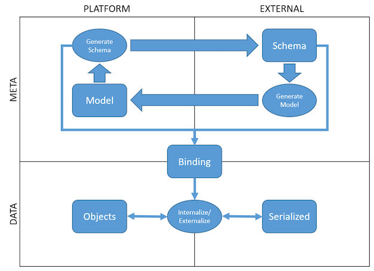

# Bindings

A Binding is used to define support in the platform for data in some format.
Data is either described using a formal schema or understood through conventions.

A Binding is used to declare an internalize/externalize (deserialization/serialisation)
relationship between data in some format and a model.

## Concepts

### Overview

Internal to the platform we have the data model to describe the data structurally and
instances of it to represent data values.  Their external equivalents are the schema
(for example a JSON Schema) and the serialized form of the data (for example a JSON
document).

Models can be generated from schemas and vice versa.

### SchemaSet
A `SchemaSet` holds one or more schemas as part of the project's metadata.
The schemas in a set must be of the same type and should be related, for example where schemas refer to each other for inclusion.
Unrelated schemas should be in different SchemaSets.

Each schema defines:

* **Id** which if given must be unique within the schema set.  It is used to reference a specific schema within the set (for example in a Binding).
* **Location** associates a location with the schema which is used when resolving schema references.  For example when resolving include/import/redefine elements for XSDs.
* **Content** the text of the schema

### Binding
A `Binding` signifies a link between a model and data a serialized format.
The data may be formally described by a schema.  Where it is not the link is achieved using a set of conventions.

Each binding defines:

* **contentType** specified the content type (such as application/json) which specifies the format of the serialized data
* **schemaSet** if given specifies the SchemaSet holding the schema
                When given the SchemaSet must define schemas compatible with the content type.
* **schemaId** if given specifies the id of the schema within the SchemaSet
* **modelUnit** defines the classes, enums and associations that make up the model

## Adding new binding formats

To add a new serialized data format to the platform we add a set of modules:

* A pure module to define the metamodel of the schema, generation capabilities and binding validation. 
* A model module that handles schemas for the format and the generations of models from schema and vice versa.
* A runtime module that handles the execution of internalization (deserialization) and externalization (serialization) to move data between the serialized form and the platform.
* Optionally a shared module to provide functionality required by both the model and runtime modules
* A protocol module to add definitions to the protocol

The most important distinction is between the model and the runtime modules.  
The model module can depend on the full capabilities of the platform, in particular the parsing and compiler capabilities.
The runtime model must only depend on features available at execution time.  In particular it must not depend on legend-pure, directly or transitively.

*Modules are currently named legend-xxx-external-format-xxx.  These will be renamed to legend-xxx-binding-xxx for greater clarity.*  

### Pure extension module

NB once metadata modularization is complete these aspects can be placed in legend-engine.  Until then they need to be in legend-pure.

See legend-pure-code-compiled-core-external-format-xml for an example.

#### Metamodel

The metamodel is the Pure data structure that is used to represent and work with the schema definition of the format.
When a SchemaSet is compiled this data structure is the resultant type for a schema.
To attach this definition into a compiled SchemaSet the root class of the metamodel for a format must extend `meta::external::shared::format::metamodel::SchemaDetail`.  

#### Generations

If you want to support generations (schema to model and/or model to schema) you define those processes here.
Each is driven by a configuration that should extend these base classes accordingly:

* `meta::external::shared::format::binding::toPure::SchemaToModelConfiguration`
* `meta::external::shared::format::binding::fromPure::ModelToSchemaConfiguration`

When either form of generation happens the result is a Binding and the generated model or schema.
The Binding links the source (existing model/schema) and the target (generated schema/model).

#### Execution plans

When an execution plan to internalize or externalize data in this format is used the planning and linkage are defined here.

**THIS IS IN THE PROCESS OF BEING SIMPLIFIED**  Currently each format creates its own serialize/deserialize nodes.
This is being replaced with generic internalize/externalize nodes and the excution plans will only need to deal with
the specifics of handling the data transformations for the format.

#### Binding verification

When a Binding is compiled we carry out a compatibility check to ensure the model and schema (if supplied) are
still compatible.  This is done by calculating a `meta::external::shared::format::binding::validation::BindingDetail`.
If the models are not compatible this should be a `meta::external::shared::format::binding::validation::FailedBindingDetail`.

### Model extension module

See legend-engine-xt-xml-model for an example.

This module should provide an implementation of `ExternalFormatExtension`.  This provides linkages from the
engine to the features you've coded in the pure module.

The bulk of the work in this module will be the interpretation of the schema text(s) into the metamodel.
Where available you should take advantage of libraries related to the format to perform this interpretation.

### Runtime extension module

See legend-engine-xt-xml-runtime for an example.

This module handles the transformations of data to and from the serialized format.
When present in the binding this should utilise the specifics of the schema.
This module should closely interoperate with the node specific code produced for the execution plan.

