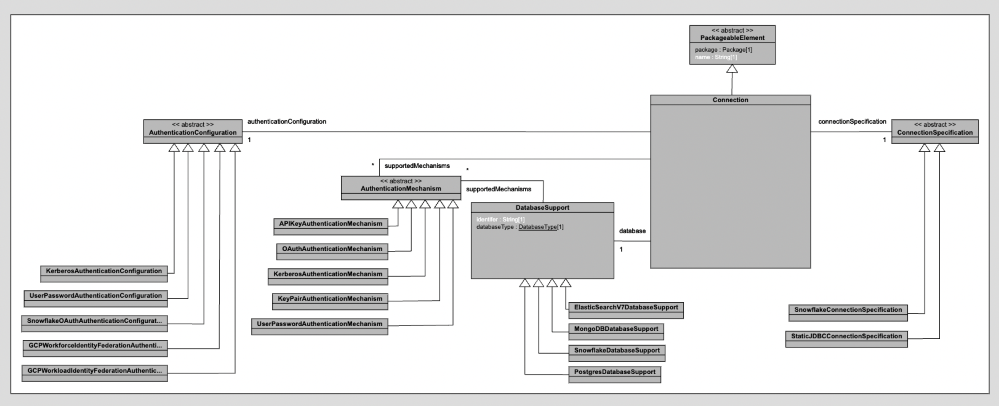
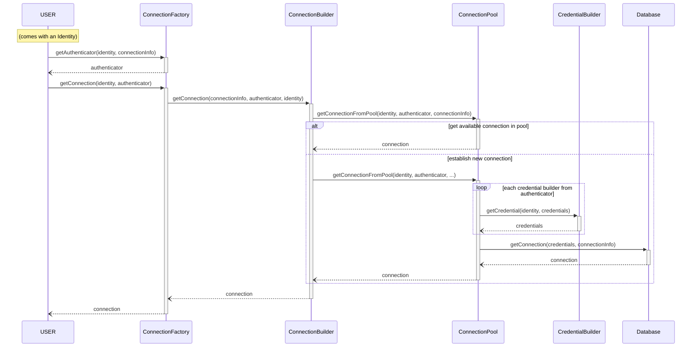

# New Connection Framework (PoC)

This is _an attempt_ to cleanup the existing connection acquisition framework to make it (1) more extensible, (2) integrate better with work that has been done on [identity/credential management](https://github.com/finos/legend/wiki/Legend-Authentication) by @epsstan as well as feedback from @pierredebelen, and (3) reduce code complexity. The core mission centers around: **_"How do we make it easy for people (both platform developers and users) to acquire database connection given their identity?"_**

> This is still a work in progress, we haven't enabled this in production. To use/test, set environment variable `org.finos.legend.engine.enableNewConnectionFramework=true` when starting the server. To execute, since at the time of speaking, we haven't include the new connection models in latest production protocol, choose `clientVersion=vX_X_X`

## Overview

Fundamentally, the new connection framework improves DX for integrating new type of connection by making it consistent across different types of databases (not limited to only relational databases); in other words, adding support for `MongoDB` or `ElasticSearch` should require similar set of change to adding support for `Snowflake` or `BigQuery`, for example.

The new API is also designed to be more declarative about the connection acquisition flows that it supports, hence, it's a continuation of the work that has been done with [DatabaseAuthenticationFlow](https://github.com/finos/legend-engine/blob/07e7129ec2b68d7c1606dd157c23e65d7cd6857b/legend-engine-xts-relationalStore/legend-engine-xt-relationalStore-execution/legend-engine-xt-relationalStore-executionPlan-connection-authentication/src/main/java/org/finos/legend/engine/authentication/DatabaseAuthenticationFlow.java#L42) by @epsstan. In the new framework, when we setup the connection manager/factory, we make it very explicit which flows are supported (which types of credentials can be resolved given an identity, and which those credentials, which types of connection can be acquired).

Last but not least, we want to clean up the existing connection pooling code using [HikariCP](https://github.com/brettwooldridge/HikariCP) which has become fairly complex after many iterations.

For more details on design and implementation, see the following sub-sections:

- [Connection Factory](#connection-factory)
- [Connection Pooling](#connection-pooling)
- [Migration Strategy](#migration-strategy)
- [Future Work / TODO](#future-work-/-todo)

## Connection Factory

`ConnectionFactory` is the API entry of the new connection framework. It is simplified to specifically addresses the main objective: **given an identity, obtain a connection to a database**. A new set of (meta)model have been created to serve this new API.

These models are heavily inspired by [RelationalDatabaseConnection](https://github.com/finos/legend-engine/blob/07e7129ec2b68d7c1606dd157c23e65d7cd6857b/legend-engine-xts-relationalStore/legend-engine-xt-relationalStore-generation/legend-engine-xt-relationalStore-protocol/src/main/java/org/finos/legend/engine/protocol/pure/v1/model/packageableElement/store/relational/connection/RelationalDatabaseConnection.java#L25); a `Connection` in the new framework comes with `AuthenticationConfiguration` corresponding to [AuthenticationStrategy](https://github.com/finos/legend-engine/blob/07e7129ec2b68d7c1606dd157c23e65d7cd6857b/legend-engine-xts-relationalStore/legend-engine-xt-relationalStore-generation/legend-engine-xt-relationalStore-protocol/src/main/java/org/finos/legend/engine/protocol/pure/v1/model/packageableElement/store/relational/connection/authentication/AuthenticationStrategy.java#L21) and `ConnectionSpecification` corresponding to [DatasourceSpecification](https://github.com/finos/legend-engine/blob/07e7129ec2b68d7c1606dd157c23e65d7cd6857b/legend-engine-xts-relationalStore/legend-engine-xt-relationalStore-generation/legend-engine-xt-relationalStore-protocol/src/main/java/org/finos/legend/engine/protocol/pure/v1/model/packageableElement/store/relational/connection/specification/DatasourceSpecification.java#L21). The former is responsible for providing extra metadata needed to obtain necessary credential from the user's identity while the latter provides metadata to obtain the actual connection to the database given the obtained credentials.



> We believe in this abstraction since concepts like `authentication` and `connection specification` are certainly applicable to NoSQL databases like `MongoDB` and `ElasticSearch`

Each connection targets a particular type of database (similar to [RelationalDatabaseConnection.databaseType](https://github.com/finos/legend-engine/blob/07e7129ec2b68d7c1606dd157c23e65d7cd6857b/legend-engine-xts-relationalStore/legend-engine-xt-relationalStore-generation/legend-engine-xt-relationalStore-protocol/src/main/java/org/finos/legend/engine/protocol/pure/v1/model/packageableElement/store/relational/connection/RelationalDatabaseConnection.java#L29)), which comes with a set of database support defined in the platform configuration. As of now, this database support only includes information about the various authentication mechanisms that a database supports in Legend. For example, for `Snowflake`, we only support `OAuth` and `KeyPair`; for `Postgres`, we only support `UsernamePassword`. Since `AuthenticationConfiguration` provides extra metadata to obtain credentials, each type of configuration therefore is bound to an `AuthenticationMechanism` -- this specification is also something defined explicitly at top-level.

> Unlike [RelationalDatabaseConnection.databaseType](https://github.com/finos/legend-engine/blob/07e7129ec2b68d7c1606dd157c23e65d7cd6857b/legend-engine-xts-relationalStore/legend-engine-xt-relationalStore-generation/legend-engine-xt-relationalStore-protocol/src/main/java/org/finos/legend/engine/protocol/pure/v1/model/packageableElement/store/relational/connection/RelationalDatabaseConnection.java#L29)) which is practically an enum which is not modularizable and hardcoded to Relational types, `database support` is more extensible and a useful concept on its own, in the future, we can add more database capabilities here as needed

As for the `ConnectionFactory`, it's configured with 2 types of components:`CredentialBuilder` - (can be chained) taking the identity and build a credential, `ConnectionBuilder` - taking a credential and acquire a connection.

```java
class ConnectionBuilder<CONNECTION, CRED extends Credential, SPEC extends ConnectionSpecification>
...

class CredentialBuilder<CONFIG extends AuthenticationConfiguration, INPUT_CRED extends Credential, OUTPUT_CRED extends Credential>
...
```

> Notice how the credential builder is bound to the authentication configuration as some credential builders need extra metadata from the configuration to obtain the credential, for example, `UserPasswordCredentialBuilder` needs the name of the user and the reference to the password in the secret vault. @epsstan mentioned here that we should also tie `CrendetialBuilder` by the `AuthenticationMechanism` which is a point worths exploring.

The factory exposes 2 methods: `getAuthenticator(Identity, ConnectionInfo): Authenticator` and `getConnection(Identity, Authenticator): Connection`. Given connection information (i.e. `Connection` metamodel) and user's identity, the factory will resolve a chain of credential builders that sequentially can _authenticate_ users and help them obtain the necessary credentials to acquire a connection to the specified database. The second method is self-explantory, the factory can use the authenticator to establish the connection given user's identity.

> The resolution process of the credential builders chain is implemented in `breadth first search` manner, and the fact that we configure the factory with small components makes it convenient to reuse these pieces in different flows, easier to debug, and flexible enough to support fairly complex flows: e.g. given a `kerberos` identity, obtain a password from the vault which can be used to obtain a `single-sign-on` token, and so on...



## Connection Pooling

The current implementaion of the connection pool is fairly simple, we maintain a hashmap that indexes the connection by the database and user's identity. This hasn't been able to address @pierredebelen biggest concern that is when a connection from the pool dies (e.g. it coudl timeout/closed by the database), we don't have a way to re-establish that connection with the user's identity since `HikariCP` creates connection asynchronously; caching identity across thread is potentially security-risk.

> Right now, we cache the identity in the connection pool for a brief period of time and have a cleanup process that runs on a separate thread to remove connections/pools with expired/invalid credentials.

## Migration Strategy

The bulk of the work is to migrate existing relational database connection framework to the new framework. To do that, we opt for a gradual migration strategy, convert one [DatabaseAuthenticationFlow](https://github.com/finos/legend-engine/blob/07e7129ec2b68d7c1606dd157c23e65d7cd6857b/legend-engine-xts-relationalStore/legend-engine-xt-relationalStore-execution/legend-engine-xt-relationalStore-executionPlan-connection-authentication/src/main/java/org/finos/legend/engine/authentication/DatabaseAuthenticationFlow.java#L42) [flow at a time](https://github.com/finos/legend-engine/blob/07e7129ec2b68d7c1606dd157c23e65d7cd6857b/legend-engine-xts-relationalStore/legend-engine-xt-relationalStore-execution/legend-engine-xt-relationalStore-executionPlan-connection-authentication-default/src/main/java/org/finos/legend/engine/authentication/LegendDefaultDatabaseAuthenticationFlowProvider.java#L50). We create new subtypes for `DatasourceSpecification` and `AuthenticationStrategy` that wraps new models `ConnectionSpecification` and `AuthenticationConfiguration` respectively.

```java
public class ConnectionSpecificationWrapper extends DatasourceSpecification
{
    public ConnectionSpecification value;
}

public class AuthenticationConfigurationWrapper extends AuthenticationStrategy
{
    public AuthenticationConfiguration value;
}
```

In `RelationalExecutor`'s `ConnectionManagerSelector.getDatabaseConnectionImpl(...)`, we check for the presence of the wrapper types to determine if we can opt-in to the new connection framework to acquire connections.

On top level, we configure a custom deserializer for [RelationalDatabaseConnection](https://github.com/finos/legend-engine/blob/07e7129ec2b68d7c1606dd157c23e65d7cd6857b/legend-engine-xts-relationalStore/legend-engine-xt-relationalStore-generation/legend-engine-xt-relationalStore-protocol/src/main/java/org/finos/legend/engine/protocol/pure/v1/model/packageableElement/store/relational/connection/RelationalDatabaseConnection.java#L25) if it matches a particular combination, we will convert its datasource specification and authentication strategy to wrapper type. For example, if the connection database type is [Snowflake](https://github.com/finos/legend-engine/blob/07e7129ec2b68d7c1606dd157c23e65d7cd6857b/legend-engine-xts-relationalStore/legend-engine-xt-relationalStore-generation/legend-engine-xt-relationalStore-protocol/src/main/java/org/finos/legend/engine/protocol/pure/v1/model/packageableElement/store/relational/connection/DatabaseType.java#L20) with [SnowflakeDatasourceSpecification](https://github.com/finos/legend-engine/blob/07e7129ec2b68d7c1606dd157c23e65d7cd6857b/legend-engine-xts-relationalStore/legend-engine-xt-relationalStore-dbExtension/legend-engine-xt-relationalStore-snowflake/legend-engine-xt-relationalStore-snowflake-protocol/src/main/java/org/finos/legend/engine/protocol/pure/v1/model/packageableElement/store/relational/connection/specification/SnowflakeDatasourceSpecification.java#L17) and [SnowflakePublicAuthenticationStrategy](https://github.com/finos/legend-engine/blob/07e7129ec2b68d7c1606dd157c23e65d7cd6857b/legend-engine-xts-relationalStore/legend-engine-xt-relationalStore-dbExtension/legend-engine-xt-relationalStore-snowflake/legend-engine-xt-relationalStore-snowflake-protocol/src/main/java/org/finos/legend/engine/protocol/pure/v1/model/packageableElement/store/relational/connection/authentication/SnowflakePublicAuthenticationStrategy.java#L17) (which corresponds to [SnowflakeWithKeyPairFlow](https://github.com/finos/legend-engine/blob/07e7129ec2b68d7c1606dd157c23e65d7cd6857b/legend-engine-xts-relationalStore/legend-engine-xt-relationalStore-dbExtension/legend-engine-xt-relationalStore-snowflake/legend-engine-xt-relationalStore-snowflake-execution/src/main/java/org/finos/legend/engine/authentication/flows/SnowflakeWithKeyPairFlow.java#L49)), we can convert this to use wrapper type, such as:

```
RelationalDatabaseConnection connection::snowflake
{
  store: store::MyDatabase;
  type: Snowflake;
  specification: ConnectionSpecification // wrapper type
  {
    rawValue: #{
      {
        "_type" : "snowflake",
        "accountName" : "ki79827",
        "region" : "us-east-2",
        "warehouseName" : "SUMMIT_DEV",
        "databaseName" : "SUMMIT_DEV",
        "cloudType" : "aws",
        "role" : "SUMMIT_DEV"
      }
    }#;
  };
  auth: AuthenticationConfiguration // wrapper type
  {
    rawValue: #{
      {
        "_type" : "KeyPair",
        "userName" : "SUMMIT_DEV1",
        "privateKey" : {
          "_type" : "properties",
          "propertyName" : "TEST_SNOWFLAKE_PK"
        },
        "passphrase" : {
          "_type" : "properties",
          "propertyName" : "TEST_SNOWFLAKE_PK_PASSPHRASE"
        }
      }
    }#;
  };
}
```

> Note: since this is still a PoC, we _hack_ a fair bit to make things just work while keeping things loose enough to adapt to new feedback, therefore, we haven't settled with a particular grammar/Pure protocol/Pure metamodel, that's something we have to come back to change

> When migrate to the new models, we also use new `CredentialVault` mechanism created by @epsstan, which requires specifying the type of [CredentialVaultSecret](https://github.com/finos/legend-engine/blob/07e7129ec2b68d7c1606dd157c23e65d7cd6857b/legend-engine-xts-authentication/legend-engine-xt-authentication-protocol/src/main/java/org/finos/legend/engine/protocol/pure/v1/model/packageableElement/authentication/vault/CredentialVaultSecret.java#L23), e.g. [PropertiesFileSecret](https://github.com/finos/legend-engine/blob/07e7129ec2b68d7c1606dd157c23e65d7cd6857b/legend-engine-xts-authentication/legend-engine-xt-authentication-protocol/src/main/java/org/finos/legend/engine/protocol/pure/v1/model/packageableElement/authentication/vault/PropertiesFileSecret.java#L21C14-L21C34), [EnvironmentCredentialVaultSecret](https://github.com/finos/legend-engine/blob/07e7129ec2b68d7c1606dd157c23e65d7cd6857b/legend-engine-xts-authentication/legend-engine-xt-authentication-protocol/src/main/java/org/finos/legend/engine/protocol/pure/v1/model/packageableElement/authentication/vault/EnvironmentCredentialVaultSecret.java#L21C14-L21C46), etc. When we configure the custom deserializer, we need to be aware of this though, for legacy infrastructure, most likely, we will use their proprietary secret vault implementation.

Last but not least, since right now, this POC supports only one flow `SnowflakeWithKeyPair`, to test it out, we need to set environment variable `org.finos.legend.engine.enableNewConnectionFramework=true` when starting the server.
For the execution flow, since we need to transform Pure metamodel into protocol as part of building the execution plan, we need to make change to `Pure protocol`, right now those changes are in `vX_X_X`, when execute, we need to set `clientVersion=vX_X_X`.

## Future Work / TODO

- [ ] Settle on the metamodels and implement grammar/compiler/Pure protocol/metamodel code for these models (search for marker **`@HACKY: new-connection-framework`** in the codebase)
- [ ] Improve connection pooling recovery mechanism
- [ ] Improve connection acquisition flow coverage, see [LegendDefaultDatabaseAuthenticationFlowProvider](https://github.com/finos/legend-engine/blob/07e7129ec2b68d7c1606dd157c23e65d7cd6857b/legend-engine-xts-relationalStore/legend-engine-xt-relationalStore-execution/legend-engine-xt-relationalStore-executionPlan-connection-authentication-default/src/main/java/org/finos/legend/engine/authentication/LegendDefaultDatabaseAuthenticationFlowProvider.java#L50)
- [ ] Make use of this new connection framework in data-push server to battle-test the implementation
- [ ] Design parameterized tests for new connection framework flows. These tests should be parameterized on (potentially) `database type`, `credential vault type`, `connection specification`, `authentication mechanism`, `authentication configuration` and should have a simple `READ` operation to ensure the connection is working.
- [ ] Consistenyly support `aws-sdk S3`-styled builder patterns
- [ ] Cleanups:
  - [ ] Move `GCPApplicatonDefaultsCredential` to `bigquery` db extension
  - [ ] Cleanup logic for `IdentityFactory`
  - [ ] Potentially unify the work done on `xt-authenticaton` with the new connection framework
