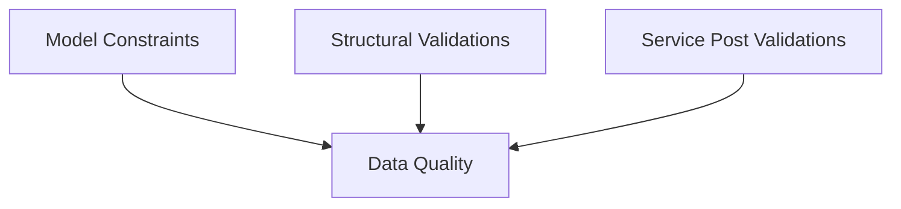

# Data Quality

## Background
- Improved data quality leads to better decision-making across an organization.
- Detecting and providing visibility on data quality helps build trust with data consumers.
- Identifying issues earlier in the data production lifecycle reduces the cumulative 
 cost and downstream impact, improving operational efficiency

## Legend Data Quality Concepts
Within Legend there can be three main context where data quality checks / features can be 
adopted:
1. [Structural Validations](#structural-validations)
2. [Model Constraints](#model-constraints)
3. [Service Post Validations](#service-post-validations)



Using this features allows 
1. Data quality expectations to be specified / documented in a declarative format to help consumers understand 
   the expected behaviour of the data model / services.
2. Data quality expectations are attached to the model/service, so are versioned / live alongside  and share the same 
   lifecycle as the data models themselves
3. Data quality expectations are executable / machine readable so can be used to find defects / issues against a 
   given data set.

### Structural Validations

When creating data models, there is inherent information that the producer is encoding in the structure 
that can be used to validate the quality of any given data sample 
``` pure
Class domain::model::Employee 
{
     name : String[1];
     jobTitle : JobTitle[1];
}

Enum domain::model::JobTitle
{
      Analyst,
      Manager
      CEO
}
```
- The multiplicity of a property can be used to validate for empty / missing values (e.g. if the `name` property 
  on the Employee object has multiplicity [1], then we can infer that it should never be null / empty in the data 
  source)
- If a field is defined as an Enum (e.g. `jobTitle` might be an Enum with values: `Analyst`, `Manager`, etc.), then we
  can infer that there should not be any values in the data source that are not defined in this set/domain
  
Legend has features to support execution / enforcement of these validations.  For more details see 
[graphFetchChecked](../queries/queries.md#checked-graphfetch-graphfetchchecked-graphfetchunexpanded-graphfetchcheckedunexpanded)
on the [Queries](../queries/queries.md) page


### Model Constraints

Model constraints extend the structural validations to allow business logic validations to be defined on
a given Class / item.  

```pure
Class domain::model::Employee
[
     nameMustNotBeBlank: $this.name->length() > 0,
     idMustBePositive: $this.id > 0,
     officeLocationRequiredForAllNonRemoteWorkers : $this.remoteWorker || $this.officeLocation->isNotEmpty()
] 
{
     name : String[1];
     id : Integer[1];
     remoteWorker : Boolean[1];
     officeLocation : Location[0..1]; 
}
```

- The `nameMustNotBeBlank` constraint specifies that the `name` must not be a blank string.  This is in addition to
  `name` not being null / empty, which is inferred based on the multiplicity in the model being [1]. 
- The `idMustBePositive` constraint specifies that the `id` must be a positive number.  This is in addition to
  `id` not being null / empty, which is inferred based on the multiplicity in the model being [1].
- The `officeLocationRequiredForAllNonRemoteWorkers` constraint specifies that an office location value must be provided
  if the `Employee` is not a remote worker.  In the model structure the `officeLocation` value is optional, so we 
  can not know when it's expected to be set.  However, the constraint provide validation for when it's expected to be
  set / have a value.

Legend has features to support execution / enforcement of these validations.  For more details see
[graphFetchChecked](../queries/queries.md#checked-graphfetch-graphfetchchecked-graphfetchunexpanded-graphfetchcheckedunexpanded)
on the [Queries](../queries/queries.md) page
 
### Service Post Validations

Both `Structural Validations` and `Model Constraints` are primarily focused on validations that are:
1. Expected to always be true/valid across all contexts/usages of the model
2. Defined at the per item/instance level

However, there are situations where you may wish to define additional validations to allow:
1. Validations to be specified across a set of objects

   e.g. `id` properties must be unique across all `Employee` instances
2. Validations that are only true for a subset of the data

   e.g. the `city` on the `officeLocation` must be a European city when looking at `Employee`s in European countries.

These can be specified using `Service Post Validations` that allow assertions / expectations to be specified against  
a `Service` that returns a slice / set of data.

For more information see [here](./service-post-validations.md)