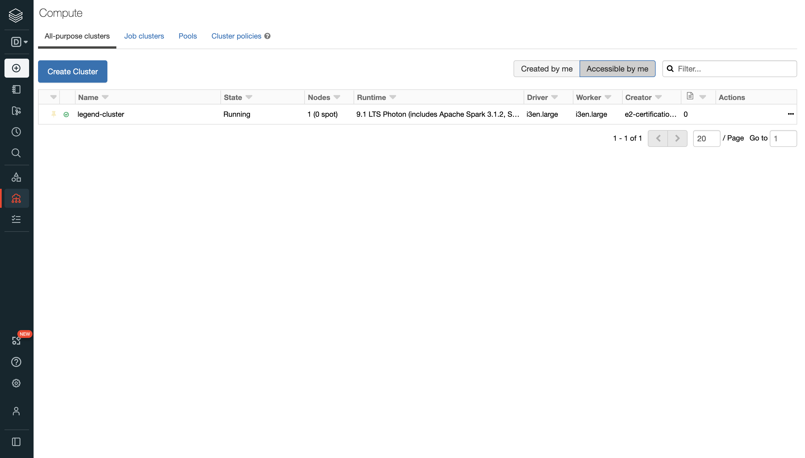
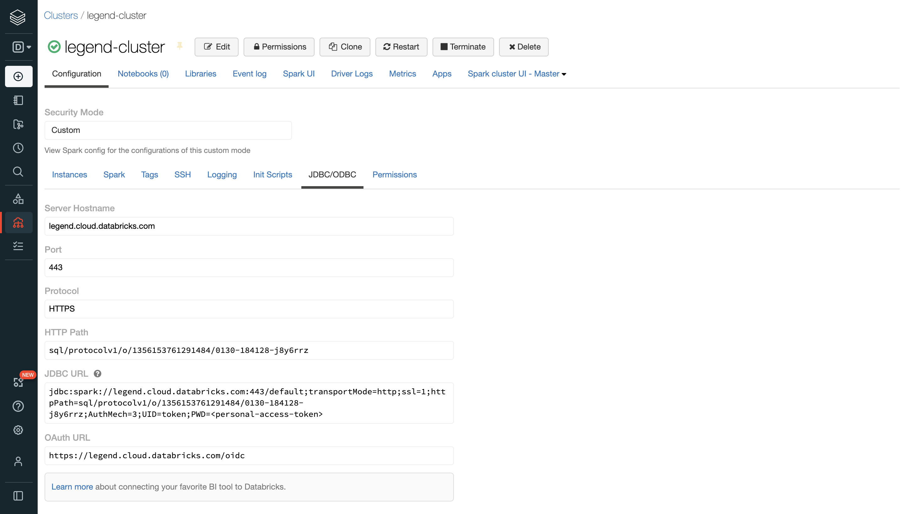
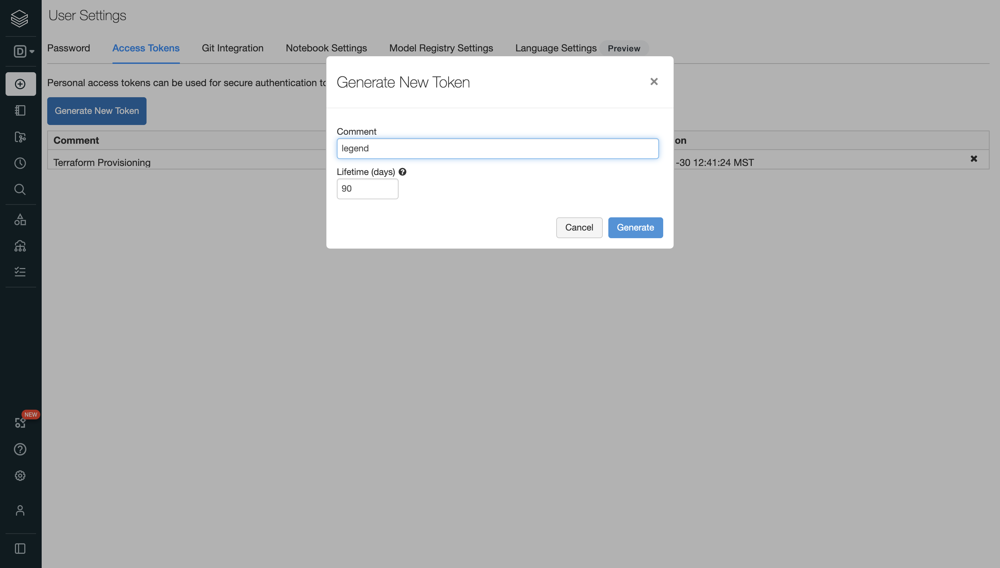
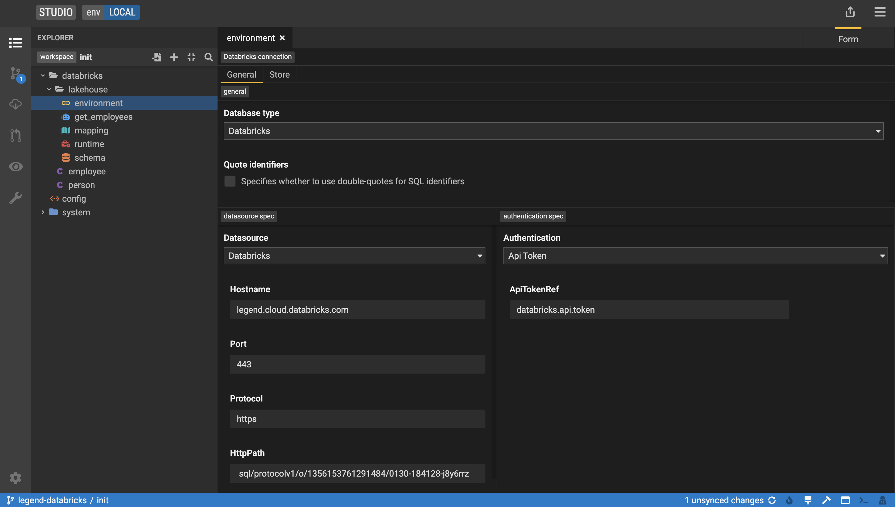
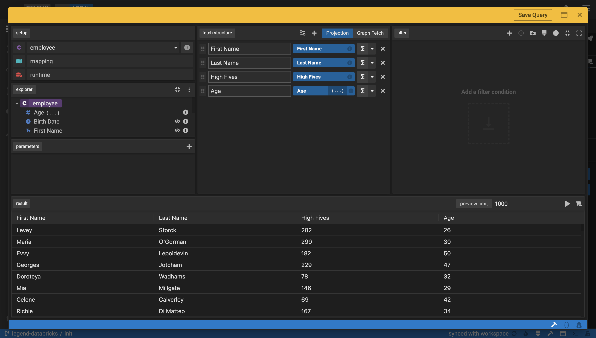

## Databricks Integration

*Part of the Linux foundation, [Delta Lake](https://delta.io/) is an open source storage layer that brings reliability to data lakes. 
Delta Lake provides ACID transactions, scalable metadata handling, and unifies streaming and batch data processing. 
Running on top of your existing data lake and fully compatible with the Apache Spark APIs, Delta brings the best of both 
data warehousing and data lakes functionality onto one unified platform.*

### Backend

We connect legend stack to Databricks backend through a JDBC connection to an active cluster. 
On a Databricks workspace, we start a new cluster as follows. 
More information on cluster management [here](https://docs.databricks.com/clusters/index.html). 
Note that the same can be done programmatically using the databricks cluster [API](https://docs.databricks.com/dev-tools/api/latest/clusters.html).



Active clusters offer a SQL endpoint through ODBC/JDBC. Details of the connection can be found under "advanced options" menu.
Please note the JDBC details that will be used later to integrate this active cluster with the Legend engine 
(namely `hostname`, `port`, `protocol`, `httpPath`). 
More information on JDBC endpoint [here](https://docs.databricks.com/data/data-sources/sql-databases.html)



The easiest way to authenticate through a Databricks backend (hence a JDBC connection) is via API tokens. 
We can create a new API token under user settings.
See [documentation](https://docs.databricks.com/dev-tools/api/latest/authentication.html) for more information.



With an active cluster and a valid API token, we can proceed and define this endpoint on the legend studio interface.

### Vault configuration

It would pose a risk for any organisation to store their personal access token as plain text alongside their pure model on gitlab. 
Furthermore, token could expire or get updated without having to push for a new change in the underlying pure model.
Instead, we leverage the Vault functionality of the legend engine to store our tokens as property files on legend server,

 ```json
 {
     "vaults": [
         {
           "location": "/path/to/engine/vault.properties"
         }
     ]
 }
 ```

We can store our different tokens (e.g. for different workspaces) in our `vault.properties` that we can reference
accordingly through the legend studio interface (or its underlying pure model).

```shell script
databricks.api.token = dapibd0d233ddaXXXXXXXXXXXXXXX
```

### Server configuration

Spark JDBC driver is not OSS and as such not available through maven central. Please download JDBC driver from Databricks
[website](https://databricks.com/spark/jdbc-drivers-download) and extract jar file to a specific location.
Start the legend engine by appending classpath with `SparkJDBC42.jar`.

```shell script
java -cp \
  SparkJDBC42.jar:legend-engine-server-shaded.jar \
  org.finos.legend.engine.server.Server \
  server \
  config.json
```

### Frontend

Create a new database source of type `Databricks`, and report information of your newly created cluster as follows. 
Please note the authentication layer that now expects the property value set in our vault configuration (`databricks.api.token`).



The same can be expressed as a pure object of type `Connection`

```pure
###Connection
RelationalDatabaseConnection databricks::lakehouse::environment
{
  store: databricks::lakehouse::schema;
  type: Databricks;
  specification: Databricks
  {
    hostname: 'legend.cloud.databricks.com';
    port: '443';
    protocol: 'https';
    httpPath: 'sql/protocolv1/o/1356153761291484/0130-184128-j8y6rrz';
  };
  auth: ApiToken
  {
    apiToken: 'databricks.api.token';
  };
}
```

Finally, users can query data from Delta Lake directly through the comfort of the legend studio interface.



## Authors
<antoine.amend@databricks.com>


