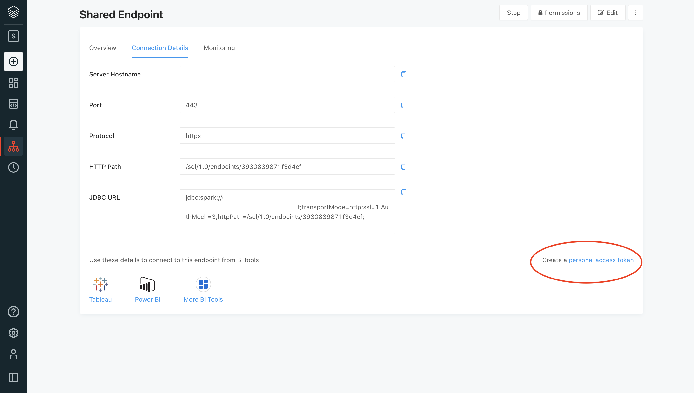
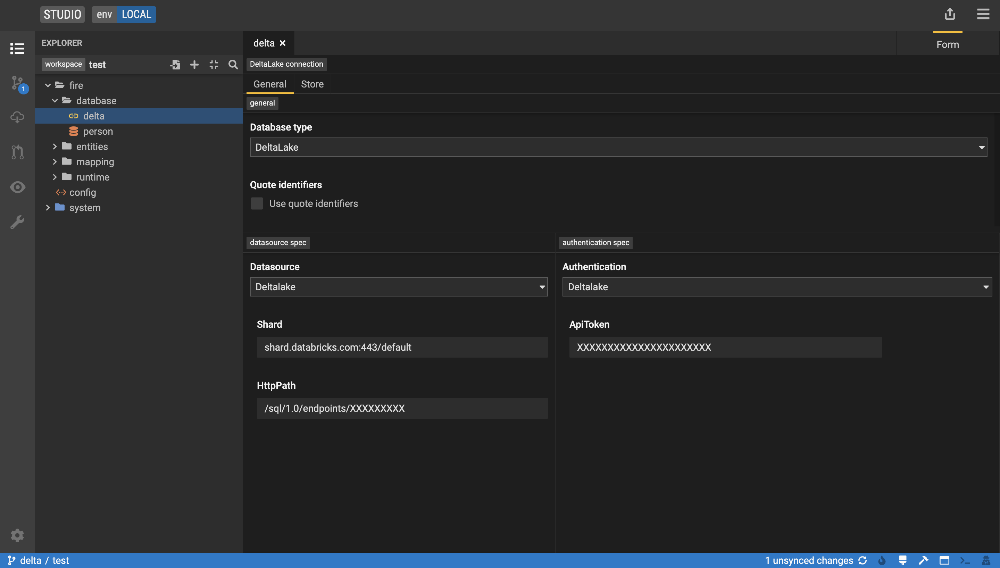
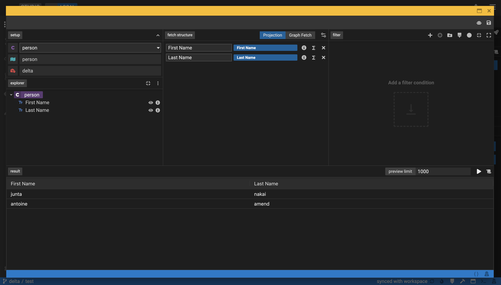

## Delta Lake Integration

*Combining best of open data standards with open source technologies*

___

With origins in academia and the open-source community, Databricks was founded in 2013 by the original 
creators of Apache Spark™, Delta Lake and MLflow. Built on a modern 
[Lakehouse](https://databricks.com/product/data-lakehouse) architecture in the cloud, Databricks 
combines the best of data warehouses and data lakes to offer an open and unified platform for data and AI. 

By integrating the Legend Framework into a Lakehouse architecture, Databricks and FINOS bring the best of open data 
standard and open source technologies together into one platform, improving data exchange across the financial 
services industry, supporting key organizations in their digital transformation and finally unifying business and 
technologies after decades of organizational struggles.

### Usage

We start by creating a new database source of type `DeltaLake`, providing both a Datasource specification and authentication.
For JDBC connection details, please refer to your databricks environment and create a personal access token as per below screenshot.



The same can be reported back on the legend studio as follows



See [pure](deltaLakeModel.pure) model for reference. Finally, users can query data from Delta Lake directly through 
the comfort of the legend studio interface.



### Configuration

Spark JDBC driver is not OSS and as such not available through maven central. Please download JDBC driver from Databricks
[website](https://databricks.com/spark/jdbc-drivers-download) and extract jar file to a specific location.
We start the legend engine by appending our classpath with `SparkJDBC42.jar`.

```shell script
java -cp \
  SparkJDBC42.jar:legend-engine-server/target/legend-engine-server-2.35.2-SNAPSHOT-shaded.jar \
  org.finos.legend.engine.server.Server \
  server \
  config.json
```