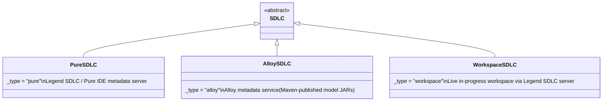
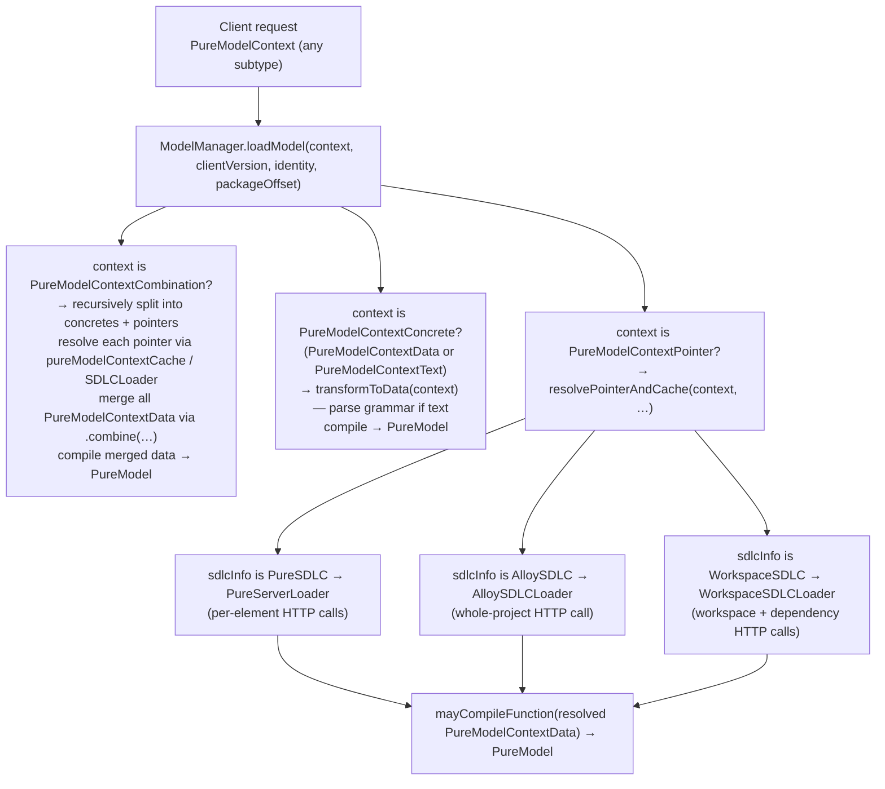
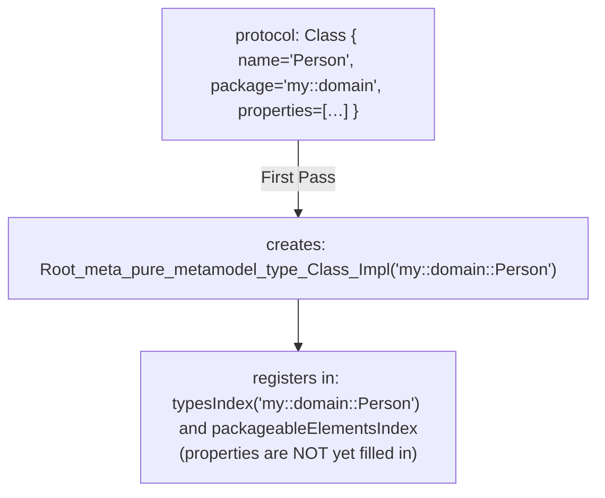

# The Legend Engine Compiler - Alloy Compiler

> **Related docs:** [Architecture Overview](overview.md) | [Key Java Areas](key-java-areas.md) | [Key Pure Areas](key-pure-areas.md) | [Module Reference](../reference/modules.md)

> **legend-pure background reading:** [Compiler Pipeline](https://github.com/finos/legend-pure/blob/main/docs/architecture/compiler-pipeline.md)
> describes the full Pure compile phases (parse → symbol registration → post-processing → validation →
> PAR/Java code-gen → runtime) that the Alloy compiler sits on top of. In particular,
> [§4 — Type Resolution and Generics](https://github.com/finos/legend-pure/blob/main/docs/architecture/compiler-pipeline.md)
> explains the full parametric polymorphism unification algorithm — understanding it makes
> clear why the Alloy compiler deliberately excludes user-defined generics (see §1.2 below).

---

## 1. Overview

Legend Engine contains its own **Java-based compiler** that sits between the grammar parser and the
Pure runtime. Its job is to translate a bag of JSON protocol POJOs — a `PureModelContextData`
snapshot — into a live, fully type-checked, cross-linked Pure metamodel graph called `PureModel`.

This compiler is frequently called the **Alloy compiler** (after the original Alloy project name)
to distinguish it from the `legend-pure` compiler.

### 1.1 Goal and Design Philosophy

The Alloy compiler's primary goal is to be a **fast, request-time compiler for user-defined
domain models**. It is deliberately designed as a constrained subset of what `legend-pure` can
express, trading completeness for predictability and speed:

- It must complete in milliseconds, not seconds — it will be called on every query execution
  request that isn't already cached.
- It needs to support exactly the Pure constructs that users can define in Legend Studio and
  related tooling: classes, enumerations, associations, mappings, runtimes, services, and
  concrete functions.
- It deliberately **does not attempt to compile every feature of the Pure language**. Features
  that are only needed inside the standard library or platform code — and that users cannot
  meaningfully author through the grammar or Studio — are excluded from the protocol and
  therefore from the compiler.

### 1.2 Key Deliberate Constraints

The most important example of what the Alloy compiler intentionally does **not** support is
**type parameters (generics) on user-defined classes and functions**.

In `legend-pure`, any class or function can declare type parameters, e.g.:

```pure
// This is valid in legend-pure but has no equivalent in the Alloy protocol
Class meta::pure::functions::collection::Pair<U, V>
{
    first  : U[1];
    second : V[1];
}
```

In the Alloy compiler, the protocol `Class` POJO has no `typeParameters` field at all:

```java
public class Class extends PackageableElement {
    public List<PackageableElementPointer> superTypes = Collections.emptyList();
    public List<Property> properties = Collections.emptyList();
    public List<QualifiedProperty> qualifiedProperties = Collections.emptyList();
    // … no typeParameters field — generic user classes are not supported
}
```

Similarly, the protocol `Function` POJO has no `typeParameters` field.

This is a deliberate choice, not an oversight. User-authored domain classes in Legend are
concrete (e.g. `Person`, `Trade`, `Account`) — they do not need to be generic. Parameterised
container types like `List<T>`, `Pair<U,V>`, and `Map<K,V>` are part of the Pure standard
library, compiled once by `legend-pure`, and are available to use as property types and in
expressions.

**What is supported is *using* generic types from the Pure platform.** Properties can be
typed with generic instantiations, and expressions can use all the generic collection functions
(`filter`, `map`, `fold`, `first`, etc.) — the Alloy compiler handles `GenericType` with
`typeArguments` for these cases in `Property.genericType`. The restriction is only on
*declaring* new type parameters on user-created classes or functions.

Other constrained or unsupported features:

- **`native` functions** — native functions (implemented in Java) can only be registered from
  `legend-pure` via `isNative = true` in the `Handlers` registry. Users cannot define new
  native functions through the grammar; they can only call the ones already registered.
- **`@` meta-programming annotations** and compile-time evaluation — not available in the
  Alloy grammar or protocol.
- **Recursive type definitions with multiple mutual type parameters** — while technically
  parseable, the Alloy compiler's type-resolution passes do not cover the full unification
  algorithm that `legend-pure` uses for complex polymorphic type inference.

### 1.3 Relationship to `legend-pure`

The two compilers are complementary and serve different purposes:

| Dimension | Alloy compiler (`legend-engine`) | `legend-pure` compiler |
|-----------|----------------------------------|------------------------|
| **Input** | `PureModelContextData` — versioned JSON protocol POJOs | `.pure` source files on the classpath |
| **Output** | A `PureModel` backed by the running `legend-pure` compiled JVM | Pre-compiled, bytecode-generated `Root_meta_*` Java classes in `legend-pure` JARs |
| **When it runs** | At request time (or model-load time), for every user model snapshot | At build time of the `legend-pure` project; output shipped as pre-compiled JARs |
| **Scope** | **Deliberate subset of Pure** — user domain constructs only; no generic class/function declarations, no native function definitions | **Full Pure language** — the complete metamodel, all language features, type-parameter inference, native function wiring |
| **Speed target** | Milliseconds — must be fast enough to run per-request | Seconds to minutes — run once; result is cached in JARs |
| **Type system coverage** | Resolves concrete and generic-instantiation types against the core already compiled by `legend-pure`; does not perform full parametric polymorphism unification | Full parametric polymorphism, contravariance, multiplicity parameters, type inference from scratch |
| **Extension point** | `CompilerExtension` SPI — `xts-*` modules add `Processor<T>` handlers and `Handlers` registrations | `CompiledExtension` SPI — adds generated Java code for new Pure constructs |
| **Key class** | `org.finos.legend.engine.language.pure.compiler.toPureGraph.PureModel` | `org.finos.legend.pure.runtime.java.compiled.execution.CompiledExecutionSupport` |
| **Module** | `legend-engine-language-pure-compiler` | inside `legend-pure` JARs |

In short: **`legend-pure` compiles the full standard library once at build time; the Alloy
compiler compiles each user domain model at request time against that pre-compiled library,
but only needs to handle the restricted set of Pure constructs that users can actually author**.

---

## 2. Where the Compiler Lives

```text
legend-engine-core/
  legend-engine-core-base/
    legend-engine-core-language-pure/
      legend-engine-language-pure-compiler/   ← compiler module
        src/main/java/…/compiler/
          Compiler.java                       ← thin static entry-point
          MetadataWrapper.java                ← bridges user graph → legend-pure metadata
          toPureGraph/
            PureModel.java                    ← the compiler itself
            CompileContext.java               ← per-element compilation context + import scope
            ProcessingContext.java            ← per-expression context (variable stack, etc.)
            DependencyManagement.java         ← topological sort of elements
            ValueSpecificationBuilder.java    ← compiles protocol ValueSpecification nodes
            HelperValueSpecificationBuilder.java
            HelperModelBuilder.java           ← compiles classes, profiles, associations
            HelperMappingBuilder.java         ← compiles mappings
            HelperRuntimeBuilder.java
            Milestoning.java
            handlers/
              Handlers.java                   ← function registry + type inference DSL
              FunctionHandler.java            ← one registered function overload
              builder/                        ← FunctionExpressionBuilder hierarchy
              inference/                      ← ReturnInference, Dispatch, MostCommonType, …
            extension/
              CompilerExtension.java          ← SPI interface for all extensions
              Processor.java                  ← per-element-type compilation handler
              CompilerExtensions.java         ← aggregates all loaded extensions
            validator/
              ClassValidator.java
              FunctionValidator.java
              MappingValidator.java
              …
```

---

## 3. `PureModelContext` — The Model Input Type Hierarchy

Before compilation can happen, the engine must obtain a `PureModelContextData` — the fully
materialised bag of protocol POJOs that the compiler actually processes. The protocol defines
a flexible class hierarchy that lets callers express **either the full model inline or a
pointer that tells the engine where to fetch it**. The `ModelManager` is responsible for
resolving any non-inline form into a `PureModelContextData` before handing it to the compiler.

### 3.1 Class Hierarchy

```text
PureModelContext   (abstract, JSON discriminator: "_type")
├── PureModelContextConcrete   (abstract — data is present inline in this object)
│   ├── PureModelContextData   ("data")   ← the fully materialised model
│   └── PureModelContextText   ("text")   ← raw Legend grammar text (engine parses it first)
├── PureModelContextPointer    ("pointer") ← a reference; engine fetches it from storage
└── PureModelContextCombination ("combination") ← list of any mix of the above; engine merges them
```

### 3.2 `PureModelContextData` — The Full Inline Model

**JSON type:** `"data"` (default when `_type` is absent)

`PureModelContextData` carries the actual element payloads. It is the only form the compiler
directly accepts.

```json
{
  "_type": "data",
  "serializer": { "name": "pure", "version": "vX_X_X" },
  "origin": { ... },
  "elements": [
    { "_type": "class", "package": "my::domain", "name": "Person", ... },
    { "_type": "mapping", "package": "my::domain", "name": "PersonMapping", ... }
  ]
}
```

Key fields:

| Field | Type | Purpose |
|-------|------|---------|
| `serializer` | `Protocol` | Records which protocol version was used to serialise this payload (`name` + `version`). Used by `clientVersion`-aware transformers to up/down-convert the JSON before compilation. |
| `origin` | `PureModelContextPointer` | Optional. Records **where this data originally came from** — its SDLC source pointer. Populated by the `SDLCLoader` after resolving a pointer so that execution-plan generation can stamp the plan with provenance. Also used for logging in `PureModel`. |
| `elements` | `List<PackageableElement>` | The complete ordered list of all model elements. Each entry is a polymorphic protocol POJO (Class, Mapping, Service, Store, Runtime, …). The list is the sole input to the compiler's passes. |

**`origin` is not the source of compilation — it is provenance metadata.**
When a `PureModelContextPointer` is fetched from the SDLC server, the resulting
`PureModelContextData` has its `origin` field set to that pointer so the engine can record
which project/version/workspace the data came from.

### 3.3 `PureModelContextText` — Raw Grammar Inline

**JSON type:** `"text"`

Carries a raw Legend grammar string instead of parsed elements. The `ModelManager` converts
it to `PureModelContextData` immediately by calling
`PureGrammarParser.newInstance().parseModel(text.code)` before touching anything else.

```json
{
  "_type": "text",
  "code": "###Pure\nClass my::domain::Person { name: String[1]; }"
}
```

Use cases: quick one-off API calls from scripts or test harnesses where constructing a full
JSON element tree is inconvenient.

### 3.4 `PureModelContextPointer` — A Lazy Reference to an SDLC Source

**JSON type:** `"pointer"`

A `PureModelContextPointer` **contains no element data**. It is a reference that tells the
`ModelManager` *where* to fetch a `PureModelContextData` from an external metadata store.
The pointer is also used as the **cache key** for the compiled `PureModel` cache.

```json
{
  "_type": "pointer",
  "serializer": { "name": "pure", "version": "vX_X_X" },
  "sdlcInfo": { "_type": "alloy", "groupId": "org.example", "artifactId": "my-model", "version": "1.0.0", "packageableElementPointers": [] }
}
```

#### The `sdlcInfo` field — SDLC Source Variants

`sdlcInfo` is itself polymorphic (discriminator `_type`). Three concrete SDLC types are defined:



Common base fields on `SDLC`:

| Field | Purpose |
|-------|---------|
| `version` | The resolved version string. `"none"` means "latest/head". Populated by the loader after resolution; callers normally leave it `"none"`. |
| `baseVersion` | Used transiently during resolution by `PureServerLoader.getCacheKey` to record the actual server version for stable cache keying. Cleared after the cache key is computed. |
| `packageableElementPointers` | An optional **element filter** — if non-empty, only these elements (identified by type + path) are loaded from the source. An empty list means "load everything". |

---

#### `PureSDLC` — Legend Pure IDE / Pure Metadata Server

```json
{ "_type": "pure", "version": "none",
  "packageableElementPointers": [
    { "type": "MAPPING", "path": "my::domain::PersonMapping" }
  ]
}
```

Points to the **Legend Pure IDE metadata server** (configured as `metaDataServerConfiguration.pure`
in `MetaDataServerConfiguration`). When used as a pointer, `PureServerLoader` calls:

```text
GET <pure-server-base-url>/alloy/{elementType}/{clientVersion}/{elementPath}
```

One HTTP call per `PackageableElementPointer` in the filter list. Supported types are
`MAPPING`, `STORE`, and `SERVICE`. The server returns the closure of all elements needed
to compile the requested element (e.g. all classes referenced by a mapping).

**`overrideUrl`** — optional field that lets the caller redirect to an alternate Pure metadata
server URL. The engine validates the URL against a configured allow-list in
`PureServerConnectionConfiguration.allowedOverrideUrls`.

**Caching:** Always cacheable. The cache key is a normalized pointer where `baseVersion` is
resolved to the server's current base version via:

```text
GET <pure-server-base-url>/alloy/pureServerBaseVersion
```

This means repeated requests for the same element on the same server version hit the cache
and do not recompile.

---

#### `AlloySDLC` — Alloy Metadata Service (Maven-Published Models)

```json
{
  "_type": "alloy",
  "groupId": "org.example",
  "artifactId": "my-model",
  "version": "1.0.0",
  "packageableElementPointers": []
}
```

Points to a **versioned Maven-published model artifact** surfaced through the Alloy metadata
service (configured as `metaDataServerConfiguration.alloy`). `AlloySDLCLoader` calls:

```text
GET <alloy-base-url>/projects/{groupId}/{artifactId}/versions/{version}/pureModelContextData
       ?convertToNewProtocol=false&clientVersion={clientVersion}
```

The response is the complete `PureModelContextData` for the entire project at that version.
If `packageableElementPointers` is non-empty, the loader validates that every listed path
exists in the returned data (throwing a descriptive error if any are missing).

**`version`** may be:

- A concrete release version (e.g. `"1.0.0"`) — stable; always cached.
- `"none"`, `null`, or a `SNAPSHOT` version — treated as "latest revision"; **not cached**
  because the content can change between requests.

**`project`** — deprecated field; originally held the GitLab project ID. Now replaced by
`groupId` + `artifactId`.

---

#### `WorkspaceSDLC` — Live In-Progress Workspace

```json
{
  "_type": "workspace",
  "project": "MYORG-123",
  "version": "my-feature-branch",
  "isGroupWorkspace": false
}
```

Points to an **active (unpublished) workspace** on the Legend SDLC server. Used by Legend
Studio while the user is editing — their current workspace content is the model.
`WorkspaceSDLCLoader` calls:

```text
GET <sdlc-server-base-url>/api/projects/{project}
    /{workspaces|groupWorkspaces}/{workspace}/pureModelContextData
```

It then **also** fetches the workspace's upstream project dependencies (from
`/api/projects/{project}/workspaces/{workspace}/...`) and merges them via `combine(…)` so
the full transitive model is available to the compiler.

`version` here is the **workspace name** (accessed via `getWorkspace()`), not a version tag.
`isGroupWorkspace` distinguishes individual from group workspaces.

**Never cached** — workspace content is mutable by definition.

### 3.5 `PureModelContextCombination` — Merging Multiple Sources

**JSON type:** `"combination"`

A `PureModelContextCombination` holds a list of any mix of `PureModelContext` subtypes. The
`ModelManager` flattens it by:

1. Recursively separating concrete forms (`PureModelContextData` / `PureModelContextText`) from
   pointers (`PureModelContextPointer`).
2. Resolving all pointers (in parallel or sequentially) via their respective loaders.
3. Merging all resulting `PureModelContextData` instances via `PureModelContextData.combine(…)`,
   which concatenates element lists and deduplicates by path.

```json
{
  "_type": "combination",
  "contexts": [
    { "_type": "pointer", "sdlcInfo": { "_type": "alloy", "groupId": "org.shared", "artifactId": "shared-model", "version": "2.0.0" } },
    { "_type": "data",    "elements": [ { "_type": "class", "name": "MyExtension", ... } ] }
  ]
}
```

Typical use: a client needs the published shared model **plus** some locally-defined elements
that haven't been published yet.

### 3.6 `ModelManager` — Resolution and Caching

`ModelManager` is the single entry point for transforming any `PureModelContext` into a
compiled `PureModel`. It maintains **two Guava `Cache` instances** (both with 30-minute
soft-value expiry):

| Cache | Key | Value |
|-------|-----|-------|
| `pureModelContextCache` | `PureModelContext` (the pointer) | `PureModelContextData` |
| `pureModelCache` | `PureModelContext` (the pointer) | `PureModel` |

Only pointers with a stable (non-mutable) identity are cached:

- `PureSDLC` — always cacheable; cache key uses the resolved `baseVersion`.
- `AlloySDLC` with a concrete release version — cacheable; cache key is the pointer itself.
- `AlloySDLC` with `SNAPSHOT` / `latest` version — **not cached**.
- `WorkspaceSDLC` — **never cached**.
- `PureModelContextData` / `PureModelContextText` — the `ModelManager` does not cache these;
  callers that want caching for raw-data forms should manage it themselves.

The full resolution flow for a pointer-based request:



### 3.7 The `DeploymentMode` and `clientVersion` Contract

**`DeploymentMode`** (`PROD` vs `TEST` vs `SANDBOX`) is threaded through the compiler but its
main effect on model *loading* is through `SDLCLoader`:

- In `PROD` / `TEST`, the client is expected to pass a `clientVersion` string that the
  metadata servers use to select the correct serialisation format for the returned protocol JSON.
  `Assert.assertTrue(clientVersion != null, …)` in `SDLCLoader.load` enforces this.
- In `TEST` (unit and integration tests), callers typically pass `PureModelContextData`
  directly and supply `DeploymentMode.TEST`, bypassing the loader entirely.

**`clientVersion`** is forwarded as a query parameter to every metadata server URL. The server
uses it to select the correct protocol version when serialising the `PureModelContextData`
response, ensuring the returned JSON can be deserialised by the requesting engine instance.

### 3.8 `PackageableElementPointer` — Element-Level Filtering

`PackageableElementPointer` appears in two different roles:

| Context | Meaning |
|---------|---------|
| Inside `SDLC.packageableElementPointers` | **Element filter on a pointer** — when fetching a `PureSDLC`-backed pointer, each pointer specifies one element (type + path) to load. For `AlloySDLC`, the list is a post-load membership check / subsetting hint. |
| Inside `DependencyManagement` / `Processor.processPrerequisiteElements` | **Within-PMCD prerequisite tracking** — used during compilation to express that element A depends on element B being compiled first. Not related to SDLC fetching. |

The `PackageableElementType` enum covers all first-class element types:
`CLASS`, `MAPPING`, `SERVICE`, `STORE`, `RUNTIME`, `BINDING`, `FUNCTION`, `PROFILE`,
`ENUMERATION`, `ASSOCIATION`, `DATA`, `DIAGRAM`, `PERSISTENCE`, `CONNECTION`, and others.

---

## 4. The Compilation Pipeline in Detail

Compilation is triggered by constructing a `PureModel`:

```java
PureModel pureModel = Compiler.compile(
    pureModelContextData,   // the parsed protocol snapshot
    DeploymentMode.TEST,
    Identity.getAnonymousIdentity().getName()
);
```

The constructor runs the following passes in sequence.

### 4.0 Phase Order Summary

| # | Phase | Key class / method | Why this order matters |
|---|-------|--------------------|------------------------|
| 0 | **Initialisation** | `PureModel` constructor | Must happen before any user elements are touched; builds the `Handlers` registry and registers primitives. |
| 1 | **Dependency resolution** | `DependencyManagement` (Kahn's algorithm) | Computes a topological sort of element *types* so later passes run in the right order. |
| 2 | **Pass 0 — Sections + Profiles** | `Processor.processFirstPass` for `SectionIndex` / `Profile` | Import directives must be established before any type name is resolved. |
| 3 | **First pass — Type shell registration** | `Processor.processElementFirstPass` | Registers every element's path; creates empty "shell" objects so forward references can be resolved in the next pass. |
| 4 | **Second pass — Body compilation** | `Processor.processElementSecondPass` | Fills in property types, function bodies, mapping bodies — all cross-references, which now work because all shells are registered. |
| 5 | **Prerequisite elements pass** | `Processor.processPrerequisiteElements` | Computes fine-grained, per-element (not just per-type) dependency edges for the final sort. |
| 6 | **Milestoning pass** | `Milestoning.java` | Injects synthetic temporal date parameters and qualified properties into temporal associations; must happen after class bodies are fully compiled. |
| 7 | **Third pass — Final wiring** | `Processor.processElementThirdPass` | Handles anything requiring all elements to be fully compiled (e.g. aggregation-aware mappings). |
| 8 | **Post-validation** | `*Validator` classes | Domain-specific semantic checks; run last because they require the fully wired graph. |

> **Why ordering matters:** The first pass deliberately creates empty shells so that **circular
> references do not cause resolution failures**. A class `A` with a property of type `B` and a
> class `B` with a property of type `A` are both registered as shells in the first pass, so
> when the second pass resolves property types, both names are already in `typesIndex` — even
> though neither body was compiled when the other was registered. Without this two-pass structure,
> the compiler would have to decide an arbitrary ordering and would fail on any mutual reference.

### 4.1 Initialisation

Before any user elements are touched:

1. A `CompiledExecutionSupport` is constructed, wrapping:
   - The pre-compiled `legend-pure` `MetadataLazy` (all core types, standard-library functions).
   - A `MetadataWrapper` that overlays the growing user graph on top of the lazy core graph.
2. The `Handlers` registry is built (see §6). If a cached version exists for the same extension
   fingerprint, the function cache is reused across requests, making subsequent compilations fast.
3. Primitive types and built-in multiplicities are registered.
4. A pre-validation runs `PureModelContextDataValidator` to check for obvious structural problems
   (e.g. duplicate element paths).

### 4.2 Dependency Resolution

Elements in `PureModelContextData` can reference each other. Before any compilation pass,
the compiler builds a **dependency graph** over element types:

- Each `Processor<T>` declares `getPrerequisiteClasses()` — the element types that must be
  compiled before `T`.
- `DependencyManagement` runs a topological sort (Kahn's algorithm) to produce batches of
  independent elements.
- Disjoint dependency sub-graphs are identified and compiled independently, enabling
  parallelism when a `ForkJoinPool` is configured.

### 4.3 Pass 0 — Section Index + Profile Pass

`SectionIndex` and `Profile` elements are processed first because they carry import directives
used by everything else. After this pass, `sectionsIndex` is populated and `CompileContext`
instances for all other elements know which packages are in scope.

### 4.4 First Pass — Type Shell Registration

For every remaining element, the compiler calls `Processor.processElementFirstPass(element, context)`.

**Purpose:** Register the element's path and create an empty ("shell") Pure metamodel object
in the `typesIndex` / `packageableElementsIndex`. At the end of this pass every type name is
resolvable, even if the type body is empty.

For core built-in types (Class, Enumeration, Association, Profile, Function) the corresponding
`*CompilerExtension` class (e.g. `ClassCompilerExtension`) provides the `Processor`. Extension
modules contribute additional processors via `CompilerExtension.getExtraProcessors()`.

Example for a user-defined class:



#### Natively supported `PackageableElement` sub-types

The following element types are handled by processors built into `legend-engine-language-pure-compiler` itself (the "core" compiler). Extension modules add further types via `CompilerExtension.getExtraProcessors()`.

| Protocol type (`_type`) | Pure metamodel type | Processor class | Compile helper |
|-------------------------|---------------------|-----------------|----------------|
| `class` | `meta::pure::metamodel::type::Class` | `ClassCompilerExtension` | `HelperModelBuilder` |
| `enumeration` | `meta::pure::metamodel::type::Enumeration` | `EnumerationCompilerExtension` | `HelperModelBuilder` |
| `association` | `meta::pure::metamodel::relationship::Association` | `AssociationCompilerExtension` | `HelperModelBuilder` |
| `profile` | `meta::pure::metamodel::extension::Profile` | `ProfileCompilerExtension` | `HelperModelBuilder` |
| `function` / `ConcreteFunctionDefinition` | `meta::pure::metamodel::function::ConcreteFunctionDefinition` | `FunctionCompilerExtension` | `HelperValueSpecificationBuilder` |
| `mapping` | `meta::pure::mapping::Mapping` | `MappingCompilerExtension` | `HelperMappingBuilder` |
| `packageableRuntime` | `meta::pure::runtime::PackageableRuntime` | `RuntimeCompilerExtension` | `HelperRuntimeBuilder` |
| `packageableConnection` | `meta::pure::runtime::PackageableConnection` | `ConnectionCompilerExtension` | per-connection-type helpers |
| `sectionIndex` | `meta::pure::metamodel::section::SectionIndex` | `SectionIndexCompilerExtension` | — |
| `dataElement` | `meta::pure::data::DataElement` | `DataElementCompilerExtension` | `HelperValueSpecificationBuilder` |

Extension-contributed element types (each registered by its own `xts-*` module via `CompilerExtension`):

| Protocol type | Module | Notes |
|---------------|--------|-------|
| `service` | `legend-engine-xts-service` | Wraps a function + mapping + runtime |
| `relationalDatabaseConnection` | `legend-engine-xts-relationalStore` | JDBC connection config |
| `database` (relational store) | `legend-engine-xts-relationalStore` | Tables, joins, views |
| `binding` | `legend-engine-xts-*` (external-format modules) | External format attachment |
| `schemaSet` | `legend-engine-xts-*` (external-format modules) | Schema definitions |
| `snowflakeApp` / `hostedService` / `bigQueryFunction` | `legend-engine-xts-*` (function-activator modules) | FunctionActivator sub-types |
| `persistence` | `legend-engine-xts-persistence` | ETL pipeline definition |
| `dataQualityValidation` | `legend-engine-xts-dataquality` | Data-quality rule set |
| `diagram` | `legend-engine-xts-diagram` | Visual diagram element |

> **For extension authors:** To add a new element type, implement `CompilerExtension` and return
> a `Processor<YourProtocolType>` from `getExtraProcessors()`. Register the implementation in
> `META-INF/services/org.finos.legend.engine.language.pure.compiler.toPureGraph.extension.CompilerExtension`.
> See [Contributor Workflow §1](../guides/contributor-workflow.md) for the full step-by-step.

### 4.5 Second Pass — Body Compilation

`Processor.processElementSecondPass(element, context)` fills in the bodies.

**Purpose:** Resolve cross-references, compile property types, association ends, function
bodies, class constraints, mapping bodies, connection parameters, etc.

This is where the bulk of semantic analysis happens:

- `HelperModelBuilder.buildProperty(...)` resolves property types against the now-populated
  `typesIndex`.
- `HelperValueSpecificationBuilder.buildLambda(...)` compiles function bodies and constraint
  expressions into `ValueSpecification` trees.
- `HelperMappingBuilder` stitches `SetImplementation` objects to their source classes.

### 4.6 Prerequisite Elements Pass

A fine-grained pass that computes, for each element, the **specific element paths** (not just
element types) it depends on. This produces the data needed for the final topological sort of
*individual* elements (rather than element types), used in the next two passes.

### 4.7 Milestoning Pass

Processes milestoning date propagation for temporal associations, injecting synthetic date
parameters and qualified properties as described in `Milestoning.java`.

### 4.8 Third Pass — Final Wiring

`Processor.processElementThirdPass(element, context)` handles anything that must happen after
second-pass resolution of all elements — for example, finalising aggregation-aware mappings
that depend on completely compiled class hierarchies.

### 4.9 Post-Validation

After all passes:

- `ProfileValidator`, `EnumerationValidator`, `ClassValidator`, `AssociationValidator`,
  `FunctionValidator`, `MappingValidator` run domain-specific semantic checks.
- Extension validators registered via `CompilerExtension.getExtraPostValidators()` run.

Validators throw `EngineException` (with `EngineErrorType.COMPILATION`) on failure. When
**partial compilation** mode is active (`PureModelProcessParameter.enablePartialCompilation`),
errors are collected rather than thrown, allowing the model to be used in a degraded state
(used by the REPL and IDE to provide best-effort analysis).

### 4.10 Parallel Compilation

When a `ForkJoinPool` is provided via `PureModelProcessParameter`, the compiler switches all
index structures to concurrent (`ConcurrentHashMap`, `ConcurrentHashSet`) and submits passes
as parallel streams. First and second passes within each disjoint dependency sub-graph are
parallelised at the element level.

---

## 5. Key Internal Classes

### `PureModel`

The top-level compilation result. Holds all index maps, the `Handlers` registry, and the
`CompiledExecutionSupport`. Exposes lookup methods:

```java
pureModel.getClass("my::domain::Person", sourceInfo);
pureModel.getEnumeration("my::domain::Status", sourceInfo);
pureModel.getMapping("my::domain::PersonMapping", sourceInfo);
pureModel.getRuntime("my::domain::PersonRuntime", sourceInfo);
pureModel.getFunction("my::domain::greet_String_1__String_1_", sourceInfo); // FunctionDescriptor form
```

### `CompileContext`

A per-element, **immutable** context that carries:

- A reference to the `PureModel`.
- The set of **import packages** in scope for the element's section.

Used throughout the compiler to resolve unqualified type names. Built via:

```java
CompileContext context = pureModel.getContext(element); // uses element's section imports
CompileContext context = pureModel.getContext();         // uses default meta-imports only
```

### `ProcessingContext`

A **mutable** per-expression context that carries:

- A stack of named **scope tags** (used for error messages and diagnostic logging).
- Inferred variable types (`inferredVariableList`) — used during function expression
  compilation to track what type a lambda parameter has been inferred to be.
- A milestoning date propagation context stack.

### `MetadataWrapper`

Implements `legend-pure`'s `Metadata` interface. Intercepts `getMetadata(classifier, id)` calls:

- For `Package::Root`, returns the user-model root package.
- For everything else, first tries the `legend-pure` lazy core metadata, then falls back to the
  `PureModel`'s `typesIndex` for user-defined types.

This is the bridge that lets compiled user classes participate transparently in the `legend-pure`
runtime as if they had been compiled by `legend-pure` itself.

---

## 6. Function Registry and Type Inference

### The `Handlers` Class

`Handlers` is a large registry that maps every callable Pure function name to:

1. A `FunctionExpressionBuilder` — knows how to pick the right overload and build the
   `SimpleFunctionExpression` Pure node.
2. A `ReturnInference` — a lambda that, given the compiled parameter `ValueSpecification`
   list, computes the return `GenericType` and `Multiplicity` of the call-site.

The registry is built once per extension fingerprint and cached statically across requests.

#### Registration DSL

`Handlers` provides a concise DSL for registering functions:

```java
// Simple overload — always selected, fixed return type
register("meta::pure::functions::string::toUpper_String_1__String_1_", "toUpper",
    /*isNative*/ true,
    ps -> res("String", "one"));  // always returns String[1]

// Polymorphic return — return type inferred from parameter type
register(h("meta::pure::functions::collection::head_T_MANY__T_$0_1$_", "head",
    false,
    ps -> res(ps.get(0)._genericType(), "zeroOne"),  // same type as input, multiplicity 0..1
    ps -> Lists.fixedSize.with(ps.get(0)._genericType()),  // type parameters to resolve
    ps -> true));  // dispatch guard: always matches

// Multiple overloads for same function name (different parameter counts)
register(m(
    m(h("meta::pure::functions::collection::range_Integer_1__Integer_1__Integer_1__Integer_MANY_",
        "range", true, ps -> res("Integer", "zeroMany"), ps -> ps.size() == 3)),
    m(h("meta::pure::functions::collection::range_Integer_1__Integer_1__Integer_MANY_",
        "range", false, ps -> res("Integer", "zeroMany"), ps -> ps.size() == 2)),
    m(h("meta::pure::functions::collection::range_Integer_1__Integer_MANY_",
        "range", false, ps -> res("Integer", "zeroMany"), ps -> ps.size() == 1))
));
```

Key DSL methods:

| Method | Meaning |
|--------|---------|
| `h(fullName, shortName, isNative, returnInference)` | Creates a `FunctionHandler` |
| `h(…, dispatch)` | Creates a handler with a dispatch guard (selects overload by parameter types/count) |
| `m(handlers…)` | Creates a `MultiHandlerFunctionExpressionBuilder` (one canonical function name, multiple overloads) |
| `grp(dispatch, handler)` | Groups a handler under a shared dispatch strategy |
| `res(typeName, multiplicity)` | Creates a `TypeAndMultiplicity` for return inference |
| `register(…)` | Inserts the builder into the `map` by function short name |

#### Return Type Inference

When `ValueSpecificationBuilder` encounters an `AppliedFunction` node in the protocol, it:

1. Looks up the short function name in `Handlers.map`.
2. Calls `FunctionExpressionBuilder.buildFunctionExpression(params, sourceInfo, builder)`.
3. The builder picks the matching `FunctionHandler` using dispatch guards (`ps -> ps.size() == N`
   or `ps -> typeOne(ps.get(0), "Map")` etc.).
4. `FunctionHandler.process(vs, sourceInfo)` calls `ReturnInference.infer(vs)` to compute the
   return `GenericType` and `Multiplicity`.
5. A `SimpleFunctionExpression` Pure node is created and annotated with the inferred
   `genericType` and `multiplicity`.

#### Type Matching / Dispatch

Dispatch between overloads relies on already-compiled parameter types. The `Dispatch` interface:

```java
public interface Dispatch {
    boolean shouldSelect(List<ValueSpecification> params);
}
```

Common dispatch strategies:

- **Count-based:** `ps -> ps.size() == 3`
- **Type-based:** `ps -> typeOne(ps.get(0), "Map")` — checks that parameter 0 is `Map[1]`
- **Structure-based:** lambda vs non-lambda parameter — `FunctionExpressionBuilder.comp(…)`
  uses `Type.subTypeOf` to distinguish function-typed parameters.

#### Subtype-aware Matching

`CompilerExtension.getExtraSubtypesForFunctionMatching()` lets extensions declare that a
user-defined type should be treated as a subtype of another type for function dispatch
purposes, without modifying the core type hierarchy.

---

## 7. Compiling a Function Body

The `ValueSpecificationBuilder` class is a `ValueSpecificationVisitor` that walks the protocol
`ValueSpecification` tree and produces the corresponding `legend-pure` `ValueSpecification` tree.

Key cases handled:

| Protocol node | Compiler action |
|---------------|----------------|
| `CString`, `CInteger`, `CBoolean`, … | Wrap in `InstanceValue` with the appropriate `PrimitiveType` |
| `Variable` | Look up inferred type in `ProcessingContext.inferredVariableList` |
| `AppliedFunction` | Look up in `Handlers.map`; infer types; build `SimpleFunctionExpression` |
| `AppliedProperty` | Resolve property on the owner class via `HelperModelBuilder`; build `SimpleFunctionExpression` |
| `LambdaFunction` | Push new variable scope; compile body; pop scope; wrap in `LambdaFunction_Impl` |
| `PackageableElementPtr` | Resolve element path via `CompileContext`; wrap in `InstanceValue` |
| `ClassInstance` (graph fetch, path, colSpec, …) | Delegated to `CompilerExtension.getExtraClassInstanceProcessors()` |
| `Collection` | Compile each value; infer most-common type via `MostCommonType.mostCommon(…)` |

---

## 8. The `legend-pure` Compiler vs the Alloy Compiler: Mechanics

For the high-level comparison of goals and scope, see [§1.3](#13-relationship-to-legend-pure).
This section focuses on what each compiler actually does at the implementation level.

### What `legend-pure` compiles

`legend-pure` compiles `.pure` source files at build time into:

- **A `ModelRepository`** holding all `CoreInstance` objects for the core metamodel and
  standard library functions.
- **Generated Java source code** (via `JavaSourceCodeGenerator`) for every class and function
  in the repository — the `Root_meta_*` generated classes. These are compiled with `javac` and
  packaged into JARs.
- Type parameters, contravariance, multiplicity parameters, and native function bindings are
  all handled here, during this build-time step.

When the engine starts, `MetadataLazy.fromClassLoader(…)` loads the pre-compiled metadata from
these JARs via reflection. No `.pure` source files are present at runtime.

### What the Alloy compiler compiles

The Alloy compiler compiles user-submitted model snapshots at request time into:

- A **live Java object graph** by instantiating and wiring the `Root_meta_*` generated classes
  from `legend-pure` as concrete implementations (e.g. `Root_meta_pure_metamodel_type_Class_Impl`).
- The resulting objects are stored in `PureModel`'s index maps (`typesIndex`, etc.) and
  immediately usable by the Pure runtime.

The Alloy compiler **never generates Java source code** and **never calls `javac`**. The
compilation cost is purely object instantiation and type resolution via hash-map lookups.

### The division of responsibility

| Concern | Handled by |
|---------|-----------|
| Declaring `Class<T>` with type parameters | `legend-pure` build time only — not in user protocol |
| Using `List<Person>` as a property type | Alloy compiler — `GenericType` with `typeArguments` is resolved via `CompileContext` |
| Registering `native` functions (Java-backed) | `legend-pure` build time; registered in `Handlers` with `isNative=true` |
| Registering user-defined `Function` bodies | Alloy compiler — `FunctionCompilerExtension` first pass |
| Running constraints and derived properties | Alloy compiler third pass — body compiled by `ValueSpecificationBuilder` |
| Parametric type inference / unification | `legend-pure` `ProcessorSupport` — the Alloy compiler delegates to it via `MostCommonType.mostCommon` and `GenericType.findBestCommonGenericType` |

---

## 9. Adding New Elements: How to Extend the Compiler

### 9.1 Adding a New Packagable Element Type

Each new protocol element type (e.g. a new store type, a new activator type) requires a
`Processor<T>` registered via a `CompilerExtension`.

#### Step 1 — Define the protocol POJO

Create a Java class in the module's `-protocol` sub-module that extends
`org.finos.legend.engine.protocol.pure.m3.PackageableElement`:

```java
// in legend-engine-xts-mystore/legend-engine-xt-mystore-protocol/
public class MyStore extends PackageableElement {
    public String connectionUrl;
    // … other fields
}
```

**Step 2 — Implement a `Processor<MyStore>`**

```java
public class MyStoreProcessor extends Processor<MyStore> {
    @Override
    public Class<MyStore> getElementClass() { return MyStore.class; }

    @Override
    public Collection<? extends Class<? extends PackageableElement>> getPrerequisiteClasses() {
        // MyStore depends on no other user element types in this example
        return Collections.emptyList();
    }

    @Override
    protected Set<PackageableElementPointer> processPrerequisiteElements(MyStore element, CompileContext context) {
        return Collections.emptySet(); // or return referenced element paths
    }

    @Override
    protected org.finos.legend.pure.m3.coreinstance.meta.pure.metamodel.PackageableElement
    processElementFirstPass(MyStore element, CompileContext context) {
        // Create and register the Pure-side shell object
        Root_meta_mystore_MyStore_Impl compiled =
            new Root_meta_mystore_MyStore_Impl(element.name, null, context.pureModel.getClass("meta::mystore::MyStore"));
        context.pureModel.storeIndex.put(buildPackageString(element._package, element.name), compiled);
        return compiled;
    }

    @Override
    protected void processElementSecondPass(MyStore element, CompileContext context) {
        // Fill in body — resolve cross-references now that all types are registered
        Root_meta_mystore_MyStore_Impl compiled =
            (Root_meta_mystore_MyStore_Impl) context.pureModel.getStore(
                buildPackageString(element._package, element.name), element.sourceInformation);
        compiled._connectionUrl(element.connectionUrl);
    }
}
```

**Step 3 — Register via `CompilerExtension`**

```java
// in legend-engine-xts-mystore/-grammar or -compiler sub-module
public class MyStoreCompilerExtension implements CompilerExtension {
    @Override
    public Iterable<? extends Processor<?>> getExtraProcessors() {
        return Lists.immutable.with(new MyStoreProcessor());
    }
    // … other methods return empty by default
}
```

Register in `src/main/resources/META-INF/services/`:

```properties
# META-INF/services/org.finos.legend.engine.language.pure.compiler.toPureGraph.extension.CompilerExtension
org.finos.legend.engine.language.pure.compiler.toPureGraph.MyStoreCompilerExtension
```

### 9.2 Adding New Functions

To register a new Pure function with the Alloy compiler so that it can be used in lambdas:

**Step 1 — Define the Pure function in a `.pure` file** (in the module's `-pure` sub-module).
This is compiled by `legend-pure` at build time and shipped in the module's JAR.

**Step 2 — Register the function in `CompilerExtension`:**

```java
@Override
public List<Function<Handlers, List<FunctionHandlerRegistrationInfo>>> getExtraFunctionHandlerRegistrationInfoCollectors() {
    return Collections.singletonList(handlers -> Lists.mutable.with(
        // Simple case: fixed return type
        new FunctionHandlerRegistrationInfo(null,
            handlers.h(
                "meta::mystore::functions::myCount_MyStore_1__Integer_1_",   // Pure function descriptor
                "myCount",          // short name used in compiled code
                false,              // isNative — false since defined in .pure
                ps -> handlers.res("Integer", "one")   // return inference
            )
        ),

        // Polymorphic case: return type tracks input type
        new FunctionHandlerRegistrationInfo(null,
            handlers.h(
                "meta::mystore::functions::fetchAll_MyStore_1__T_MANY__T_MANY_",
                "fetchAll",
                false,
                ps -> handlers.res(ps.get(1)._genericType(), "zeroMany"),  // infer from 2nd param
                ps -> Lists.fixedSize.with(ps.get(1)._genericType()),       // type parameters
                ps -> true  // dispatch guard
            )
        )
    ));
}
```

**Step 3 (multi-overload case) — Use `FunctionExpressionBuilderRegistrationInfo`** when a
function has multiple signatures that differ structurally (e.g. one taking a lambda, one taking
column names as strings):

```java
@Override
public List<Function<Handlers, List<FunctionExpressionBuilderRegistrationInfo>>> getExtraFunctionExpressionBuilderRegistrationInfoCollectors() {
    return Collections.singletonList(handlers -> Lists.mutable.with(
        new FunctionExpressionBuilderRegistrationInfo(null,
            handlers.m(
                handlers.m(handlers.h(
                    "meta::mystore::functions::query_MyStore_1__Function_1__TabularDataSet_1_",
                    "query", false,
                    ps -> handlers.res("meta::pure::tds::TabularDataSet", "one"),
                    ps -> ps.size() == 2 && ps.get(1)._genericType()._rawType()._name().contains("Function")
                )),
                handlers.m(handlers.h(
                    "meta::mystore::functions::query_MyStore_1__String_MANY__TabularDataSet_1_",
                    "query", false,
                    ps -> handlers.res("meta::pure::tds::TabularDataSet", "one"),
                    ps -> true
                ))
            )
        )
    ));
}
```

### 9.3 Adding New Class-Instance Syntax

For special inline value syntax that isn't a standard function call (e.g. a col-spec literal,
a graph-fetch tree), register a class instance processor:

```java
@Override
public Map<String, Function3<Object, CompileContext, ProcessingContext,
        org.finos.legend.pure.m3.coreinstance.meta.pure.metamodel.valuespecification.ValueSpecification>>
getExtraClassInstanceProcessors() {
    return Maps.mutable.with(
        "mySpecialLiteral", (obj, context, processingContext) -> {
            MySpecialLiteral literal = (MySpecialLiteral) obj;
            // … build and return a ValueSpecification
        }
    );
}
```

The key in the map must match the `type` field of the `ClassInstance` protocol node.

---

## 10. Type Resolution in Depth

### Resolving a Type Name

`CompileContext.resolveType(String path, SourceInformation)` is the main entry point:

1. If `path` is in `SPECIAL_TYPES` (`Nil`, `Any`, …) → resolve from `legend-pure` core.
2. If `path` is an unqualified name (no `::`) → iterate the import packages in scope for this
   element's section, trying `importPkg + "::" + path` against `typesIndex`.
3. If `path` is qualified → resolve directly from `typesIndex`.
4. Fall back to the `legend-pure` `ProcessorSupport` for core metamodel types.
5. If still not found → throw `EngineException` with `COMPILATION` error type and the
   `SourceInformation` of the reference site.

### Resolving a Function

Functions are resolved by **function descriptor** — the full path including mangled parameter
types, e.g. `meta::pure::functions::string::toUpper_String_1__String_1_`.

`PureModel.getFunction(String, SourceInformation)` uses `FunctionDescriptor.functionDescriptorToId`
to normalise the path, then looks up in `fcache` (the static function cache populated from the
`legend-pure` metadata) and then in the user-defined functions registered during second pass.

### Generic Type Propagation

Return type inference for generic functions (e.g. `filter`, `map`, `fold`) is handled by
`ReturnInference` implementations:

- **`ps -> res(ps.get(0)._genericType(), "zeroMany")`** — propagates the type of the first
  parameter to the return type (typical for collection operations).
- **`MostCommonType.mostCommon(types, pureModel)`** — computes the least upper bound in the
  type hierarchy, delegating to `legend-pure`'s
  `GenericType.findBestCommonGenericType(…, processorSupport)`.
- **`ResolveTypeParameterInference`** — resolves type variables (e.g. `T`, `V`) by matching
  concrete argument types against declared parameter type parameters.

---

## 11. Testing the Compiler

### 11.1 Grammar Round-Trip Tests

The most common test pattern: compile a string of Legend grammar, then assert on the resulting
`PureModel`:

```java
// extend TestCompilationFromGrammar.TestCompilationFromGrammarTestSuite for standard harness
Pair<PureModelContextData, PureModel> result = TestCompilationFromGrammarTestSuite.test(
    "###Pure\n" +
    "Class my::domain::Person\n" +
    "{\n" +
    "  name: String[1];\n" +
    "  age: Integer[0..1];\n" +
    "}\n"
);

PureModel pureModel = result.getTwo();
org.finos.legend.pure.m3.coreinstance.meta.pure.metamodel.type.Class<?> personClass =
    pureModel.getClass("my::domain::Person");
Assert.assertNotNull(personClass);
```

For expected compilation failures:

```java
TestCompilationFromGrammarTestSuite.test(
    "###Pure\n" +
    "Class my::domain::BrokenClass\n" +
    "{\n" +
    "  badProp: NonExistentType[1];\n" +
    "}\n",
    "Can't find type 'NonExistentType'"  // expected error substring
);
```

**Test location:** `legend-engine-language-pure-compiler/src/test/java/…/test/TestCompilationFromGrammar.java`
and `fromGrammar/` sub-package. Extension modules place their tests in their own `-compiler`
or `-grammar` sub-module under the same package structure.

### 11.2 Protocol-Only Tests

For cases where you already have a `PureModelContextData` built programmatically:

```java
// TestCompilationFromProtocol.java pattern
PureModelContextData modelData = PureModelContextData.newBuilder()
    .withElement(myClass)
    .build();
PureModel pureModel = Compiler.compile(modelData, DeploymentMode.TEST, "test-user");
```

### 11.3 Handler Validation Tests

`TestHandlersValidation` verifies that all registered function handlers are internally
consistent (no two handlers for the same function name with the same parameter count):

```java
// Verifies the full handler registry for your extension
new Handlers(pureModel, null).validateHandlers();
```

Run this in a unit test that includes your extension's `ServiceLoader` entries. A failing
`validateHandlers()` call typically means two registered handlers share both a function name
and a parameter count without a discriminating dispatch guard.

### 11.4 Integration Tests with a Full Model

For tests that require mappings, runtimes, and stores (e.g. relational compiler extension tests):

1. Extend the base test suite from the relevant `xts-*` module.
2. Use `PureModelContextData` built from a full grammar snippet that includes `###Relational`,
   `###Mapping`, `###Runtime` sections.
3. Assert on compiled `Mapping`, `Store`, or `Runtime` objects retrieved from `pureModel`.

### 11.5 Partial Compilation Tests

To test graceful degradation (IDE use-case):

```java
PureModelProcessParameter params = new PureModelProcessParameter();
params.setEnablePartialCompilation(true);

PureModel pureModel = new PureModel(
    pureModelContextData, user, DeploymentMode.TEST, params, null
);
// pureModel.getEngineExceptions() contains collected errors
Assert.assertFalse(pureModel.getEngineExceptions().isEmpty());
```

### 11.6 What to Test

When contributing a new element type or new function registrations, include:

| Test case | Why |
|-----------|-----|
| Successful compilation of a minimal valid element | Confirms first + second pass succeed |
| Compilation that references other user-defined elements | Confirms dependency ordering |
| Compilation with a missing or mis-typed reference | Confirms error messages are correct and source-information is accurate |
| Compilation of a function call using the new function | Confirms `Handlers` registration and return type inference |
| Duplicate element detection | Every `TestCompilationFromGrammarTestSuite` must implement `getDuplicatedElementTestCode()` |
| Handler validation | Confirms no dispatch ambiguity is introduced |

---

## 12. Relationship to the HTTP API

The compiler is exposed via two HTTP endpoints:

```text
POST /api/pure/v1/compilation/compile
  body: PureModelContextData (JSON)
  → compiles the model and returns any warnings/errors

POST /api/pure/v1/compilation/lambdaReturnType
  body: { lambda, model } (JSON)
  → compiles the lambda against the provided model, returns the inferred return GenericType
```

These are implemented in `legend-engine-language-pure-compiler-http-api`. The `ModelManager`
caches compiled `PureModel` instances keyed by model origin (SDLC workspace/version), so that
repeated requests for the same model version reuse the compiled graph rather than recompiling it.

---

## 13. Common Pitfalls

| Symptom | Likely cause |
|---------|-------------|
| `Can't find type 'X'` at second pass | First pass didn't register `X`, or `X` is missing from the test grammar |
| `Duplicate element 'X'` | Two elements with the same fully-qualified path in `PureModelContextData` |
| `NullPointerException` in `Handlers` | A `ReturnInference` lambda accessed `ps.get(N)` but the function was called with fewer parameters; check dispatch guards |
| Stale function cache | If you add a new `CompiledExtension` to `legend-pure`, the static `Handlers` cache keyed by extension fingerprint (`extensionNames`) may need to be invalidated; bump the extension's version |
| `FunctionHandler not initialised` | The function's full Pure descriptor doesn't match what's in `legend-pure` metadata; check the function descriptor string matches exactly |
| Handler validation fails with "Duplicate parameter size" | Two handlers for the same function name have the same parameter count without a discriminating dispatch guard |
| Type not found in second pass | Element was registered in the wrong index during first pass (e.g. stored in `typesIndex` but looked up via `getStore`) |
