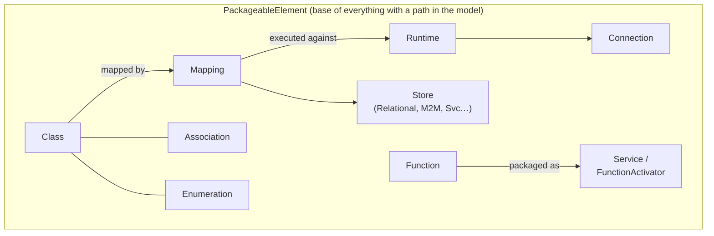

# Domain & Key Concepts

> **Related:** [Architecture Overview](overview.md) | [Key Java Areas](key-java-areas.md) | [Key Pure Areas](key-pure-areas.md)

> **See also (legend-pure):**
> - [Domain Concepts](https://github.com/finos/legend-pure/blob/main/docs/architecture/domain-concepts.md) — glossary, metamodel entity relationships, Visitor/layered-compiler design patterns.
> - [Pure Language Reference](https://github.com/finos/legend-pure/blob/main/docs/reference/pure-language-reference.md) — Class, Function, Enumeration, and Association syntax and semantics.

---

## 1. Core Domain Model

Legend Engine operates on a small set of first-class domain concepts. Understanding their
relationships is essential before reading any code.



### Class

A user-defined domain type with typed properties and multiplicity constraints.
Properties can be primitive (`String`, `Integer`, `Date`, `Boolean`, `Float`, `Decimal`)
or reference other classes. Corresponds to `meta::pure::metamodel::type::Class` in the
Pure metamodel.

### Association

A first-class bidirectional relationship between two classes. Associations are owned at
the package level (not inside either class), which allows cross-package navigation.

### Enumeration

A finite set of named values. Maps to `enum` constructs in target languages.

### Mapping

Describes how to project one or more domain classes onto a store. Contains:

- **SetImplementations** — one per mapped class, one per store (e.g. `RootRelationalClassMapping`, `PureInstanceSetImplementation`).
- **EnumerationMappings** — translate store enum values to domain enum values.
- **AssociationMappings** — map navigations across foreign keys or join tables.

A mapping is always paired with a **Runtime** at execution time.

### Store

An abstract representation of a data source. Examples:

- `Database` — a relational database with tables, columns, joins, views.
- `ModelStore` — the implicit store for M2M (model-to-model) mappings.
- `ServiceStore` — an HTTP/REST service as a data source.
- `Binding` — an external format (JSON, Avro, Protobuf, etc.) attached to a class model.

### Runtime

Provides the live connection details that bind a mapping to actual data at execution time.
A `PackageableRuntime` wraps one or more `EngineRuntime` specs; each `EngineRuntime`
maps a store to a `Connection`.

### Connection

The technical details for connecting to a store instance (JDBC URL + credentials,
HTTP base URL, etc.). Connections reference an `AuthenticationSpecification` rather than
embedding raw credentials.

### Function / FunctionDefinition

A named, typed Pure function. Can be a concrete function (`ConcreteFunctionDefinition`)
or a qualified property. Queries are lambda functions — anonymous `FunctionDefinition`
instances evaluated against a mapping and runtime.

### Service

A `Service` packages a Pure function + mapping + runtime as a versioned, owned, documented
API endpoint with test data and post-validation rules. See [Key Pure Areas — Service Metamodel](key-pure-areas.md#8-service-metamodel).

### FunctionActivator

An abstraction for deploying a Pure function to an external platform (Snowflake, BigQuery,
hosted REST, etc.). See [Modules — Function Activators](../reference/modules.md#function-activator-modules).

### Binding

Connects a Pure class model to an external data format. Enables `internalize` (deserialise
bytes → objects) and `externalize` (serialise objects → bytes). See [Key Pure Areas — Binding](key-pure-areas.md#10-external-format--binding).

### Model-to-Model (M2M) Mapping

**M2M mapping** is a special mapping variant where the *source* is not a database or service
but another set of Pure class instances — hence "model to model". The execution behaviour
depends on the connection type and query shape: it can run entirely in-process on the JVM,
or it can delegate to and push transformations down into an underlying store.

#### What problem it solves

A relational mapping projects domain classes onto SQL tables. An M2M mapping projects one
domain class graph onto *another* domain class graph. The canonical use cases are:

| Use case | Example |
|----------|---------|
| **Protocol / schema conversion** | Map a canonical `Trade` model onto a vendor-specific `FpML::Swap` model |
| **View / projection** | Produce a read-optimised `TradeSummary` from the full `Trade` graph |
| **Aggregation** | Fold a list of `Position` objects into a `PortfolioSnapshot` |
| **Cross-format normalisation** | Normalise objects arriving in different formats into a single canonical type |

#### How it differs from a store mapping

| Dimension | Store mapping (e.g. relational) | M2M mapping |
|-----------|--------------------------------|-------------|
| **Source** | Tables / columns in a database | Instances of another Pure class set (or the result of a chained underlying mapping) |
| **Store** | `Database` | `ModelStore` (implicit — no explicit store element needed) |
| **Connection** | JDBC / HTTP credentials | `ModelConnection` (in-memory instances) or `ModelChainConnection` (chains through another mapping) |
| **Execution** | SQL sent to an external database | Depends on connection type and query shape — see below |
| **Push-down** | Yes — predicates and projections become SQL `WHERE`/`SELECT` | **Partial** — see execution paths below |

#### Execution paths

The M2M `StoreContract` routes to one of three execution paths depending on the connection
type and whether the query returns class instances or a TDS:

| Scenario | Connection | Result type | Execution path | Push-down to store? |
|----------|-----------|-------------|----------------|---------------------|
| **Pure in-memory transform** | `ModelConnection` | Class instances | `ModelToModelExecutionNode` — mapping lambda compiled to Java and executed in-process | No — source objects are in JVM memory; filtering is done in-JVM |
| **Graph fetch through a chain** | `ModelChainConnection` | Class instances (graph fetch tree) | Re-routed through the underlying store's planner via `planModelChainConnectionGraphFetchExecution`; produces a `GlobalGraphFetchExecutionNode` tree | **Yes for root filters** — filters on root properties that map to source store criteria are pushed into the underlying store's query (e.g. SQL `WHERE`). Cross-store sub-tree properties are fetched via **micro-batched sub-queries**, keyed by parent result values. |
| **TDS query through a chain** | `ModelChainConnection` | `TabularDataSet` | M2M transform inlined into re-routed expression, planned and executed entirely by the underlying store (`planExecutionChain`) | **Yes** — full push-down; filters, projections, and joins go into the underlying store's SQL |

> **Graph fetch push-down detail:** For a graph fetch over a `ModelChainConnection`, the
> planner explicitly sets `includeFilter = false` on the M2M layer (the comment in the
> source reads *"On chain connections, the filter gets pushed to the target"*) and re-routes
> the whole expression — including the graph fetch tree and any `filter(...)` applied to the
> source — through `routeFunction` against the underlying mapping. The underlying store
> (e.g. relational) then generates SQL that includes the filter criteria.
>
> Cross-store sub-tree properties (fetched from a second store via `XStorePropertyMapping`)
> are resolved via **micro-batching**: the engine collects a batch of parent objects from the
> primary store, then issues further queries to the child store keyed by the cross-store
> property values. Whether the child store supports batching is determined per-store via
> `crossStoreSourceSupportsBatching`. Some additional in-memory filtering may still apply
> (e.g. constraint checks, multiplicity validation) after objects are assembled.

> **Note:** A direct `ModelConnection` (not chain) cannot return a `TabularDataSet` —
> `planExecutionInMemory` asserts against this and will throw at plan-generation time.

#### Grammar sketch

```pure
###Mapping
Mapping my::domain::TradeToSummaryMapping
(
  *my::domain::TradeSummary: Pure
  {
    ~src my::domain::Trade
    id:       $src.tradeId,
    notional: $src.legs->map(l | $l.notional)->sum()
  }
)

###Runtime
Runtime my::domain::M2MRuntime
{
  mappings: [ my::domain::TradeToSummaryMapping ];
  connections:
  [
    ModelStore:
    [
      id1: #{
        my::domain::Trade: $trades   // $trades is bound at execution time
      }#
    ]
  ];
}
```

#### See also

[Key Pure Areas — M2M Store](key-pure-areas.md#7-m2m-store-and-mapping-chain) for the Pure-level
implementation (`inMemory.pure`, `chain.pure`, `storeContract.pure`).

---

## 2. Execution Concepts

### ExecutionPlan

The intermediate representation (IR) produced by the query planner. An `ExecutionPlan` is
a tree of `ExecutionNode` objects. It is serialisable to JSON, cacheable, and inspectable.
See [Key Pure Areas — Execution Plan Metamodel](key-pure-areas.md#3-execution-plan-metamodel).

### Execution Context

Carries runtime hints for plan generation: `enableConstraints`, `queryTimeOutInSeconds`,
`enableAnalytics`, timezone. Passed from the HTTP request through the entire planner.

### TDS (Tabular Data Set)

The primary result type for relational queries. A two-dimensional table of typed columns.
`TDSResultType` in a plan node indicates the result is streamed as a TDS. See [Key Pure Areas — TDS](key-pure-areas.md#6-tds-and-relation).

### Relation

A statically-typed variant of TDS where column names and types are encoded in the
Pure type parameter. Newer code prefers `Relation<(colA:String, colB:Integer)>` over
untyped `TabularDataSet`. See [Key Pure Areas — TDS and Relation](key-pure-areas.md#6-tds-and-relation).

### GraphFetchTree

A description of exactly which properties to fetch from a result. Enables partial-object
retrieval and cross-store joins. See [Key Pure Areas — Graph Fetch](key-pure-areas.md#4-graph-fetch).

### Milestoning

First-class bi-temporal support. Classes annotated `processingtemporal`, `businesstemporal`,
or `bitemporal` have temporal date parameters automatically injected into queries and SQL.
See [Key Pure Areas — Milestoning](key-pure-areas.md#5-milestoning).

---

## 3. Protocol and Versioning Concepts

### PureModelContextData

The serialised (JSON) representation of a model snapshot. Contains a flat list of
`PackageableElement` protocol POJOs. This is what travels over the wire between Studio
and the Engine.

### Client Version

A string such as `v1_24_0` that identifies the protocol schema version. The engine supports
multiple client versions simultaneously. Transfer functions (`v1_24_0 → v1_25_0`) migrate
between versions. Managed via `PureClientVersions`.

### DeploymentMode

`PROD` — strict mode; rejects arbitrary model payloads from HTTP bodies.
`SANDBOX` / `TEST` — accepts model payloads in requests, used for development and testing.

---

## 4. Extension Concepts

### Extension (Pure)

`meta::pure::extension::Extension` is a Pure class that acts as the plug-in registry.
Passed as a parameter through every planning and execution function. See [Key Pure Areas — Extension System](key-pure-areas.md#1-extension-system).

### StoreContract (Pure)

Defines how a store participates in routing and plan generation. Each store provides a
`StoreContract` instance in its `Extension`. The contract answers: "can I handle this
expression?", "how do I generate a plan node for it?".

### CompilerExtension (Java)

SPI interface. Allows a module to register `Processor<T>` handlers that compile new
`PackageableElement` types from protocol to the Pure graph.

### StoreExecutorBuilder (Java)

SPI interface. Allows a module to register a `StoreExecutor` implementation that handles
execution of plan nodes for a particular store type. Discovered via Java `ServiceLoader`.

---

## 5. Glossary

| Term | Definition |
|------|-----------|
| **Pure** | The functional language used to express models, mappings, queries, and business rules in Legend |
| **Compiled runtime** | The Pure execution mode where Pure functions are pre-compiled to Java bytecode |
| **Interpreted runtime** | The Pure execution mode where Pure functions are tree-walked at runtime (used in Pure IDE) |
| **M3** | The Pure language metamodel layer — defines what `Class`, `Function`, `Association`, etc. mean |
| **M2** | Domain-specific metamodels built in Pure — `Mapping`, `Database`, `Service`, `Binding`, etc. |
| **M1** | User/business domain models — the actual classes a domain engineer writes |
| **PAR file** | Pure ARchive — binary snapshot of a compiled Pure repository (build cache) |
| **PCT** | Pure Compatibility Test — a Pure function annotated `<<PCT.test>>` that is run against every registered store backend to verify consistent behaviour. The framework is defined in `legend-pure`; see [legend-pure Testing Strategy §5 — PCT](https://github.com/finos/legend-pure/blob/main/docs/testing/testing-strategy.md) for how to author PCT tests in Pure, and [legend-engine Testing Strategy §5](../testing/testing-strategy.md) for how to register a new store as a PCT target. |
| **XTS** | Extension module prefix (e.g. `legend-engine-xts-relationalStore`) — stands for "extension" |
| **TDS** | Tabular Data Set — a dynamically-typed table result |
| **Relation** | Statically-typed TDS; column names/types encoded in the Pure type parameter |
| **Binding** | A named link between a class model and an external format schema |
| **GraphFetch** | Partial-object fetch specifying exactly which properties to retrieve |
| **Milestoning** | Bi-temporal data support — automatic date-parameter injection for temporal classes |
| **Routing** | The process of deciding which store/strategy handles each sub-expression in a query |
| **Clustering** | Grouping adjacent nodes with the same routing strategy into a single execution cluster |
| **FreeMarker** | Templating language used to parameterise SQL in execution plan nodes |
| **SDLC** | Legend SDLC — the GitLab-backed model store used in production |
| **REPL** | Read-Eval-Print Loop — the interactive Legend command-line interface |
| **DataCube** | The grid-based analytical UI embedded in the REPL |
| **Function Activator** | A mechanism for deploying a Pure function to an external platform |
| **Persistence** | The Legend DSL for specifying ETL pipelines (Trigger + Service + Target) |
| **Change Token** | A versioned payload migration record — upcast/downcast code for schema evolution |
| **MCP** | Model Context Protocol — exposes Legend models to LLM tool calls |

---

## 6. Design Patterns

### Visitor / Pattern Matching (Pure `match`)

All polymorphic dispatch in Pure uses `->match([Type1[1] | ..., Type2[1] | ...])`.
The Java layer mirrors this with the `ResultVisitor` pattern for `Result` subtypes.

### ServiceLoader / Plugin Registry

Java extension points are discovered at startup via `java.util.ServiceLoader`. Each
`xts-*` module places its implementation class name(s) in
`META-INF/services/<interface-FQN>`.

### Extension Parameter Threading

Rather than a global registry or dependency injection, the `Extension[*]` collection is
passed as an explicit parameter through every Pure function that needs extension behaviour.
This makes extension dependencies explicit and makes functions easier to test in isolation.

### Versioned Protocol / Transfer Functions

The protocol (JSON wire format) is versioned. Each version has its own package of POJOs.
Migration between versions is handled by Pure transfer functions, not by Java code.

### Plan-Then-Execute Separation

Query planning (routing + SQL generation) is fully separated from execution. The
`ExecutionPlan` JSON is the contract between them. This enables plan caching, plan
inspection via the Studio UI, and plan sharing across services.

### Streaming Results

Execution results are never fully materialised in the engine process. `RelationalResult`
streams `ResultSet` rows on demand; `StreamingResult` wraps a serialiser that writes
directly to the HTTP response `OutputStream`. This bounds memory usage regardless of
result size.
