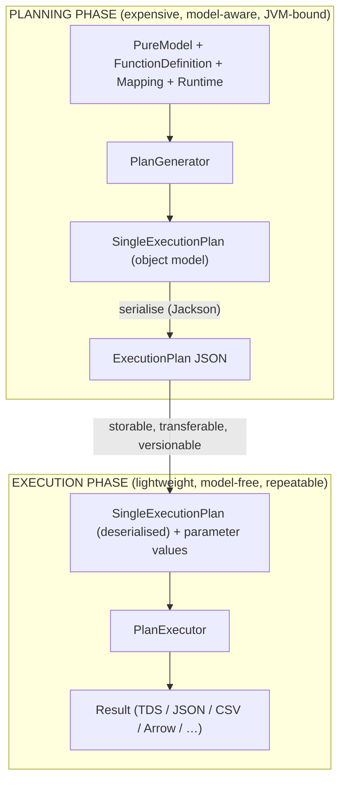
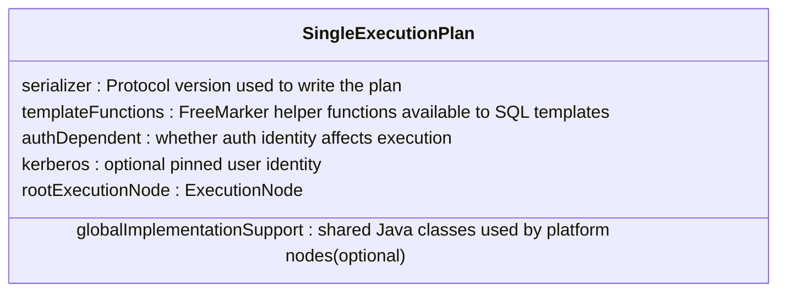
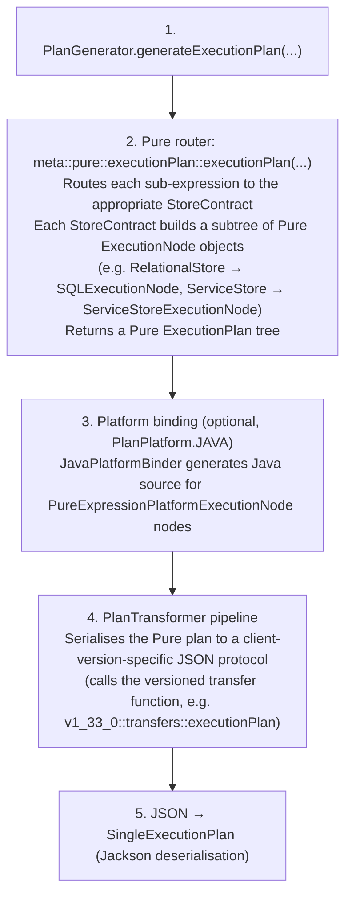
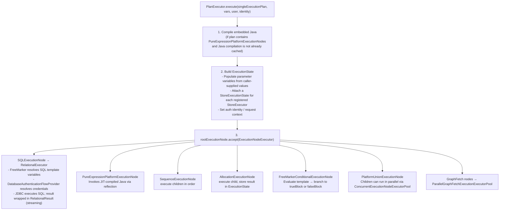
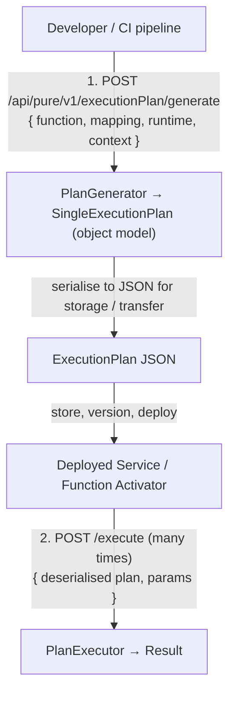

# Legend Engine — Execution Plans

> **Audience:** Developers who need to understand, debug, extend, or operationalise the
> query-execution pipeline in Legend Engine.  
> **Related docs:** [Architecture Overview](overview.md) | [Key Java Areas](key-java-areas.md) |
> [Key Pure Areas](key-pure-areas.md)

---

## 1. What Is an Execution Plan?

An **Execution Plan** is a fully-resolved, store-aware, serialisable description of **how** a Pure
query will be executed — without actually executing it.

Think of it like a compiled query plan in a database engine, but lifted to the multi-store,
multi-language level of Legend Engine. Given a Pure `FunctionDefinition`, a `Mapping`, and a
`Runtime`, the engine analyses the query, routes each sub-expression to the right store contract,
and produces a tree of `ExecutionNode` objects. That tree is then serialised to JSON and handed off
independently to the executor.

---

## 2. Why Execution Plans Exist — The Separation of Concerns

The key architectural decision is that **planning and execution are deliberately separate phases**:

This separation provides several critical properties:

### 2.1 Resiliency

The executor does not need the Pure compiler, the metamodel graph, or even the SDLC in order to
run a query. Once a plan has been generated, execution is a self-contained operation that depends
only on:

- The JSON plan itself (which embeds all SQL templates, connection descriptors, and optionally
  pre-compiled Java bytecode).
- The runtime parameter values supplied at call time.
- Live store credentials resolved at execution time.

If the compiler or SDLC service is unavailable, previously-generated plans continue to execute
without interruption.

### 2.2 Reproducibility

Because the plan is a serialisable value — a `SingleExecutionPlan` object that round-trips
cleanly to and from JSON — it can be:

- **Stored** alongside a deployed service definition (e.g. in a Legend Service or Function Activator).
- **Versioned** in source control or an artefact store.
- **Replayed** deterministically: given the same plan JSON and the same parameter values, the
  executor will always issue the same SQL / HTTP / in-memory operations.
- **Inspected** by humans or tooling without re-running compilation.

This is especially valuable for production services: the plan is generated once at deployment time
and then executed thousands of times with different parameter values, with no re-compilation cost
or risk of non-deterministic routing decisions.

### 2.3 Performance

Plan generation is expensive: it involves Pure compilation, expression-tree routing, SQL
generation, and optionally Java source generation and compilation. By separating generation from
execution, the engine can:

- Cache plans (see `ExecutionPlanCache`) so that repeated calls for the same query share the
  same pre-generated plan.
- Pre-generate plans at service deployment time and store the result, giving near-zero planning
  overhead at request time.
- Avoid re-running the full compilation + routing pipeline on every API call.

### 2.4 Portability

Because the plan object model serialises cleanly to JSON, it can be generated in one
environment (e.g. a developer's workstation or a CI pipeline), persisted, and then
deserialised and executed in another (e.g. a production data-centre with no SDLC
connectivity). This is the basis of the **Function Activator** and **Hosted Service** patterns.

---

## 3. The Execution Plan Data Model

An `ExecutionPlan` is a Java object model rooted at a `SingleExecutionPlan`. It can be
serialised to and deserialised from JSON, which is the wire format used by the
API and the storage format used by deployed services — but the canonical form is the object
model, not the JSON text.

Every `ExecutionNode` in the tree carries:

| Field | Purpose |
|-------|---------|
| `_type` | Discriminator — which concrete node type this is |
| `resultType` | Schema of the data produced by this node (TDS columns, class type, etc.) |
| `resultSizeRange` | Expected multiplicity (e.g. `[0..*]`) |
| `executionNodes` | Ordered list of child nodes |
| `requiredVariableInputs` | Variables this node reads from `ExecutionState` |
| `implementation` | Optional embedded `JavaPlatformImplementation` (source + bytecode) |
| `authDependent` | Whether this node's behaviour depends on the calling user's identity |

### 3.1 Core Node Types

| Node Type | Description |
|-----------|-------------|
| `SQLExecutionNode` | Issues a single SQL statement; carries a FreeMarker-parameterised SQL template and a `DatabaseConnection` descriptor |
| `PureExpressionPlatformExecutionNode` | Executes a Pure expression using JIT-compiled Java (carries embedded Java source in `implementation`) |
| `SequenceExecutionNode` | Executes children in order; the last child's result is the output |
| `AllocationExecutionNode` | Executes a child and stores the result as a named variable in `ExecutionState` |
| `ConstantExecutionNode` | Returns a literal value; no I/O |
| `PlatformUnionExecutionNode` | Merges results from multiple children; children can execute in parallel |
| `PlatformMergeExecutionNode` | Merges graph-fetch results from different stores |
| `FreeMarkerConditionalExecutionNode` | Evaluates a FreeMarker boolean and branches to `trueBlock` or `falseBlock` |
| `FunctionParametersValidationNode` | Validates and type-checks incoming parameter values (e.g. enum membership) |
| `GraphFetchExecutionNode` | Root of a graph-fetch sub-tree |
| `StoreMappingGlobalGraphFetchExecutionNode` | Coordinates per-store graph-fetch batching and cross-store joins |
| `InMemoryRootGraphFetchExecutionNode` | Reads and maps objects using Pure M2M mappings |
| `ErrorExecutionNode` | Immediately fails with a compile-time-known error message |

### 3.2 Result Types

Each node also carries a `ResultType` describing the shape of its output:

| Result Type | Description |
|-------------|-------------|
| `TDSResultType` | Tabular result with named, typed columns |
| `ClassResultType` | An instance of a mapped Pure class |
| `RelationResultType` | A database relation (table or view) |
| `DataTypeResultType` | A primitive scalar value |
| `VoidResultType` | No output (side-effect-only node) |

---

## 4. Plan Generation

**Entry point:** `org.finos.legend.engine.plan.generation.PlanGenerator`  
**Module:** `legend-engine-core-executionPlan-generation`  
**API endpoint:** `POST /api/pure/v1/executionPlan/generate`

### 4.1 Inputs

| Input | Type | Description |
|-------|------|-------------|
| `FunctionDefinition` | Pure | The query lambda to be planned |
| `Mapping` | Pure | The mapping that projects domain classes onto stores |
| `Runtime` | Pure | The connections to the physical stores |
| `ExecutionContext` | Pure | Options such as time-zone, analytics hints, etc. |
| `PlanPlatform` | Java enum | Target platform (currently `JAVA` or none) |
| `extensions` | Pure `Extension[*]` | All active store/format/feature plug-ins |
| `transformers` | Java `PlanTransformer[*]` | Post-processing pipeline (e.g. `JavaPlatformBinder`) |

### 4.2 Generation Pipeline

### 4.3 Debug Mode

`PlanGenerator.generateExecutionPlanDebug(...)` captures Pure `Console` output during generation
and returns it alongside the plan as a `PlanWithDebug`. This is used by Legend Studio's
"Generate Plan (Debug)" feature to expose the router's routing decisions and intermediate state.

---

## 5. Plan Execution

**Entry point:** `org.finos.legend.engine.plan.execution.PlanExecutor`  
**Module:** `legend-engine-core-executionPlan-execution`  
**API endpoint:** `POST /api/pure/v1/execution/execute`

### 5.1 Execution Flow

### 5.2 ExecutionState

`ExecutionState` is the mutable per-request bag threaded through the entire execution. It holds:

- Named `Result` variables (allocated by `AllocationExecutionNode` or pre-populated from
  caller parameters).
- A `StoreExecutionState` per registered store type (carries open connections, temp tables, etc.).
- Auth identity, execution ID, and request context metadata.
- The `EngineJavaCompiler` instance (after JIT compilation), shared across all JVM-platform nodes
  within the same request.

### 5.3 JIT Java Compilation

`PureExpressionPlatformExecutionNode` nodes carry embedded Java source code generated during plan
creation by `JavaPlatformBinder`. At execution time, `PlanExecutor.possiblyCompilePlan(...)` uses
`EngineJavaCompiler` (backed by the JDK compiler API with a Janino fallback) to compile the
source in memory. The resulting `ClassLoader` is cached and reused for the lifetime of the plan,
so compilation only happens once per distinct plan even under concurrent requests.

### 5.4 Result Streaming

Results are **never fully materialised in memory by default**. Each `StoreExecutor` returns a
`Result` sub-type that lazily pulls data from the source:

| Result type | Description |
|-------------|-------------|
| `ConstantResult` | Wraps a single in-memory value |
| `RelationalResult` | Wraps a live JDBC `ResultSet`; serialised to TDS JSON, Arrow, or CSV on demand |
| `StreamingObjectResult` | Streams M2M-mapped domain objects as a JSON array |
| `JSONStreamingResult` | Generic streaming JSON output |
| `CSVStreamingResult` | Generic streaming CSV output |

---

## 6. Plan Caching

The engine supports two caching strategies to avoid redundant work:

### 6.1 Execution Plan Cache (`ExecutionPlanCache`)

Caches `SingleExecutionPlan` instances keyed by `PlanCacheKey` (derived from the query, mapping,
runtime, and client version). Subsequent requests for the same logical query short-circuit plan
generation entirely and jump straight to execution.

### 6.2 JIT Compiler Cache

Once the embedded Java within a plan has been compiled, the resulting `EngineJavaCompiler` instance
is retained so that subsequent executions of the same plan do not re-compile the same source.

---

## 7. Plan Serialisation & Versioning

Execution plans are versioned in lockstep with the Pure protocol. Each supported client version
(e.g. `v1_29_0`, `v1_33_0`) has a corresponding set of Pure transfer functions
(`core/pure/protocol/<version>/transfers/executionPlan.pure`) and matching Java Jackson subtypes.

`PlanTransformer.supports(String version)` controls which transformer handles which client version.
The correct transformer is selected by `PlanGenerator.serializeToJSON(...)` at generation time.

Plans are **forward-compatible** within a major protocol series: a plan generated for an older
client version can still be executed by a newer `PlanExecutor`.

---

## 8. Extension Points

| Extension SPI | Module | Purpose |
|---|---|---|
| `StoreContract` (Pure) | `meta::pure::extension` | Teaches the router how to generate plan nodes for a new store type |
| `PlanGeneratorExtension` (Java) | `legend-engine-executionPlan-generation` | Contributes extra `PlanTransformer` implementations |
| `PlanTransformer` (Java) | `legend-engine-executionPlan-generation` | Post-processes the Pure plan tree for a specific client version |
| `StoreExecutorBuilder` (Java) | `legend-engine-executionPlan-execution` | Registers a new `StoreExecutor` (loaded via `ServiceLoader`) |
| `ExecutionNodeVisitor<T>` (Java) | `legend-engine-protocol-pure` | Visitor pattern entry-point for processing new `ExecutionNode` sub-types |

All Java SPIs are registered via `META-INF/services/<interface-FQN>` files.

---

## 9. Lifecycle Summary

Key invariant: **Step 2 does not require Step 1 to have been run recently** — or at all in the
same process. A plan JSON produced months ago on a developer laptop can be executed today in a
production cluster, as long as the embedded SQL / Java is still valid for the target stores.

---

## 10. Further Reading

- [Key Java Areas](key-java-areas.md) §4 (PlanGenerator) and §5 (PlanExecutor) for detailed
  class-level descriptions.
- [Architecture Overview](overview.md) §3.3 and §3.4 for the pipelines in context.
- `PlanGenerator.java` — `legend-engine-core/…/legend-engine-executionPlan-generation/`
- `PlanExecutor.java` — `legend-engine-core/…/legend-engine-executionPlan-execution/`
- `SingleExecutionPlan.java` — `legend-engine-core/…/legend-engine-protocol-pure/`
- `ExecutionNode.java` (and subtype classes) — same module as above, under `.../executionPlan/nodes/`
- `core/pure/executionPlan/executionPlan_generation.pure` — the Pure-side generation entry points
- `core/pure/protocol/vX_X_X/models/executionPlan.pure` — canonical protocol model definition
