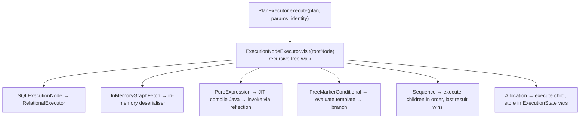

# Legend Engine — Key Java Areas

> **Audience:** Developers who need to understand, debug, or extend the Java layer of the engine.
> For corresponding Pure-side concepts see [Key Pure Areas](key-pure-areas.md).

---

## 1. Grammar Layer

### Functional Purpose

Converts human-readable Legend grammar text into a versioned JSON protocol representation
(`PureModelContextData`) and back. This is the bridge between the text-based IDE and the
rest of the engine.

### Key Technical Implementation

**Entry-point classes:**

- `org.finos.legend.engine.language.pure.grammar.from.PureGrammarParser`
- `org.finos.legend.engine.language.pure.grammar.to.PureGrammarComposer`

**Module:** `legend-engine-language-pure-grammar`

**How it works:**

1. Input text is split into named **sections** by `###SectionType` markers
   (e.g. `###Pure`, `###Relational`, `###Mapping`).
2. Each section is parsed by a `SectionParser` registered via `PureGrammarParserExtension`
   (Java `ServiceLoader`).
3. ANTLR4 grammars (in `src/main/antlr4/`) define the token rules for each section.
   Generated listeners/visitors walk the parse tree and produce protocol POJO instances.
4. Built-in sections: `DomainParser` (classes, enums, functions), `MappingParser`,
   `RuntimeParser`, `ConnectionParser`.

**Extension point:** Implement `PureGrammarParserExtension` + `PureGrammarComposerExtension`
and register in `META-INF/services/`.

---

## 2. Compiler — PureModel

> **See also:** [Alloy Compiler Deep-Dive](alloy-compiler.md) for a full description of every
> compilation phase, the function registry / type-inference system, how to add new element types
> and functions, and the complete testing guide.

### Functional Purpose

Takes `PureModelContextData` (a bag of protocol POJOs) and produces a `PureModel`: a fully
type-checked, cross-linked in-memory Pure object graph backed by the `legend-pure` runtime.

### Key Technical Implementation

**Entry-point class:** `org.finos.legend.engine.language.pure.compiler.toPureGraph.PureModel`

**Module:** `legend-engine-language-pure-compiler`

**Multi-pass compilation:**

| Pass | What happens |
|------|-------------|
| Pre-requisite | Sort elements so dependencies compile before dependents |
| First pass | Register package paths and type names into the Pure `ModelRepository` |
| Second pass | Fill in properties, constraints, function bodies, mapping implementations |
| Validation | Per-type validators (`ClassValidator`, `FunctionValidator`, etc.) |

**Extension mechanism:** `CompilerExtension` SPI — each `xts-*` module registers `Processor<T>`
handlers for its new element types. `CompilerExtensions` aggregates all loaded extensions.

**Key internal classes:**

- `HelperValueSpecificationBuilder` — builds Pure `ValueSpecification` from protocol lambdas
- `Handlers` — maps function names to Pure signatures for type inference
- `MetadataWrapper` — wraps `legend-pure` metadata for lazy loading during compilation

**Thread safety:** `PureModel` construction can be parallelised at the element level using
`ConcurrentHashMap` from Eclipse Collections.

---

## 3. Model Manager

### Functional Purpose

Caches compiled `PureModel` instances to avoid recompilation on every request. Supports
loading models from SDLC or directly from a `PureModelContextData` payload.

### Key Technical Implementation

**Entry-point class:** `org.finos.legend.engine.language.pure.modelManager.ModelManager`

**Module:** `legend-engine-language-pure-modelManager`

- `ModelLoader` SPI — multiple loaders registered (e.g. `SDLCLoader`, direct-data loader).
- `SDLCLoader` calls the Legend SDLC HTTP API to fetch versioned model snapshots; results
  are cached by workspace/version key.
- `DeploymentMode` (`PROD` vs `SANDBOX`) controls whether arbitrary model context data is
  accepted from request bodies.

---

## 4. Execution Plan Generation — PlanGenerator

> **See also:** [Execution Plans](execution-plans.md) for a full description of why execution
> plans exist, the separation-of-concerns design, the complete node-type catalogue, caching,
> versioning, and the extension points.

### Functional Purpose

Given a Pure `FunctionDefinition`, a `Mapping`, a `Runtime`, and an execution context,
produce a serialisable `SingleExecutionPlan` describing **how** to execute the query without
actually running it.

### Key Technical Implementation

**Entry-point class:** `org.finos.legend.engine.plan.generation.PlanGenerator`

**Module:** `legend-engine-executionPlan-generation`

**Key steps:**

1. **Pure router invocation.** `PlanGenerator` calls
   `meta::pure::router::routeFunction(...)` via the compiled Pure runtime. This analyses
   the lambda expression tree and dispatches each sub-expression to the appropriate
   `StoreContract`.

2. **Pure plan generation.** Each `StoreContract` produces a subtree of Pure
   `ExecutionNode` objects (SQL nodes, in-memory nodes, platform nodes, etc.).

3. **Plan transformation.** The plan is serialised to JSON then deserialized into a Java
   `SingleExecutionPlan`. A chain of `PlanTransformer` implementations post-processes it:
   - `JavaPlatformBinder` — generates Java source for `PureExpressionPlatformExecutionNode`
     nodes using the engine's Java code generator. The source is embedded as
     `JavaPlatformImplementation`.

4. **Versioned serialisation.** Written in the `clientVersion`-specific JSON schema using
   protocol transfer functions.

**Extension point:** `PlanGeneratorExtension` SPI — contributes additional plan transformers.

---

## 5. Plan Executor — PlanExecutor

### Functional Purpose

Takes an `ExecutionPlan` and parameter values, then executes it to produce a `Result`.
Results are streamed to avoid materialising large datasets in memory.

### Key Technical Implementation

**Entry-point class:** `org.finos.legend.engine.plan.execution.PlanExecutor`

**Module:** `legend-engine-executionPlan-execution`

**Architecture:**

**JIT Java compilation:** `PureExpressionPlatformExecutionNode` nodes carry embedded Java
source. `JavaHelper` compiles it using `EngineJavaCompiler` (JDK compiler API or Janino
fallback). Compiled classes are cached.

**Concurrency:**

- `PlatformUnionExecutionNode` children can run in parallel via
  `ConcurrentExecutionNodeExecutorPool` (configurable thread pool).
- `ParallelGraphFetchExecutionExecutorPool` handles parallel batched graph-fetch.

**Store executors** are loaded via `StoreExecutorBuilderLoader` (ServiceLoader) at startup.
Each `StoreExecutor` contributes a `StoreExecutionState` per request.

**Result types:** `ConstantResult`, `RelationalResult` (streaming JDBC `ResultSet`),
`StreamingResult`, `JSONStreamingResult`, `CSVStreamingResult`.

---

## 6. Relational Store Executor

### Functional Purpose

Executes SQL against any JDBC-compliant database. Handles parameterised SQL, temp tables,
graph-fetch result streaming, and per-dialect DDL differences.

### Key Technical Implementation

**Entry-point class:** `org.finos.legend.engine.plan.execution.stores.relational.RelationalExecutor`

**Module:** `legend-engine-xt-relationalStore-executionPlan`

**SQL execution flow:**

1. `SQLExecutionNode` carries a FreeMarker-parameterised SQL template plus result type info.
2. `FreeMarkerExecutor` resolves variables from `ExecutionState` into the template.
3. `ConnectionManagerSelector` selects the right `DatabaseManager` (one per dialect) and
   opens a pooled HikariCP JDBC connection.
4. The statement is executed; the `ResultSet` is wrapped in a `RelationalResult`.
5. `RelationalResultHelper` serialises to TDS JSON, Arrow, or CSV as requested.

**Authentication:** `DatabaseAuthenticationFlowProvider` chains `AuthenticationFlow`
implementations. Each flow resolves a `Credential` from the `CredentialProviderProvider`
(see section 8). The credential is passed to `DatabaseManager.getConnection(credential)`.

**Temp tables:** Cross-store joins or large parameter lists use temp tables.
`StreamResultToTempTableVisitor` writes rows into a temporary DB table using dialect-specific
DDL (`DatabaseManager.buildTemporaryTableFromColumns`).

**Block connections:** `BlockConnection` wraps a JDBC connection to keep it open across
multiple SQL nodes (needed for temp table lifetime and transactions).

---

## 7. In-Memory (M2M) Store Executor

### Functional Purpose

Executes Model-to-Model (M2M) transformations: maps objects from one class to another using
Pure mapping definitions, without any database involvement.

### Key Technical Implementation

**Module:** `legend-engine-executionPlan-execution-store-inMemory`

- Driven by `InMemoryGraphFetchExecutionNode` plan nodes.
- Source data is read as a stream using the `ExternalFormatRuntime`.
- The stream is deserialised to `IReferencedObject` instances, then transformed through Pure
  mapping's `PurePropertyMapping` lambdas.
- Results are collected into a `GraphObjectsBag` for downstream property resolution.

**Chained mappings:** When a mapping uses a `ModelChainConnection`, the M2M store re-routes
through the engine's Pure router multiple times (see `chain.pure`) to compose mapping hops.

---

## 8. Authentication

### Functional Purpose

Provides a unified, pluggable credential-resolution framework. Rather than hard-coding
credentials, Legend resolves them at runtime from a layered vault hierarchy (env-vars,
properties files, AWS Secrets Manager, GCP Secret Manager, etc.).

### Key Technical Implementation

**Module:** `legend-engine-xts-authentication` + `legend-shared` (core interfaces)

**Key classes:**

- `CredentialVaultProvider` — ordered list of vaults; first vault that answers wins.
- `PropertiesFileCredentialVault` — reads from `.properties` file (local dev).
- `AWSSecretsManagerVault` — reads from AWS Secrets Manager.
- `CredentialProviderProvider` — ordered list of `CredentialProvider` implementations.
- `CredentialBuilder.makeCredential(provider, spec, identity)` — single call site that
  resolves a `Credential` from an `AuthenticationSpecification`.

**Intermediation rules:** Each `CredentialProvider` uses a list of `IntermediationRule`
objects to resolve its credential type. Rules look up vault entries, perform OAuth flows,
etc. Rules can also be injected via `IntermediationRuleProvider`.

**GCP/AWS federation:** `GCPWIFWithAWSIdPOAuthCredentialProvider` supports Workload Identity
Federation (WIF) with AWS as the identity provider — the pattern for cross-cloud
service-to-service auth.

**Code examples:** See `docs/authentication/code-examples.md`.

---

## 9. Extension SPI Summary

| SPI Interface | Module | Purpose |
|---|---|---|
| `PureGrammarParserExtension` | `legend-engine-language-pure-grammar` | Add a grammar section parser |
| `PureGrammarComposerExtension` | `legend-engine-language-pure-grammar` | Add a grammar section composer |
| `CompilerExtension` | `legend-engine-language-pure-compiler` | Add compilation for new element types |
| `StoreExecutorBuilder` | `legend-engine-executionPlan-execution` | Add a new store runtime executor |
| `PlanGeneratorExtension` | `legend-engine-executionPlan-generation` | Add plan transformers |
| `DatabaseAuthenticationFlowProvider` | `legend-engine-xt-relationalStore-executionPlan-connection-authentication` | Add auth flow for new credential type |
| `ResultInterpreterExtension` | `legend-engine-xt-relationalStore-executionPlan` | Customise relational result interpretation |
| `EntitlementServiceExtension` | server assembly | Add store entitlement check |

All SPI implementations are registered via `META-INF/services/<interface-FQN>` files.

---

## 10. Server Assembly (Server.java)

### Functional Purpose

The `Server` class is the Dropwizard `Application<ServerConfiguration>` that assembles all
pieces into a running HTTP process.

### Key Technical Implementation

**Class:** `org.finos.legend.engine.server.Server`

**Module:** `legend-engine-server-http-server`

**Bootstrap phase:**

- Registers Jackson subtypes for all protocol element types (classpath scan at startup).
- Registers Dropwizard bundles: `SwaggerBundle`, `MultiPartBundle`, `AssetsBundle`.
- Configures environment-variable substitution in YAML config.

**Run phase:**

1. Builds `CredentialVaultProvider` and `CredentialProviderProvider` from configuration.
2. Creates `ModelManager` (with optional SDLC integration).
3. Creates `PlanExecutor` with all store executors (ServiceLoader + explicit constructors
   for Deephaven/Elasticsearch which need configuration injection).
4. Registers every REST resource class with Jersey.
5. Configures CORS, session handling, Prometheus metrics, OpenTracing.

**Local dev config:**
`legend-engine-server-http-server/src/test/resources/org/finos/legend/engine/server/test/userTestConfig.json`
