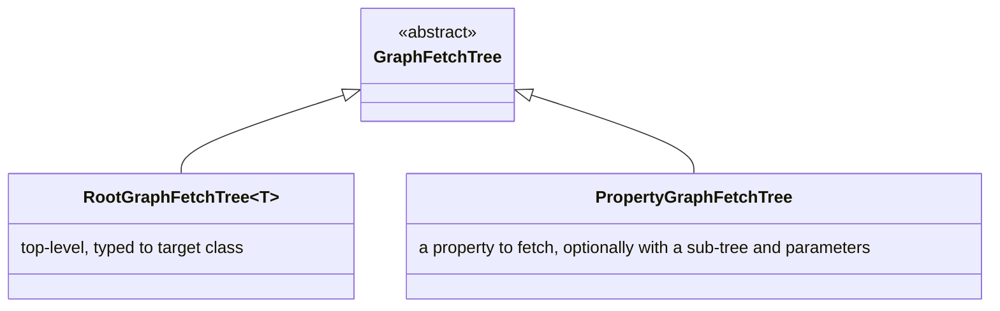

# Legend Engine — Key Pure Areas

> **Audience:** Developers who need to understand or extend the Pure code within `legend-engine`.  
> **Prerequisite:** Familiarity with the Pure language (types, functions, stereotypes, profiles).  
> See the `legend-pure` documentation for language fundamentals.  
>
> **Important:** The Pure files described here are bundled as classpath resources inside  
> `legend-engine-core` modules and processed by the compiled Pure runtime at startup.  
> They live under `src/main/resources/` and are loaded via `CodeRepository` / `CodeStorage`.
>
> **legend-pure language reference:**
> The Pure *language itself* — syntax, types, multiplicity, generics, lambdas — is documented in
> [`legend-pure` Pure Language Reference](https://github.com/finos/legend-pure/blob/main/docs/reference/pure-language-reference.md).
> This document covers only engine-specific Pure code; consult that reference for any language-level questions.

---

## 1. Extension System (`core/pure/extensions/extension.pure`)

### Functional Purpose

The `Extension` class is the **central plug-in registry** of the engine. It is threaded as a
parameter through virtually every router, planner, and executor function in Pure. By passing
different `Extension[*]` collections you get different behaviour without changing any core code.

### Key Technical Implementation

**File:** `legend-engine-core/legend-engine-core-pure/legend-engine-pure-code-compiled-core/src/main/resources/core/pure/extensions/extension.pure`

**Key structure:**

```pure
Class meta::pure::extension::Extension
{
  type : String[1];                             // unique name, e.g. 'relational'
  availableStores  : StoreContract[*];          // routing + plan-gen hooks per store
  availableExternalFormats : ExternalFormatContract<Any>[*];  // format handlers
  availableFeatures : FeatureExtension[*];      // cross-cutting features (e.g. TDS→Relation)
  availablePlatformBindings : PlatformBinding[*]; // Java code-gen binding
  // ... plus many function-valued properties for specific hook points
}
```

**How it propagates:** Every call to `routeFunction`, `generatePlan`, `planNodeToString`, etc.
accepts `extensions: Extension[*]` as a parameter. Store contracts use it to dispatch to the
correct implementation without hard-coding imports.

**How extensions register:** In Java, each `PlanGeneratorExtension` implementation returns a list
of Pure `Extension` objects (obtained by calling generated accessor functions on the compiled Pure
runtime). These are collected and passed to every Pure function call.

---

## 2. Router (`core/pure/router/`)

> **See also:** [Router and Pure-to-SQL Pipeline](router-and-pure-to-sql.md) for a complete
> deep-dive into routing strategies, clustering, Pure-to-SQL query translation, `sqlQueryToString`,
> dialect extension, and step-by-step worked examples.

### Functional Purpose

The router is the **query planning brain** of Pure. Given a `FunctionDefinition` (a lambda), it
walks the expression tree, determines which sub-expressions touch which stores, and wraps each
sub-expression in a typed cluster node. The output is an annotated function tree from which the
execution plan is generated.

### Key Technical Implementation

**Key files:**

```text
core/pure/router/router_main.pure      ← top-level entry point: routeFunction(...)
core/pure/router/routing/              ← per-expression-type routing logic
core/pure/router/clustering/           ← ClusteredValueSpecification wrappers
core/pure/router/store/                ← store-level routing helpers
core/pure/router/platform/             ← platform (Java) routing strategy
core/pure/router/externalFormat/       ← external format routing strategy
```

**Key Pure function:** `meta::pure::router::routeFunction`

**Routing strategies:**

- `StoreRoutingStrategy` — routes `getAll()` and property navigation to a specific store.
- `PlatformRoutingStrategy` — routes `map`, `filter`, `groupBy` etc. to in-process Pure execution.
- `ExternalFormatRoutingStrategy` — routes `internalize` / `externalize` to a format contract.

**Clustering:**
After routing, adjacent nodes with the same routing strategy are merged into `ClusteredValueSpecification`
objects (`StoreMappingClusteredValueSpecification`, `PlatformClusteredValueSpecification`, etc.).
Each cluster becomes one top-level execution node.

**Debugging routing:** Pass a `DebugContext` to `routeFunction` and the router will print its
decisions. In the Pure IDE run `meta::pure::router::routeFunction($f, ^DebugContext(debug=true, space=''), [])`.

---

## 3. Execution Plan Metamodel (`core/pure/executionPlan/executionPlan.pure`)

### Functional Purpose

Defines the **data structures** that represent a fully-planned query: what to do, in what order,
with what types. This is the intermediate representation (IR) between planning and execution.

### Key Technical Implementation

**File:** `core/pure/executionPlan/executionPlan.pure`

**Key classes:**

| Pure Class | Purpose |
|---|---|
| `ExecutionPlan` | Top-level: links to root node, carries global Java implementation support |
| `ExecutionNode` | Base class for all plan nodes. Carries `resultType`, child nodes, auth metadata |
| `SQLExecutionNode` | Parameterised SQL template + connection spec |
| `RelationalExecutionNode` | Extends `SQLExecutionNode` with TDS column info |
| `PureExpressionPlatformExecutionNode` | A Pure expression to be executed in-process (compiled to Java) |
| `SequenceExecutionNode` | Execute children in order |
| `AllocationExecutionNode` | Assign result of child to a named variable |
| `FunctionParametersValidationNode` | Validate input parameter types/multiplicities |
| `GlobalGraphFetchExecutionNode` | Top-level graph fetch coordinator |
| `ResultType` | Abstract base: `ClassResultType`, `TDSResultType`, `DataTypeResultType`, `VoidResultType` |

**Plan generation function:** `meta::pure::executionPlan::generatePlan` (in `executionPlan_generation.pure`)

**Plan printing:** `meta::pure::executionPlan::toString::planToString` (in `executionPlan_print.pure`) — useful for debugging via the Pure IDE or the `/executionPlan/generateString` API.

---

## 4. Graph Fetch (`core/pure/graphFetch/`)

> **See also (legend-pure):** [Domain Concepts](https://github.com/finos/legend-pure/blob/main/docs/architecture/domain-concepts.md)
> for the constraint/defect model that underpins `graphFetchChecked`.

### Functional Purpose

Graph Fetch enables **partial-object retrieval**: rather than fetching every property of every
class in a result set, the caller specifies a `RootGraphFetchTree` describing exactly which
properties (and sub-properties) are needed. This reduces data transfer and enables cross-store
property resolution in a single logical query.

### Key Technical Implementation

**Key files:**

```text
core/pure/graphFetch/graphFetch.pure           ← API functions (graphFetch, graphFetchChecked)
core/pure/graphFetch/graphFetchExecutionPlan.pure ← execution node types
core/pure/graphFetch/graphFetch_routing.pure   ← routing logic for graph fetch trees
core/pure/graphFetch/domain/                   ← tree metamodel classes
```

**Key Pure functions:**

- `graphFetch<T>(collection, tree)` — fetch `T` instances with only the specified tree.
- `graphFetchChecked<T>(collection, tree)` — same, but wraps results in `Checked<T>` which carries data quality defects (missing required properties, constraint violations).
- `graphFetchUnexpanded<T>(...)` — skips sub-tree expansion (used in cross-store scenarios).

**Graph Fetch Tree metamodel:**



**Cross-store graph fetch:**
When properties are spread across stores, the router produces a `GlobalGraphFetchExecutionNode`
containing multiple `LocalGraphFetchExecutionNode` children (one per store). The executor
batches IDs from the first store and feeds them as parameters to each subsequent store.

**Data quality / `Checked`:**
`graphFetchChecked` wraps each result in `Checked<T>` (defined in `core/pure/dataQuality/`).
Defects accumulate through the tree — e.g. a missing `[1]` multiplicity property becomes a defect
rather than an exception, allowing partial results with error annotations.

---

## 5. Milestoning (`core/pure/milestoning/milestoning.pure`)

> **See also (legend-pure):** [Pure Language Reference — Milestoning](https://github.com/finos/legend-pure/blob/main/docs/reference/pure-language-reference.md)
> for the stereotype syntax (`<<temporal::businesstemporal>>`, `<<temporal::processingtemporal>>`,
> `<<temporal::bitemporal>>`) and the language-level semantics of temporal date parameters.

### Functional Purpose

Milestoning is Legend's first-class support for **bi-temporal data**: every class can be
annotated as `processingtemporal`, `businesstemporal`, or `bitemporal`. The engine then
automatically injects temporal date parameters into queries and SQL, eliminating the need for
manual `WHERE processingDate BETWEEN ...` clauses.

### Key Technical Implementation

**File:** `core/pure/milestoning/milestoning.pure`

**Stereotypes (defined in `legend-pure`):**

- `temporal::processingtemporal` — row valid in the processing/system timeline.
- `temporal::businesstemporal` — row valid in the business timeline.
- `temporal::bitemporal` — both timelines.

**Generated properties:**
When the compiler processes a milestoned class, it automatically adds:

- `processingDate: Date[1]` / `businessDate: Date[1]` — the date parameters.
- `allVersionsInRange(from, to)` — access all versions between two dates.
- `allVersions` — access all versions without date filtering.
- `milestoning: Milestoning[*]` — raw milestoning metadata.

**Engine behaviour:**

- The router (`router_main.pure`) detects navigations to milestoned classes and ensures the
  temporal parameters are propagated.
- SQL generation (`meta::relational::milestoning`) adds the correct `WHERE` clauses automatically
  based on the temporal stereotype and property type.
- `excludeRangeMilestoningProperty` / `excludeRangeMilestoningPropertyMapping` helpers are used
  throughout mapping compilation to skip auto-generated range properties.

---

## 6. TDS and Relation (`core/pure/tds/`, `core/pure/tds/relation/`)

> **See also:** [TDS and Relation Deep-Dive](../reference/tds-and-relation.md) for the full function catalogue,
> OLAP window syntax, schema-inference internals, the TDS→Relation migration layer, and the PCT
> test structure.

### Functional Purpose

**TDS (Tabular Data Set)** is Pure's abstraction for a two-dimensional table of typed columns.
It is the primary result type for relational queries. The newer **Relation** type is a
compile-time typed TDS with statically-known column names and types, enabling type-safe
column-level operations.

### Key Technical Implementation

**Key files:**

```text
core/pure/tds/tds.pure          ← TDS metamodel and functions (project, filter, join, groupBy, ...)
core/pure/tds/tdsSchema.pure    ← schema inference for TDS operations
core/pure/tds/relation/         ← Relation metamodel and typed column functions
```

**TDS key functions:**

- `project(fn, cols)` — select/compute columns.
- `filter(pred)` — filter rows.
- `join(right, type, condition)` — SQL-style join.
- `groupBy(keys, aggs)` — aggregate.
- `sort`, `slice`, `distinct`, `renameColumns`, `concatenate`, etc.

**TDS → SQL:** During plan generation, TDS operations are mapped to relational SQL nodes.
The `tdsSchema` module infers the column types of each operation to enable downstream type-checking.

**Relation:**
`meta::pure::metamodel::relation::Relation<T>` carries a type parameter that encodes the column
schema at compile time. Functions like `select`, `filter`, `join` operate on `Relation<T>` with
full static typing. This is the direction new Pure code should prefer over untyped TDS.

---

## 7. M2M Store and Mapping Chain (`core/store/m2m/`)

> **See also (legend-pure):** [Mapping Grammar Reference — Pure class mapping](https://github.com/finos/legend-pure/blob/main/docs/reference/mapping-grammar-reference.md)
> for the `###Mapping` Pure-source syntax used to define M2M transformation expressions.

### Functional Purpose

The Model-to-Model (M2M) store enables **object-to-object mapping**: given a source
collection of class instances, produce a target collection using Pure mapping definitions.
The execution path depends on the connection type and query shape — it may run in-process
in the JVM or push transformations down into an underlying store. See
[Domain Concepts — M2M Mapping](domain-concepts.md#model-to-model-m2m-mapping) for the
full breakdown of execution paths.

### Key Technical Implementation

**Key files:**

```text
core/store/m2m/inMemory.pure       ← in-memory execution (ModelConnection, graph fetch)
core/store/m2m/chain.pure          ← ModelChainConnection TDS path (re-routes to underlying store)
core/store/m2m/storeContract.pure  ← StoreContract: dispatches to inMemory or chain paths
```

**Mapping types used:**

- `PureInstanceSetImplementation` — maps a source class to a target class property-by-property using Pure lambdas.
- `OperationSetImplementation` with `union`/`merge` operations — combines multiple set implementations.

**Execution (three paths):**

1. **`ModelConnection` + class result** → `planExecutionInMemory` → `ModelToModelExecutionNode` —
   mapping lambda compiled to Java and run in-process. Cannot return `TabularDataSet`.
2. **`ModelChainConnection` + graph fetch** → `planModelChainConnectionGraphFetchExecution` —
   re-routes through the underlying store's planner. **Root filters are pushed to the underlying
   store** (the planner sets `includeFilter=false` on the M2M layer with the comment
   *"On chain connections, the filter gets pushed to the target"*). Cross-store sub-tree
   properties are resolved via **micro-batched sub-queries** keyed by parent result values;
   some in-memory filtering still applies for constraints and multiplicity checks.
3. **`ModelChainConnection` + TDS result** → `planExecutionChain` — M2M transform inlined into
   the re-routed expression and planned entirely by the underlying store. Full push-down; no
   separate in-JVM M2M step.
4. Results are packaged as `GraphObjectsBag` for downstream graph-fetch property resolution.

**Mapping chain:**
`ModelChainConnection` enables chaining: mapping A produces objects of class X, which are then
fed as input to mapping B to produce class Y. `chain.pure::executeChain` orchestrates this by
re-routing the function for each hop in the chain.

---

## 8. Service Metamodel (`core_service/service/metamodel.pure`)

### Functional Purpose

A `Service` is a first-class Legend element that **packages and exposes a Pure function** as a
versioned, documented, owned API endpoint. It carries its execution specification, test data,
ownership metadata, post-validation rules, and optionally an MCP server identifier.

### Key Technical Implementation

**File:** `legend-engine-xts-service/legend-engine-language-pure-dsl-service-pure/src/main/resources/core_service/service/metamodel.pure`

**Key classes:**

| Class | Purpose |
|---|---|
| `Service` | Root element. Has `pattern` (URL path), `execution`, `test`, `ownership`, `postValidations` |
| `PureSingleExecution` | One mapping + runtime + Pure function |
| `PureMultiExecution` | Multiple executions keyed by a parameter (e.g. env-specific endpoints) |
| `SingleExecutionTest` / `MultiExecutionTest` | Test data for the service |
| `PostValidation<T>` | Constraints evaluated after execution (data quality assertions) |
| `Ownership` | `DeploymentOwner` or `UserListOwner` — defines who owns/controls the service |

**Constraints defined at the Pure level:**

- `executionAndTestTypesMatch` — `PureMultiExecution` must pair with `MultiExecutionTest`.
- `patternMustStartWithBackslash` — URL pattern validation.
- `mcpServerIsValidIdentifierIfExists` — MCP server name must be a valid identifier.

**Service execution in Java:**
`ServiceModelingApi` → `ServicePlanExecutor` → `PlanGenerator` → `PlanExecutor`.

---

## 9. Persistence DSL (`legend-engine-xts-persistence` Pure files)

### Functional Purpose

The Persistence DSL defines an **ETL pipeline specification**: a `Persistence` describes *what*
data to move and *how*, while a `PersistenceRuntime` instantiates it with concrete credentials,
platforms, and environments.

### Key Technical Implementation

**Key concepts** (see also `legend-engine-xts-persistence/legend-engine-xt-persistence-pure/README.md`):

| Concept | Description |
|---|---|
| `Persistence` | Template: `Trigger` + `Service` ref + `ServiceDatasetMapping[+]` + `Notifier` |
| `PersistenceRuntime` | Instance: execution platform + runtime environment + service parameters |
| `Trigger` | When to run: schedule, data dependency, continuous (CDC) |
| `ServiceDataset` | Describes the data shape: snapshot vs delta, partition keys, metadata fields |
| `Target` | Where to write: relational table, MongoDB collection, S3, etc. |
| `Notifier` | Alert channels: PagerDuty, email |

**Separation of concerns:**
`Persistence` is deployment-environment-agnostic. A single `Persistence` can have many
`PersistenceRuntime` instances (e.g. dev, staging, prod), each pointing to different databases
and service parameter values.

---

## 10. External Format / Binding (`core/pure/binding/`)

### Functional Purpose

The `Binding` concept connects a Pure class model to an external data format (JSON, Avro, Protobuf,
FlatData, XML, etc.). This enables the engine to deserialise external data directly into Pure
objects (`internalize`) and serialise Pure objects to external formats (`externalize`).

### Key Technical Implementation

**Key files:**

```text
core/pure/binding/binding/binding.pure          ← Binding class definition
core/pure/binding/functions/functions.pure      ← internalize / externalize functions
core/pure/binding/executionPlan/                ← plan nodes for format conversion
core/pure/binding/externalFormat/externalFormatContract.pure ← ExternalFormatContract SPI
```

**`Binding` class:**

```pure
Class meta::external::format::shared::binding::Binding extends PackageableElement
{
  schemaSet : SchemaSet[0..1];     // optional schema (XSD, JSON Schema, Avro schema, etc.)
  schemaId : String[0..1];         // specific schema within the set
  contentType : String[1];         // MIME type, e.g. 'application/json'
  modelUnit : ModelUnit[1];        // the set of Pure classes this binding applies to
}
```

**`ExternalFormatContract<T>` SPI:**
Each format module (JSON, Avro, etc.) registers an `ExternalFormatContract` via the `Extension`.
The contract provides:

- `supportedSchemaTypes` — what schemas this format understands.
- `generateSerializerDescription` / `generateDeserializerDescription` — produce execution plan nodes.
- `metamodelValidator` — validate the binding against the schema.

**`internalize` / `externalize`:**
These Pure functions (in `functions.pure`) are the user-facing API.
`internalize(binding, data)` → deserialise bytes/stream to a class instance.
`externalize(binding, object)` → serialise to bytes/stream.
Both are `NotImplementedFunction` stubs — they are replaced during plan generation by
`UrlStreamHandlerFactory`-backed execution nodes.

---

## 11. PCT — Pure Compatibility Tests

### Functional Purpose

PCT (Pure Compatibility Tests) is a **cross-store correctness framework**. For each Pure function
(e.g. `filter`, `groupBy`, `distinct`), PCT defines a canonical test specification in Pure, then
generates test variants for every registered store (H2, Postgres, DuckDB, Snowflake, etc.).
This ensures functions behave identically regardless of the backing store.

### Key Technical Implementation

**Module:** `legend-engine-core/legend-engine-core-pure/legend-engine-pure-code-compiled-core` (PCT metamodel)  
**Store-level test modules:** `legend-engine-xts-relationalStore/legend-engine-xt-relationalStore-PCT`

**Key Pure stereotype:** `<<PCT.test>>` — marks a function as a PCT test case.  
**Key Pure profile:** `meta::pure::test::pct::PCT` — carries `test` and `exclude` tags.

**Test generation flow:**

1. PCT test functions are annotated with `<<PCT.test>>` in Pure.
2. A Java JUnit 5 test class (`PCTRelational_H2_Test`, etc.) is generated (or hand-written) for
   each store. It discovers all `<<PCT.test>>` functions and executes them against the store.
3. If a function is not supported on a store, it is annotated `<<PCT.test>> {exclude=[storeName]}`
   to avoid false negatives.
4. CI runs PCT tests as part of the test matrix (see `.github/workflows/resources/modulesToTest.json`).

**Reverse PCT:** `legend-engine-xts-sql/legend-engine-xt-sql-postgres-server` contains a reverse
PCT that validates the SQL-text → Pure query path.
