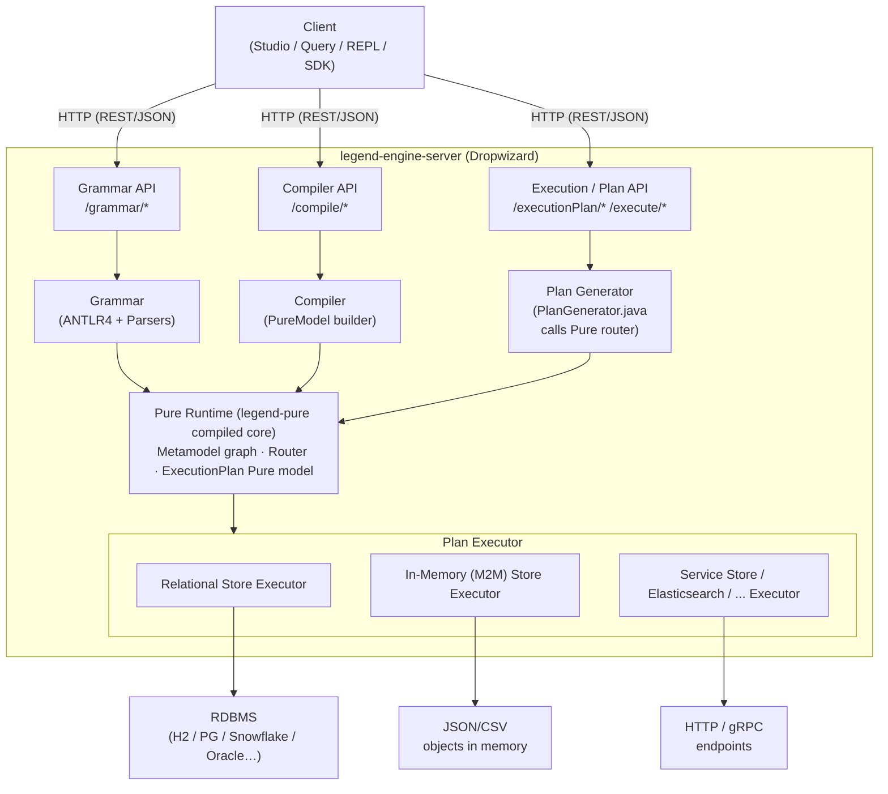
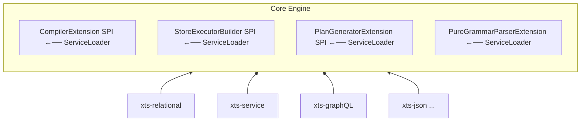
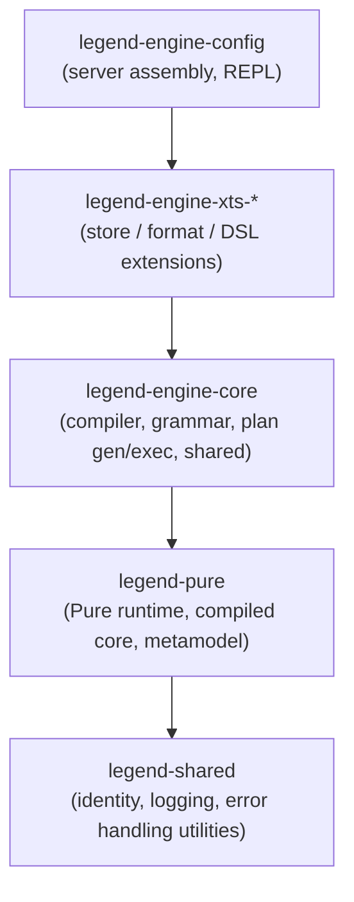

# Legend Engine — Architecture Overview

> **Related docs:** [Module Reference](../reference/modules.md) | [Key Java Areas](key-java-areas.md) | [Key Pure Areas](key-pure-areas.md)  
> **Note:** For Pure language fundamentals (types, functions, metamodel) see the `legend-pure` documentation.

> **legend-pure prerequisite:** [Architecture Overview](https://github.com/finos/legend-pure/blob/main/docs/architecture/overview.md)
> covers the M4/M3/M2/M1 metamodel stack and the full Legend stack position diagram that this
> document builds on. Read that first if you are new to the Pure type system.

---

## 1. What Is Legend Engine?

Legend Engine is the **execution backbone of the Legend platform**. Given a Pure function (a query),
a Mapping (which describes how to project domain classes onto a physical store), and a Runtime
(which provides live connection details), it:

1. **Parses** the textual (grammar) representation of models, mappings, runtimes, and functions into
   a JSON protocol.
2. **Compiles** the protocol into an in-memory Pure graph (the `PureModel`).
3. **Plans** how to execute the function: it routes sub-expressions to stores, generates SQL / query
   fragments, and assembles an `ExecutionPlan` tree.
4. **Executes** the plan: it connects to databases or services, streams results back, and serialises
   them to JSON/CSV/Arrow/etc.

It is packaged as a **Dropwizard HTTP server** and exposes a REST/Swagger API used by Legend Studio,
Legend Query, Legend REPL, and any custom client.

---

## 2. High-Level Component Map

---

## 3. The Five Core Pipelines

### 3.1 Grammar ↔ Protocol Pipeline

**Entry:** `POST /api/pure/v1/grammar/transformGrammarToJson`  
**Java:** `PureGrammarParser` → section parsers (ANTLR4) → `PureModelContextData` (Jackson-serialisable POJOs)  
**Direction also works in reverse:** `PureModelContextData` → `PureGrammarComposer`  

This pipeline converts human-readable Legend grammar into a versioned JSON protocol and back.
It is the bridge between the text-based IDE and the rest of the engine.

### 3.2 Compilation Pipeline

**Entry:** `POST /api/pure/v1/compilation/compile`  
**Java:** `PureModel` constructor (in `legend-engine-language-pure-compiler`) loads `PureModelContextData`,
walks each element through a multi-pass compiler (pre-requisites → first-pass type registration →
second-pass body compilation), producing a fully-resolved Pure metamodel graph backed by the
legend-pure runtime.

### 3.3 Execution Plan Generation Pipeline

**Entry:** `POST /api/pure/v1/executionPlan/generate`  
**Java → Pure → Java:**

1. `PlanGenerator.generateExecutionPlan(...)` calls into the Pure interpreter.
2. The Pure `meta::pure::router::routeFunction` function analyses the lambda and dispatches each
   sub-expression to the appropriate `StoreContract`.
3. Each store contract returns a Pure `ExecutionPlan` tree.
4. `PlanTransformer` implementations (e.g. `JavaPlatformBinder`) post-process the plan tree,
   adding Java source code for platform-native execution nodes.
5. The plan is serialised to JSON (`clientVersion`-aware protocol transformers).

### 3.4 Plan Execution Pipeline

**Entry:** `POST /api/pure/v1/execution/execute`  (or via Service execution)  
**Java:** `PlanExecutor.execute(...)` walks the `ExecutionPlan` tree via `ExecutionNodeExecutor`.
Each node type (`SQLExecutionNode`, `InMemoryGraphFetchExecutionNode`, etc.) is handled by a
registered `StoreExecutor`. Results are streamed using `Result` / `StreamingResult` objects.

### 3.5 Service Execution Pipeline

**Entry:** `POST /api/pure/v1/execution/executeStrategic` or a deployed service endpoint  
**Java:** `ServiceModelingApi` → compiles the service's Pure function inline → generates a plan
→ executes it. This is the path used by deployed Legend Services.

---

## 4. Extension Architecture

Legend Engine is **designed for extension**. New stores, external formats, function activators,
and grammar sections can all be added without modifying core modules.

Each `xts-*` (extension) module registers implementations via Java's `ServiceLoader` mechanism
(files under `META-INF/services/`) and via Pure's `meta::pure::extension::Extension` class.

The Pure `Extension` class aggregates:

- `availableStores` — `StoreContract` instances (routing + plan-generation hooks)
- `availableExternalFormats` — `ExternalFormatContract` instances
- `availableFeatures` — feature-level extensions (e.g. TDS→Relation)
- `availablePlatformBindings` — Java platform code-generation bindings

---

## 5. Module Dependency Layers

Higher layers depend on lower layers; extensions (`xts-*`) depend only on `legend-engine-core`
interfaces — they do **not** depend on each other (with a few tightly-coupled exceptions such as
`xts-relationalStore` being used by some `xts-*` modules for their relational test harness).

> **Compiled vs interpreted execution mode:**
> `legend-pure` supports two execution modes for Pure functions: a *compiled* mode where Pure
> functions are pre-translated to Java bytecode at build time (fast; used in production), and an
> *interpreted* mode where the Pure AST is tree-walked at runtime (flexible; used in the Pure IDE
> and for rapid development feedback). The `legend-engine` production server always runs in
> **compiled mode** — the `legend-engine-pure-platform-*-java` and
> `legend-engine-pure-runtime-java-extension-compiled-*` modules contain the pre-generated Java
> that makes this possible. The interpreted mode is available in the same server but is only
> activated for the Pure IDE path and in test harnesses that require it.
> For a description of the build pipeline that produces the compiled artifacts, see
> [Build Extensions Guide](../guides/build-extensions.md) (forthcoming).
> For the `legend-pure` description of both modes see the
> [legend-pure Architecture Overview](https://github.com/finos/legend-pure/blob/main/docs/architecture/overview.md).

---

## 6. Key Data Structures

| Structure | Type | Description |
|-----------|------|-------------|
| `PureModelContextData` | Java POJO (protocol) | Serialised model snapshot: list of `PackageableElement` POJOs |
| `PureModel` | Java class | Compiled in-memory Pure graph; wraps the Pure runtime's `ModelRepository` |
| `ExecutionPlan` (Pure) | Pure Class | Tree of `ExecutionNode` objects produced by the router/planner |
| `SingleExecutionPlan` | Java POJO (protocol) | JSON-serialisable form of the Pure execution plan |
| `ExecutionState` | Java class | Mutable bag of state threaded through the executor (variables, result caches) |
| `Result` / `StreamingResult` | Java class | Lazy result wrapper returned by each `StoreExecutor` |
| `Extension` | Pure Class | Registry of all active store/format/feature plug-ins; threaded everywhere |

---

## 7. Request Tracing

Every HTTP request generates a trace using OpenTracing (`io.opentracing`). The active tracer
(Zipkin-compatible by default) is configured in the server YAML. Span names match the method
being executed (`Generate Plan`, `Compile`, `Execute SQL`, etc.).

To trace locally: start Zipkin (`docker run -p 9411:9411 openzipkin/zipkin`) and configure
`tracingConfig` in the server JSON config.

---

## 8. Further Reading

- [Module Reference](../reference/modules.md) — every module explained
- [Key Java Areas](key-java-areas.md) — deep dives into Java subsystems
- [Key Pure Areas](key-pure-areas.md) — deep dives into Pure subsystems
- [Router and Pure-to-SQL Pipeline](router-and-pure-to-sql.md) — deep dive into routing, Pure-to-SQL query translation, dialect extension, and SQL text generation
- [User-Facing Functionality](../user-facing-functionality.md) — product-level description of all Legend Engine capabilities
- `legend-engine-config/legend-engine-server/legend-engine-server-http-server/src/main/java/org/finos/legend/engine/server/Server.java` — main wiring point
