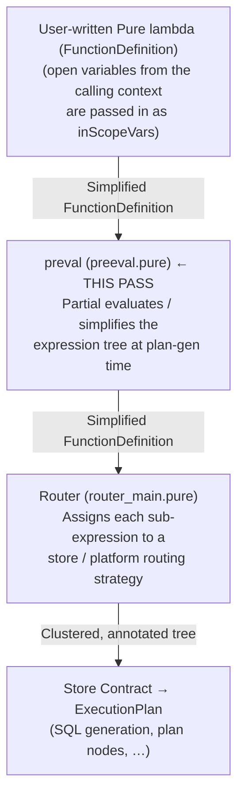

# Pre-Evaluation (`preeval`) in Legend Engine

> **Related docs:**
> [Architecture Overview](overview.md) | [Router and Pure-to-SQL](router-and-pure-to-sql.md) |
> [Key Pure Areas](key-pure-areas.md) | [Execution Plans](execution-plans.md)

---

## 1. What Is Pre-Evaluation?

**Pre-evaluation** (called `preval` in the codebase) is a compile-time / plan-time **AST
simplification and partial-evaluation pass** that runs on a Pure `FunctionDefinition` (usually a
lambda) **before** the router or execution-plan generator sees it.

Its job is to reduce a Pure expression tree to the simplest possible form by performing
transformations like:

- Inlining all constant values that are already known at plan-generation time.
- Evaluating sub-expressions that have no remaining free variables.
- Simplifying control-flow constructs whose conditions can be resolved statically (e.g. folding a
  known-`true` `if` branch, short-circuiting `and`/`or`).
- Eliminating redundant intermediate `let` variables.
- Expanding `map`, `fold`, and `concatenate` calls whose inputs are fully concrete.
- Inlining single-expression helper functions whose bodies can be substituted in-place.

The result is a semantically equivalent but structurally simpler "normalized" expression tree
that the router, plan generator, and SQL pipeline can work with more easily.

---

## 2. Where It Lives

| Artefact | Path |
|---|---|
| Core implementation | `legend-engine-core/legend-engine-core-pure/legend-engine-pure-code-compiled-core/src/main/resources/core/pure/router/preeval/preeval.pure` |
| Test suite | `…/core/pure/router/preeval/tests.pure` |
| Router extension hook | `…/core/pure/router/extension/router_extension.pure` — `RouterExtension.shouldStopPreeval` |
| Relational stop hook | `…/core_relational/relational/contract/storeContract.pure` — `shouldStopPreeval` |
| Elasticsearch stop hook | `…/core_elasticsearch_seven_metamodel/extensions/store_contract.pure` — `shouldStopPreeval` |
| Java entry point (SQL) | `legend-engine-xts-sql/…/SQLExecutor.java` — calls `core_pure_router_preeval_preeval.Root_meta_pure_router_preeval_preval_…` |

---

## 3. How It Fits in the Overall Pipeline



Pre-eval runs **before** routing.  It is not a runtime evaluator — it never calls a database or a
live service.  All simplification happens inside the Pure metamodel.

---

## 4. Key Types

### `State`  (`meta::pure::router::preeval::State`)

Carries all context needed during a single preval traversal:

| Field | Purpose |
|---|---|
| `inScopeVars` | Variables whose values are already known (as `InstanceValue`s). These are substituted in-place when the variable is referenced. |
| `rollingInScopeVars` | Accumulates `let`-bound variables as the expression sequence is scanned, so later expressions in the same sequence can use them. |
| `inScopeTypeParams` | Generic-type parameter bindings used to resolve parameterised return types during inlining. |
| `shouldInlineFxn` | A predicate that decides whether a called function should be inlined (body substituted). Default: inline any non-native function unless it is a `shouldStop` function. |
| `stopPreeval` | A predicate that signals "stop here; treat this value as opaque". Contributed by store contracts (see §7). |
| `path` | The stack of `FunctionDefinition` objects currently being inlined — used to detect and prevent infinite recursion. |
| `debug` / `depth` | Debug tracing support. |

### `PrevalWrapper<T>`

The return type of every internal traversal function.  It boxes a potentially-simplified value
together with metadata:

| Field | Meaning |
|---|---|
| `value` | The (possibly simplified) AST node. |
| `canPreval` | Whether this node and all its children are "pure" enough to be fully evaluated if needed. |
| `openVars` | Variable names in this sub-expression that are still free (not in scope). |
| `modified` | Whether any simplification actually happened in this sub-tree. |

---

## 5. Public API

All public entry points live in `meta::pure::router::preeval`.

```pure
// Simplify a full FunctionDefinition; uses no extra scope.
preval<T>(f : FunctionDefinition<T>[1],
          extensions : Extension[*]) : FunctionDefinition<T>[1]

// Same, with an explicit DebugContext.
preval<T>(f : FunctionDefinition<T>[1],
          extensions : Extension[*],
          debug : DebugContext[1]) : FunctionDefinition<T>[1]

// Simplify with caller-provided variables already in scope.
preval(f           : FunctionDefinition<Any>[1],
       vars        : Map<VariableExpression, ValueSpecification>[1],
       inScopeVars : Map<String, List<Any>>[1],
       extensions  : Extension[*]) : PrevalWrapper<FunctionDefinition<Any>>[1]

// Simplify a single FunctionExpression node (used by the service extension).
preval(fe          : FunctionExpression[1],
       inScopeVars : Map<String, List<Any>>[1],
       extensions  : Extension[*],
       debug       : DebugContext[1]) : ValueSpecification[1]
```

All overloads ultimately delegate to `prevalInternal`, which recurses over the AST.

---

## 6. What the Pass Actually Does — Transformation Rules

The traversal is a structural recursion over the Pure metamodel with the following rules applied at
each node type:

### 6.1 `LambdaFunction` / `FunctionDefinition`

- The function's open variables are merged with the caller's `inScopeVars` to form the local scope.
- Each expression in the body is processed in sequence; `let` bindings are added to the rolling scope as they are encountered so subsequent expressions can benefit from them.
- `let` variables that are safe to inline (their right-hand side is a concrete `InstanceValue` with no free variables) are **substituted** at every use site and the `let` expression itself is dropped.
- The final `openVariables` list on the lambda is updated to reflect only the variables that remain free after simplification.

### 6.2 `VariableExpression`

- If the variable name is present in `inScopeVars`, the variable reference is replaced by the stored value and `prevalInternal` is called again on that value.
- If the variable is not in scope it is left as-is and recorded as an open variable.

### 6.3 `InstanceValue`

- Sub-values (nested `InstanceValue`s, `LambdaFunction`s inside column specs, etc.) are processed recursively.
- Multiplicity and generic type are recomputed from the simplified contents.

### 6.4 `FunctionExpression` — special cases

Several specific function calls receive dedicated handling before the generic path:

| Function | Special Behaviour |
|---|---|
| `if(cond, trueExpr, falseExpr)` | If `cond` simplifies to a concrete `Boolean`, the winning branch is substituted and the other branch is **never evaluated** (guards against `toOne()` errors in the dead branch). |
| `and(a, b)` | Short-circuits: if `a` simplifies to `false`, the whole expression becomes `false`; if `b` simplifies to `false`, the whole expression becomes `false`. |
| `or(a, b)` | Short-circuits: if `a` simplifies to `true`, the whole expression becomes `true`; if `b` simplifies to `true`, the whole expression becomes `true`. |
| `filter(collection, lambda)` | If the lambda body simplifies to a constant `false`, the whole filter is replaced by the empty collection (`PureZero`). If it simplifies to a constant `true`, the filter is removed and the input collection is returned directly. |
| `map(collection, lambda)` | If all inputs are concrete `InstanceValue`s, the lambda is applied to each element in-place, eliminating the `map` entirely. |
| `fold(collection, lambda, initial)` | Same: if all inputs are concrete, the fold is unrolled. |
| `concatenate(a, b)` | If one side is a `PureZero` (empty), the result is just the other side. If both sides are known concrete collections, they are merged into a single `InstanceValue`. |
| `cast(value, type)` | Handles `cast` of an empty collection specially (compiled mode quirk). |
| `toOne(x)` / `toOneMany(x)` | Removed when multiplicity analysis can prove the input already satisfies the constraint. |
| `eval(lambda, …)` | If the lambda is a concrete `FunctionDefinition` with a single-expression body, it is inlined just like a regular function call. |
| `TDSRow.columns(…)` | Resolved by a schema-inference helper (`resolveSchema`) rather than by full re-activation, because some TDS functions are not implemented in the Pure interpreter. |

### 6.5 Function Inlining

If a called function `f` satisfies `shouldInline(f, state)`:

- `f` must be a `FunctionDefinition` (not a `NativeFunction`).
- `f` must have exactly one expression in its body.
- `f` must not be a milestoning-generated qualified property.
- `f` must not already appear in the call-path stack (cycle prevention).
- The extension's `shouldInlineFxn` predicate must agree.

When inlining is allowed, the function's parameter names are bound to the (already-simplified)
argument values and the body expression is processed with the enriched scope.

### 6.6 Full Re-activation

If none of the special cases above apply **and** all parameter values are already concrete
`InstanceValue`s with no remaining free variables, the expression is **fully re-activated**
(executed in-memory via the Pure interpreter) and the result is stored as an `InstanceValue`.
This is the mechanism that evaluates things like `'hello' + ' world'` → `'hello world'` or
`%2017-01-01->adjust(1, DurationUnit.DAYS)` → `%2017-01-02`.

---

## 7. The `stopPreeval` Extension Point

Not every value should be inlined.  Store-specific types — `Database` objects, live `Connection`s,
`Runtime` references, `Mapping` objects, etc. — must be preserved opaquely so the router and plan
generator can recognise them.

The `RouterExtension.shouldStopPreeval` hook lets each store contract contribute a predicate that
says "treat this value as a leaf; do not recurse into it".

**Default stop list** (in `preeval.pure`):

```text
String, Float, Decimal, Enum, StrictDate, LatestDate, Integer, Boolean,
DateTime, SortInformation, Enumeration<Any>, Class<Any>, Pair<Any,Any>,
Property<Any,Any|*>, Type, Path<Any,Any|*>, Mapping, PackageableRuntime,
Runtime, Connection, ConnectionStore, ExecutionContext, TDSColumn,
TdsOlapRank, TdsOlapAggregation, AlloySerializationConfig,
ExternalFormatExternalizeConfig, ExternalFormatInternalizeConfig,
AggColSpecArray, FuncColSpecArray, …plus any "simple" class whose
properties are all primitive types.
```

**Relational store** additionally stops on `Database` objects.

**Elasticsearch store** stops on its own index-store types.

**Lineage analytics** adds a custom extension that also stops on
`SimpleFunctionExpression` nodes whose `func` is `parseDate` or `cast`, preventing
those from being collapsed and hiding the lineage information.

---

## 8. Where `preval` Is Called in Practice

### 8.1 Relational Milestoning Tests

When a lambda captures a `businessDate` variable:

```pure
let busDate = %2015-10-16;
execute(
  {| Product.all($busDate)
       ->project([p | $p.classification($p.businessDate).exchange(%2019-1-1).name],
                 ['name', 'classificationType'])
  }->meta::pure::router::preeval::preval(relationalExtensions()),
  milestoningmap, testRuntime(), relationalExtensions()
)
```

`preval` substitutes `$busDate` with the literal date `%2015-10-16` and inlines the
`$p.businessDate` derived property call, so the router sees a fully resolved milestoning
expression and can generate the correct temporal SQL join conditions.

### 8.2 SQL Query API (`SQLExecutor.java`)

The SQL-over-Legend endpoint constructs a `LambdaFunction` from the incoming SQL query via the
`sqlToPure` transformation.  Before handing it to the plan generator it calls `preval`:

```java
FunctionDefinition<?> func2 =
    core_pure_router_preeval_preeval
        .Root_meta_pure_router_preeval_preval_FunctionDefinition_1__Extension_MANY__FunctionDefinition_1_(
            func, routerExtensions.apply(pureModel), pureModel.getExecutionSupport());
Root_meta_pure_executionPlan_ExecutionPlan plan =
    PlanGenerator.generateExecutionPlanAsPure(func2, …);
```

### 8.3 SQL-to-Pure Transformation (Pure side)

The `sqlToPure` function in `core_external_query_sql` accepts an optional `preval` flag; when
`true` it calls `preval` on the assembled lambda before returning:

```pure
let pureFunc = if($preval,
  | $lambda->meta::pure::router::preeval::preval($extensions),
  | $lambda);
```

The `getPlanResult` path always calls `preval` unconditionally:

```pure
let lambda = $context.lambda($context.scopeWithFrom->isTrue())
               ->meta::pure::router::preeval::preval($extensions);
```

### 8.4 Service Extension (During Routing)

When the router encounters a `from(…, SingleExecutionParameters)` expression, the service
extension resolves the `SingleExecutionParameters` argument by calling `preval` on it:

```pure
f : FunctionExpression[1] |
    let r = $f->meta::pure::router::preeval::preval($inScopeVars, $extensions, $debug);
    $r->reactivate($inScopeVars);
```

This lets parameters that reference helper functions or variables be resolved before the router
tries to extract the mapping and runtime.

### 8.5 Lineage Analytics

The lineage computation calls `preval` with a custom extension that prevents further collapsing of
`parseDate` / `cast` calls, so that `from(…, mapping, runtime)` expressions remain recognisable
after simplification:

```pure
let extensionsWithL = $extensions->concatenate(lineagePreEvalExtension());
$f->meta::pure::router::preeval::preval($extensionsWithL)
  .expressionSequence
  ->filter(x | $x->instanceOf(FunctionExpression))
  ->map(seq | $seq->findExpressionsForFunctionInValueSpecification([from_…, withMapping_…]))
```

---

## 9. Worked Examples

The test suite in `tests.pure` provides the clearest examples.  Each test defines an `input`
lambda and an `expected` lambda and asserts that `preval(input) == expected` (via a grammar
round-trip comparison).

### Constant folding and variable elimination

```pure
// Input
{| let x = 'hello' + ' world'; $x + (' ' + (5->toString()));}

// After preval
{| 'hello world 5';}
```

### Mixed: known variable + runtime value

```pure
let value = 'hello world';   // known at plan-gen time

// Input
{| let y = $value->substring(0, 5); }

// After preval  ($value substituted, substring evaluated)
{| 'hello' }
```

### `if` with statically-known condition

```pure
// Input
{| if(false, | []->toOne(), | 'hello ' + 'world') }

// After preval  (dead branch removed; no runtime toOne() error)
{| 'hello world' }
```

### `and` / `or` short-circuiting

```pure
// Input: right-hand side is runtime (today() is not constant)
{| (1 == 1) && (today() > %2018-01-01) }

// After preval  (left becomes true, so the and is the right-hand side)
{| today() > %2018-01-01 }

// Input
{| (1 == 1) || (today() > %2018-01-01) }

// After preval  (left is true → whole or is true)
{| true }
```

### `map` expansion on a concrete collection

```pure
let c = 3;

// Input
{| range($c)->map(x | $x + 1)->map(index | 'i' + $index->toString()) }

// After preval  (range(3) evaluated, both maps unrolled)
{| ['i1', 'i2', 'i3'] }
```

### `filter` constant-lambda optimisation

```pure
// Input — lambda always returns false
{| Person.all()->filter(p | false) }

// After preval  (filter removed; empty collection returned)
{| [] }
```

---

## 10. Debugging

Pass a `DebugContext(debug=true)` to any `preval` overload.  Each recursive step logs:

- The type and identity of the node being processed.
- Which in-scope and in-scope type-parameter variables are available at that point.
- Whether inlining or full re-activation is taking place.
- The resulting simplified node.
- Elapsed time.

```pure
{| Person.all()->filter(p | $p.age > 18) }
  ->meta::pure::router::preeval::preval(
      meta::relational::extension::relationalExtensions(),
      debug()      // ← enables tracing
    )
```

The function `getPreevalStateWithAdditionalStopInlineFunc` allows callers to construct a
`State` that blocks inlining of specific functions while keeping everything else enabled —
useful for debugging cases where inlining causes unexpected behaviour.

---

## 11. Extension Points Summary

| Hook | Location | Purpose |
|---|---|---|
| `RouterExtension.shouldStopPreeval` | `router_extension.pure` | Add store-specific opaque types. |
| `RouterExtension.shouldStopRouting` (also controls inlining) | `router_extension.pure` | Functions in this list are not inlined by `defaultFunctionInlineStrategy`. |
| `defaultFunctionInlineStrategy` | `preeval.pure` | Built-in inline whitelist (`col`, `mostRecentDayOfWeek`, `previousDayOfWeek`, all non-native non-stop functions). |
| `getPreevalStateWithAdditionalStopInlineFunc` | `preeval.pure` | Programmatically exclude extra functions from inlining without a full extension. |
