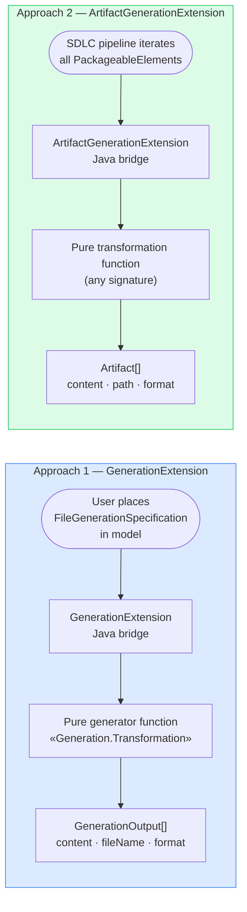
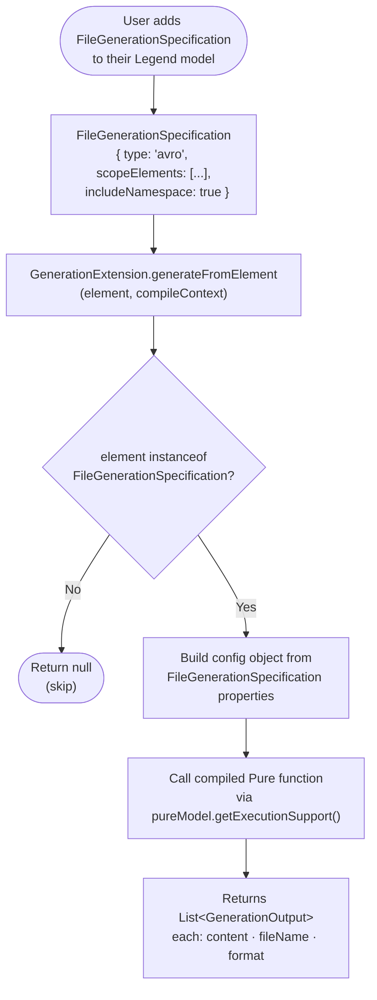
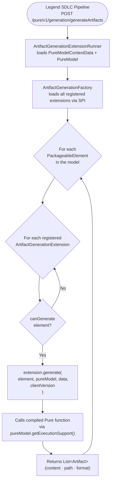
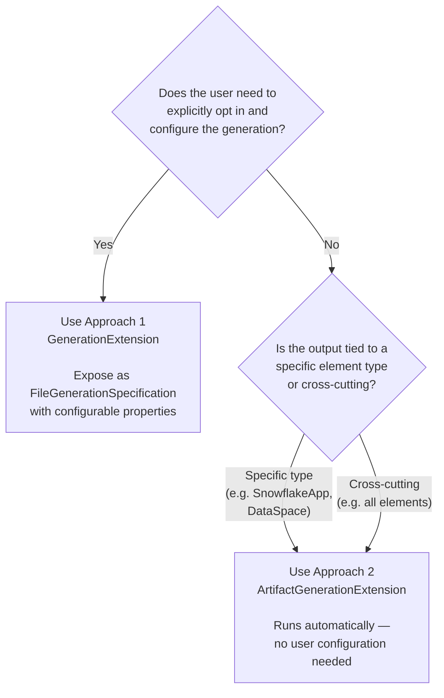

# Pure Build Artifact Generation

Legend Engine provides two mechanisms for generating build artifacts from Pure models.
Both follow the same fundamental pattern — **a Pure function is called with a compiled model as input and produces string content as output** — but they target different use cases and are wired together differently.

---

## Overview



| | Approach 1: `GenerationExtension` | Approach 2: `ArtifactGenerationExtension` |
|---|---|---|
| **Purpose** | User-driven code and schema generation | Automatic static artifact output for model elements |
| **Trigger** | User places a `FileGenerationSpecification` element in the model | Runs automatically for every element where `canGenerate()` returns `true` |
| **Scope** | Classes/packages scoped by the `FileGenerationSpecification` | Any `PackageableElement` — services, classes, mappings, activators, etc. |
| **Pure output type** | Must return `GenerationOutput` (or subtype) | Any type; serialised to `String` in the Java bridge |
| **Java interface** | `GenerationExtension` | `ArtifactGenerationExtension` |
| **Generation stereotype** | `<<Generation.Transformation>>` on the Pure function | Not required |
| **User configuration** | Properties exposed on `FileGenerationSpecification`, self-described via `describeConfiguration()` | Baked into the extension or read directly from the element |
| **Examples** | Avro schema, Protobuf schema, Morphir IR, Java classes | Search index documents, OpenAPI specs, PowerBI artifacts, Snowflake deployment descriptors |

---

## Approach 1: `GenerationExtension` — Code and Schema Generation

Use this when you want users to **explicitly opt in** to generating derived artefacts from their model, with configurable parameters. This is the right choice for format conversions such as generating Avro schemas from Pure classes, or Morphir IR from Pure functions.

### How it works



### Key Pure types

```pure
// Base config — your Pure config class must extend this
Class meta::pure::generation::metamodel::GenerationConfiguration
{
    class:                String[0..1];         // path to the target element
    package:              String[0..1];         // path to target package
    scopeElements:        PackageableElement[*];
    generationOutputPath: String[0..1];
}

// Output — your Pure generator function must return this (or a subtype)
Class meta::pure::generation::metamodel::GenerationOutput
{
    content:  String[1];    // the artifact content as a string
    fileName: String[1];    // output file name
    format:   String[0..1]; // e.g. "json", "avsc", "proto"
}
```

### Generation stereotypes

The `Generation` profile provides two stereotypes for annotating Pure elements:

```pure
Profile meta::pure::generation::metamodel::Generation
{
    stereotypes: [Transformation, Configuration];
}
```

- **`<<Generation.Transformation>>`** — marks a Pure function as the generation entry point
- **`<<Generation.Configuration>>`** — marks a Pure function that describes the configuration parameters

### Key Java interface

```java
// legend-engine-xts-generation / legend-engine-external-shared
public interface GenerationExtension extends LegendGenerationExtension {
    String getLabel();
    String getKey();          // matches the type declared in FileGenerationSpecification
    GenerationMode getMode(); // GenerationMode.Schema or GenerationMode.Code

    GenerationConfigurationDescription getGenerationDescription();
    Root_meta_pure_generation_metamodel_GenerationConfiguration defaultConfig(CompileContext context);

    // Called for each FileGenerationSpecification element in the model
    List<Root_meta_pure_generation_metamodel_GenerationOutput>
        generateFromElement(PackageableElement element, CompileContext compileContext);
}
```

### Step-by-step: implementing a new extension

#### Step 1 — Write the Pure config class

```pure
import meta::pure::generation::metamodel::*;

// Config class — extend GenerationConfiguration
Class meta::my::format::generation::MyFormatConfig extends GenerationConfiguration
{
    {doc.doc = 'Whether to include namespace in output'}
    includeNamespace: Boolean[0..1];

    {doc.doc = 'Target format version'}
    formatVersion: String[0..1];
}

// Output subtype (optional but conventional)
Class meta::my::format::generation::MyFormatOutput extends GenerationOutput {}

// Default config factory
function meta::my::format::generation::defaultConfig(): MyFormatConfig[1]
{
    ^MyFormatConfig(includeNamespace = true, formatVersion = '1.0')
}

// Self-description for UI/API — uses the framework helper
function <<Generation.Configuration>>
    meta::my::format::generation::describeConfiguration(): GenerationParameter[*]
{
    meta::pure::generation::describeConfiguration(
        MyFormatConfig,
        defaultConfig__MyFormatConfig_1_,
        []
    )
}
```

#### Step 2 — Write the Pure generator function

```pure
// Mark with <<Generation.Transformation>> so the framework can discover it
function <<Generation.Transformation>>
    meta::my::format::generation::generateMyFormat(
        config: MyFormatConfig[1]
    ): MyFormatOutput[*]
{
    let targetClass = forgivingPathToElement($config.class->toOne())
                          ->toOne()->cast(@Class<Any>);
    ^MyFormatOutput(
        content  = $targetClass->transformToMyFormat($config),
        fileName = $targetClass.name->toOne() + '.myformat',
        format   = 'myformat'
    );
}
```

#### Step 3 — Write the Java bridge

```java
public class MyFormatGenerationExtension implements GenerationExtension {

    @Override public String getLabel() { return "MyFormat"; }
    @Override public String getKey()   { return "myformat"; } // must match FileGenerationSpecification type
    @Override public GenerationMode getMode() { return GenerationMode.Schema; }

    @Override
    public Root_meta_pure_generation_metamodel_GenerationConfiguration defaultConfig(
            CompileContext context) {
        return core_my_format_generation
            .Root_meta_my_format_generation_defaultConfig__MyFormatConfig_1_(
                context.pureModel.getExecutionSupport());
    }

    @Override
    public GenerationConfigurationDescription getGenerationDescription() {
        return new FileGenerationDescription() {
            @Override public String getLabel() { return MyFormatGenerationExtension.this.getLabel(); }
            @Override public String getKey()   { return MyFormatGenerationExtension.this.getKey(); }

            @Override
            public List<GenerationProperty> getProperties(PureModel pureModel) {
                return FileGenerationDescription.extractGenerationProperties(
                    core_my_format_generation
                        .Root_meta_my_format_generation_describeConfiguration__GenerationParameter_MANY_(
                            pureModel.getExecutionSupport()));
            }
        };
    }

    @Override
    public List<Root_meta_pure_generation_metamodel_GenerationOutput> generateFromElement(
            PackageableElement element, CompileContext compileContext) {
        if (element instanceof FileGenerationSpecification) {
            Root_meta_my_format_generation_MyFormatConfig config =
                MyFormatConfigBuilder.build(
                    (FileGenerationSpecification) element, compileContext.pureModel);
            RichIterable<? extends Root_meta_pure_generation_metamodel_GenerationOutput> output =
                core_my_format_generation
                    .Root_meta_my_format_generation_generateMyFormat_MyFormatConfig_1__MyFormatOutput_MANY_(
                        config,
                        compileContext.pureModel.getExecutionSupport());
            return new ArrayList<>(output.toList());
        }
        return null;
    }
}
```

#### Step 4 — Register via SPI

```
# src/main/resources/META-INF/services/
# org.finos.legend.engine.external.shared.format.extension.GenerationExtension

com.example.MyFormatGenerationExtension
```

#### Step 5 — Use it in a Legend model

```pure
###FileGeneration
MyFormat my::model::MyFormatOutput
{
    scopeElements: [ my::model::domain ];
    includeNamespace: true;
    formatVersion: '2.0';
}

###GenerationSpecification
GenerationSpecification my::model::MyGenSpec
{
    generationNodes:
    [
        { id: myFormatOutput; generationElement: my::model::MyFormatOutput; }
    ];
}
```

### Real examples

#### Avro schema generation (`GenerationMode.Schema`)

Generates `.avsc` Avro schema files from Pure classes.

**Pure config and generator** (`core_external_format_avro/transformation/integration.pure`):

```pure
Class meta::external::format::avro::generation::AvroConfig extends GenerationConfiguration
{
    {doc.doc = 'Adds namespace derived from package to Avro schema.'}
    includeNamespace: Boolean[0..1];

    {doc.doc = 'Includes properties from super types.'}
    includeSuperTypes: Boolean[0..1];
    // ...
}

Class meta::external::format::avro::generation::AvroOutput extends GenerationOutput {}

function <<access.private, Generation.Transformation>>
    meta::external::format::avro::generation::internal_transform(
        input: AvroConfig[1]
    ): AvroOutput[*]
{
    assertFalse($input.class->isEmpty(), 'a class must be provided');
    let element = forgivingPathToElement($input.class->toOne())->toOne()->cast(@Class<Any>);
    $input->generateAvroFromPure($element);
}
```

**Java bridge** (`AvroGenerationExtension.java`):

```java
@Override
public GenerationMode getMode() { return GenerationMode.Schema; }

@Override
public List<Root_meta_pure_generation_metamodel_GenerationOutput> generateFromElement(
        PackageableElement element, CompileContext compileContext) {
    if (element instanceof FileGenerationSpecification) {
        AvroGenerationConfig config =
            AvroGenerationConfigFromFileGenerationSpecificationBuilder.build(
                (FileGenerationSpecification) element);
        RichIterable<? extends Root_meta_pure_generation_metamodel_GenerationOutput> output =
            core_external_format_avro_transformation_transformation_avroSchemaGenerator
                .Root_meta_external_format_avro_generation_generateAvroFromPureWithScope_AvroConfig_1__AvroOutput_MANY_(
                    config.process(compileContext.pureModel),
                    compileContext.pureModel.getExecutionSupport());
        return new ArrayList<>(output.toList());
    }
    return null;
}
```

#### Morphir IR generation (`GenerationMode.Code`)

Generates Morphir intermediate representation from Pure function definitions.

**Pure generator** (`core_external_language_morphir/transformation/integration.pure`):

```pure
Class meta::external::language::morphir::generation::MorphirConfig extends GenerationConfiguration {}

function meta::external::language::morphir::generation::generateMorphirIRFromPureWithScope(
    morphirConfig: MorphirConfig[1]
): GenerationOutput[*]
{
    let scopeElements = $morphirConfig.allPackageScopeElements()
        ->filter(p | $p->instanceOf(FunctionDefinition))
        ->cast(@FunctionDefinition<Any>);
    let content = $scopeElements
        ->map(c | meta::external::language::morphir::generation::generateMorphirIRFromPure($c))
        ->joinStrings('\n\n');
    ^GenerationOutput(content=$content, fileName='morphir-ir.json', format='json');
}
```

**Java bridge** (`MorphirGenerationExtension.java`):

```java
@Override
public GenerationMode getMode() { return GenerationMode.Code; }
```

Other existing implementations:
- **Protobuf** — `ModelToProtobufDataConfiguration` + `pureToProtobuf()` → `.proto` schema files
- **JSON Schema** — `JSONSchemaConfig` + `transform()` → `.json` schema files
- **Java code generation** — `JavaCodeGenerationConfig` + `generateJava()` → `.java` source files

---

## Approach 2: `ArtifactGenerationExtension` — Static Artifact Output

Use this when you want artifacts to be generated **automatically and transparently** for every matching element in the model, without the user needing to add any extra specification. This is the right choice for cross-cutting outputs that should always be present — such as search index documents that cover every element, or deployment descriptors attached to specific activator types.

### How it works



### Key types

**`ArtifactGenerationExtension`** — the Java interface you implement:

```java
// legend-engine-xts-generation / legend-engine-language-pure-dsl-generation
public interface ArtifactGenerationExtension {
    String getKey();                       // unique key, matches ^[a-zA-Z_0-9\-]+$
    boolean canGenerate(PackageableElement element);
    List<Artifact> generate(PackageableElement element,
                            PureModel pureModel,
                            PureModelContextData data,
                            String clientVersion);
}
```

**`Artifact`** — the output unit:

```java
public class Artifact {
    public String content;   // the string content of the artifact
    public String path;      // output file path/name
    public String format;    // e.g. "json", "yaml", "xml"
}
```

### Registration

Extensions are discovered via Java SPI:

```
src/main/resources/META-INF/services/
  org.finos.legend.engine.language.pure.dsl.generation.extension.ArtifactGenerationExtension
```

Extension keys must be unique and match `^[a-zA-Z_0-9\-]+$`. Duplicate or invalid keys cause a startup failure.

### Step-by-step: implementing a new extension

#### Step 1 — Write the Pure function

The function can accept any compiled model type and return any type. Serialisation to a string is done in the Java bridge.

```pure
// my/package/generation/myGenerator.pure
import meta::pure::metamodel::*;

function my::package::generation::buildMyArtifact(
    element: PackageableElement[1],
    config:  my::package::generation::MyConfig[1]
): my::package::generation::MyDocument[1]
{
    ^my::package::generation::MyDocument(
        name = $element->elementToPath()
        // ... populate fields from model
    )
}
```

#### Step 2 — Write the Java bridge

```java
public class MyArtifactGenerationExtension implements ArtifactGenerationExtension {

    @Override
    public String getKey() { return "my-artifact"; }

    @Override
    public boolean canGenerate(PackageableElement element) {
        // Return true for the element types this extension handles.
        // Return true for all elements to generate for every element in the model.
        return element instanceof Root_my_package_MyTargetType;
    }

    @Override
    public List<Artifact> generate(PackageableElement element, PureModel pureModel,
            PureModelContextData data, String clientVersion) {
        Root_my_package_generation_MyDocument doc =
            core_my_package_generation_myGenerator
                .Root_my_package_generation_buildMyArtifact_PackageableElement_1__MyConfig_1__MyDocument_1_(
                    element,
                    buildConfig(data),
                    pureModel.getExecutionSupport());

        String json = core_pure_protocol_protocol
            .Root_meta_alloy_metadataServer_alloyToJSON_Any_1__String_1_(
                doc, pureModel.getExecutionSupport());

        return Collections.singletonList(new Artifact(json, "myArtifact.json", "json"));
    }
}
```

#### Step 3 — Register via SPI

```
# src/main/resources/META-INF/services/
# org.finos.legend.engine.language.pure.dsl.generation.extension.ArtifactGenerationExtension

com.example.MyArtifactGenerationExtension
```

### Real examples

#### Search document generation — every element

Generates a search index document for **every** `PackageableElement` in the model (except in-progress services), enabling full-text search across the entire model estate.

**Pure function** (`core_analytics_search/trans.pure`):

```pure
// One document per element — dispatches on element type
function meta::analytics::search::transformation::buildDocument(
    element: PackageableElement[1],
    config:  meta::analytics::search::metamodel::ProjectCoordinates[1]
): meta::analytics::search::metamodel::BaseRootDocument[1]
{
    let document = $element->match([
        d: meta::pure::metamodel::dataSpace::DataSpace[1]  | $d->buildDataSpaceDocument(),
        s: meta::legend::service::metamodel::Service[1]    | $s->buildServiceDocument(),
        c: Class<Any>[1]                                   | $c->buildClassDocument(),
        p: PackageableElement[1]                           | $p->buildDefaultDocument()
    ]);
    ^$document(projectCoordinates = ^ProjectCoordinates(
        groupId    = $config.groupId,
        artifactId = $config.artifactId,
        versionId  = $config.versionId
    ));
}
```

**Java bridge** (`SearchDocumentArtifactGenerationExtension.java`):

```java
@Override
public boolean canGenerate(PackageableElement element) {
    // Generate for everything except services marked as in-progress
    return !((element instanceof Root_meta_legend_service_metamodel_Service)
        && element._stereotypes().anySatisfy(s ->
            s._profile()._name().equals("devStatus")
            && s._profile()._p_stereotypes().anySatisfy(st -> st._value().equals("inProgress"))));
}

@Override
public List<Artifact> generate(PackageableElement element, PureModel pureModel,
        PureModelContextData data, String clientVersion) {
    Root_meta_analytics_search_metamodel_BaseRootDocument document =
        core_analytics_search_trans
            .Root_meta_analytics_search_transformation_buildDocument_PackageableElement_1__ProjectCoordinates_1__BaseRootDocument_1_(
                element, buildProjectCoordinates(data), pureModel.getExecutionSupport());

    String json = core_pure_protocol_protocol
        .Root_meta_alloy_metadataServer_alloyToJSON_Any_1__String_1_(
            document, pureModel.getExecutionSupport());

    return Collections.singletonList(new Artifact(json, FILE_NAME, "json"));
}
```

#### OpenAPI spec generation — Service elements with a profile

Generates an OpenAPI specification for `Service` elements that carry the OpenAPI profile.

```java
@Override
public boolean canGenerate(PackageableElement element) {
    // Only Services that have been opted in via stereotype
    return element instanceof Root_meta_legend_service_metamodel_Service
        && checkIfOpenApiProfile(element);
}
```

#### Snowflake deployment descriptor — SnowflakeApp activators only

```java
@Override
public boolean canGenerate(PackageableElement element) {
    return element instanceof Root_meta_legend_service_metamodel_snowflakeApp_SnowflakeApp;
}
```

Other existing implementations:
- `FunctionActivatorArtifactGenerationExtension` — generates `functionActivatorMetadata.json` for any `FunctionActivator`
- `PowerBIArtifactGenerationExtension` — generates `.pbip` / `.pbir` project files from `DataSpace` elements

---

## Choosing between the two approaches



| Question | → Approach 1 `GenerationExtension` | → Approach 2 `ArtifactGenerationExtension` |
|---|---|---|
| Does the user control what gets generated? | ✅ User places `FileGenerationSpecification` | ❌ Runs automatically |
| Are there user-tunable parameters? | ✅ Properties on `FileGenerationSpecification` | ❌ Configuration is internal |
| Is the output a schema or code file? | ✅ Ideal (Avro, Protobuf, Java, Morphir) | Possible but unusual |
| Should it run for every element automatically? | ❌ | ✅ Ideal (search docs, analytics) |
| Is output tied to a specific activator/deployment type? | ❌ | ✅ Ideal (Snowflake, OpenAPI, PowerBI) |

> **Migration note:** Several `GenerationExtension` implementations (Avro, Protobuf, Morphir) carry a `!!MoveToArtifact!!` label in their `group()` method, indicating planned migration to `ArtifactGenerationExtension` over time.

---

## Source locations

| Component | Path |
|---|---|
| `GenerationExtension` interface | `legend-engine-xts-generation/legend-engine-external-shared/src/main/java/.../format/extension/GenerationExtension.java` |
| `GenerationMode` enum | `legend-engine-xts-generation/legend-engine-external-shared/src/main/java/.../format/extension/GenerationMode.java` |
| Pure `GenerationConfiguration` / `GenerationOutput` metamodel | `legend-engine-xts-generation/legend-engine-language-pure-dsl-generation-pure/src/main/resources/core_generation/generation/generations.pure` |
| Avro example (schema generation) | `legend-engine-xts-avro/legend-engine-xt-avro/src/main/java/.../AvroGenerationExtension.java` |
| Morphir example (code generation) | `legend-engine-xts-morphir/legend-engine-xt-morphir/src/main/java/.../MorphirGenerationExtension.java` |
| `ArtifactGenerationExtension` interface | `legend-engine-xts-generation/legend-engine-language-pure-dsl-generation/src/main/java/.../extension/ArtifactGenerationExtension.java` |
| `Artifact` class | `legend-engine-xts-generation/legend-engine-language-pure-dsl-generation/src/main/java/.../extension/Artifact.java` |
| `ArtifactGenerationFactory` | `legend-engine-xts-generation/legend-engine-xt-artifact-generation-http-api/src/main/java/.../ArtifactGenerationFactory.java` |
| `ArtifactGenerationExtensionApi` (REST endpoint) | `legend-engine-xts-generation/legend-engine-xt-artifact-generation-http-api/src/main/java/.../api/ArtifactGenerationExtensionApi.java` |
| Search document example (all elements) | `legend-engine-xts-analytics/legend-engine-xts-analytics-search/legend-engine-xt-analytics-search-generation/src/main/java/.../SearchDocumentArtifactGenerationExtension.java` |
| OpenAPI example (Service elements) | `legend-engine-xts-openapi/legend-engine-xt-openapi-generation/src/main/java/.../OpenApiArtifactGenerationExtension.java` |
| Snowflake example (SnowflakeApp elements) | `legend-engine-xts-snowflake/legend-engine-xt-snowflake-generator/src/main/java/.../SnowflakeAppArtifactGenerationExtension.java` |
