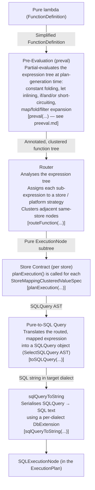
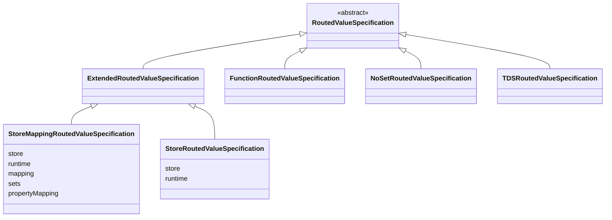
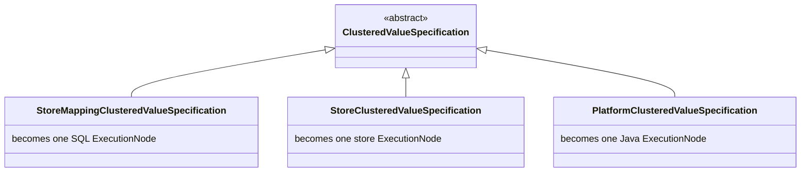
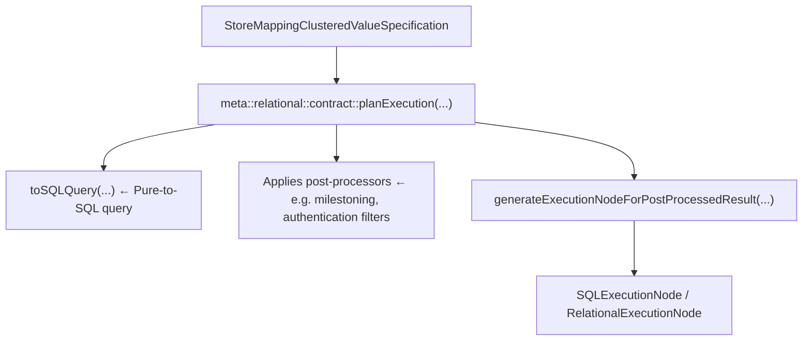
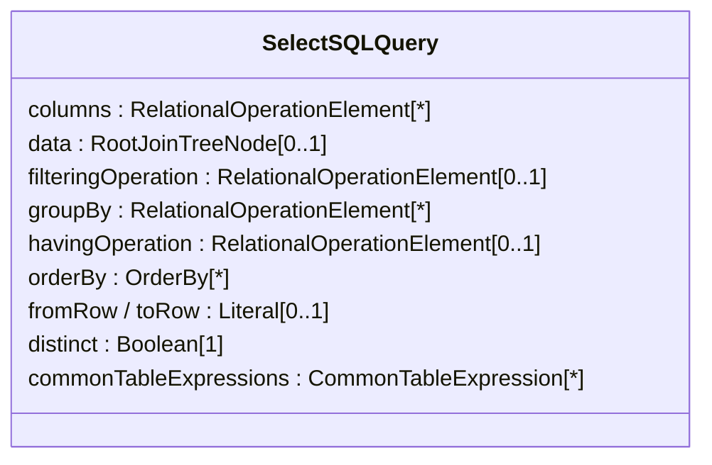
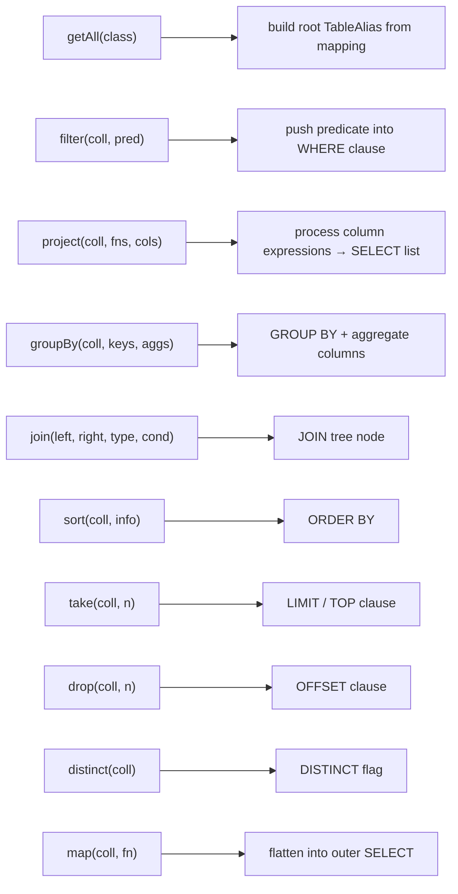
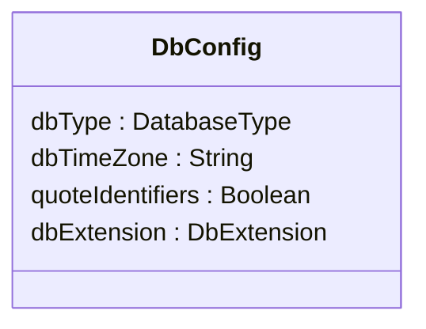

# Router and Pure-to-SQL Pipeline

> **Related docs:**
> [Architecture Overview](overview.md) | [Domain Concepts](domain-concepts.md) |
> [Key Java Areas](key-java-areas.md) | [Key Pure Areas](key-pure-areas.md) |
> [Execution Plans](execution-plans.md) | [Pre-Evaluation (preeval)](preeval.md)

> **legend-pure prerequisite:** To follow the SQL generation examples in this document you will
> need to understand the grammar that feeds the pipeline:
> - [Relational Grammar Reference](https://github.com/finos/legend-pure/blob/main/docs/reference/relational-grammar-reference.md) — `###Relational` syntax: tables, columns, joins, views, filters.
> - [Mapping Grammar Reference — Relational class mapping](https://github.com/finos/legend-pure/blob/main/docs/reference/mapping-grammar-reference.md) — column references, join navigation, and scope within `###Mapping`.

---

## 1. Overview

The **router** and the **Pure-to-SQL pipeline** are the two central components of the Legend
Engine's query-planning stage. Together they form the bridge between a user-written Pure
query expression and a concrete, executable SQL string.



---

## 2. The Router

### 2.1 Purpose

The router's job is to **analyse a Pure `FunctionDefinition` and decide which store (or in-process
execution strategy) is responsible for each sub-expression**. The output is a deeply annotated
version of the original function where every node in the expression tree is wrapped in a typed
"routing decision" object.

### 2.2 Entry Point

```text
Core Pure file: core/pure/router/router_main.pure
Key function:   meta::pure::router::routeFunction(f, exeCtx, extensions, debug)
Java caller:    PlanGenerator.generateExecutionPlan(...)
```

`PlanGenerator` calls this Pure function via the compiled Pure runtime. The result is passed
straight into plan generation.

### 2.3 Routing Strategies

Three strategies exist, implemented as sub-classes of `RoutingStrategy`:

| Strategy | Pure Class | When used |
|---|---|---|
| **Store Mapping** | `StoreMappingRoutingStrategy` | Expressions that navigate a mapped class tree (uses `getAll`, property access, filter, project). Dispatched to a specific `Store` + `Mapping` pair. |
| **Platform** | `PlatformRoutingStrategy` | Pure expressions that can be evaluated in-process (e.g. pure `map`, `filter`, `let` on non-persisted values). Compiled to Java bytecode. |
| **External Format** | `ExternalFormatRoutingStrategy` | `internalize` / `externalize` expressions that convert between Pure objects and bytes using a `Binding`. |

`routeFunction` starts with the `PlatformRoutingStrategy` as the default and transitions to a
`StoreMappingRoutingStrategy` when it encounters a `getAll(Class)` call whose class has a mapping
in scope.

### 2.4 What Routing Does to Each Expression

The router walks the entire expression tree recursively. For each node it:

1. **Determines the active routing strategy** from context (what mapping + runtime is in scope).
2. **Asks the `StoreContract.supports(fe)`** function whether this store can handle the current
   `FunctionExpression`. If yes, the expression is tagged for that store.
3. **Wraps the node** in an `ExtendedRoutedValueSpecification` subtype:
   - `StoreMappingRoutedValueSpecification` — expression routes to a store via a mapping.
   - `PlatformClusteredValueSpecification` — expression executes in-process.
   - `StoreClusteredValueSpecification` (base) — expression routes to a store without a mapping.
4. **Recursively processes parameters** of the current expression with the updated strategy.

Key Pure types involved:



### 2.5 Clustering

After routing, the engine **clusters** adjacent nodes that belong to the same routing strategy
into a single `ClusteredValueSpecification`. Each cluster represents one unit of execution:



Clustering is implemented in `core/pure/router/clustering/clustering.pure`. The function
`recursivelyFetchClusteredValueSpecification` collects all clusters from a routed tree.

Each cluster is then handed off to the appropriate `StoreContract.planExecution(...)` function
to produce the actual execution plan nodes.

### 2.6 Cross-Store Queries

When a query spans multiple stores (e.g. fetch properties from a relational DB and then
join with properties from a REST service), the router produces **multiple clusters** — one per
store. These are connected in the execution plan via:

- `GlobalGraphFetchExecutionNode` for graph-fetch queries (cross-store joins).
- `SequenceExecutionNode` + `AllocationExecutionNode` for simpler parameter-passing chains.

The runtime executor feeds the results of the first store as inputs (often via temp tables)
to the second store's SQL query.

### 2.7 Routing Extension Points

The router is extensible via two mechanisms:

**In Pure (via `Extension` / `StoreContract`):**

- `StoreContract.supports` — tells the router which function expressions a store handles.
- `StoreContract.shouldStopRouting` — a list of functions at which routing should stop
  (e.g. `tableToTDS`, raw `tableReference` functions that are already bound to a store).
- `StoreContract.routeFunctionExpressions` — pairs of `(matcher, handler)` lambdas that
  override routing for specific function expression types.
- `RouterExtension.routeFunctionExpressions` — same mechanism at the extension level.
- `RouterExtension.shouldStopPreeval` — controls pre-evaluation short-circuiting.

**In Java:**

- `PlanGeneratorExtension` — contributes additional plan transformers that post-process the
  routed plan tree.

### 2.8 Debugging Routing

Pass a `DebugContext(debug=true, space='')` to `routeFunction`. The router prints its
decisions to stdout in indented form. In the Pure IDE:

```pure
meta::pure::router::routeFunction(
  {|Person.all()->filter(p|$p.age > 18)->project([p|$p.name], ['name'])},
  myMapping,
  ^meta::pure::runtime::ExecutionContext(),
  ^DebugContext(debug=true, space=''),
  meta::relational::extension::relationalExtensions()
)
```

---

## 3. From Router Output to SQLExecutionNode

Once the router has produced clustered value specifications, the relational
`StoreContract.planExecution` function is called for each
`StoreMappingClusteredValueSpecification`. This is where the relational pipeline begins.



The generated `SQLExecutionNode` contains:

- `sqlQuery` — the SQL string (FreeMarker-parameterised for variables).
- `connection` — the `DatabaseConnection` spec.
- `resultType` — `TDSResultType` (column names + types) or `ClassResultType`.
- `resultColumns` — metadata for downstream row-to-object mapping.

---

## 4. The Pure-to-SQL Query Pipeline (`pureToSqlQuery`)

### 4.1 Purpose

`pureToSqlQuery` translates a routed Pure expression (a `StoreMappingClusteredValueSpecification`
or a `ValueSpecification` with mapping context) into a `SQLQuery` object — specifically a
`SelectSQLQuery` (or `TdsSelectSqlQuery`) — which is an **AST representation of a SQL SELECT
statement**.

### 4.2 Key Files

```text
legend-engine-xts-relationalStore/
  legend-engine-xt-relationalStore-generation/
    legend-engine-xt-relationalStore-pure/
      legend-engine-xt-relationalStore-core-pure/
        src/main/resources/core_relational/relational/
          pureToSQLQuery/
            pureToSQLQuery.pure          ← main transformation logic (~10,000 lines)
            pureToSQLQuery_union.pure    ← union mapping handling
            pureToSQLQuery_deprecated.pure ← legacy TDS helpers
            metamodel.pure               ← intermediate AST types (VarPlaceHolder, etc.)
          relationalMappingExecution.pure ← StoreContract bridge; SQLExecutionNode creation
          sqlQueryToString/
            dbExtension.pure             ← DbConfig, DbExtension, sqlQueryToString entry
            dbExtension_default.pure     ← default implementations for all hook points
```

### 4.3 The SelectSQLQuery AST

The intermediate representation between Pure-to-SQL translation and SQL text generation is
the `SelectSQLQuery` (or its sub-type `TdsSelectSqlQuery`). It is a Pure class that mirrors
a standard SQL SELECT statement:



`RelationalOperationElement` is the base type for all SQL expression fragments:

| Sub-type | SQL concept |
|---|---|
| `TableAliasColumn` | `alias.column_name` |
| `DynaFunction` | A function that maps to a SQL built-in or expression |
| `Literal` | A SQL literal value |
| `SelectSQLQuery` | A sub-select (nested query) |
| `JoinStrings` | `GROUP_CONCAT` / `STRING_AGG` style aggregation |
| `WindowColumn` | `OVER (PARTITION BY ... ORDER BY ...)` |
| `UnaryOperationSQLQuery` | `UNION`, `UNION ALL`, `INTERSECT`, `EXCEPT` |

### 4.4 How `toSQLQuery` Works

The main entry point is:

```pure
meta::relational::functions::pureToSqlQuery::toSQLQuery(
  vs:          ValueSpecification[1],
  mapping:     Mapping[0..1],
  inScopeVars: Map<String, List<Any>>[1],
  execCtx:     RelationalExecutionContext[0..1],
  debug:       DebugContext[1],
  extensions:  Extension[*]
): SQLQuery[1]
```

Internally it calls `processQuery` which delegates to `processValueSpecification`. This function
uses a **dispatch table (`supportedFunctions` map in `State`)** that maps Pure function references
to their relational translation handlers:



The `State` object threads all intermediate context through the recursion:

- `inScopeVars` — current variable bindings (e.g. lambda parameters → column expressions).
- `mapping` — the active Mapping.
- `shouldIsolate` — whether sub-selects must be isolated (nested) rather than flattened.
- `inFilter` / `inProject` — tracks the position within the expression to guide SQL shape.
- `milestoningContext` — active temporal dates for milestoned classes.

### 4.5 Property Navigation → JOIN Tree

When the processor encounters a property navigation (e.g. `$person.address.city`), it:

1. Looks up the `PropertyMapping` in the active `Mapping`.
2. Finds the target table/column from `RelationalPropertyMapping.relationalOperationElement`.
3. If the target is on a different table, creates a `JoinTreeNode` in the `SelectSQLQuery.data`
   tree, driven by the `Join` definitions in the `Database` element.
4. The `TableAlias` for the joined table is added to the alias registry in the `State`.

Milestoned properties additionally inject `WHERE` filters for the temporal date range
automatically (from `meta::relational::milestoning`).

### 4.6 Post-Processing

After `processQuery` completes, several post-processors are applied:

- `pushSavedFilteringOperation` — finalises deferred WHERE clause fragments.
- `pushExtraFilteringOperation` — injects auth-filters and row-level security predicates.
- `orderImmediateChildNodeByJoinAliasDependencies` — ensures JOIN tree children are ordered
  correctly to avoid alias resolution failures on picky SQL dialects.
- Milestoning post-processors add temporal WHERE clauses.
- `PostProcessor` chain (registered via `RelationalExecutionContext`) can apply user-defined
  SQL transformations (e.g. add schema prefixes, apply row-level-security policies).

---

## 5. SQL Text Generation (`sqlQueryToString`)

### 5.1 Purpose

`sqlQueryToString` serialises the `SQLQuery` AST into a SQL string for a specific target
database dialect. The same `SQLQuery` object can produce different text for each dialect
by plugging in a different `DbExtension`.

### 5.2 Entry Point

```pure
meta::relational::functions::sqlQueryToString::sqlQueryToString(
  sqlQuery:         SQLQuery[1],
  dbType:           DatabaseType[1],
  dbTimeZone:       String[0..1],
  quoteIdentifiers: Boolean[0..1],
  extensions:       Extension[*]
): String[1]
```

This function creates a `DbConfig` (which wraps the `DbExtension` for the given `DatabaseType`)
and calls `processOperation`, which recursively renders the AST.

### 5.3 The `DbConfig` and `DbExtension` Classes

`DbConfig` is the **central per-dialect configuration object** created at plan-generation time.
It delegates every rendering decision to the `DbExtension` it wraps:



`DbExtension` is a Pure class whose properties are **function-valued hooks** — each one can be
overridden by a dialect's extension implementation:

| `DbExtension` property | Default | What it controls |
|---|---|---|
| `selectSQLQueryProcessor` | default SELECT renderer | Main `SELECT ... FROM ... WHERE ...` rendering |
| `dynaFuncDispatch` | default dyna-function table | Maps `DynaFunction` names → SQL text (e.g. `today` → `CURRENT_DATE`) |
| `literalProcessor` | per-type processors | How each Pure type renders as a SQL literal |
| `identifierProcessor` | identity / quoting | How identifiers (table/column names) are quoted |
| `schemaNameToIdentifier` | identity | Schema name → SQL identifier |
| `columnNameToIdentifier` | identity | Column name → SQL identifier |
| `tableNameToIdentifier` | identity | Table name → SQL identifier |
| `joinStringsProcessor` | `GROUP_CONCAT` | How `JoinStrings` aggregation renders |
| `windowColumnProcessor` | standard OVER | How window functions render |
| `ddlCommandsTranslator` | — | CREATE TABLE / DROP TABLE / LOAD TABLE DDL |
| `isBooleanLiteralSupported` | true | Whether `TRUE`/`FALSE` literals are valid |
| `isDbReservedIdentifier` | empty list | Whether an identifier needs quoting |

### 5.4 DynaFunction Dispatch

`DynaFunction` is the key extensibility mechanism for mapping Pure higher-level functions
to their dialect-specific SQL equivalents. Each `DynaFunction` has a name (e.g. `'today'`,
`'dateDiff'`, `'concat'`, `'dayOfWeek'`) and parameters. The `dynaFuncDispatch` function on
`DbConfig` resolves the right `DynaFunctionToSql` for the current dialect:

```pure
Class meta::relational::functions::sqlQueryToString::DynaFunctionToSql
{
   funcName  : String[1];
   states    : GenerationState[*];          // SELECT, WHERE, etc.
   toSql     : ToSql[1];                    // format string + optional transform lambda
}
```

A `ToSql` object combines:

- `format` — a `%s`-placeholder string like `'date_trunc(\'%s\', %s)'`.
- `transform` — an optional lambda that pre-processes the parameter strings before substitution.

The default implementations live in `dbExtension_default.pure`. Dialects override only the
functions that differ.

### 5.5 Dialect Registration

Each supported SQL dialect registers its `DbExtension` using the `<<db.ExtensionLoader>>`
stereotype:

```pure
// Example: Databricks
function <<db.ExtensionLoader>>
  meta::relational::functions::sqlQueryToString::databricks::dbExtensionLoaderForDatabricks()
  : DbExtensionLoader[1]
{
  ^DbExtensionLoader(
    dbType = DatabaseType.Databricks,
    loader = createDbExtensionForDatabricks__DbExtension_1_
  );
}
```

At runtime, `getDbExtensionLoaders()` uses Pure reflection (`db->stereotype('ExtensionLoader')`)
to discover all registered loaders. `loadDbExtension(DatabaseType)` selects the right one.

This means **adding a new SQL dialect requires only**:

1. A Pure file that implements `createDbExtensionFor<Dialect>()` and annotates its loader
   function with `<<db.ExtensionLoader>>`.
2. Optionally a `DatabaseManager` Java class (to provide the JDBC URL builder and driver class
   name) registered via `ConnectionExtension` → `ServiceLoader`.

### 5.6 Built-in Dialects

| `DatabaseType` enum value | Module |
|---|---|
| `H2` | `legend-engine-xt-relationalStore-h2` |
| `Postgres` / `PostgreSQL` | `legend-engine-xt-relationalStore-postgres` |
| `Oracle` | `legend-engine-xt-relationalStore-oracle` |
| `Snowflake` | `legend-engine-xt-relationalStore-snowflake` |
| `BigQuery` | `legend-engine-xt-relationalStore-bigquery` |
| `DuckDB` | `legend-engine-xt-relationalStore-duckdb` |
| `ClickHouse` | `legend-engine-xt-relationalStore-clickhouse` |
| `Databricks` | `legend-engine-xt-relationalStore-databricks` |
| `Presto` | `legend-engine-xt-relationalStore-presto` |
| `Trino` | `legend-engine-xt-relationalStore-trino` |
| `Redshift` | `legend-engine-xt-relationalStore-redshift` |
| `MSSQLServer` | `legend-engine-xt-relationalStore-sqlserver` |
| `Sybase` | `legend-engine-xt-relationalStore-sybase` |
| `SybaseIQ` | `legend-engine-xt-relationalStore-sybaseiq` |
| `Hive` | `legend-engine-xt-relationalStore-hive` |
| `Spanner` | `legend-engine-xt-relationalStore-spanner` |
| `SparkSQL` | `legend-engine-xt-relationalStore-sparksql` |
| `Athena` | `legend-engine-xt-relationalStore-athena` |
| `MemSQL` | `legend-engine-xt-relationalStore-memsql` |

---

## 6. End-to-End Worked Example

Consider:

```pure
{|
  Person.all()
    ->filter(p | $p.age > 30)
    ->project([p | $p.firstName, p | $p.lastName], ['First', 'Last'])
}
```

**Step 1 — Routing:**

- `Person.all()` triggers `StoreMappingRoutingStrategy` for the `Relational` store.
- `filter(...)` and `project(...)` are added to the same cluster since they are supported by
  the relational `StoreContract.supports` function.
- Output: a single `StoreMappingClusteredValueSpecification` covering the whole expression.

**Step 2 — Plan execution generation (`relationalStoreContract.planExecution`):**

- The cluster is passed to `toSQLQuery(...)`.

**Step 3 — `pureToSqlQuery`:**

- `getAll(Person)` → root `TableAlias` for the `personTable` table (from the mapping).
- `filter($p.age > 30)` → `DynaFunction('greaterThan', [TableAliasColumn('age'), Literal(30)])` pushed into `SelectSQLQuery.filteringOperation`.
- `project([p | $p.firstName, ...], ...)` → two `TableAliasColumn` expressions pushed into `SelectSQLQuery.columns`.
- Output `SelectSQLQuery`:

  ```sql
  SELECT root.firstName AS "First", root.lastName AS "Last"
  FROM personTable AS root
  WHERE root.age > 30
  ```

**Step 4 — `sqlQueryToString` for H2:**

- `selectSQLQueryProcessor` renders the SELECT/FROM/WHERE.
- `greaterThan` `DynaFunction` → rendered as `%s > %s` (default).
- Integer literal `30` → `LiteralProcessor` for `Integer` → `'30'`.
- Output string: `select root.firstName as "First", root.lastName as "Last" from personTable as root where root.age > 30`

**Step 5 — `SQLExecutionNode`:**

- The SQL string is stored in `SQLExecutionNode.sqlQuery`.
- `TDSResultType` is built with two `TDSColumn` entries (`First: String`, `Last: String`).

---

## 7. Adding a New SQL Dialect

To add a dialect called `MyDB`:

### 7.1 Pure side (SQL generation)

Create a file `core_relational_mydb/relational/sqlQueryToString/mydbExtension.pure`:

```pure
import meta::relational::functions::sqlQueryToString::mydb::*;
import meta::relational::functions::sqlQueryToString::default::*;
import meta::relational::functions::sqlQueryToString::*;
import meta::relational::metamodel::*;

// 1. Register the loader
function <<db.ExtensionLoader>>
  meta::relational::functions::sqlQueryToString::mydb::dbExtensionLoaderForMyDB()
  : DbExtensionLoader[1]
{
  ^DbExtensionLoader(dbType = DatabaseType.MyDB, loader = createDbExtensionForMyDB__DbExtension_1_);
}

// 2. Build the DbExtension (override only what differs from the defaults)
function <<access.private>>
  meta::relational::functions::sqlQueryToString::mydb::createDbExtensionForMyDB()
  : DbExtension[1]
{
  let reservedWords  = myDBReservedWords();
  let literalProc    = getDefaultLiteralProcessors()->putAll(getLiteralProcessorsForMyDB());
  let literalProcessor = {type:Type[1]| getLiteralProcessorForType($type, $literalProc)};
  let dynaFuncDispatch = getDynaFunctionToSqlDefault($literalProcessor)
                          ->groupBy(d|$d.funcName)
                          ->putAll(getDynaFunctionToSqlForMyDB()->groupBy(d|$d.funcName))
                          ->getDynaFunctionDispatcher();

  ^DbExtension(
    isBooleanLiteralSupported   = true,
    isDbReservedIdentifier      = {s:String[1]| $s->in($reservedWords)},
    literalProcessor            = $literalProcessor,
    dynaFuncDispatch            = $dynaFuncDispatch,
    selectSQLQueryProcessor     = processSelectSQLQueryForMyDB_SelectSQLQuery_1__SqlGenerationContext_1__Boolean_1__String_1_,
    joinStringsProcessor        = processJoinStringsOperationWithConcatCall_JoinStrings_1__SqlGenerationContext_1__String_1_,
    windowColumnProcessor       = processWindowColumnDefault_WindowColumn_1__SqlGenerationContext_1__String_1_,
    identifierProcessor         = processIdentifierWithDoubleQuotes_String_1__DbConfig_1__String_1_,
    columnNameToIdentifier      = columnNameToIdentifierDefault_String_1__DbConfig_1__String_1_,
    ddlCommandsTranslator       = getDDLCommandsTranslatorDefault()
  );
}

// 3. Override dyna functions that differ from standard SQL
function <<access.private>>
  meta::relational::functions::sqlQueryToString::mydb::getDynaFunctionToSqlForMyDB()
  : DynaFunctionToSql[*]
{
  let allStates = allGenerationStates();
  [
    dynaFnToSql('today', $allStates, ^ToSql(format='GETDATE()%s', transform={p:String[*]|''})),
    dynaFnToSql('concat', $allStates, ^ToSql(format='CONCAT%s', transform={p:String[*]|$p->joinStrings('(', ', ', ')')}))
  ];
}
```

Add `DatabaseType.MyDB` to the `DatabaseType` enum in `meta::relational::runtime::DatabaseType`.

### 7.2 Java side (JDBC connection)

Create a `MyDBManager` extending `DatabaseManager`:

```java
public class MyDBManager extends DatabaseManager {
    @Override
    public MutableList<String> getIds() { return Lists.mutable.with("MyDB"); }

    @Override
    public String buildURL(String host, int port, String db,
                           Properties props, AuthenticationStrategy auth) {
        return "jdbc:mydb://" + host + ":" + port + "/" + db;
    }

    @Override
    public String getDriver() { return "com.mydb.jdbc.Driver"; }

    @Override
    public RelationalDatabaseCommands relationalDatabaseSupport() {
        return new MyDBCommands();
    }
}
```

Register it via a `ConnectionExtension` implementation and add to
`META-INF/services/org.finos.legend.engine.plan.execution.stores.relational.connection.ConnectionExtension`.

### 7.3 PCT tests

Add a PCT test class for `MyDB` in a `-PCT` submodule. Run
`PCTRelational_MyDB_Test` to verify all standard Pure functions generate correct SQL.

---

## 8. Customising Dialect Behaviour at Runtime

### 8.1 Post-Processors (Java + Pure)

`RelationalExecutionContext.postProcessors` accepts a list of `PostProcessor` objects that
can modify the `SQLQuery` AST after `pureToSqlQuery` produces it:

```java
RelationalExecutionContext ctx = RelationalExecutionContext.builder()
    .postProcessors(List.of(new MyRowSecurityPostProcessor()))
    .build();
```

A post-processor receives the `SQLQuery` and returns a `PostProcessorResult` containing the
(optionally modified) query plus any extra pre/post execution nodes (e.g. temp table creation).

### 8.2 Quote Identifiers

Setting `quoteIdentifiers = true` on a `RelationalDatabaseConnection` tells `DbConfig` to
pass all table/column names through the dialect's `identifierProcessor`, adding the
appropriate quoting character (double-quotes for most ANSI SQL dialects, backticks for
MySQL-style dialects).

### 8.3 Timezone

Setting `timeZone` on the connection causes `DbConfig.dbTimeZone` to be populated. The
`LiteralProcessor` for `DateTime` values passes this timezone to `convertDateToSqlString`,
which adjusts the literal format to match the dialect's timezone handling.

---

## 9. Summary of Key Classes and Files

| Concept | Key Pure file / Java class |
|---|---|
| Router entry point | `core/pure/router/router_main.pure` → `routeFunction` |
| Routing state | `core/pure/router/routing/router_routing.pure` → `RoutingState` |
| Clustering | `core/pure/router/clustering/clustering.pure` |
| Store contract (relational) | `core_relational/relational/contract/storeContract.pure` |
| Pure-to-SQL translation | `core_relational/relational/pureToSQLQuery/pureToSQLQuery.pure` → `toSQLQuery` |
| SQL AST (SelectSQLQuery) | `meta::relational::metamodel::relation::SelectSQLQuery` |
| SQL text generation entry | `core_relational/relational/sqlQueryToString/dbExtension.pure` → `sqlQueryToString` |
| Dialect plug-in | `DbExtension` class in `dbExtension.pure` |
| Default implementations | `dbExtension_default.pure` |
| DynaFunction dispatch | `DynaFunctionToSql` + `getDynaFunctionDispatcher` |
| JDBC adapter | `DatabaseManager` → one subclass per dialect |
| Dialect discovery (Java) | `DatabaseManager.fromString(dbType)` via `ServiceLoader` |
| Dialect discovery (Pure) | `getDbExtensionLoaders()` via `<<db.ExtensionLoader>>` stereotype |
