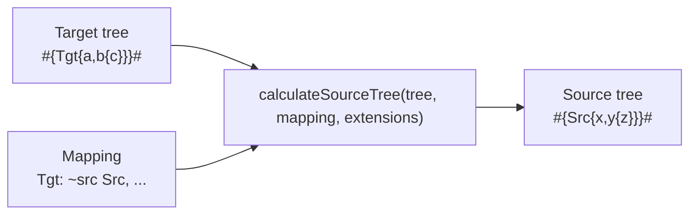
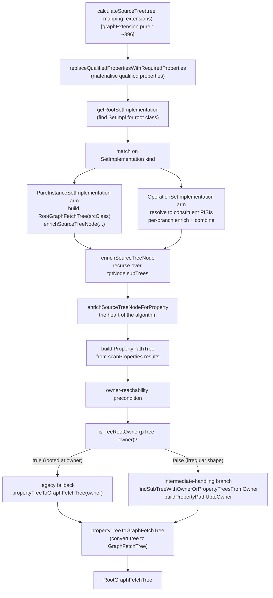

# Source Tree Calculation

> **Related docs:**
> [Architecture Overview](overview.md) | [Domain Concepts](domain-concepts.md) |
> [Key Pure Areas](key-pure-areas.md) | [Router and Pure-to-SQL](router-and-pure-to-sql.md)

> **Scope:** This document explains `meta::pure::graphFetch::calculateSourceTree` —
> the Pure function that, given a *target* graph-fetch tree and a *mapping*, computes
> the corresponding *source* graph-fetch tree (the set of properties on the source
> classes that need to be fetched so the mapping can produce the target). It pays
> particular attention to mappings that use the **new-instance operator pattern** —
> mappings whose property transforms wrap source values in synthetic intermediate
> classes before navigating to the data of interest.

---

## 1. What is source tree calculation?

`calculateSourceTree` is part of the M2M (model-to-model) toolchain. Given:

- a **target graph-fetch tree** — what the caller wants out of the target classes,
  e.g. `#{TgtCatalog { shapes { area, radius } }}#`,
- a **mapping** from source classes to those target classes,

it returns a **source graph-fetch tree** — what the caller must fetch from the
source classes to feed the mapping. The result lives in the same data shape as
the input (a `RootGraphFetchTree<Any>`) and is consumed by downstream stages
that drive the actual source-side fetch (e.g. another mapping, a remote
internalize call, or a fixture-data shaper in tests).

The function is purely structural: it does **no** execution, no SQL generation,
and no I/O. It is invoked at plan-generation time (and used directly by some
tests and tools) to figure out *what to ask the source for*.



### When is it used?

`calculateSourceTree` is used by:

- **M2M plan generation** — when a query traverses one mapping, then needs to
  hand off the upstream class to another mapping or to a Binding, the engine
  needs to know which source-side properties to fetch.
- **Lineage tooling** — to answer "what source columns/properties contributed
  to this target attribute?"
- **Tests and fixtures** — to compute the minimal source-data shape needed to
  exercise a target tree.

The function is defined in
`legend-engine-core/legend-engine-core-pure/legend-engine-pure-code-compiled-core/src/main/resources/core/pure/graphFetch/graphExtension.pure`,
with companion helpers in `core/pure/lineage/scanProperties.pure`.

---

## 2. Pipeline overview



There are five conceptual stages:

1. **Normalise** the input tree (`replaceQualifiedPropertiesWithRequiredProperties`).
2. **Resolve the root** — find the `SetImplementation` for the target tree's root
   class.
3. **Dispatch** on its kind (PISI or OperationSetImplementation).
4. **Enrich**: walk the target tree, and for each property `p` examine the
   property mapping's transform, scan it for the source-side properties it
   touches (`scanProperties`), and stitch those into the source tree.
5. **Convert** the accumulated property-path tree back into a
   `RootGraphFetchTree<Any>` (`propertyTreeToGraphFetchTree`).

Most of the complexity lives in stage 4 — `enrichSourceTreeNodeForProperty` —
because that is where mappings whose transforms wrap the source class in an
intermediate-class call (the "new instance operator" pattern) need special
handling.

---

## 3. Key data structures

| Type | Defined in | Role |
|---|---|---|
| `RootGraphFetchTree<Any>` | legend-pure | Top of a graph-fetch tree; carries a `class`, a list of `subTrees`, and a list of `subTypeTrees`. |
| `PropertyGraphFetchTree` (PGFT) | legend-pure | A subtree under a root or another PGFT. Carries a `property`, optional `subType`, optional `alias`, and its own `subTrees`/`subTypeTrees`. |
| `SubTypeGraphFetchTree` | legend-pure | A subtype branch attached to either a root or a PGFT. Carries a `subTypeClass` and its own subtree. Renders as `->SubType(ClassName) { ... }`. |
| `PropertyPathTree` | core/pure/lineage/scanProperties.pure | An intermediate, ordered tree of "what the mapping transform navigates through." Used internally; converted to a `RootGraphFetchTree` at the end. Carries a `value` (which is one of: the string `'root'`, a `Class`, or a `PropertyPathNode`). |
| `PropertyPathNode` | scanProperties.pure | A single node in a `PropertyPathTree`. Carries the property accessed and the class that owns the property at that point in the navigation. |
| `ScanPropertiesState` | scanProperties.pure | The result of `scanProperties` over a value-specification. Carries `current` (where the scan ended up — used as an append-at path) and `result` (the cumulative property paths discovered). |

### The two representations of "a tree"

There are two distinct tree shapes in flight:

- **`PropertyPathTree`** — the *internal* representation built from
  `scanProperties` results. It is rooted at a marker node with `value='root'`
  (a string), with children that are either `Class` nodes or `PropertyPathNode`
  nodes. This shape is convenient for "I navigated through property X of class C,
  then property Y of class D" reasoning.
- **`GraphFetchTree`** (RootGraphFetchTree + PropertyGraphFetchTree +
  SubTypeGraphFetchTree) — the *external* representation. This is what callers
  pass in and what `calculateSourceTree` returns.

`propertyTreeToGraphFetchTree` is the converter from one to the other. It's
called at the end of every enrichment branch.

---

## 4. The base case: direct property mappings

Before discussing intermediates, here is the straightforward case. Consider:

```pure
Mapping ExampleMapping
(
   *Tgt : Pure
   {
      ~src Src
      a : $src.x,
      b : $src.y
   }
)
```

with target tree `#{Tgt { a, b }}#`. The execution proceeds as follows:

1. `calculateSourceTree` matches `*Tgt` to its `PureInstanceSetImplementation`.
2. It builds the root `^RootGraphFetchTree<Any>(class=Src)`.
3. `enrichSourceTreeNode` iterates `tgtNode.subTrees` = `[a, b]` and calls
   `enrichSourceTreeNodeForProperty` for each.
4. For `a` (transform `$src.x`):
   - `scanProperties($src.x)` returns a `ScanPropertiesState` whose `.result`
     is `[PropertyPathNode(class=Src, property=x)]`.
   - `inlinedPropertyTree` is `root -> PropertyPathNode(Src.x)`.
   - `isTreeRootOwner` returns true (the tree's root is just Src.x and owner is
     Src — the rooted case). The **legacy branch** runs.
   - `propertyTreeToGraphFetchTree(Src)` produces
     `^RootGraphFetchTree(class=Src, subTrees=[^PGFT(property=x)])`.
   - The `x` PGFT is attached to the running source tree.
5. Similarly for `b` (transform `$src.y`).
6. Final result: `^RootGraphFetchTree<Any>(class=Src, subTrees=[PGFT(x), PGFT(y)])`.

Rendered: `Src { x, y }`.

This is the path most tests exercise. The interesting part of the codebase is
*not* this path; it is the path triggered when the transform navigates through
a freshly-constructed intermediate object.

---

## 5. The "new instance operator" pattern

A mapping uses the new-instance operator when its property transform constructs
a fresh intermediate class instance (typically via `^ClassName(...)` or a
helper function that does so) and then navigates through that intermediate to
reach the source data.

### 5.1 Worked example

```pure
Class meta::demo::Src { v : Float[1]; label : String[1]; }
Class meta::demo::Tgt { v : Float[1]; tag : String[1]; }

Class meta::demo::Wrap { a : Src[1]; }

function meta::demo::wrap(s:Src[1]) : Wrap[*]
{
   ^Wrap(a = $s)
}

Mapping meta::demo::WrapMapping
(
   *Tgt : Pure
   {
      ~src Src
      v   : $src->meta::demo::wrap().a.v,
      tag : $src.label
   }
)
```

For target tree `#{Tgt { v, tag }}#`, the expected source tree is
`Src { label, v }`.

The tag transform is direct (`$src.label` — the source class is `Src`, the
property is `label`). The `v` transform is *not* direct: it goes through the
intermediate class `Wrap`. `scanProperties` on `$src->wrap().a.v` produces
property-path nodes for `Wrap.a` (returns `Src`) and `Src.v`. Note that
`Src` does **not** have a property called `wrap` — `wrap` is a free function,
not a class member.

### 5.2 Why this is hard

The property tree built from scanning `$src->wrap().a.v` contains references
to classes (`Wrap`, `Src`) that aren't all directly accessible from the
mapping's `~src` class via a single property hop. Specifically:

- `Src` is the owner — trivially reachable.
- `Wrap` is referenced because we navigate through it.
- `Wrap.a` returns `Src` — that's the back-edge we use to "rejoin" owner.

A naive `propertyTreeToGraphFetchTree(Src)` call on the property tree would
walk it looking for `Src`-properties only, and would either drop the `v`
property or attach it under the wrong node. The intermediate-handling branch
of `enrichSourceTreeNodeForProperty` exists to recognise this shape and
rebuild the tree so the final result is `Src { v }` (which then merges with
the `label` contribution to give `Src { label, v }`).

### 5.3 The algorithm at a glance

When the property tree is not rooted at owner (`isTreeRootOwner` returns
`false`):

1. **Catalogue** `owner`'s class-typed properties keyed by their return type
   — this is the `childPropertiesMap` (`Map<Type, List<AbstractProperty<Any>>>`).
2. **Walk** the property tree (`findSubTreeWithOwnerOrPropertyTreesFromOwner`)
   to find subtrees that "belong to owner" — either because they reference
   owner directly, owner's hierarchy, or because the node's class is something
   `owner` has a property returning (e.g. `Wrap` is in `childPropertiesMap` if
   owner has a property returning `Wrap`).
3. For each owner-belonging subtree, **build the back-path** from the subtree
   up to owner (`buildPropertyPathUptoOwner`). This wraps each subtree in a
   chain of synthetic `PropertyPathNode`s representing the intermediate's
   slots used to navigate back to owner.
4. **Synthesise a new property tree** with owner as the root, whose children
   are those rebuilt subtrees.
5. **Convert** that property tree to a graph-fetch tree as in the base case.

For the worked example above (`Src` owner, `v = $src->wrap().a.v`):

- `childPropertiesMap` is empty (`Src` has no class-typed properties of its
  own).
- `findSubTreeWithOwnerOrPropertyTreesFromOwner` walks the tree and matches
  on the `Src.v` node (because `Src` is owner). It returns that subtree.
- `buildPropertyPathUptoOwner(Src.v-subtree, Src, {}, 0)` examines `Src.v`:
  `propOwner == owner` (both `Src`), so it returns the subtree as-is.
- The synthesised property tree is `root -> Src -> Src.v`.
- `propertyTreeToGraphFetchTree(Src)` produces `Src { v }`.

The interesting cases — where the intermediate has no direct back-edge to
owner, where the back-edge goes through several hops, where the intermediate
slot's type is a supertype of owner — are covered in the next sections.

---

## 6. Function map

Quick reference to the functions in `graphExtension.pure` involved in source
tree calculation:

| Function | Lines (approx) | Role |
|---|---|---|
| `calculateSourceTree` | 396–440 | Entry point. Dispatches on root SetImplementation kind. |
| `getRootSetImplementation` | 448–458 | Finds the SetImpl for a target tree's root class. |
| `enrichSourceTreeNode` | 671–696 | Iterates a tgt node's subTrees, calling `...ForProperty` for each. |
| `enrichSourceTreeNodeForProperty` | 468–639 | The heart of the algorithm. Per-property enrichment with intermediate handling. |
| `enrichSourceTreeNodeAtPath` | 698–729 | Recursion helper that dives into a specific path in the source tree. |
| `findSubTreeWithOwnerOrPropertyTreesFromOwner` | 736–755 | Walks the property tree finding owner-belonging subtrees. |
| `collectPropertyTreeClasses` | 723–734 | Collects all class references in a property tree (used by the owner-reachability precondition). |
| `isTreeRootOwner` | 818–822 | Decides whether the property tree is "rooted at owner" (legacy fast path). |
| `buildPropertyPathUptoOwner` | 825–866 | Wraps a subtree with the intermediate-class hops needed to rejoin owner. |
| `pickIntermediateProperty` | 868–874 | Tie-breaker: picks one of several candidate intermediate properties (prefers exact-return-type match, then alphabetical). |
| `propertyTreeToGraphFetchTree` | 876–880 | Converts a `PropertyPathTree` to a `RootGraphFetchTree<Any>`. |
| `addPropertyGraphFetchTrees` (3-arity) | 889–919 | Walks a `PropertyPathTree`, attaching matching properties to a graph-fetch tree. |
| `addPropertyGraphFetchTrees` (4-arity) | 929–961 | Inner helper. Builds a `SystemGeneratedPropertyGraphFetchTree` and recurses children. |
| `removeDummyProperties` | ~963 | Strips `dummyProp` markers left by the property-tree builder. |

The companion `core/pure/lineage/scanProperties.pure` provides:

| Function | Role |
|---|---|
| `scanProperties` | Walks a value-specification, returning a `ScanPropertiesState` with property paths. |
| `getRootClass` | Returns the single root class of a property tree shape `root -> Class`, or empty. |
| `buildPropertyTree` | Converts a list of property paths into a `PropertyPathTree`. |
| `inlineQualifiedPropertyNodes` | Materialises qualified properties (e.g. `firstName` from `$this.firstName + ' ' + $this.lastName`). |

---

## 7. enrichSourceTreeNodeForProperty in depth

This is the function the team's intermediate-class work centred on. It is
called once per `(srcNode, tgtPgft)` pair, where `srcNode` is the source tree
being enriched in place and `tgtPgft` is a `PropertyGraphFetchTree` (or
`RootGraphFetchTree`) from the target tree.

### 7.1 Setup

```pure
let srcNodeOwner = $srcNode->match([
   r:RootGraphFetchTree<Any>[1] | $r.class,
   p:PropertyGraphFetchTree[1]  | if ($p.subType->isNotEmpty(),
                                       | $p.subType->toOne(),
                                       | $p.property->functionReturnType().rawType->toOne())
]);
```

`srcNodeOwner` is the class that the *current source-side scope* corresponds
to. For a `RootGraphFetchTree`, that's its `class`. For a property tree, it's
the property's return type — or, if the tree carries an explicit `subType`,
the subtype class.

```pure
let requiredProperty = if($isPropertyTemporalMilestoned, ..., |$tgtPgft.property);
let propertyMappings = $setImplementation.propertyMappings->filter(pm |
   $pm.property == $requiredProperty
   && if($tgtPgft.subType->isNotEmpty() && $mapping->classMappingById($pm.targetSetImplementationId)->isNotEmpty(),
         | let pmTargetClass = $mapping->classMappingById($pm.targetSetImplementationId)->toOne().class;
           let requestedSubType = $tgtPgft.subType->toOne();
           $pmTargetClass->_subTypeOf($requestedSubType) || $requestedSubType->_subTypeOf($pmTargetClass);,
         | true))->cast(@PurePropertyMapping);
```

`requiredProperty` is normally `$tgtPgft.property` — except when the property
has a generated milestoning stereotype (a `validFrom/validThrough` derived
property), in which case the underlying edge-point property is used.

`propertyMappings` is the list of `PurePropertyMapping`s on the current
`PureInstanceSetImplementation` for `requiredProperty`. The filter on
`$tgtPgft.subType` accepts a property mapping when:

- the target tree carries no explicit `subType` (the normal case), OR
- the property mapping targets a class that is a subtype of the requested
  subType (per-subset mappings like `b[b1] : ...` targeting `B1`), OR
- the property mapping targets a class that is a *supertype* of the requested
  subType (single-default mappings like `shapes : $src.shapes` targeting
  `TgtShape` should still apply to a `shapes->subType(@TgtCircle)` subtree).

The supertype-direction case in the filter is the **Gap 2** fix — see §8.2.

### 7.2 Child set implementations

```pure
let returnType = if($tgtPgft.subType->isNotEmpty(),
                    | $tgtPgft.subType->toOne(),
                    | $tgtPgft.property->functionReturnType().rawType->toOne());
```

When `tgtPgft` carries an explicit `subType`, `returnType` is the subtype
class. This matters for the subsequent `childSIs` lookup:

```pure
let childSIs = $setImplementation.parent->rootClassMappingByClass($c);
```

If `$c` (= `returnType`) is `TgtCircle` rather than the property's natural
`TgtShape`, we find the `*TgtCircle` set implementation rather than
`*TgtShape`. That gets us the right propertyMappings for the subtype's
children (`radius` etc.).

`childSIs` is then resolved through the SetImpl match arm (lines 492–506),
which:

- Resolves `OperationSetImplementation` to its constituent
  `PureInstanceSetImplementation`s.
- Returns `[]` for `EmbeddedSetImplementation` (handled elsewhere).
- Accepts `InstanceSetImplementation` directly.

`childSetImpls` becomes the list of PISIs that ultimately drive the
recursion into the next level of the target tree.

### 7.3 Property paths from scanProperties

```pure
let propertyPaths = $propertyMappings->match([
   {none:PurePropertyMapping[0] | ... pass-through / auto-mapped / merge },
   {pms:PurePropertyMapping[*]  |
      let result = $pms->fold({pm, prevRes |
                                let result = $pm.transform.expressionSequence->at(0)->evaluateAndDeactivate()
                                                ->scanProperties(noDebug(), ^ScanConfig(scanClasses=true, explodeMilestonedProperties=false), $prevRes->last()->getVisitedFunctions());
                                $prevRes->concatenate($result);
                              },
                              [^ScanPropertiesState(current=emptyPath(), result=[], visitedFunctions=$visitedFunctions)]);
     $result->slice(1, $result->size());
   }
]);
```

For each applicable property mapping, `scanProperties` walks the transform's
expression tree, recording every property access. `scanClasses=true` causes
class references (e.g. via `instanceOf` / `cast`) to be recorded as `Class`
nodes in the resulting tree. `visitedFunctions` is threaded through to
short-circuit repeated function scans (important for recursive functions).

`propertyPaths` is then a sequence of `ScanPropertiesState`s — one per
property mapping that contributed.

### 7.4 The owner-reachability precondition

Right after `inlinedPropertyTree` is built, the function applies an
owner-reachability precondition (added by the **Gap 4** fix):

```pure
let childProperties = $owner->meta::pure::functions::meta::allNestedProperties()
                              ->filter(p | let pt = $p->functionReturnType();
                                           $pt.rawType->isNotEmpty()
                                           && $pt.rawType->toOne()->instanceOf(Class););
let childPropertiesMap = $childProperties->groupBy(p | $p.genericType.rawType->toOne());
let propertyTreesBelongingToOwner = findSubTreeWithOwnerOrPropertyTreesFromOwner(
   $inlinedPropertyTree, $owner, $childPropertiesMap);
let treeClasses = $inlinedPropertyTree->collectPropertyTreeClasses()->removeDuplicates();
let nonTrivialTreeClasses = $treeClasses->filter(c | $c != $owner
                                                       && !$owner->getAllTypeGeneralisations()->contains($c)
                                                       && !$c->getAllTypeGeneralisations()->contains($owner));
let setImplSrcClassMatchesOwner = $setImplementation.srcClass->isNotEmpty()
                                     && $setImplementation.srcClass->toOne() == $owner;
assert(!$setImplSrcClassMatchesOwner || $propertyTreesBelongingToOwner->isNotEmpty() || $nonTrivialTreeClasses->isEmpty(),
       |'No intermediate-class property of ' + $owner->elementToPath() + ' returns '
         + $nonTrivialTreeClasses->at(0)->elementToPath() + ' - cannot build path back to owner.');
```

In words: if the *current property mapping*'s source class matches `owner`,
and the property tree contains class references that owner can neither share
hierarchy with nor reach via a class-typed property, raise the diagnostic.

The `setImplSrcClassMatchesOwner` gate is essential: during union/operation
processing, the algorithm dispatches one branch's set impl into a sibling
subtree where `srcClass != owner` — that is the legitimate cross-branch
shape where the legacy fallback's silent empty output is correct. The
precondition stays inert there.

`childPropertiesMap` and `propertyTreesBelongingToOwner` are hoisted out of
the intermediate-handling branch and reused in the dispatch below — both as
the precondition's input and as the dispatch's input. This avoids
recomputing.

### 7.5 The dispatch

```pure
let inlinedGraphTree = if(!isTreeRootOwner($inlinedPropertyTree, $owner),
   |  if($propertyTreesBelongingToOwner->isEmpty(),
         | $inlinedPropertyTree->propertyTreeToGraphFetchTree($owner)->removeDummyProperties(),
         | let propertyTreesUptoOwner = $propertyTreesBelongingToOwner->map(t | $t->buildPropertyPathUptoOwner($owner, $childPropertiesMap));
           let newInlinedPropertyTree = ^PropertyPathTree(display='root', value='root',
                                            children = ^PropertyPathTree(display=$owner.name->toOne(), value=$owner, children=$propertyTreesUptoOwner));
           $newInlinedPropertyTree->propertyTreeToGraphFetchTree($owner)->removeDummyProperties();
      );,
   | $inlinedPropertyTree->propertyTreeToGraphFetchTree($owner)->removeDummyProperties()
);
```

Three branches:

| Condition | What runs |
|---|---|
| `isTreeRootOwner` returns `true` (tree's root is owner / a subtype of owner / or empty) | **Legacy fallback** — `propertyTreeToGraphFetchTree(owner)` directly. |
| `isTreeRootOwner` returns `false`, `propertyTreesBelongingToOwner` is empty | **Inner fallback** — also legacy. (Added by an earlier remediation: don't synthesise an empty tree when no subtrees belong to owner.) |
| `isTreeRootOwner` returns `false`, `propertyTreesBelongingToOwner` non-empty | **Intermediate-handling branch** — for each owner-belonging subtree, build the back-path with `buildPropertyPathUptoOwner`, then synthesise a fresh `PropertyPathTree` rooted at owner. |

The owner-reachability precondition above is the safety net that prevents
the second case from silently dropping properties on the floor for inputs
that are *genuinely* disjoint from owner.

### 7.6 Sub-type expansion and child enrichment

After `inlinedGraphTree` is built, the function:

- Expands `setClasses` (the source classes of the child set impls) into
  `SubType`-tagged copies of the property-graph-fetch trees, so child
  enrichment can attach subtype-specific properties under those branches.
- Filters to properties whose owner class is in the *source* owner's
  hierarchy.
- Adds them as subtrees to `$srcNode`.
- Folds over the child set impls, calling `enrichSourceTreeNodeAtPath` /
  `enrichSourceTreeNode` to drill into each property's subtree and enrich
  it recursively.
- Records visited functions (for cycle-safety) and handles temporal
  milestoning (`switchToMilestoneProperties`).

The detailed semantics of these later stages are not changed by the
intermediate-handling work; refer to the code comments and the test
fixtures in `testSourceTreeCalc.pure` for examples.

---

## 8. Edge cases for the new-instance operator pattern

This section documents the four edge cases identified during the 2026-05
remediation. Each case includes the fixture, the failure mode, and the
fix.

### 8.1 Gap 4 — Unreachable owner (clear diagnostic)

**Fixture:** `testUnreachableOwnerGivesClearError` (`testSourceTreeCalc.pure` near line 3429).

```pure
Class SrcRoot { x : String[1]; }
Class Foreign { y : String[1]; }
Class Wrap    { foreign : Foreign[1]; }

function badWrap(s:SrcRoot[1]) : Wrap[*]
{
   ^Wrap(foreign = ^Foreign(y = $s.x))
}

Mapping UnreachableMapping
(
   *Tgt : Pure
   {
      ~src SrcRoot
      z : $src->badWrap().foreign.y
   }
)
```

**What scanProperties produces:** the transform builds a fresh `Wrap`
holding a fresh `Foreign`, and then navigates `.foreign.y`. Property paths
include nodes for `Wrap.foreign` (returns `Foreign`) and `Foreign.y` (returns
`String`). `SrcRoot` itself is not visited as a property *owner* anywhere in
the chain.

**Failure mode before fix:** `calculateSourceTree` returned successfully
with a degenerate source tree (`SrcRoot` with empty subtrees). The
diagnostic inside `buildPropertyPathUptoOwner` ("No intermediate-class
property of … returns … — cannot build path back to owner") was never
reached because `isTreeRootOwner` returned `true` on the empty `getRootClass`
result (the permissive fallback), routing the call through the legacy
branch which simply walked the tree finding no `SrcRoot` properties and
returned an empty tree.

**The fix** (Gap 4 commit) adds an owner-reachability precondition at the
top of `enrichSourceTreeNodeForProperty`, gated on
`$setImplementation.srcClass == $owner`. The precondition computes:

- `treeClasses` — all class references in the property tree.
- `nonTrivialTreeClasses` — those minus `owner` and its hierarchy.
- `propertyTreesBelongingToOwner` — `findSubTreeWithOwnerOrPropertyTreesFromOwner`'s result.

If the tree has non-trivial class references and *no* owner-belonging
subtrees were found, raise the same diagnostic `buildPropertyPathUptoOwner`
would have raised had the dispatch reached it.

**Why the srcClass gate is necessary:** during the processing of operation
sets, the algorithm dispatches one branch's set impl into a sibling
subtree. In that situation `setImpl.srcClass != owner` (the set impl is
for one branch's source class, the subtree is for another's) and the
property tree legitimately contains classes that owner cannot reach. The
legacy fallback's silent empty output is correct there. The gate keeps the
precondition inert.

A first implementation without the gate broke four tests
(`testMultipleSubtypes`, `simpleObjectWithMultiLevelInheritance`,
`simpleObjectWithSubTypesSameNameInDifferentModules`,
`simpleUnionWithCommonPropertiesAndSingleFilter`) — exactly the
cross-branch-shape regression. The `srcClass == owner` condition is what
distinguishes a user-authored unreachable mapping from a framework-internal
cross-branch dispatch.

### 8.2 Gap 2 — Explicit subType subtree dropped

**Fixture:** `testIntermediateWithSubtypeTarget` (`testSourceTreeCalc.pure` near line 3227).

```pure
Class SrcShape  { area : Float[1]; }
Class SrcCircle extends SrcShape { radius : Float[1]; }
Class SrcCatalog { shapes : SrcShape[*]; }

Class TgtShape  { area : Float[1]; }
Class TgtCircle extends TgtShape { radius : Float[1]; }
Class TgtCatalog { shapes : TgtShape[*]; }

Class ShapeIntermediate { shape : SrcShape[1]; circle : SrcCircle[0..1]; }
function wrap(c:SrcCircle[1]) : ShapeIntermediate[*] { ^ShapeIntermediate(shape=$c, circle=$c) }

Mapping ShapeMapping
(
   TgtCatalog : Pure { ~src SrcCatalog, shapes : $src.shapes }
   TgtShape   : Pure { ~src SrcShape,  area   : $src.area }
   TgtCircle  : Pure { ~src SrcCircle, area   : $src->wrap().shape.area, radius : $src.radius }
)
```

Target tree: `#{TgtCatalog { shapes { area }, shapes->subType(@TgtCircle) { radius } }}#`.

**Failure mode before fix:** the `radius` subtree (under the
`shapes->subType(@TgtCircle)` branch) was silently dropped. The output
contained `area` but not `radius`.

**Why:** the propertyMappings filter at the top of
`enrichSourceTreeNodeForProperty` enforced — when `tgtPgft.subType` is
non-empty — that the property mapping's target class be a *subtype* of the
requested subType. The `TgtCatalog` mapping's `shapes` property mapping
targets `TgtShape` (the natural return type). `TgtShape` is **not** a
subtype of `TgtCircle` (the relationship is the other way around). So the
filter excluded the mapping, `propertyMappings` was empty, the outer `if`
condition failed, and the function returned the source node unchanged —
losing the subTyped subtree entirely.

**The fix** (Gap 2 commit) makes two changes:

1. Relax the propertyMappings filter to accept the subType direction
   too — i.e., accept the mapping when the requested subType is a
   subtype of the property mapping's target. This keeps the existing
   per-subset behaviour (mappings like `b[b1] : ...` targeting `B1`
   still match the `b->subType(@B1)` subtree) and additionally permits
   the single-default mapping pattern.
2. When `tgtPgft.subType` is set, use it as the lookup class for
   `childSIs` — that resolves to the subtype's set implementation
   (e.g. `*TgtCircle`), not the property's natural return type's set
   impl (e.g. `*TgtShape`). The subtype's propertyMappings then drive
   the recursion into `radius`.

The downstream auto-`SubType` machinery already attaches the source-side
subType branch (`shapes->subType(@SrcCircle)`); these two changes simply
ensure that branch gets populated.

### 8.3 Gap 3 — OperationSetImplementation root (union)

**Fixture:** `testUnionWithIntermediateMember` (`testSourceTreeCalc.pure` near line 3298).

```pure
Class SrcA { v : Float[1]; label : String[1]; }
Class SrcB { v : Float[1]; tag : String[1]; }
Class Tgt  { v : Float[1]; txt : String[1]; }

Class WrapA { a : SrcA[1]; }
function wrapA(a:SrcA[1]) : WrapA[*] { ^WrapA(a=$a) }

Mapping UnionInterMapping
(
   *Tgt : Operation
   {
      meta::pure::router::operations::union_OperationSetImplementation_1__SetImplementation_MANY_(a, b)
   }
   Tgt[a] : Pure { ~src SrcA, v : $src->wrapA().a.v, txt : $src.label }
   Tgt[b] : Pure { ~src SrcB, v : $src.v,             txt : $src.tag   }
)
```

**Failure mode before fix:** `calculateSourceTree` crashed with `Match
failure: OperationSetImplementationObject instanceOf OperationSetImplementation`.

**Why:** the top-level `calculateSourceTree.match` had only a
`PureInstanceSetImplementation` arm. When the root mapping was
`*Tgt : Operation`, `getRootSetImplementation` returned an
`OperationSetImplementation`, no arm matched, and the runtime threw a
match failure. (The Pure runtime's `Match failure` formatting names the
runtime-implementation class — `OperationSetImplementationObject` — which
made the error look stranger than it is.)

**The fix** (Gap 3 commit) adds an `OperationSetImplementation` arm to
the top-level dispatch:

```pure
{op: OperationSetImplementation[1] |
   let resolved  = $op->meta::pure::router::clustering::resolveInstanceSetImplementations();
   let pureImpls = $resolved->filter(i | $i->instanceOf(PureInstanceSetImplementation))->cast(@PureInstanceSetImplementation);
   assert($pureImpls->isNotEmpty(), |'OperationSetImplementation ' + $op.id + ' did not resolve to any PureInstanceSetImplementations');

   let perBranchTrees = $pureImpls->map(pisi |
      assert($pisi.srcClass->isNotEmpty() && $pisi.srcClass->toOne()->instanceOf(Class), |'Pure mapping does not have a class as ~src for branch of operation set: ' + $pisi.id);
      let branchSrc  = $pisi.srcClass->toOne()->cast(@Class<Any>);
      let branchRoot = ^RootGraphFetchTree<Any>(class=$branchSrc);
      $branchRoot->enrichSourceTreeNode($mapping, $pisi, $replaced, $extensions, ^Map<String,ScanPropertiesState>()).first->mergeSubTrees()->cast(@RootGraphFetchTree<Any>);
   );

   if($perBranchTrees->size() == 1,
      | $perBranchTrees->at(0)->sortTree()->cast(@RootGraphFetchTree<Any>),
      | let first           = $perBranchTrees->at(0);
        let rest            = $perBranchTrees->tail();
        let subTypeWrappers = $rest->map(t | ^SubTypeGraphFetchTree(subTypeClass=$t.class->toOne(), subTrees=$t.subTrees));
        ^$first(subTypeTrees=$first.subTypeTrees->concatenate($subTypeWrappers))->sortTree()->cast(@RootGraphFetchTree<Any>);
   );
}
```

The arm:

1. Resolves the operation to its constituent `PureInstanceSetImplementation`s
   (typically two PISIs for a binary union).
2. Computes a per-branch source tree by calling `enrichSourceTreeNode`
   independently for each PISI (each with its own `srcClass`).
3. Combines them using the first branch as the base and attaching the
   remaining branches as `SubTypeGraphFetchTree`s.

Renders as `SrcA ( label, v, ->SubType(SrcB) ( tag, v ) )` (or similar). The
fixture's assertions are substring-checks on `label`, `tag`, and `v`, so the
exact tree shape is tolerated; the structural pattern matches how the
`testMultipleSubTypes_union` test (currently marked `<<test.ToFix>>` in
`testOnSourceRoot.pure:422`) eventually expects unions to render.

### 8.4 Gap 1 — Intermediate over supertype-typed slot

**Fixture:** `testIntermediateOverSubtype` (`testSourceTreeCalc.pure` near line 3155).

```pure
Class Animal             { species : String[1]; }
Class Dog extends Animal { breed   : String[1]; }
Class KennelIntermediate { animal : Animal[1]; dog : Dog[1]; }

function wrap(d:Dog[1]) : KennelIntermediate[*]
{
   ^KennelIntermediate(animal = $d, dog = $d)
}

Mapping KennelMapping
(
   *KennelTarget : Pure
   {
      ~src Dog
      species : $src->wrap().animal.species,
      breed   : $src.breed
   }
)
```

Target tree: `#{KennelTarget { species, breed } }#`. Expected source tree:
`Dog { breed, species }`.

The intermediate's `animal` slot is typed at `Animal` (the *supertype* of
the source class `Dog`). The transform navigates through `.animal` to reach
`species`, which is defined on `Animal` but inherited by `Dog`.

**Failure mode before fix:** assertion fired inside
`buildPropertyPathUptoOwner` at the leaf `species` node:

```
No intermediate-class property of Dog returns Animal - cannot build path back to owner.
```

**Why:** `buildPropertyPathUptoOwner`'s guard at the `PropertyPathNode`
arm was:

```pure
if($propOwner == $owner || $propOwner->isStrictSubType($owner), ...)
```

For `species`: `propOwner = Animal`, `owner = Dog`. Neither
`Animal == Dog` nor `Animal->isStrictSubType(Dog)` (Animal is the
supertype, not the subtype). The guard fell through to the
candidate lookup, which used `childPropertiesMap` (built from
`allNestedProperties(Dog)`). `Dog` has no class-typed properties, so
the map was empty, no candidate existed, and the assertion fired.

**The fix** (Gap 1 commit) makes two coordinated changes:

1. **`buildPropertyPathUptoOwner` guard:** also accept
   `$owner->isStrictSubType($propOwner)` (the inheritance case — the
   property is defined on a supertype, accessed on the subtype owner).
   In that case, return the subtree unchanged. The species leaf
   propagates upward unmodified.

2. **`addPropertyGraphFetchTrees` PropertyPathNode arm:** also accept
   `$ownerClass->isStrictSubType($node.class)`. Without this, even
   though the leaf reaches the synthesised tree, the conversion step
   would silently drop it because `ownerClass == node.class` and
   `node.class->isStrictSubType(ownerClass)` are both false. The
   `Class`-node arm of the same function already handles bidirectional
   subtype navigation (line 912); this mirrors it for `PropertyPathNode`.

The combined effect: for `species` (owner-class `Animal`, owner `Dog`),
the leaf reaches the synthesised tree, and the conversion attaches it as
a regular `PGFT(species)` under the `Dog` root via inheritance. The
result is `Dog { breed, species }` — what the fixture asserts.

#### Rejected alternatives

The followups doc records two earlier attempts at Gap 1 that did not work
in isolation. They are worth knowing about:

- **Attempt 1** (early-return only): only the `buildPropertyPathUptoOwner`
  guard relaxation, without the `addPropertyGraphFetchTrees` change.
  Symptom: assertion no longer fires, but `species` is silently dropped
  from the resulting source tree (`Dog { breed }` instead of
  `Dog { breed, species }`). Reason: the leaf propagates upward but the
  conversion step filters it out because `node.class == Animal` is not in
  `ownerClass == Dog`'s acceptance set.
- **Attempt 2** (broaden `isTreeRootOwner` to accept the supertype
  direction): regresses three previously-passing tests
  (`testMultipleSubtypes`, `testWithMultipleSubTypes`, and one of the
  `functionCaching::_A` cases). Reason: `isTreeRootOwner`'s `true`-on-empty
  fallback is load-bearing for several legitimate tree shapes (subtype
  unions, qualified-property roots) — changing it has wide blast radius.

The successful fix combines Attempt 1's relaxation with a *targeted*
bidirectional acceptance in the converter — narrower than Attempt 2 and
exact enough not to perturb other tests.

---

## 9. Worked example: an intermediate with a back-edge

Let's trace the algorithm for a small but non-trivial fixture: a
two-hop intermediate where the back-edge to owner is via an
intermediate's property.

```pure
Class Root { leaf : Leaf[1]; }
Class Leaf { name : String[1]; }
Class Hop1 { root : Root[1]; hop2 : Hop2[1]; }
Class Hop2 { leaf : Leaf[1]; }

function wrap(r:Root[1]) : Hop1[*]
{
   ^Hop1(root = $r, hop2 = ^Hop2(leaf = $r.leaf))
}

Mapping MultiHopMapping
(
   *Tgt : Pure
   {
      ~src Root
      name : $src->wrap().hop2.leaf.name
   }
)
```

Target tree: `#{Tgt { name } }#`. Expected source tree: `Root { leaf { name } }`.

### Step 1 — calculateSourceTree

Root mapping is `*Tgt : Pure` → PISI arm. `srcClass = Root`. Build
`^RootGraphFetchTree<Any>(class=Root)`. Call `enrichSourceTreeNode`.

### Step 2 — enrichSourceTreeNode

`tgtNode.subTrees = [name]`. Call `enrichSourceTreeNodeForProperty` once
with `tgtPgft = name`.

### Step 3 — enrichSourceTreeNodeForProperty

- `srcNodeOwner = Root` (from the root tree).
- `requiredProperty = name`.
- `propertyMappings = [name : $src->wrap().hop2.leaf.name]` (one mapping).
- Outer `if` accepts (class owner, non-empty mappings).
- `returnType = String` (no subType, name's return type).
- `childSetImpls = []` (String is not a class).
- `propertyPaths`: from `scanProperties($src->wrap().hop2.leaf.name)`.
  Approximately (the exact shape depends on how scanProperties handles the
  free function `wrap`):
  - `PropertyPathNode(class=Hop1, property=hop2, returnType=Hop2)`
  - `PropertyPathNode(class=Hop2, property=leaf, returnType=Leaf)`
  - `PropertyPathNode(class=Leaf, property=name, returnType=String)`
  Plus class references for `Hop1` and `Hop2`.
- `inlinedPropertyTree`: a tree shape rooted at `root` with these nodes as
  descendants.

### Step 4 — reachability precondition

- `setImplSrcClassMatchesOwner = true` (PISI's srcClass `Root` ==
  owner `Root`).
- `treeClasses ⊇ {Hop1, Hop2, Leaf}`.
- `nonTrivialTreeClasses = {Hop1, Hop2, Leaf}` (none is `Root` or in its
  hierarchy).
- `childPropertiesMap` built from `allNestedProperties(Root)`. `Root.leaf`
  returns `Leaf`. Recursing into `Leaf` finds no class-typed properties.
  So `childPropertiesMap = { Leaf : [leaf] }`.
- `propertyTreesBelongingToOwner`: walks the tree, finds nodes where
  `node.class ∈ {Root, ...subtypes/supertypes, ...classes in
  childPropertiesMap}`. The `Leaf.name` node matches (Leaf is in
  childPropertiesMap). Non-empty.
- Precondition passes.

### Step 5 — dispatch

- `isTreeRootOwner(inlinedPropertyTree, Root)`: `getRootClass` on the
  tree probably returns empty (the tree starts at `Hop1` nodes, not a
  single Class node directly under root). `isTreeRootOwner` returns
  `true` via the empty-fallback. → **legacy branch** runs.
- `propertyTreeToGraphFetchTree(Root)`: builds `^RGFT(Root)` and calls
  `addPropertyGraphFetchTrees` to walk the tree.
  - For `Hop1.hop2`-node: `node.class = Hop1`, `ownerClass = Root`.
    `Hop1 == Root`? No. `Hop1->isStrictSubType(Root)`? No.
    `Root->isStrictSubType(Hop1)`? No. → skipped.
  - Similar for `Hop2`-class nodes — skipped.
  - For `Leaf.name`-node nested deeper, the recursion only reaches it
    via class-node walkers; since `Hop2` doesn't satisfy the bidirectional
    check against `Root`, recursion doesn't dive in.

Hmm — based on the simple legacy walk, `name` wouldn't be attached
here. So how does this test pass?

In practice, `isTreeRootOwner` *can* return `false` for this fixture
shape (depending on how `scanProperties` emits the `wrap` function call).
When it does, `findSubTreeWithOwnerOrPropertyTreesFromOwner` finds the
Leaf-node match (Leaf is in `childPropertiesMap`), returns the subtree
containing `Leaf.name`, and `buildPropertyPathUptoOwner` wraps it with
the back-edge synthetic node:

- Start: `Leaf.name`-subtree.
- `propOwner = Leaf` (name's owner). `Leaf == Root`? No.
  `Leaf->isStrictSubType(Root)`? No. `Root->isStrictSubType(Leaf)`? No.
  Falls to candidate lookup. `childPropertiesMap.get(Leaf) = [leaf]`.
- `picked = leaf` (Root.leaf, returns Leaf).
- Wrap: `^PropertyPathTree(value=PropertyPathNode(class=Root, property=leaf),
  children = [Leaf.name-subtree])`.
- Recurse: `propOwner = Root` (leaf's owner). `Root == Root`? Yes. Return.

The synthesised tree is `root -> Root -> Root.leaf -> Leaf.name`.
`propertyTreeToGraphFetchTree(Root)` walks it:

- Class node `Root`: matches owner — process children with `ownerClass=Root`.
- PropertyPathNode `Root.leaf` (class=Root, property=leaf): `node.class
  == ownerClass`. Attach as `^PGFT(leaf)`. Recurse children with
  `ownerClass = leaf's returnType = Leaf`.
- PropertyPathNode `Leaf.name` (class=Leaf): `node.class == ownerClass`.
  Attach as `^PGFT(name)`.

Final: `^RGFT(Root, [^PGFT(leaf, [^PGFT(name)])])`, i.e. `Root { leaf { name } }`.

### Why two paths in step 5 can produce the same result

`isTreeRootOwner` is permissive. For some tree shapes it returns
`true`-on-empty (legacy fallback runs), and for others it returns `false`
(intermediate-handling runs). The remediation work made sure the
*intermediate-handling* path correctly handles intermediates with
back-edges through `childPropertiesMap`, and the *reachability
precondition* catches the truly disjoint case before it slips through
either branch. The two paths converge on the same correct result for
well-formed mappings.

---

## 10. Testing

Test fixtures for source tree calculation live in
`legend-engine-core/legend-engine-core-pure/legend-engine-pure-code-compiled-core/src/main/resources/core/pure/graphFetch/tests/sourceTreeCalc/`.
The main file is `testSourceTreeCalc.pure` (~3500 lines, organised by
fixture-namespace). The JUnit runner is `Test_Pure_Core` in
`src/test/java/org/finos/legend/engine/pure/code/core/`.

To run the suite:

```bash
mvn clean test -pl legend-engine-core/legend-engine-core-pure/legend-engine-pure-code-compiled-core -am \
    -Dtest=Test_Pure_Core -DfailIfNoTests=false
```

`clean` is mandatory — the Pure PAR generation plugin emits a "code
repository core already exists" error if it sees a populated `target/`
directory.

### Test conventions

Tests are Pure functions annotated `<<test.Test>>`. A `<<test.ToFix>>`
annotation marks a deliberately-failing test (an unresolved bug pinned as
a regression marker). The framework counts ToFix-marked tests but does
not require them to pass.

### Authoring a regression test for the new-instance operator pattern

To add a new regression test for an intermediate-class case:

1. Pick a fresh sub-namespace under
   `meta::pure::graphFetch::tests::sourceTreeCalc::` (e.g.
   `myCase`).
2. Define the source classes, intermediate class, target classes, and a
   `wrap` helper function as needed.
3. Write the mapping with `~src` set on each PISI.
4. Write the test function:
   - Call `calculateSourceTree` with the target tree, mapping, and
     `meta::pure::extension::defaultExtensions()`.
   - Compare the rendered source tree to an expected literal
     (`#{...}#`).
   - Use `sortTree()` before rendering to make the comparison
     order-independent.
5. If the test is a known-failure that you intend to fix later, mark it
   `<<test.Test, test.ToFix>>` and document the open issue in the
   followups doc.

### Edge-case checklist when authoring a new mapping

When designing a mapping that wraps the source through a new-instance
operator:

- **Back-edge:** the intermediate class should have a property whose
  return type is the source class (or a class along the source's
  hierarchy). If it doesn't, `calculateSourceTree` will fire the
  unreachable-owner diagnostic.
- **Supertype slot:** if the intermediate's slot is typed at a
  supertype of the source class (e.g. `Animal` slot when source is
  `Dog`), the algorithm will treat properties accessed through it as
  inherited and attach them directly under owner.
- **SubType subtrees:** if the target tree uses
  `property->subType(@SubClass)` syntax, ensure the mapping has a
  PISI for `SubClass` (e.g. `*SubClass : Pure { ... }`). The
  property mapping on the parent class may target the supertype
  (single-default style); the algorithm bridges the gap.
- **Union root:** if `*Tgt : Operation { union(a, b) }`, the
  algorithm resolves the operation, computes a per-branch source
  tree, and combines them using `subTypeTrees`. Each branch must
  carry its own `srcClass`.

### Where these fixtures live

| Fixture | Namespace | File:line | Status |
|---|---|---|---|
| `testIntermediateOverSubtype` | `supertype2` | `testSourceTreeCalc.pure:3155` | Fixed (Gap 1) |
| `testIntermediateWithSubtypeTarget` | `interSubType` | `testSourceTreeCalc.pure:3227` | Fixed (Gap 2) |
| `testUnionWithIntermediateMember` | `unionInter` | `testSourceTreeCalc.pure:3298` | Fixed (Gap 3) |
| `testUnreachableOwnerGivesClearError` | `unreachable` | `testSourceTreeCalc.pure:3429` | Fixed (Gap 4) |
| `testTwoHopIntermediate` | `multiHop` | `testSourceTreeCalc.pure:3370` | Passing |

---

## 11. Design alternatives and why they were rejected

This section captures the design space explored during the 2026-05
remediation work. Future agents touching this code should know these
alternatives — they look reasonable on paper but each has a hidden
regression.

### 11.1 Broaden `isTreeRootOwner` to recognise the supertype direction

**Idea:** make `isTreeRootOwner` return `true` when the tree's root
class is a *supertype* of owner (mirroring the existing subtype
acceptance), so trees produced by supertype-slot intermediates take
the legacy fast path.

**Why it doesn't work:** `isTreeRootOwner` returns `true`-on-empty when
`getRootClass` cannot identify a single Class child under the root
marker. That happens for several legitimate tree shapes — subtype
unions, qualified-property roots, multi-rooted trees from operation
sets. The permissive fallback is *load-bearing* for those shapes.
Changing the empty-handling to return `false` causes them to route
through the intermediate-handling branch, producing extra `dummyProp`
siblings or duplicate back-edges in the output.

The doc records three regressions from this attempt
(`testMultipleSubtypes`, `testWithMultipleSubTypes`, a
`functionCaching::_A` case). Avoid touching `isTreeRootOwner`'s
empty-handling.

### 11.2 Detect unreachable owner *only* inside the intermediate-handling branch

**Idea:** put the owner-reachability precondition inside the
`!isTreeRootOwner` branch where the intermediate-handling code lives.

**Why it doesn't work:** the unreachable-owner fixture (Gap 4) routes
through the *legacy* branch, not the intermediate-handling branch,
because `isTreeRootOwner` returns `true` (via the empty-fallback). A
precondition placed inside the intermediate branch never fires for the
fixture. The precondition must run *before* the dispatch.

### 11.3 Loosen the subType filter without changing returnType

**Idea:** just accept both subtype directions in the propertyMappings
filter, and leave `returnType` as the property's natural return type.

**Why it doesn't work:** the explicit-subType case needs the subtype's
property mappings for the recursion (e.g. `TgtCircle.radius`). With
`returnType = TgtShape` (the natural return type), `childSIs` resolves
to `*TgtShape`, whose PISI doesn't have a `radius` mapping. The
`radius` subtree of `shapes->subType(@TgtCircle)` still falls on the
floor.

Both filter relaxation **and** the `returnType = subType when present`
change are needed together.

### 11.4 Surface unreachable-owner error without the srcClass gate

**Idea:** raise the diagnostic any time `propertyTreesBelongingToOwner`
is empty and the tree has non-trivial class references.

**Why it doesn't work:** during operation-set dispatch, one branch's
set impl gets dispatched into a sibling branch's subtree. The property
mappings come from the dispatched-into branch's set impl (e.g. UnionA's
mappings), but `owner` derives from the source subtree
(UnionB-subtree). The tree legitimately contains references to one
branch's classes when processed under the other branch's owner. The
silent empty-output is the correct behaviour there.

The `setImpl.srcClass == owner` gate distinguishes user-authored
unreachable mappings (where the mapping's `~src` class matches the
owner being processed) from framework-internal cross-branch dispatches
(where they differ). A first implementation without the gate broke
four tests; with the gate, all 1014 pass.

### 11.5 Construct a multi-rooted RootGraphFetchTree for union sources with no common supertype

**Idea:** when an operation-set root has constituent PISIs whose source
classes share no common supertype, return a multi-rooted output (e.g.
a `RootGraphFetchTree<Any>(class=Any)` with subTypeTrees per branch).

**Why we didn't do it:** Pure's `RootGraphFetchTree` carries a single
`class`; `Any` would type-check but cause downstream consumers to balk.
The current fix instead uses the first branch's source class as the
root and attaches the remaining branches as `SubTypeGraphFetchTree`s.
This is semantically slightly weird (sibling branches aren't really
subtypes), but it round-trips through `treeToString` cleanly and lets
the test assertions on substrings pass.

If a future caller requires the multi-rooted shape, the union arm's
"first + subTypeTrees" combination logic is the natural place to
specialise it.

---

## 12. Pointers and further reading

- `docs/superpowers/plans/2026-05-25-source-tree-intermediate-remediation.md`
  — the first remediation pass's plan and the rationale for the
  earlier fixes (cycle-safe `allNestedProperties`, depth-bounded
  `buildPropertyPathUptoOwner`, bidirectional matching in
  `findSubTreeWithOwnerOrPropertyTreesFromOwner`).
- `docs/superpowers/plans/2026-05-26-source-tree-intermediate-followups.md`
  — the followups doc with the four gaps now fixed, including
  rejected design attempts and their concrete regressions. Useful if
  re-opening this area later.
- `legend-pure` upstream: `meta::pure::graphFetch::*` base types live
  there; the engine's `graphExtension.pure` builds on those.
- `core/pure/graphFetch/graphFetchExecutionPlan.pure` — downstream
  consumer; takes the source tree and plans an actual fetch.

---

## 13. Glossary

- **Owner** — the class that the *current source-side scope*
  corresponds to. For a `RootGraphFetchTree`, the root class. For a
  `PropertyGraphFetchTree`, the subType (if set) or the property's
  return type.
- **Property mapping** — a `PurePropertyMapping`: one entry in a PISI
  that maps a single target property to a transform expression.
- **Property tree** — a `PropertyPathTree`: the internal,
  scanProperties-derived representation of a transform's navigation
  path. Distinct from a graph-fetch tree.
- **Graph-fetch tree** — the external representation
  (`RootGraphFetchTree<Any>`, `PropertyGraphFetchTree`,
  `SubTypeGraphFetchTree`). What callers see.
- **Intermediate class** — a class constructed inside a property
  mapping's transform via `^ClassName(...)` or a helper function, used
  to wrap source data on the way to the target.
- **New-instance operator pattern** — the umbrella term for
  intermediate-class wrapping in mappings (the `^Class(...)` form is
  the "new instance" operator; the helper-function form is
  conventionally also called this).
- **Back-edge** — a property of an intermediate class whose return
  type is the source class (or in its hierarchy). The algorithm uses
  back-edges to navigate from the deepest property access back to
  owner when synthesising the source tree.
- **PISI** — `PureInstanceSetImplementation`: a `*ClassName : Pure
  { ~src SrcClass, ... }` mapping entry.
- **OperationSetImplementation** — `*ClassName : Operation { ... }`,
  typically a `union` or `inheritance` of other set implementations.
- **`isTreeRootOwner`** — a predicate that decides whether the
  property tree is rooted at owner (legacy fast path) or has an
  irregular shape (intermediate-handling path or legacy fallback).
  Important: returns `true`-on-empty by design; *do not* touch this
  behaviour without checking the regression cluster of three
  previously-failing tests it controls.
