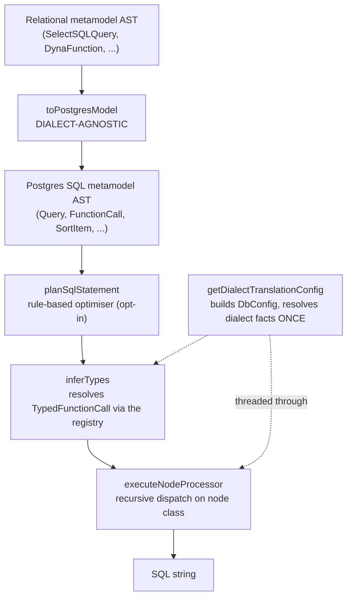

# SQL Dialect Translation

> **Related docs:**
> [Architecture Overview](overview.md) | [Router & Pure-to-SQL](router-and-pure-to-sql.md) |
> [SQL Optimizer](sql-optimizer.md) | [Relational DynaFunctions](relational-dynafunctions.md) |
> [Key Pure Areas](key-pure-areas.md) | [Execution Plans](execution-plans.md)
>
> Derived from the [SQL Dialect Translation Framework](https://confluence.work.gs.com/spaces/~pantro/pages/6426309296/SQL+Dialect+Translation+Framework)
> Confluence page, reconciled against the code.

---

## 1. Overview

SQL Dialect Translation converts a **Postgres SQL Model** instance into a dialect-specific,
executable SQL string. It is designed as an independent platform feature giving Legend polyglot SQL
capability: given one Postgres-shaped AST, transpile it to SQL for any supported database.

There are **two** SQL-generation frameworks in the relational store:

| | Legacy | SQL Dialect Translation |
|---|---|---|
| Entry point | `meta::relational::functions::sqlQueryToString::sqlQueryToString` | `meta::external::store::relational::sqlDialectTranslation::generateSqlDialect` |
| Input | `SQLQuery` (relational metamodel AST) | `Node` (Postgres SQL metamodel AST) |
| Per-dialect unit | `DbExtension` — ~40 optional processor lambdas | `SqlDialect` — node-type → `NodeProcessor` map, plus a function map |
| Style | String templating with dialect hooks | AST walk with typed, per-node dispatch |
| Status | Carries essentially all production traffic | Carries H2 only (§9) |

The newer framework makes dialect support **declarative and testable**: a dialect is data (maps and
small lambdas) rather than a pile of conditionals, and every dialect is exercised by the same shared
conformance suite (§10). The stated direction is to retire `DbExtension` for all databases.

The two frameworks are independent implementations. A change to null ordering, literal formatting,
or function mapping in one does **not** propagate to the other — the most common source of surprise
when working here (§13).

---

## 2. The Postgres SQL model

The intermediate AST is a metamodel of the SQL that Postgres supports. Postgres is the reference
dialect: the AST means *what Postgres would mean by it*.

`Node` is the base class for every element — expressions, subqueries, DDL statements. It is the
rough analogue of `RelationalOperationElement` in the legacy `SelectSQLQuery` model.

| Module | Pure repo | Contents |
|---|---|---|
| `...-postgresSqlModel-pure` | `core_external_store_relational_postgres_sql_model` | [`metamodel.pure`](https://github.com/finos/legend-engine/blob/master/legend-engine-xts-relationalStore/legend-engine-xt-relationalStore-generation/legend-engine-xt-relationalStore-postgresSql/legend-engine-xt-relationalStore-postgresSqlModel-pure/src/main/resources/core_external_store_relational_postgres_sql_model/metamodel.pure) — the core nodes |
| `...-postgresSqlModel-extensions-pure` | `core_external_store_relational_postgres_sql_model_extensions` | [`metamodel_extensions.pure`](https://github.com/finos/legend-engine/blob/master/legend-engine-xts-relationalStore/legend-engine-xt-relationalStore-generation/legend-engine-xt-relationalStore-postgresSql/legend-engine-xt-relationalStore-postgresSqlModel-extensions-pure/src/main/resources/core_external_store_relational_postgres_sql_model_extensions/metamodel_extensions.pure) — nodes beyond that set |

The split exists because the core metamodel is **shared with Alloy SQL**, which supports only a
subset of Postgres SQL. Anything not yet supported by Alloy SQL, or not supported by Postgres at
all, lives in the extensions repo rather than polluting the shared model.

---

## 3. Design principles

**1. Conversion is dialect-agnostic; dialects own translation.**
[`toPostgresModel`](https://github.com/finos/legend-engine/blob/master/legend-engine-xts-relationalStore/legend-engine-xt-relationalStore-generation/legend-engine-xt-relationalStore-pure/legend-engine-xt-relationalStore-core-pure/src/main/resources/core_relational/relational/sqlDialectTranslation/toPostgresModel.pure)
takes no `SqlDialect` and no `DbConfig`; it never asks "which database is this for?". All
dialect-specific decisions happen later, during rendering. This boundary is what makes one shared
conformance suite possible — a test asserts *Postgres semantics*, and every dialect must reproduce
them however it needs to.

**2. Render, don't template.** Each node type has exactly one `NodeProcessor` per dialect. Rendering
is a recursive walk; a dialect customises by replacing individual processors, not by branching
inside a monolithic serialiser.

**3. Divergence is declared, not hardcoded.** Where a database deviates from Postgres semantics, the
dialect declares the *fact* of the deviation and shared code decides what to emit (§8).

**4. Minimal SQL.** When a dialect's native behaviour already matches the spec, emit nothing. Keeps
generated SQL readable and existing fixtures stable.

**5. Do not be enticed by DRY.** This is a deliberate house rule. Chasing code reuse here previously
produced convoluted generic code, and — worse — left dialects silently inheriting default
implementations that their database did not actually support. Prefer an explicit per-dialect
processor over a clever shared one.

---

## 4. Where the code lives

```
legend-engine-xts-relationalStore/
├── legend-engine-xt-relationalStore-generation/
│   ├── legend-engine-xt-relationalStore-postgresSql/
│   │   ├── ...-postgresSqlModel-pure/               — Postgres SQL metamodel (shared with Alloy SQL)
│   │   └── ...-postgresSqlModel-extensions-pure/    — nodes beyond the shared subset
│   └── legend-engine-xt-relationalStore-pure/
│       ├── ...-sqlDialectTranslation-pure/          [core_external_store_relational_sql_dialect_translation]
│       │   ├── sqlDialect.pure                      — SqlDialect, NodeProcessor, dispatch
│       │   ├── sqlDialectTranslator.pure            — configs, state, generateSqlDialect, dialect lookup
│       │   ├── defaults/sqlDialectDefaults.pure     — default NodeProcessor for every node type
│       │   ├── functionRegistry/                    — SqlFunction catalogue
│       │   ├── sqlTyping/sqlTypes.pure              — the SQL type system
│       │   └── postgres/postgresSqlDialect.pure     — the reference dialect
│       ├── ...-core-pure/                           [core_relational]
│       │   └── sqlDialectTranslation/               — toPostgresModel.pure, sqlDialectTranslation.pure
│       ├── ...-sqlPlanning-pure/                    — planSqlStatement (rule-based SQL optimiser)
│       └── ...-SDT-pure/                            — conformance framework + shared suites
└── legend-engine-xt-relationalStore-dbExtension/
    ├── ...-{h2,duckdb,memsql,snowflake}-sqlDialectTranslation-pure/   — the dialects
    ├── ...-{h2,duckdb,memsql,postgres}-SDT/                           — conformance runners
    └── ...-<db>-PCT/                                                  — PCT adapters
```

Per database there are up to four modules: the **dialect**, its **SDT runner**, its **PCT adapter**,
and the store extension itself. The Snowflake SDT runner (`Test_Snowflake_SDT`) is the exception —
it lives inside the Snowflake dialect module rather than a separate `-SDT` module.

**Dependency direction matters.** `core_relational` depends on the framework module and (for
historical/test reasons) on the H2 dialect module. It must **not** depend on other dialect modules.
Dialects are discovered at runtime through the extension mechanism (§9), which is what keeps that
constraint satisfiable.

---

## 5. Core interfaces

### `SqlDialect` — everything that makes a database different

```pure
Class meta::external::store::relational::sqlDialectTranslation::SqlDialect
{
  dbType: String[1];
  identifierQuoteConfig: QuoteConfiguration[1];      // how to quote "identifiers"
  literalQuoteConfig: QuoteConfiguration[1];         // how to quote 'literals'
  nodeProcessors: Map<Class<Node>, NodeProcessor<Node>>[1];   // the render table
  identifierProcessor: IdentifierProcessor[1];
  expressionPrecedenceComparator: ExpressionPrecedenceComparator[1];
  keywords: String[*];                               // reserved words needing quoting
  functionProcessorMap: Map<Class<SqlFunction>, FunctionProcessor>[0..1];
  variablePlaceholderPrefixSuffixMap: Map<String, Pair<String, String>>[1];
  isBooleanAliasForTinyInt: Boolean[1] = false;      // MemSQL: BOOLEAN is TINYINT
  nativeNullOrdering: Function<{->Map<SortItemOrdering, SortItemNullOrdering>[1]}>[0..1];
  initSqlStatementsForTests: String[*];
  expectedSqlDialectTestErrors: Map<String, String>[1];  // known conformance gaps
}
```

- **`functionProcessorMap`** is keyed by `Class<SqlFunction>`, not by function name. The registry
  (§6) owns identity; the dialect owns rendering. A dialect lacking a function omits the key and
  gets a clear `does not support the function` error.
- **`expectedSqlDialectTestErrors`** records *known* conformance failures without disabling the
  shared suite — keyed by test identifier, valued by expected error text. Gaps stay visible and
  diffable rather than silently skipped.

### `NodeProcessor<T>` — render one node type

```pure
Class meta::external::store::relational::sqlDialectTranslation::NodeProcessor<T>
{
  nodeType: Class<T>[1];
  processFunction: Function<{SqlDialect[1], T[1], SqlDialectTranslationState[1], SqlDialectTranslationConfig[1] -> String[1]}>[1];
  selfDelimiting: Function<{T[1] -> Boolean[1]}>[1];
}
```

`selfDelimiting` means "this node already brackets itself" (a function call, a parenthesised
subquery) and is therefore exempt from automatic parenthesisation (§7.2). Every processor receives
the same four arguments, which is what lets `sqlDialectDefaults.pure` supply a working
implementation for every node type and lets a dialect override only what it needs.

### Config and state

```pure
Class SqlDialectTranslationConfig
{
  dbConfig: DbConfig[1];
  formatConfig: FormatConfig[1];                                      // pretty, indent, upperCaseKeywords
  functionRegistry: Map<Class<SqlFunction>, SqlFunction>[1];
  extraNodeProcessors: Map<Class<Node>, NodeProcessor<Node>>[0..1];   // per-request overrides
}

Class DbConfig
{
  dbType: String[1];
  dbTimeZone: String[0..1];
  quoteIdentifiers: Boolean[1] = false;
  useDbNativeImplicitNullOrdering: Boolean[1] = false;
  nativeNullOrdering: Map<SortItemOrdering, SortItemNullOrdering>[0..1];  // resolved once, §8
}
```

**Convention:** a new translation-wide toggle is a field on `DbConfig` plus a parameter on
`getDialectTranslationConfig` — *not* a new parameter threaded through every render function.

`SqlDialectTranslationState` is immutable-with-copy: it carries the current indentation `level` and
is advanced with `increaseLevel()`. Because state is copied down the walk and never propagates back
up, it cannot be used as a cache — a fact that directly shapes §8.

---

## 6. SQL functions

Functions are divided by where the capability comes from:

- **Postgres native functions** — directly supported by Postgres. When adding a new platform
  function, look here first; a Postgres function that fully or partially covers the need is the
  preferred mapping.
- **Extension functions** — not supported by Postgres, but supported by at least two or three other
  databases. Named after the most appropriate of those implementations.

Each function is a Pure **class** with a singleton constructor:

```pure
Class <<typemodifiers.abstract>> SqlFunction
{
  name: String[*];
  variations: SqlFunctionVariation[1..*];   // parameterTypes → returnType, for type inference
  tests: SqlFunctionTest[1..*];             // conformance tests, run against every dialect
  documentation: String[1];
}

Class {sqlFunctionInfo.initializer = 'rank'} ...postgresNativeFunctions::window::Rank
  extends PostgresNativeSqlFunction
[ $this.name == 'rank' ]
{}
```

The class *is* the identity used as the map key in both the registry and each dialect's
`functionProcessorMap`. Declaring `tests` on the function makes the conformance suite
self-populating: adding a function adds its tests to every dialect runner.

### Function processors

A dialect renders a function with one of four processors, cheapest first:

| Processor | Use for |
|---|---|
| `nativeFunctionProcessor` | Postgres dialect only, for natively-supported functions. Takes just the `SqlFunction` class. |
| `simpleFunctionProcessor` | Pure rename — renders the given name with comma-separated parameters. |
| `argTransformFunctionProcessor` | Node-level argument transforms: reordering, appending extra arguments. |
| `customFunctionProcessor` | Full flexibility, `FunctionCall` → `String`. |

In `customFunctionProcessor`, reuse `processFunctionArgs()`, `generateFunctionCallWithArgs()` and
`generateCast()` — they reduce duplication and, importantly, already honour pretty formatting.

---

## 7. How a translation works



### 7.1 Entry point

```pure
function generateSqlDialect(node: Node[1], config: SqlDialectTranslationConfig[1], extensions: Extension[*]): String[1]
{
  let sqlDialect = $config.dbConfig.dbType->fetchSqlDialectForDbType($extensions);
  let typeInferredNode = $node->match([
    q: Query[1]      | $q->inferTypes($config.functionRegistry),
    e: Expression[1] | $e->inferTypes($config.functionRegistry),
    s: Statement[1]  | $s,
    n: Node[1]       | fail(...)
  ]);
  $sqlDialect->executeNodeProcessor($typeInferredNode, ^SqlDialectTranslationState(), $config);
}
```

### 7.2 Dispatch

```pure
function getNodeProcessorForNode(node: Node[1], sqlDialect: SqlDialect[1], config: SqlDialectTranslationConfig[1]): NodeProcessor<Node>[1]
{
  let nodeProcessorsMap = if($config.extraNodeProcessors->isNotEmpty(),
    | $sqlDialect.nodeProcessors->putAll($config.extraNodeProcessors->toOne()),
    | $sqlDialect.nodeProcessors
  );
  // A TypedSqlExpression is an inference artefact; render it as its untyped parent.
  let untypedNodeClass = ...;
  $nodeProcessorsMap->get($untypedNodeClass)->toOne('... not implemented ...');
}
```

1. **Override precedence** — `extraNodeProcessors` from the config wins over the dialect's own map
   (`putAll` semantics). This is the per-request escape hatch, populated from
   `RelationalExtension.sqlDialectTranslation_nodeProcessorsMapByDbType`.
2. **Exact-class lookup** — dispatch is by exact class after unwrapping type-inference artefacts,
   *not* by walking the hierarchy. A new node subtype needs its own entry.
3. **Missing processor is a hard, named error**, not a silent fallback.

Parenthesisation is automatic and centralised in `executeNodeProcessor`: a child expression that is
not `selfDelimiting` and has lower precedence than its parent gets wrapped. Additional heuristics —
differing logical operators, double negation, any `divide`/`subtract` — over-parenthesise
deliberately for readability and float-safety.

### 7.3 Rendering a node

The default `SortItem` processor, also the worked example in §8:

```pure
function sortItemProcessor_default(): NodeProcessor<SortItem>[1]
{
  nodeProcessor(
    SortItem,
    {sqlDialect, s, state, config |
      let nullOrdering = resolveNullOrdering($sqlDialect, $s, $config);
      $sqlDialect->executeNodeProcessor($s.sortKey, [], $state, $config) + ' ' +
      if([ pair(|$s.ordering == SortItemOrdering.ASCENDING,  | $sqlDialect->keyword('asc', $state, $config)),
           pair(|$s.ordering == SortItemOrdering.DESCENDING, | $sqlDialect->keyword('desc', $state, $config)) ],
         | failWithMessage(...)) +
      if([ pair(|$nullOrdering == SortItemNullOrdering.FIRST,     | ' ' + $sqlDialect->keyword('nulls first', $state, $config)),
           pair(|$nullOrdering == SortItemNullOrdering.LAST,      | ' ' + $sqlDialect->keyword('nulls last', $state, $config)),
           pair(|$nullOrdering == SortItemNullOrdering.UNDEFINED, | '') ],
         | failWithMessage(...));
    }
  )
}
```

Use `keyword(...)` rather than literal strings — that honours `upperCaseKeywords`. Use
`$state.separator(n, $config)` rather than `' '` wherever pretty-printing should be able to break a
line.

**One `SortItem` processor serves four surfaces**: root `ORDER BY`, window `ORDER BY`,
`WITHIN GROUP (ORDER BY …)` via `Group.orderBy`, and ordered-aggregate `FunctionCall.orderBy`. All
four call `executeNodeProcessor` on `SortItem`, so a sort change made here is automatically
consistent — and implementing one anywhere else means implementing it four times.

### 7.4 Type inference

Type inference runs **before** rendering, to be strict about the arguments each SQL function
accepts. The walk types every node it can — `IntegerLiteral` → `IntegerSqlType`,
`ComparisonExpression` → `BooleanSqlType`. Only a subset is covered; column references are **not**
typed yet.

For a `FunctionCall`, argument types are inferred first, then the best-matching `SqlFunction`
variation is selected; its return type becomes the call's type, and the call becomes a
`TypedFunctionCall` carrying its `SqlFunction`. No matching variation fails the translation — the
user is most likely calling the function wrongly.

Two rules follow, and both are load-bearing when declaring `variations`:

- **Declare the most generic variation last.** Untyped arguments match the final variation, which is
  *assumed* to be the most generic; translation fails if it is not.
- **Be generic on parameter types, specific on return type.**

The type system is defined in
[`sqlTypes.pure`](https://github.com/finos/legend-engine/blob/master/legend-engine-xts-relationalStore/legend-engine-xt-relationalStore-generation/legend-engine-xt-relationalStore-pure/legend-engine-xt-relationalStore-sqlDialectTranslation-pure/src/main/resources/core_external_store_relational_sql_dialect_translation/sqlTyping/sqlTypes.pure).

### 7.5 SQL optimisation

Between conversion and rendering sits `planSqlStatement`, a rule-based optimiser that iteratively
applies transformations to the AST (for example, filter pushdown into join conditions). It is
**opt-in**, gated by the `shouldOptimize` flag on `relOpToString`; every current caller passes
`false`, so it is effectively off in production pending a future release.

---

## 8. Worked example: null ordering across dialects

The reference example for handling cross-dialect semantics.

**The spec.** Pure's canonical ordering — matching Postgres — sorts nulls as the **largest** value:
`NULLS LAST` ascending, `NULLS FIRST` descending. So a `SortItem` means:

- explicit `FIRST`/`LAST` → exactly that, on every dialect
- `UNDEFINED` → "whatever Postgres would do", i.e. nulls high

**The problem.** Databases disagree natively. H2 2.1.214 and Snowflake match canonical; H2 1.4.200
and MemSQL invert it in both directions; DuckDB always sorts nulls last, matching on ascending and
diverging on descending.

**The design.** The dialect declares the *fact*; shared code decides the *emission*. The
`nativeNullOrdering` field being empty means "already canonical, nothing to compensate". DuckDB
declares both directions as `LAST`. The shared resolver, mirroring `NullOrderingSupport.processSortItem`
on the legacy path:

```pure
function resolveNullOrdering(sqlDialect: SqlDialect[1], s: SortItem[1], config: SqlDialectTranslationConfig[1]): SortItemNullOrdering[1]
{
  let canonical = canonicalNullOrdering($s.ordering);
  let nativeOrdering = nativeNullOrderingFor($config, $s.ordering, $canonical);
  if($s.nullOrdering != SortItemNullOrdering.UNDEFINED,
     | $s.nullOrdering,                                        // explicit: verbatim
     | if($config.dbConfig.useDbNativeImplicitNullOrdering || ($nativeOrdering == $canonical),
          | SortItemNullOrdering.UNDEFINED,                    // opt-out, or already correct: emit nothing
          | $canonical                                         // diverges: force the clause
       )
  );
}
```

Resulting SQL for an unspecified sort:

| Dialect | ASC | DESC |
|---|---|---|
| Postgres, Snowflake, H2 2.1.214 | `c asc` | `c desc` |
| H2 1.4.200, MemSQL | `c asc nulls last` | `c desc nulls first` |
| DuckDB | `c asc` | `c desc nulls first` |

### Why `nativeNullOrdering` is a thunk

H2 answers it by querying the running server (`SELECT H2VERSION()`) — two H2 versions coexist with
opposite behaviour. Three constraints pin the design:

- **Cannot be eager at dialect construction.** `relationalExtensions()` builds the H2 extension
  *unconditionally*, so an eager probe would hit H2 while generating Snowflake SQL.
- **Should not be per sort item.** That is one round trip per sort key.
- **Pure has no memoisation primitive.** There is no `@cached`, and `SqlDialectTranslationState`
  cannot carry a value back up the walk.

So the thunk is resolved exactly once, by `newDbConfig`, and the *result* is cached on `DbConfig`.

> **Every path that builds a `DbConfig` for real SQL generation must go through `newDbConfig`.** A
> bare `^DbConfig(...)` silently behaves as though the dialect were canonical-compliant, producing
> *wrong SQL* rather than an error. This is a live footgun — the SDT framework originally built its
> own config and had to be rerouted. Unit-test helpers constructing `^DbConfig` directly are fine;
> canonical is the right assumption there.

---

## 9. Extension, wiring, and routing

A dialect is discovered at runtime, never compile-time:

```pure
function h2SqlDialectExtension(): Extension[1]
{
  ^Extension(
    type = 'H2SqlDialectExtension',
    moduleExtensions = [
      ^SqlDialectTranslationModuleExtension(
        module = sqlDialectTranslationModuleExtensionName(),
        extraSqlDialects = h2SqlDialect()
      )
    ]
  )
}
```

The dialect extension must be present during plan generation and execution for db-specific
translation to happen. Lookup filters the supplied `extensions` by `dbType`:

- `fetchSqlDialectForDbType` — asserts exactly one; use when a dialect is genuinely required.
- `findSqlDialectForDbType` — returns `[0..1]`; use when absence is legitimate. Both reject duplicates.

**Routing to real execution** is gated narrowly:

```pure
function meta::relational::mapping::useDialectTranslation(r:RelationalOperationElement[1], dbType:DatabaseType[1]):Boolean[1]
{
  $dbType->in([DatabaseType.H2]) && (!$r->instanceOf(SQLQuery) || $r->instanceOf(SelectSQLQuery))
}
```

Only **H2**, and only for `SelectSQLQuery`. Everything else still goes through `sqlQueryToString`.
The other dialects are fully implemented and conformance-tested but **dormant** for mapped
execution — reachable through `relOpToString` and the SDT runners. Read "this dialect works" as "it
passes SDT", not "it serves production traffic".

---

## 10. Testing

### SDT — SQL Dialect Tests

SDTs are the primary mechanism: integration tests for end-to-end translatability of SQL features
across databases. A test declares setup/teardown DDL, a **query AST**, and an expected result set;
the harness renders the AST through the dialect, executes it against a **real database**, and
compares rows.

```pure
Class SqlDialectTest
{
  identifier: String[1];
  setupStatements: Statement[*];
  teardownStatements: Statement[*];
  testQuery: Query[1];            // hand-built AST — bypasses toPostgresModel entirely
  expectedResult: TestResult[1];
}
```

Tests are collected by stereotype (`<<SDT.test>>`) from a package, and `SdtTestSuiteBuilder` builds
one JUnit suite per dialect: `Test_H2_SDT`, `Test_DuckDB_SDT`, `Test_MemSQL_SDT`, `Test_Postgres_SDT`,
`Test_Snowflake_SDT`.

Two properties are easy to get wrong:

- **SDT tests are dialect-agnostic.** One test runs on *every* dialect runner. Do not write
  per-dialect SDT tests. Because the AST carries Postgres semantics, the expected result is the same
  everywhere by construction — a dialect needing different SQL to get there is what the framework is
  for.
- **SDT bypasses `toPostgresModel`.** It exercises the render half only; conversion needs its own
  unit tests.

Prefer SDT over SQL-string assertions — it tests *behaviour*. Reach for a SQL-string unit test only
when the distinction is invisible in the result set; the genuine case is "no clause emitted because
native is already correct" versus "explicit clause emitted" — identical rows, different SQL.

To iterate on specific functions without a full suite run:

```pure
runFunctionSdtTestsInIDE(
    [MakeDate, MakeTimestamp],
    [h2SqlDialectExtension(), postgresSqlDialectExtension(),
     duckDBSqlDialectExtension(), snowflakeSqlDialectExtension()],
    debug()
);
```

### Other suites

| Suite | Scope |
|---|---|
| `Test_Pure_Relational` (core-pure) | ~2765 platform tests; the broad SQL-fixture regression net |
| `Test_Pure_ExternalStoreRelationalSqlDialectTranslation<Db>` | Per-dialect Pure unit tests |
| Function `tests` on each `SqlFunction` | Auto-folded into every dialect's SDT run |
| `...-<db>-PCT` | Cross-store behavioural parity (see `docs/pct/`) |

---

## 11. Adding a new function

Worked end-to-end in [this commit](https://github.com/gs-rpant1729/legend-engine/commit/f5bf7fc0a2ecfe97fa64c444e439b682d06a5b98).

1. **Decide the Postgres Model shape.** Not everything is a `FunctionCall` — the `add` DynaFunction
   becomes an `ArithmeticExpression`, for instance. Add the mapping to `dynaFunctionConverterMap` in
   `toPostgresModel.pure`.
2. **Classify it** (steps 2–5 apply only if you mapped to a Postgres native or extension function).
   Natively supported by Postgres → declare a Postgres native function. Otherwise, if at least two
   databases support it → an extension function, named after the most appropriate implementation.
   Check the vendor docs for real usage
   ([Postgres datetime](https://www.postgresql.org/docs/current/functions-datetime.html),
   [Snowflake `editdistance`](https://docs.snowflake.com/en/sql-reference/functions/editdistance)).
3. **Declare all variations** — generic on parameter types, specific on return type, most generic
   variation last (§7.4). At least one SDT invoking the function is mandatory.
4. **Add it to `sqlFunctionRegistry()`.** From then on it is part of the SQL Functions SDT suite, and
   every dialect must either implement a translation or declare an expected error with the exact
   message.
5. **Add a processor per supporting dialect**, using the cheapest of the four that fits (§6).
6. **Run the function's SDTs** across dialects via `runFunctionSdtTestsInIDE`, then your PCTs and
   unit tests.

**A new dialect:** create a `...-<db>-sqlDialectTranslation-pure` module, build a `SqlDialect` from
the `*_default()` processors, expose an `Extension`, add an SDT runner. Start by overriding nothing
and let the conformance suite tell you what diverges.

**A new cross-dialect semantic:** follow §8. Declare the fact on `SqlDialect`, put the decision in
one shared helper next to the default processor, add dialect-agnostic SDTs. Resist encoding it in
`toPostgresModel` — that breaks principle 1 and makes shared conformance tests inexpressible.

---

## 12. Directives

- **Cover every new `NodeProcessor` with a test** — ideally an SDT, at minimum a unit test.
- **Test new SQL functions thoroughly**, across scenarios. These resemble PCTs but check only
  consistent translatability of SQL functions, not Pure native function semantics.
- **Minimise expected SDT errors.** Each one is a permanent inconsistency between databases; the
  goal is parity.
- **Resist DRY** (§3.5) when it would push an unsupported default onto a dialect.

---

## 13. Notes for maintainers

**Two frameworks, one concept.** The most expensive mistake available here is fixing a semantic in
the framework that doesn't serve the path you're testing. H2 routes real mapped execution through
dialect translation, which is *not* where most of the relational code's history lives. When a
dialect-specific behaviour looks wrong, first establish which of the two frameworks renders it for
that database.

**Put cross-dialect decisions at the render layer.** Conversion-time compensation looks like it
works, because `toPostgresModel` is where the relational metamodel's richer information lives. It
fails twice over: SDT bypasses conversion, so nothing tests it; and it makes the intermediate AST
dialect-specific, collapsing the shared-conformance property.

**Any new `^DbConfig(...)` is a potential silent bug.** Dialect facts default to absent, which reads
as "canonical" — a plausible-looking wrong answer rather than a failure. Route through `newDbConfig`.

**Check all four sort surfaces — or verify they share a processor.** They do today. A future dialect
that overrides `querySpecificationProcessor` or a `string_agg` processor and inlines sort rendering
instead of delegating to `executeNodeProcessor` silently opts out of every shared sort behaviour.

**Known rough edges** (sharp, not defective):

- Node dispatch is exact-class; a new node subtype needs a new map entry. It errors clearly at
  render time, but nothing catches it at compile time.
- Parenthesisation deliberately over-brackets, so generated SQL is not minimal.
- `expectedSqlDialectTestErrors` is string-matched against error text, so unrelated error-message
  changes can break dialect suites.
