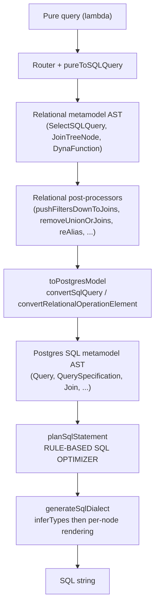

# The SQL Optimizer (SQL Planning)

> **Related docs:**
> [SQL Dialect Translation](sql-dialect-translation.md) | [Router & Pure-to-SQL](router-and-pure-to-sql.md) |
> [Architecture Overview](overview.md) | [Key Pure Areas](key-pure-areas.md) |
> [Execution Plans](execution-plans.md) | [Pre-Evaluation](preeval.md)

---

## 1. What this is

`legend-engine-xt-relationalStore-sqlPlanning-pure` (Pure repository
`core_external_store_relational_sql_planning`, package
`meta::external::store::relational::sqlPlanning`) is a **rule-based rewriter over the Postgres SQL
metamodel AST**. It sits between AST conversion and dialect rendering: it takes a `Query`, applies a
list of semantics-preserving transformations until a fixed point, and returns a `Query`.

```pure
function meta::external::store::relational::sqlPlanning::planSqlStatement(
  statement: Statement[1], config: SqlPlanningConfig[1], extensions: Extension[*]): Statement[1]
```

**What it is not**, and deliberately so today:

| Not | Detail |
|---|---|
| A cost-based optimizer | No statistics, no cardinality estimates, no cost model, no join reordering |
| A physical planner | It does not choose access paths or algorithms — the target database still does all of that |
| A validator | It assumes a well-formed AST; guards are about *applicability*, not correctness of the input |
| Dialect-aware rendering | Emission is entirely [SQL Dialect Translation](sql-dialect-translation.md)'s job |

The value proposition is narrower and more practical: **the SQL that the relational store generates
is machine-written and heavily nested**, because `pureToSQLQuery` composes per-property, per-join,
per-operation fragments independently. Filters land at the outermost level even when they select a
handful of rows from the innermost scan. Real databases often — but not always, and not
predictably across engines — push those predicates down themselves. Doing it in the engine makes the
behaviour deterministic and portable, and the emitted SQL legible to humans debugging it.

There are **two** rules in the module today (§7). The framework around them (§4–§6) is the durable
part, and is what §11's roadmap builds on.

---

## 2. Where it sits, and what actually reaches it

### 2.1 Pipeline position



Two properties of this position matter for every rule you will ever write here:

1. **The AST is untyped at planning time.** `inferTypes` — which resolves each `FunctionCall` to a
   `TypedFunctionCall` carrying its `SqlFunction` — runs inside `generateSqlDialect`, i.e. *after*
   planning. A rule that needs to know a function's return type, or a column's SQL type, cannot get
   it from the AST as it stands. See §10.
2. **The AST is dialect-agnostic Postgres.** Rules are therefore portable by default, and a rule
   that needs to be dialect-specific must say so explicitly through `DatabaseSupport` (§4.3) rather
   than by inspecting rendering config.

### 2.2 Reachability today

There are exactly two call sites, both in `core_relational`:

| Call site | Condition | Effect |
|---|---|---|
| `meta::relational::mapping::toSqlString` (`relationalMappingExecution.pure:450,465`) | `useDialectTranslation($s, $connection.type)` | Mapped **execution** — always plans when dialect translation applies |
| `meta::relational::functions::sqlDialectTranslation::relOpToString` (`sqlDialectTranslation.pure:124`) | `$shouldOptimize && $node->instanceOf(Query)` | **SQL-string generation** — plans only when the caller opts in |

```pure
// relationalMappingExecution.pure — the execution path
if(useDialectTranslation($s, $connection.type),
  | let query = $s->convertSqlQuery($extensions);
    let optimizedQuery = $query->planSqlStatement(^SqlPlanningConfig(dbType = $connection.type->toString()), $extensions);
    $optimizedQuery->toSqlDialect($connection, false, $useDbNative, $extensions);,
  | ... legacy sqlQueryToString ...
);
```

`shouldOptimize = true` is passed by exactly one family of callers — the two `SQLResult.toSQLString`
methods in `transform/fromPure/toSQLString.pure`, i.e. the "generate the SQL for this query" API.
Every other `relOpToString` caller passes `false`.

And `useDialectTranslation` is narrow:

```pure
function meta::relational::mapping::useDialectTranslation(r:RelationalOperationElement[1], dbType:DatabaseType[1]):Boolean[1]
{
  $dbType->in([DatabaseType.H2]) && (!$r->instanceOf(SQLQuery) || $r->instanceOf(SelectSQLQuery))
}
```

> **The net effect: the optimizer runs for H2 `SelectSQLQuery` only.** No other dialect reaches it in
> mapped execution today, because no other dialect reaches the AST-based rendering path at all. The
> rules' own `databaseSupport` is `AllDatabaseSupport` — they are *written* to be portable; they are
> simply never invoked for anything but H2. When reasoning about a production SQL shape on
> Snowflake or Databricks, the optimizer is not in the picture.

Note also the asymmetry this creates: the rules' unit tests run with `dbType = 'Postgres'` and the
Postgres dialect (§9), while production only exercises them against H2.

---

## 3. Where the code lives

```
legend-engine-xts-relationalStore/legend-engine-xt-relationalStore-generation/
└── legend-engine-xt-relationalStore-pure/
    └── legend-engine-xt-relationalStore-sqlPlanning-pure/     [core_external_store_relational_sql_planning]
        ├── sqlPlanner.pure                                    — entry point, config, module extension
        ├── utils.pure                                         — generic AST traversal + predicate helpers
        └── ruleBasedTransformation/
            ├── ruleBasedTransformation.pure                   — RuleBasedSqlTransformer, driver loop, test harness
            ├── multiRuleTests.pure                            — rule-interaction tests
            └── rules/
                ├── joinFilterPushDown/{joinFilterPushDown,joinFilterPushDownTests}.pure
                └── subQueryFilterPushDown/{subQueryFilterPushDown,subQueryFilterPushDownTests}.pure
```

Roughly 2,300 lines total, of which ~1,200 are test fixtures.

**Repository dependencies** (`core_external_store_relational_sql_planning.definition.json`):

```json
"dependencies": [
  "platform", "core_functions_standard", "core_functions_unclassified", "core_functions_json", "core",
  "core_external_store_relational_postgres_sql_model",     // the AST it rewrites
  "core_external_store_relational_postgres_sql_parser",    // tests parse SQL text
  "core_external_store_relational_sql_dialect_translation" // tests render SQL text
]
```

Note the direction: **`core_relational` depends on `sqlPlanning`, not the other way round.** The
optimizer knows nothing about mappings, runtimes, connections, or the relational metamodel. It knows
about SQL. This is the property that makes it reusable from any surface holding a Postgres AST
(§11.1).

The parser and dialect-translation dependencies exist **only for the test harness** — the parser is
declared in `ignoredUnusedDeclaredDependencies` in the pom for exactly that reason.

---

## 4. Core interfaces

### 4.1 `RuleBasedSqlTransformer` — one rule

```pure
Class <<typemodifiers.abstract>> meta::external::store::relational::sqlPlanning::ruleBasedTransformation::RuleBasedSqlTransformer
{
  name             : String[1];
  enabledByDefault : Boolean[1];
  databaseSupport  : DatabaseSupport[1];

  transformSqlQuery(query: Query[1], config: SqlPlanningConfig[1], debug: DebugContext[1], extensions: Extension[*])
  {
    fail('Needs to be implemented in sub classes'); ^TransformedQuery(hasChanged = false, query = $query);
  }: TransformedQuery[1];
}
```

A rule is a **class**, not a lambda — the same identity pattern used by `SqlFunction` and
`NodeProcessor` in dialect translation. Each concrete rule carries a class-level constraint pinning
its `name`, and ships a singleton constructor function:

```pure
Class ...joinFilterPushDown::JoinFilterPushDownRule extends RuleBasedSqlTransformer
[ $this.name == 'JoinFilterPushDown' ]
{
  transformSqlQuery(query, config, debug, extensions) { $query->pushFiltersIntoJoins() }: TransformedQuery[1];
}

function ...joinFilterPushDown::joinFilterPushDownRule(): JoinFilterPushDownRule[1]
{
  ^JoinFilterPushDownRule(name = 'JoinFilterPushDown', enabledByDefault = true, databaseSupport = ^AllDatabaseSupport())
}
```

The name is the rule's public identifier: it appears in debug traces and is the natural key for
future per-connection enable/disable (§11.5).

### 4.2 `TransformedQuery` — change tracking is part of the contract

```pure
Class TransformedQuery
{
  hasChanged: Boolean[1];
  query: Query[1];
}
```

Every rule must report whether it changed anything. This is not bookkeeping — it is the **termination
condition of the driver loop** (§5). A rule that returns `hasChanged = true` unconditionally causes
the loop to run all rules the full ten times on every query.

### 4.3 `DatabaseSupport` — how a rule scopes itself

```pure
Class <<typemodifiers.abstract>> DatabaseSupport
{
  isDatabaseTypeSupported(dbType: String[1]) { ... }: Boolean[1];
}

Class AllDatabaseSupport extends DatabaseSupport
{
  isDatabaseTypeSupported(dbType: String[1]) { true }: Boolean[1];
}

Class LimitedDatabaseSupport extends DatabaseSupport
{
  supportedDatabaseTypes: String[*];
  isDatabaseTypeSupported(dbType: String[1]) { $dbType->in($this.supportedDatabaseTypes) }: Boolean[1];
}
```

`LimitedDatabaseSupport` is the built-in hook for database-specific rules (§11.2). It is currently
**unused** — both shipped rules declare `AllDatabaseSupport` — but it is the mechanism a dialect-team
rule should reach for rather than branching on `$config.dbType` inside the transform.

### 4.4 `SqlPlanningConfig` — what a rule knows about its target

```pure
Class SqlPlanningConfig
{
  dbType : String[1];
}
```

One field. This is the extension point for anything a rule needs to know about the target that is
not in the AST — dialect capability flags, connection-level feature toggles, size hints. Follow the
`DbConfig` convention from dialect translation: **a new planning-wide input is a field here, not a
new parameter threaded through every rule.**

### 4.5 `SqlPlanningModuleExtension` — where extra rules come from

```pure
Class SqlPlanningModuleExtension extends ModuleExtension
[ $this.module == 'SqlPlanning' ]
{
  sqlPlanning_ruleBasedTransformation_extraRuleBasedSqlTransformers : RuleBasedSqlTransformer[*];
}
```

The standard Pure extension mechanism: `Extension.moduleExtension('SqlPlanning')` returns `[0..1]`,
so an extension that does not register planning rules simply contributes nothing.

**No module in the repository currently registers one.** The extension path is live code, exercised
only in the sense that it returns empty. §11.2 is about populating it.

---

## 5. The driver: rules to a fixed point

```pure
function executeRuleBasedTransformersOnQuery(query: Query[1], config: SqlPlanningConfig[1], rules: RuleBasedSqlTransformer[*], debug: DebugContext[1], extensions: Extension[*]): Query[1]
{
  $query->executeRuleBasedTransformersOnQueryTillFixedPointOrMaxIterations($config, $rules, 1, 10, $debug, $extensions).query
}
```

Each **iteration** folds every in-scope rule over the query in list order, ORing their `hasChanged`
flags. If any rule changed anything, the whole set runs again. The loop stops at a fixed point or
after **10 iterations**, whichever comes first.

```pure
let transformed = $rules->fold({t, agg |
  let res = $t.transformSqlQuery($agg.query, $config, $debug->indent(), $extensions);
  ^TransformedQuery(hasChanged = $res.hasChanged || $agg.hasChanged, query = $res.query);
}, ^TransformedQuery(hasChanged = false, query = $query));

if ($transformed.hasChanged,
    | $transformed.query->executeRuleBasedTransformersOnQueryTillFixedPointOrMaxIterations($config, $rules, $currentIteration + 1, $maxIterations, $debug, $extensions),
    | $transformed
);
```

Consequences worth internalising:

- **Rule order affects the path, not (in principle) the destination.** The default list is
  `[JoinFilterPushDown, SubQueryFilterPushDown]`; `multiRuleTests.pure` deliberately runs them in the
  opposite order and expects the same converged result. Re-running to a fixed point is what buys that
  robustness — one rule's output feeding the other's input is the normal case, not an accident.
- **Exceeding the iteration cap is silent.** At `$currentIteration > $maxIterations` the driver
  returns the current query with `hasChanged = false`. No warning, no log, no error. A
  non-converging rule pair therefore produces a *partially* optimized query and no signal. See §10.
- **Rules must be idempotent to converge.** The filter-push-down rules achieve this through
  `addClauseIfNotExisting` (§6.2), which refuses to add a predicate that is already present. Without
  that guard the rules would re-add the same clause every iteration and hit the cap with ten copies.

### Debug tracing

The driver is instrumented throughout with `print(if(!$debug.debug, |'', | ...))`, emitting per
iteration: the rule list, the starting query, per-rule changed/unchanged plus the updated SQL, and
the iteration result. Rendering for the trace goes through `printDebugQuery`, which builds a
throwaway `SqlDialectTranslationConfig` and calls `generateSqlDialect`.

Both production call sites pass `noDebug()`. To see a trace, call
`executeRuleBasedTransformersOnQuery` directly with a debug context (`^DebugContext(debug = true, space = '')`)
from the Pure IDE or a test — the fastest loop is the delta compiler
([guide](../guides/pure-ide-delta-compiler-debugging.md)).

> `printDebugQuery` is not free: it runs full type inference and rendering per rule per iteration.
> That is fine for a trace and unacceptable on a hot path — the `if(!$debug.debug, ...)` guard wraps
> the *argument*, so keep it that way if you add trace points.

---

## 6. The shared toolkit

Rules are short because `utils.pure` carries the mechanical weight. Anything reusable belongs here,
not in a rule.

### 6.1 Generic rewriting: `transformNodeRecursivelyWithChangeTracking`

The single most important function in the module. It applies a transform to a node, then recurses
into every `Node`-typed property, rebuilding only what changed:

```pure
function transformNodeRecursivelyWithChangeTracking(node: Node[1], transformFunction: Function<{Node[1]->NodeTransformationWithChangeTracking[1]}>[1]): NodeTransformationWithChangeTracking[1]
{
  let transformedNodeWithChangeTracking = $transformFunction->eval($node);
  let transformedNode = $transformedNodeWithChangeTracking.result;
  let nodeType = $transformedNode->type()->cast(@Class<Any>);
  let allProperties = $nodeType->hierarchicalAllProperties()->filter(x | $x->instanceOf(Property))->cast(@Property<Nil,Any|*>);
  ...
  if ($transformedNodeWithChangeTracking.hasChanged->concatenate($transformedKeyValuesWithChangeTracking.first)->or(),
      | changed($nodeType->dynamicNew($transformedKeyValuesWithChangeTracking.second)->cast(@Node)),
      | unchanged($node)
  );
}
```

Properties of this design:

- **Reflective, not generated.** It discovers properties via `hierarchicalAllProperties` and rebuilds
  via `dynamicNew`, so it works for *every* node type in the metamodel — including ones added later —
  with no visitor to maintain. The cost is reflection on every node of every query (§10).
- **Top-down.** The transform sees the node before its children; recursion then descends into the
  *transformed* node. A rule that rewrites a `QuerySpecification` will subsequently visit the
  children of its replacement, not the original's.
- **Type-checked.** Each rebuilt property value is asserted to be a subtype of the property's
  declared type, with a message naming the property and both types. Rules that return the wrong node
  shape fail loudly at the point of the mistake.
- **Structurally conservative.** Unchanged sub-trees are returned by identity; only the spine above a
  change is reconstructed.

Paired helpers `changed(node)` / `unchanged(node)` wrap results in
`NodeTransformationWithChangeTracking`, and read well at rule sites.

### 6.2 Predicate analysis

| Helper | Purpose |
|---|---|
| `identifySingleColumnFilterGroups(expr)` | Split a predicate into `(column, sub-predicate)` pairs where the sub-predicate references **exactly one** column and contains no `SubqueryExpression`. Descends through `AND` only. |
| `isAndExpression` / `isOrExpression` / `isEqualsExpression` | Shape tests over `LogicalBinaryExpression` / `ComparisonExpression` |
| `addClauseIfNotExisting(expr, toAdd)` | `AND` a clause onto a predicate unless an equal node is already present — the idempotence guard (§5) |
| `isQueryPlainQuerySpecification(query)` | The query body is a `QuerySpecification` with no `limit`, `orderBy`, or `offset` |
| `extractOrderedJoins(qs \| join)` | Flatten a left-deep `Join` spine into source order |
| `fetchAllSubNodesRecursively(node)` / `...WithFilter(node, stop)` | Collect descendants, optionally pruning sub-trees (used to stop at `TableSubquery` boundaries) |

`identifySingleColumnFilterGroups` is the heart of both current rules, and its restrictions define
their reach: **conjunctions of single-column predicates, no `OR`, no correlated sub-queries.**
`WHERE a = 1 AND f(b) > 2` yields two groups; `WHERE a = 1 OR b = 2` yields none.

---

## 7. The rules today

### 7.1 `SubQueryFilterPushDown`

Pushes an outer predicate into the derived table it constrains, rewriting outer column references to
the sub-query's underlying expressions. The outer predicate is **kept** — pushing down is additive,
which is what makes it safe and order-independent.

```sql
-- before
SELECT root.* FROM ( SELECT root.FIRSTNAME AS FIRSTNAME, root.AGE AS AGE FROM personTable AS root ) AS root
WHERE root.AGE = 22

-- after
SELECT root.* FROM ( SELECT root.FIRSTNAME AS FIRSTNAME, root.AGE AS AGE FROM personTable AS root
                     WHERE root.AGE = 22 ) AS root
WHERE root.AGE = 22
```

It fires in two positions, both handled by one transform function:

- **Root relation** of a `QuerySpecification` — via `findRootRelationWithAlias`, walking left through
  the join spine — pushing from `WHERE`.
- **Right side of a `Join`** — pushing from the join's `ON` expression.

`findRootRelationWithAlias` and `replaceRootTableSubquery` are a matched pair (both carry a
`// Needs to be in sync with below/above function` comment): one locates the target, the other
substitutes it back. Change one and you must change the other.

**`GROUP BY` handling.** `pushSingleFilter` decides between `WHERE` and `HAVING`: a predicate on a
grouping column becomes an inner `WHERE`; anything else would have to become a `HAVING`. In practice
the aggregate case is declined, because the rule additionally requires the matching select item's
expression to be a bare `QualifiedNameReference` (an aggregate like `count(root.ID)` is not), so
`... AND TradeCount > 2` stays outside. The `HAVING` branch exists and is reachable in principle;
`testPushDownWithGroupBy` documents the current behaviour precisely.

**Guards** — the rule declines when:

| Condition | Why |
|---|---|
| Sub-query has `LIMIT` or `OFFSET` | Filtering before the row cut changes which rows survive |
| Sub-query (outside nested `TableSubquery`s) contains a `Window` | Filtering changes the window frame, hence the values |
| Sub-query is not a plain `QuerySpecification` (has its own `ORDER BY`/`LIMIT`/`OFFSET`) | Same class of problem |
| Select item is `AllColumns` (`SELECT *`) | No mapping from outer name to inner expression |
| The join spine contains `RIGHT` or `FULL` outer joins | Null-extended rows make predicate placement non-equivalent |
| The predicate is not a single-column conjunct (`OR`, multi-column, correlated) | `identifySingleColumnFilterGroups` yields nothing |

The window guard is deliberately depth-limited: `fetchAllSubNodesRecursivelyWithFilter({n | $n->instanceOf(TableSubquery)})`
stops at nested sub-query boundaries, so a window *further inside* a nested derived table does not
block a push at this level. `testPushDownWithNestedWindowColumn` pins that.

### 7.2 `JoinFilterPushDown`

Propagates single-column predicates across join equalities into the `ON` clause, so the joined
relation is filtered before or during the join rather than after it.

```sql
-- WHERE t1.TradeID = 1, joined ON (t1.TradeID = t3.TradeID)
-- becomes ON (t1.TradeID = t3.TradeID AND t3.TradeID = 1)
```

The mechanism: for each join, take the equality conjuncts of the `ON` expression whose sides are both
`QualifiedNameReference`s; for each side that has a filter group in scope, rewrite that group's
predicate with the *other* side substituted in, and `AND` it onto the join criteria. Derived filters
are fed back into `filterPairs` (`JoinFilterPushDownIntermediateResult`) so they can propagate along a
multi-join chain — `testMultiJoinPushDown` covers that.

Filters already scoped to the join's own right-hand alias are excluded (`$fp.first.name.parts->at(0) != $targetAlias`):
they are already applied there, and re-adding them is noise.

**Guards** — `isFromSupportedForJoinFilterPushDown` requires a single `from` that is a `Join`, and
recursively:

| Requirement | Note |
|---|---|
| `criteria` present and a `JoinOn` | `NaturalJoin` / `JoinUsing` are out of scope |
| `type` is `INNER` or `LEFT` | `RIGHT`/`FULL` excluded for the null-extension reason above |
| `left` is an `AliasedRelation` or a supported `Join` | Left-deep spines only |
| `right` is an `AliasedRelation` | Aliases are required to attribute columns |

`OR` anywhere in the filter or the join criteria disables the rewrite
(`testNoPushDownWithOrInFilter`, `testNoPushDownWithOrInJoin`).

### 7.3 Composition

The two rules feed each other, which is the reason for the fixed-point loop.
`multiRuleTests::testJoinAndSubQueryFilterPushDown` is the canonical illustration: an outer
`WHERE tradetable_0.TradeID = 1` ends up (a) in both inner derived tables' `WHERE`, (b) on the inner
join's `ON`, and (c) still on the intermediate `QuerySpecification` — four placements from one
predicate, none of which any single rule produces alone.

### 7.4 The legacy sibling: relational-metamodel post-processors

Filter push-down exists **twice** in this codebase, at two different layers:

| | `postProcessor::filterPushDown::pushFiltersDownToJoins` | `sqlPlanning` rules |
|---|---|---|
| AST | Relational metamodel (`SelectSQLQuery`, `JoinTreeNode`) | Postgres SQL metamodel (`Query`, `Join`) |
| Runs | Always, for every dialect, in `sqlQueryDefaultPostProcessors()` | Only on the dialect-translation path (H2) |
| Registration | Hardcoded list in `defaultPostProcessor.pure` | Default list + extension-contributed rules |
| Scope | Also handles `tryPushFiltersIntoSubQuery` | Same two transformations, re-expressed |

They are independent implementations of overlapping ideas, and on the H2 path **both** run — the
post-processor on the relational AST before conversion, the rules on the SQL AST after. This is the
same "two frameworks, one concept" hazard called out in the dialect-translation doc: when a filter
appears somewhere unexpected in generated SQL, establish *which layer* put it there before changing
anything.

Other members of the legacy family worth knowing, because §11.3 proposes SQL-AST equivalents:
`removeUnionOrJoinsPostProcessor` (prunes unions/joins not contributing to the result — and, notably,
already implements the dbType + connection-feature gating that the SQL planner still has as a TODO),
`cteExtractionPostProcessor`, `reAliasQuery`, `trimColumnNamePostProcessor`.

---

## 8. Extension and configuration

```pure
function fetchInScopeRuleBasedTransformers(config: SqlPlanningConfig[1], extensions: Extension[*]): RuleBasedSqlTransformer[*]
{
  let defaultTransformers = defaultRuleBasedSqlTransformers();
  let extensionTransformers = $extensions->map(e | $e.moduleExtension('SqlPlanning')->cast(@SqlPlanningModuleExtension).sqlPlanning_ruleBasedTransformation_extraRuleBasedSqlTransformers);
  let allTransformers = $defaultTransformers->concatenate($extensionTransformers);

  let filteredTransformers = $allTransformers->filter({t |
    if ($t.databaseSupport.isDatabaseTypeSupported($config.dbType),
        | if ($t.enabledByDefault,
              | // TODO: Check if excluded in connection
                true,
              | // TODO: Check if included in connection
                false
          ),
        | false
    )
  });
}
```

Selection is two-stage — database support, then enablement — and the enablement stage is
**unimplemented**. Today `enabledByDefault = false` means "dead code": there is no way to switch a
rule on. Both shipped rules therefore set it to `true`. §11.5 proposes the wiring.

---

## 9. Testing

### The harness

```pure
function runSqlRuleBasedTransformationTest(originalQuery: String[1], expectedQuery: String[1], rules: RuleBasedSqlTransformer[*]): Boolean[1]
{
  runSqlRuleBasedTransformationTest($originalQuery, $expectedQuery, $rules, ^SqlPlanningConfig(dbType = 'Postgres'), postgresSqlDialectExtension())
}
```

Parse SQL text → run the rules to a fixed point → pretty-print through the Postgres dialect →
`assertEquals` against expected SQL text. Tests are therefore written entirely in SQL, which makes
them readable and reviewable — the multi-rule test reads as a before/after pair of formatted
statements with inline comments explaining each placement.

Collected by `<<test.Test>>` under `meta::external::store::relational::sqlPlanning` and run by
`Test_Pure_ExternalStoreRelationalSqlPlanning`.

### Coverage today

| Suite | Tests | Emphasis |
|---|---|---|
| `subQueryFilterPushDownTests` | 15 | Column renaming, existing filters, joins, group-by, multi-column, nested pushes; negatives for `SELECT *`, `OR`, `LIMIT`/`OFFSET`, windows, `RIGHT`/`FULL` joins |
| `joinFilterPushDownTests` | 6 | Simple, complex operators, multi-join chains; negatives for `OR` in filter, `OR` in join, `RIGHT`/`FULL` joins |
| `multiRuleTests` | 1 | Rule interaction and convergence |

Negative tests — "this must **not** be rewritten" — are roughly a third of the suite, which is the
right ratio for a rewriter whose failure mode is silent wrong answers.

`TestCoreExternalStoreRelationalSqlPlanningCompiledStateIntegrity` is `@Ignore`d, with
`testReferenceUsages` overridden as `@Test(expected = AssertionError.class)` — the module's compiled
state does not currently satisfy the standard integrity checks.

### The gap

**Every test asserts SQL text; none asserts query results.** Nothing verifies that an optimized query
returns the same rows as the original against a real database. A guard that is subtly too permissive
— a window case, a null-extension case, a `HAVING` placement — produces valid SQL with different
semantics, and the suite passes.

The pattern to copy is SDT ([SQL Dialect Translation §8](sql-dialect-translation.md#8-testing)): set
up data, execute, compare rows. For an optimizer the natural shape is stronger still — execute
*both* the original and the optimized query against the same fixture and assert identical result
sets, which needs no hand-written expectations. See §11.6.

---

## 10. Known limitations

Ordered roughly by how likely each is to bite.

1. **Reachable only for H2.** §2.2. The rules are portable; the path to them is not.
2. **No execution-level verification.** §9.
3. **Untyped AST.** `inferTypes` runs after planning, so no rule can consult a column's type, a
   function's return type, or nullability. This rules out an entire class of rewrites (constant
   folding with type-correct literals, null-aware simplification, safe cast removal) until either
   planning runs after inference or the planner resolves types itself.
4. **No schema access.** The AST references tables by `QualifiedName`. There is no `Database`,
   no column list, no key or index metadata. Column pruning through a `SELECT *` (`AllColumns`), or
   any rule needing "which columns does this table actually have", is blocked on this.
5. **Silent iteration-cap truncation.** §5. A rule pair that oscillates yields a half-optimized query
   and no diagnostic.
6. **`enabledByDefault = false` is unusable.** §8.
7. **Reflective traversal cost.** `transformNodeRecursivelyWithChangeTracking` calls
   `hierarchicalAllProperties` and `dynamicNew` per node, per rule, per iteration. On a large
   generated query with two rules and several iterations this is a meaningful multiplier, and it
   grows linearly with the rule count. Nobody has profiled it — see §11.6.
8. **`OR` is a hard wall.** `identifySingleColumnFilterGroups` descends `AND` only. Predicates in
   disjunctive form are invisible to both rules. Normalising to CNF first would widen both rules
   considerably, at the cost of a normalisation rule that must itself terminate.
9. **Left-deep join spines only.** `extractOrderedJoins` walks `$j.left`; a right-nested join tree is
   skipped rather than mis-handled, but it is skipped.
10. **Statement types other than `Query` fail loudly.** `planSqlStatement` calls `fail(...)` for any
    other `Statement`. Fine today (only `Query` reaches it), but an `Insert`/`Update` surface would
    need the match arm extended rather than a caller-side guard.

---

## 11. Future scope

This section is a design direction, not a committed plan. It is written so that a rule contributed
next quarter lands in the shape the framework already implies.

### 11.1 Widening reachability

Three surfaces, in increasing order of effort:

1. **Legend SQL / the Postgres server.** `legend-engine-xts-sql` and the `postgresSql` grammar parse
   user SQL into *exactly* the metamodel this module rewrites. No conversion step, no dialect gating
   — `planSqlStatement` could be applied directly to a parsed statement. This is the cheapest new
   consumer and the one with the most hand-written (hence most improvable) SQL.
2. **More dialects on the AST rendering path.** Broadening `useDialectTranslation` beyond H2 brings
   the optimizer along automatically. That decision belongs to dialect translation, not here, but the
   optimizer should be part of its acceptance criteria: each newly-enabled dialect wants its SQL
   fixtures regenerated *with* planning on.
3. **The legacy `sqlQueryToString` path.** Not recommended. Re-implementing rules on the relational
   metamodel duplicates §7.4's split rather than closing it. The strategic direction is to converge
   on the SQL AST, which argues for investing in (2).

### 11.2 Module organization for database-specific rules

The framework is already shaped for this; what is missing is the first instance. Proposed shape,
mirroring how dialects are organised:

```
legend-engine-xt-relationalStore-pure/
└── legend-engine-xt-relationalStore-sqlPlanning-pure/          [core_external_store_relational_sql_planning]
    ├── sqlPlanner.pure                       — entry, config, module extension  (unchanged)
    ├── utils.pure                            — traversal + predicate toolkit    (grows)
    └── ruleBasedTransformation/
        ├── ruleBasedTransformation.pure      — driver, rule interface, harness
        └── rules/                            — PORTABLE rules only
            ├── filterPushDown/{joinFilterPushDown,subQueryFilterPushDown}/
            ├── projection/{unusedColumnTrimmer,redundantProjectionMerge}/
            ├── subquery/{redundantSubselectElimination,unusedCteElimination}/
            └── expression/{predicateSimplification,constantFolding}/

legend-engine-xt-relationalStore-dbExtension/
├── ...-snowflake/...-snowflake-sqlPlanning-pure/   [<>_sql_planning_snowflake]  — Snowflake-only rules
├── ...-duckdb/...-duckdb-sqlPlanning-pure/         — DuckDB-only rules
└── ...-databricks/...-databricks-sqlPlanning-pure/ — Databricks-only rules
```

Rules of the road for that split:

- **Default to portable.** A rule belongs in a db module only if it is *unsound or useless*
  elsewhere, not merely most valuable there. Portable rules scoped with `LimitedDatabaseSupport` are
  the middle ground and should be preferred over a separate module while the list is short.
- **Db modules register through `SqlPlanningModuleExtension`**, exactly as dialect modules register
  `SqlDialect`s — no compile-time dependency from the core module to any db module, and the
  `core_relational`-must-not-depend-on-dialects constraint stays satisfied.
- **Db modules may depend on their dialect module.** A Snowflake rule that rewrites to `QUALIFY`
  needs to know the dialect supports it; co-locating with the dialect makes that a local fact.
- **Grouping rules by concern, not by one-file-per-rule,** once the count grows: the current
  `rules/<ruleName>/{rule,ruleTests}.pure` convention is right for a handful and will need a
  category level (shown above) beyond about a dozen.

Naming: keep the `<name>Rule` class / `<name>Rule()` constructor / `'<Name>'` string triple
consistent — the name string is what config (§11.5) and traces key on.

### 11.3 Rule catalogue roadmap

Drawn from the standard rule sets — Calcite's `RelOptRule` catalogue and `RelFieldTrimmer`, and
DuckDB's optimizer passes — restricted to what is expressible on a *SQL* AST (as opposed to a
relational-algebra IR with schema and statistics). Roughly in dependency order:

#### Tier 1 — structural, no type or schema information needed

| Rule | What it does here | Calcite / DuckDB analogue | Notes |
|---|---|---|---|
| **Unused column trimmer** | Drop select items of a derived table that no enclosing scope references; recurse outward-in | `RelFieldTrimmer`; DuckDB `RemoveUnusedColumns` | The single highest-value rule for engine-generated SQL, which routinely projects every mapped column through six levels of nesting. Requires name-resolution scaffolding (§11.4) and must decline on `AllColumns`, `SELECT DISTINCT`, and any `ORDER BY`/`GROUP BY` referencing the alias |
| **Redundant subselect elimination** | Collapse `SELECT a AS a, b AS b FROM (...) AS x` where the inner is a plain `QuerySpecification` and the outer adds nothing but renaming | `ProjectMergeRule` + `ProjectRemoveRule` | The natural companion to the trimmer: trimming makes wrappers trivial, elimination then removes them. Blocked by `DISTINCT`, `LIMIT`/`OFFSET`, windows, set operations, and duplicated aliases |
| **Trivial projection merge** | Merge adjacent `QuerySpecification`s where the outer only re-projects inner expressions | `ProjectMergeRule` | Weaker, safer form of the above; a good first rule for someone learning the framework |
| **Filter merge** | `WHERE a AND (b AND c)` → flattened conjunct list; deduplicate equal conjuncts | `FilterMergeRule` | Cleans up after push-down, which is additive by design; makes generated SQL markedly more readable |
| **Limit push-down / Top-N** | Push `LIMIT` into a derived table when ordering and filtering permit | DuckDB `TopN`, `LimitPushdown` | Narrow applicability given the current `LIMIT` guards, but high payoff when it fires |
| **`UNION ALL` flattening** | Collapse nested unions into one n-ary set operation | `UnionMergeRule` | Interacts with `removeUnionOrJoins` (§7.4) — decide which layer owns it |
| **Unused CTE elimination** | Drop `WITH` entries no longer referenced after other rules fire | — | Only relevant once the CTE post-processor's output reaches this layer |
| **Empty-relation pruning** | Propagate `WHERE FALSE` / empty `IN ()` upward, pruning branches | `PruneEmptyRules`; DuckDB empty-result pull-up | Rare in generated SQL, common in user SQL — pairs with §11.1's Legend SQL surface |

#### Tier 2 — needs type information (i.e. planning after `inferTypes`, §10.3)

| Rule | What it does | Analogue |
|---|---|---|
| **Constant folding** | Evaluate literal-only expressions; simplify `x AND TRUE`, `x OR FALSE`, `NOT NOT x` | `ReduceExpressionsRule`; DuckDB expression rewriter |
| **Comparison simplification** | `x = x` → `x IS NOT NULL`, range merging, `BETWEEN` canonicalisation | DuckDB `ComparisonSimplification` |
| **Redundant cast removal** | Drop casts to a type the expression already has | DuckDB expression rewriter |
| **`IN`-list rewriting** | Small `IN` lists → `OR` chains, or the reverse, per dialect cost | DuckDB `InClauseRewriter` |
| **Common subexpression elimination** | Hoist a repeated expression into a derived column | DuckDB CSE |

#### Tier 3 — needs schema, keys, or statistics

| Rule | Blocked on |
|---|---|
| **Join elimination** (drop a join whose columns are unused and whose key guarantees one match) | Foreign-key/uniqueness metadata — available in the relational `Database` model, *not* in the SQL AST |
| **`DISTINCT` / `GROUP BY` removal** on already-unique output | Same |
| **Sub-query decorrelation** (`EXISTS`/`IN` → semi-join) | Correlation analysis; the biggest single win for user-written SQL, and the largest piece of work |
| **Join reordering** | Cardinality statistics — i.e. a cost model. Genuinely out of scope: the target databases do this better, with statistics we do not have |

The honest framing for Tier 3: **most of it should stay the database's job.** Legend's advantage is
structural — it knows the query is machine-generated and over-nested — not statistical.

### 11.4 Framework work the catalogue implies

The catalogue above is gated less by rule logic than by missing infrastructure. In rough priority:

1. **A name/scope resolver.** "Which output columns of this derived table does anything above it
   reference?" is the precondition for the trimmer, elimination, and most Tier 1 rules. It belongs in
   `utils.pure` as a shared analysis, computed once per rewrite rather than per rule, and it must
   handle alias shadowing, `AllColumns`, and references from `ORDER BY`/`GROUP BY`/`HAVING`.
2. **Rule metadata.** `RuleBasedSqlTransformer` currently carries name, enablement, and db support.
   Rules with phase ordering and idempotence characteristics want: `phase` (normalize → simplify →
   pushdown → cleanup), `idempotent: Boolean`, and a short `description` for diagnostics. Phases let
   the driver run cheap normalisation once instead of on every fixed-point iteration.
3. **Convergence diagnostics.** Replace the silent cap (§10.5) with a warning naming the rules that
   were still reporting changes on the final iteration. Cheap, and it converts a silent
   half-optimization into an actionable signal.
4. **Traversal performance.** Either memoize `hierarchicalAllProperties` per node class or generate a
   typed visitor. Worth measuring before building (§11.6).
5. **Type information at planning time.** Deciding whether `inferTypes` moves ahead of
   `planSqlStatement`, or the planner runs its own resolution, unblocks all of Tier 2. Moving
   inference earlier is the smaller change, but rules that rewrite function calls would then have to
   maintain typed nodes correctly.

### 11.5 Enablement and configuration

The two TODOs in `fetchInScopeRuleBasedTransformers` should resolve onto the mechanism that already
exists for relational generation features:

```pure
Class meta::external::store::relational::runtime::GenerationFeaturesConfig extends RelationalQueryGenerationConfig
[ noDuplicatesBetweenEnabledAndDisabled: ..., knownFeatures: ... ]
{
  enabled: String[*];
  disabled: String[*];
}
```

Connections carry `queryGenerationConfigs`, the grammar parses them, and
`removeUnionOrJoinsPostProcessor` already demonstrates the full pattern: default-on for a set of
dbTypes, overridable per connection in both directions, with feature names registered in
`knownGenerationFeatures()` so a typo fails compilation rather than silently doing nothing.

Concretely:

- Register each rule's `name` (or a `SQL_PLANNING_<RULE>` string) in `knownGenerationFeatures()`.
- Extend `SqlPlanningConfig` with the resolved enable/disable sets — resolution happens at the call
  site, which has the connection; the planner stays connection-agnostic (§3).
- Implement the two TODO branches: `enabledByDefault && !disabled->contains(name)` and
  `!enabledByDefault && enabled->contains(name)`.
- Keep the precedence rule explicit and documented, as `useDbNativeImplicitNullOrdering` does.

This also gives operations a per-connection kill switch for a misbehaving rule, which is a
prerequisite for enabling anything non-trivial by default.

### 11.6 Testing and benchmarking evolution

| Layer | Proposal |
|---|---|
| **Rule unit tests** | Keep the SQL-text harness as-is. It is readable and reviewable — the strongest thing about the current suite |
| **Equivalence tests** | New: execute original and optimized query against a real fixture database and assert identical result sets. No hand-written expectations, and it directly targets the failure mode the text tests cannot see (§9) |
| **Property tests** | Assert idempotence (`rules(rules(q)) == rules(q)`) and convergence-within-cap for every rule, generically, over the whole fixture corpus |
| **Cross-suite regression** | `Test_Pure_Relational` (~2,765 tests) is the existing net for SQL-shape changes; expect churn in fixtures whenever a rule is enabled for a new dialect |
| **Benchmarks** | The repository gained a pipeline performance benchmark that runs on PRs — the right place to measure both rewriter overhead (§10.7) and generated-SQL improvement, so a rule that costs more to apply than it saves is visible |

### 11.7 On cost-based optimization

Worth stating explicitly so it stops being an open question: **a cost-based optimizer is not the
direction.** It would need statistics Legend does not collect, about data it does not own, to
out-guess optimizers that have both. The compelling scope is everything that makes generated SQL
structurally closer to what a competent human would write — pruning, flattening, push-down,
simplification — after which the target database's own optimizer has a much easier problem. Tier 3
above is the boundary, and most of it sits on the far side.

---

## 12. Adding a rule — checklist

1. `rules/<category>/<ruleName>/<ruleName>.pure`: the `RuleBasedSqlTransformer` subclass with its
   name constraint, plus the `<ruleName>Rule()` constructor. Keep the rule class thin — a single
   delegation to a private transform function, as both shipped rules do.
2. Put the mechanics after a `###Pure` section break in the same file (both rules follow this), and
   anything reusable in `utils.pure`.
3. Return `hasChanged` **honestly**, and make the rule idempotent — re-applying it to its own output
   must be a no-op (§5). `addClauseIfNotExisting` is the model.
4. Guard first, transform second. Write the applicability predicate as a named function
   (`isFromSupportedForJoinFilterPushDown`) rather than inline conditions; it is the part reviewers
   need to read.
5. Register in `defaultRuleBasedSqlTransformers()` — or, for a db-specific rule, in that db module's
   `SqlPlanningModuleExtension` (§11.2).
6. Scope with `LimitedDatabaseSupport` if it is not universally sound.
7. Tests in `<ruleName>Tests.pure`: positives, **and a negative per guard**. State the reason in a
   comment next to the expected SQL, as the existing fixtures do.
8. If the rule can interact with an existing one, add a `multiRuleTests.pure` case and verify it
   converges in **both** rule orders.
9. `mvn clean install -DskipTests -pl <sqlPlanning module path>` — always `clean` for Pure-source
   modules — then run `Test_Pure_ExternalStoreRelationalSqlPlanning`.
10. Check the downstream blast radius: enabling a rule changes generated SQL for H2, so
    `Test_Pure_Relational` fixtures will move.

---

## 13. Notes for maintainers

**Know which layer you are looking at.** Filter push-down exists on the relational metamodel
(post-processor) and on the SQL metamodel (this module), and on H2 both run. Before changing either,
confirm which one produced the SQL in front of you (§7.4).

**H2-only is the single most surprising fact here.** Rules are written and tested as portable, run in
tests under Postgres, and in production serve H2 alone. Read `useDialectTranslation` before
concluding that an optimization is or is not live for a given database (§2.2).

**Additive rewrites are the safe default.** Both current rules *add* predicates and never remove the
original. That is why they compose in any order and why they are hard to get semantically wrong. The
Tier 1 roadmap rules are mostly *subtractive* (removing columns, removing wrappers) — a categorically
riskier class that genuinely needs the equivalence testing in §11.6 before being enabled by default.

**`hasChanged` is load-bearing.** Getting it wrong does not produce a wrong query; it produces a
query that is silently re-optimized ten times, or one that stops one rewrite short. Neither shows up
as a test failure.

**Rebuild semantics.** `transformNodeRecursivelyWithChangeTracking` reconstructs nodes with
`dynamicNew` from `hierarchicalAllProperties`. Non-`Node` properties are carried across as-is and
qualified properties are excluded. A node type whose meaning depends on something outside its
declared properties will not survive the round trip.

**Debug output is behind a guard for a reason.** `printDebugQuery` runs type inference and full
rendering. Keep new trace points inside `if(!$debug.debug, |'', | ...)` so the argument is not
evaluated when tracing is off — and keep expensive metadata lookups out of them entirely.

**Pure gotchas that produce misleading errors** (shared with dialect translation, repeated because
they cost real time):
- `native` is a reserved keyword; `let native = ...` fails with an error pointing at the `let`.
- Every statement in a multi-statement function or lambda body needs a trailing `;`, including the
  last one.
- Deeply nested `let` inside `if` branches is parser-fragile — extract helper functions.

**Build gotcha:** always `mvn clean install` for this module. A stale `target/classes` makes the PAR
plugin find two copies of `core_external_store_relational_sql_planning` and fail with
`The code repository <name> already exists!`.
