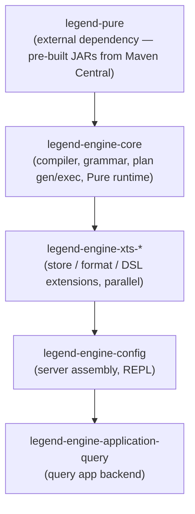
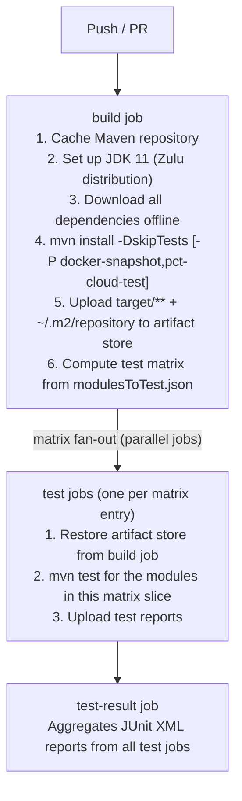

# Build & CI Guide

## 1. Full Maven Build Lifecycle

The build is driven by the root `pom.xml` at `legend-engine/pom.xml`. The module reactor
order is determined by the `<modules>` declaration and inter-module dependency graph.



### Build commands

```bash
# Fast build — skip tests, 4 parallel threads
mvn install -DskipTests -T 4

# Full build with tests
mvn install -T 4

# Build a single module and all its dependencies
mvn install -pl <module-path> -am -DskipTests

# Build with verbose output for debugging
mvn install -DskipTests -e -X 2>&1 | head -200
```

### Maven properties that affect the build

| Property | Default | Effect |
|----------|---------|--------|
| `skipTests` | `false` | Skip test execution (sources still compiled) |
| `maven.compiler.source` / `.target` | `1.8` | Compiler source/target level (enforced as Java 8 bytecode) |
| `maven.compiler.release` | `8` | Combined source+target+bootclasspath |
| `maven.enforcer.requireJavaVersion` | `[11.0.10,12)` | Enforces JDK 11 at build time |
| `surefire.vm.params` | see root POM | JVM args for test forks: timezone, soft-ref LRU policy |
| `dependencies.failOnWarning` | `true` | `maven-dependency-plugin:analyze` fails on unused declared deps |

---

## 2. Key Maven Plugins

| Plugin | Version property | Purpose |
|--------|-----------------|---------|
| `maven-compiler-plugin` | `maven.compiler.plugin.version` | Java compilation (source/target 8, runtime JDK 11) |
| `maven-surefire-plugin` | `maven.surefire.plugin.version` | Test execution; configured with JVM params |
| `maven-checkstyle-plugin` | `maven.checkstyle.plugin.version` | Enforces `checkstyle.xml` rules on `.java`, `.xml`, `.pure` files |
| `maven-enforcer-plugin` | `maven.enforcer.plugin.version` | Enforces JDK 11, Maven 3.6.2+, no banned dependencies |
| `maven-dependency-plugin` | `maven.dependency.plugin.version` | Dependency analysis; fails on unused declared / used undeclared deps |
| `jacoco-maven-plugin` | `jacoco.maven.plugin.version` | Code coverage instrumentation and reporting |
| `maven-shade-plugin` | `maven.shade.plugin.version` | Assembles fat JARs for the server and REPL |
| `maven-source-plugin` | `maven.source.plugin.version` | Attaches source JARs for publishing |
| `maven-javadoc-plugin` | `maven.javadoc.plugin.version` | Generates and attaches Javadoc JARs |
| `antlr4-maven-plugin` | (via `antlr.version`) | Generates lexer/parser Java from `.g4` grammar files |
| `build-helper-maven-plugin` | `build-helper.maven.plugin.version` | Adds extra source/resource directories |
| `depgraph-maven-plugin` | `depgraph-maven-plugin.version` | Generates module dependency graphs (DOT format) |
| `exec-maven-plugin` | `exec.maven.plugin.version` | Runs external executables (e.g. npm build steps) |
| `google.maven.download.plugin` | `google.maven.download.plugin.version` | Downloads external artifacts during build |

### Generating a dependency graph

```bash
# Generate DOT graph for the entire project
mvn com.github.ferstl:depgraph-maven-plugin:graph \
  -DshowGroupIds=true -DshowVersions=true \
  -DgraphFormat=dot

# Output: target/dependency-graph.dot
# Render: dot -Tpng target/dependency-graph.dot -o deps.png
```

---

## 3. Maven Profiles

| Profile | Activation | Purpose |
|---------|-----------|---------|
| `docker-snapshot` | Manual (`-P docker-snapshot`) | Builds and pushes Docker snapshot image to Docker Hub. Used on `master` branch CI. |
| `pct-cloud-test` | Manual (`-P pct-cloud-test`) | Activates PCT tests that require cloud credentials (Snowflake, BigQuery, etc.). Only runs in CI when secrets are available. |
| `integration-test` | Manual (`-P integration-test`) | Activates Testcontainers-based integration tests requiring Docker. |

---

## 4. ANTLR4 Grammar Build

Grammar files (`.g4`) live in `src/main/antlr4/` of grammar modules. The
`antlr4-maven-plugin` runs during `generate-sources` and writes generated Java to
`target/generated-sources/antlr4/`.

> **legend-pure build pipeline:** `legend-engine`'s build is downstream of the `legend-pure`
> plugin pipeline. The Pure-specific build steps — PAR file generation, Java code-gen from Pure,
> and PCT report generation — are driven by `legend-pure` Maven plugins that run *before* the
> ANTLR4 step. See the
> [legend-pure Maven Plugins Reference](https://github.com/finos/legend-pure/blob/main/docs/reference/maven-plugins-reference.md)
> for the full goal/parameter reference for `legend-pure-maven-generation-par`,
> `-generation-java`, and the PCT plugin. `legend-engine` does **not** re-compile core Pure
> at build time; it consumes the pre-compiled PAR/JAR outputs that `legend-pure` publishes
> to Maven Central.

**Key grammar modules:**

- `legend-engine-language-pure-grammar` — core domain, mapping, runtime, connection grammars
- Each `xts-*` module with a `-grammar` sub-module adds its own `.g4` files

**Adding a new grammar section:**

1. Create `.g4` files in `src/main/antlr4/`.
2. Write a `SectionParser` that calls the ANTLR parser and produces protocol POJOs.
3. Register via `PureGrammarParserExtension` in `META-INF/services/`.
4. Write a `SectionComposer` and register via `PureGrammarComposerExtension`.
5. Add a round-trip test (`grammar → JSON → grammar`).

---

## 5. GitHub Actions CI Pipeline

The CI pipeline is defined in `.github/workflows/build.yml`.

### Workflow triggers

- `push` to `master`
- `pull_request` targeting `master`

Concurrent runs on the same PR branch are cancelled automatically.

### Pipeline stages



**On `master` only:** the `build` job also runs with `-P docker-snapshot` to build and
push a Docker snapshot image to Docker Hub under `finos/legend-engine`.

### Test matrix

The matrix is defined in `.github/workflows/resources/modulesToTest.json`. Each entry
lists the Maven module name(s) to test in that job. Key groups:

| Group | What it covers |
|-------|---------------|
| `server` | Full server integration tests |
| `core` | Pure compiled core, function extensions |
| `javaBinding` | Java platform binding PCT |
| `sql` | SQL grammar, pure, HTTP API, reverse-PCT |
| `relational` | Relational store execution, H2 dialect |
| `relationalDialects` | Postgres, Snowflake, BigQuery, DuckDB, Oracle, etc. |
| `graphQL` | GraphQL compiler, pure, HTTP API |
| `service` | Service DSL, execution, test runner |
| `persistence` | Persistence DSL and test runner |
| `authentication` | Authentication grammar and implementation |
| `analytics` | Analytics APIs |
| `changeToken` | Change-token compiler and tests |

### Adding a new module to CI testing

1. Add an entry to `.github/workflows/resources/modulesToTest.json`.
2. If the module needs cloud credentials (PCT cloud tests), add it under the
   `pct-cloud-test` profile block.

---

## 6. Docker Images

The `legend-engine-config/legend-engine-server` module produces a Docker image via the
`dockerfile-maven-plugin`. The image:

- Base: `eclipse-temurin:11-jre`
- Exposes port `6300`
- Entrypoint: `java -jar legend-engine-server.jar server <config>`

**Building locally:**

```bash
mvn install -P docker-snapshot -pl legend-engine-config/legend-engine-server/legend-engine-server-http-server -am
docker run -p 6300:6300 finos/legend-engine-server:snapshot
```

---

## 7. Release Process

Releases are managed by the `maven-release-plugin` via `.github/workflows/release.yml`
(triggered manually or on tag push).

Key steps:

1. `mvn release:prepare` — bumps version, creates tag, commits `[maven-release-plugin]` commit.
2. `mvn release:perform` — builds from tag, deploys to Maven Central (via OSSRH / Sonatype).
3. Docker image is tagged and pushed with the release version.

**Version format:** `MAJOR.MINOR.PATCH-SNAPSHOT` → `MAJOR.MINOR.PATCH` on release.
Current series: `4.x.x`.

Legend stack release coordination (across `legend-pure`, `legend-engine`, `legend-sdlc`,
`legend-studio`) is managed via `.github/workflows/legend-stack-release.yml`.
