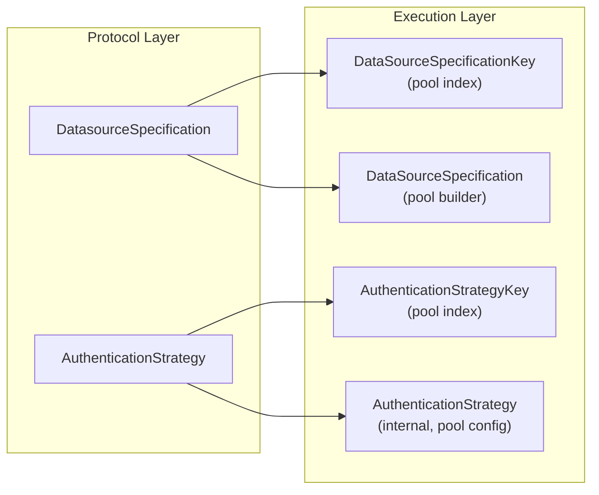
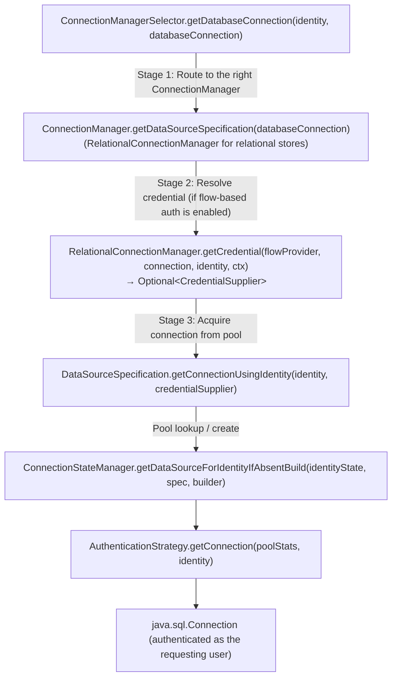
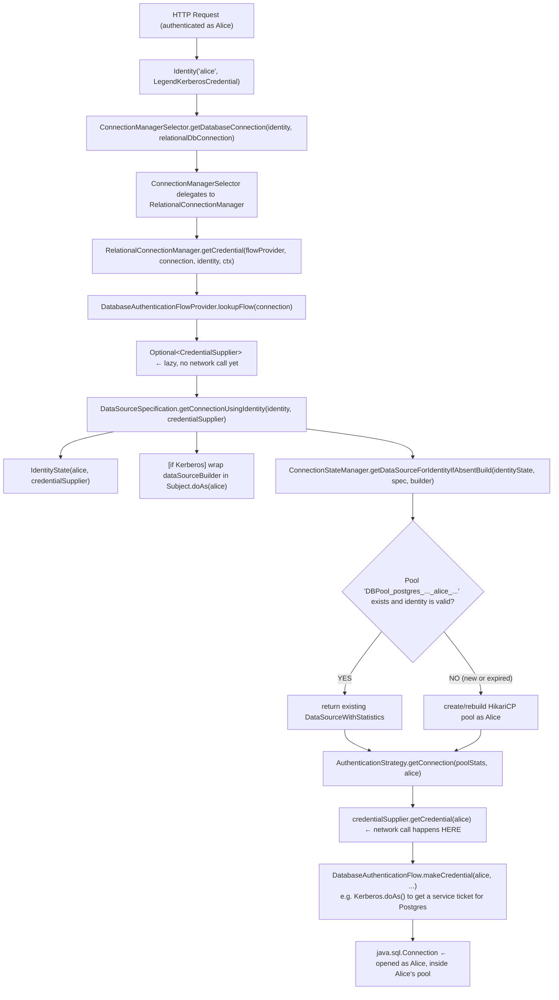

# Legend Engine: Connection Management Guide

> **Version**: Legend Engine 4.x  
> **Last Updated**: March 2026  
> **Audience**: Platform engineers, store implementors, and infrastructure contributors  
> **Related reading**: [Identity, Authentication & Traceability Guide](../authentication/identity-authentication-traceability-guide.md), [New Connection Framework (PoC)](./new-connection-framework.md)

---

## Table of Contents

1. [Overview](#1-overview)
2. [The Connection Model](#2-the-connection-model)
3. [Connection Key — Identifying a Pool](#3-connection-key--identifying-a-pool)
4. [The Connection Acquisition Pipeline](#4-the-connection-acquisition-pipeline)
5. [DataSourceSpecification — Per-Database Configuration](#5-datasourcespecification--per-database-configuration)
6. [Connection Pooling with HikariCP](#6-connection-pooling-with-hikaricp)
7. [ConnectionStateManager — Pool Lifecycle](#7-connectionstatemanager--pool-lifecycle)
8. [Identity State and Pool Invalidation](#8-identity-state-and-pool-invalidation)
9. [CredentialSupplier — Late-Bound Credential Acquisition](#9-credentialsupplier--late-bound-credential-acquisition)
10. [The DatabaseManager SPI](#10-the-databasemanager-spi)
11. [Extending Connection Support](#11-extending-connection-support)
12. [The Schema Exploration and Ad-hoc SQL APIs](#12-the-schema-exploration-and-ad-hoc-sql-apis)
13. [Connection Metrics and Observability](#13-connection-metrics-and-observability)
14. [Middle-Tier Connection Authorisation](#14-middle-tier-connection-authorisation)
15. [Summary: Connection Acquisition Flow](#15-summary-connection-acquisition-flow)

---

## 1. Overview

Connection management in Legend Engine solves a deceptively hard problem: **given a user's runtime identity, open and pool database connections that are securely bound to that user**, across dozens of database types and authentication mechanisms, without leaking connections between users or holding stale credentials.

The system achieves this through three interlocking mechanisms:

| Mechanism | Responsibility |
|---|---|
| **`ConnectionKey`** | Uniquely identifies a pool by `(datasource config, auth type)` |
| **`ConnectionStateManager`** | LRU cache of per-user, per-connection-key HikariCP pools |
| **`CredentialSupplier`** | Late-bound, lazy credential creation from the user's `Identity` at the moment a new connection is needed |

The result: every physical database connection in every pool was opened using the credentials of the user who requested it. Pools are never shared across users with different identities. Expired credentials cause pools to be automatically rebuilt with fresh credentials.

---

## 2. The Connection Model

### 2.1 `RelationalDatabaseConnection` — The Protocol Object

The user-facing model for a relational connection is `RelationalDatabaseConnection`, a thin protocol object that carries *intent* rather than runtime state:

```java
// RelationalDatabaseConnection.java
public class RelationalDatabaseConnection extends DatabaseConnection {
    public DatasourceSpecification datasourceSpecification; // WHERE: host, port, db name, etc.
    public AuthenticationStrategy authenticationStrategy;  // HOW: Kerberos, OAuth, keypair, etc.
    public DatabaseType databaseType;                      // WHAT: H2, Snowflake, Postgres, etc.
    public List<PostProcessor> postProcessors;             // Optional SQL post-processing
    public Boolean localMode;                              // true → in-process H2 for testing
}
```

This object is created from the Pure model at planning time and passed unchanged into the execution layer. It is **immutable at runtime** — the execution layer never writes back to it.

### 2.2 `DatasourceSpecification` vs. `AuthenticationStrategy` (Protocol)

At the protocol level these are separate hierarchies:

- **`DatasourceSpecification`**: describes the database server (host, port, database name, cloud-specific identifiers). Subtypes: `StaticDatasourceSpecification`, `SnowflakeDatasourceSpecification`, `BigQueryDatasourceSpecification`, etc.
- **`AuthenticationStrategy`**: declares the authentication method. Subtypes: `KerberosAuthenticationStrategy`, `UserNamePasswordAuthenticationStrategy`, `SnowflakeKeyPairAuthenticationStrategy`, `GCPWorkloadIdentityFederationAuthenticationStrategy`, etc.

At the execution level, the `RelationalConnectionManager` **transforms** these protocol objects into concrete internal types used to build the pool:



---

## 3. Connection Key — Identifying a Pool

### 3.1 Structure

A `ConnectionKey` uniquely identifies a connection configuration (independent of the user):

```java
// ConnectionKey.java
public class ConnectionKey {
    private final DataSourceSpecificationKey dataSourceSpecificationKey; // e.g. "postgres_myhost_5432_mydb"
    private final AuthenticationStrategyKey  authenticationStrategyKey;  // e.g. "kerberos"

    public String shortId() {
        return dataSourceSpecificationKey.shortId() + "_" + authenticationStrategyKey.shortId();
    }
}
```

### 3.2 Pool Naming Convention

Each HikariCP pool is named using the `ConnectionKey` **plus** the user's identity:

```java
// ConnectionStateManager.java
public String poolNameFor(Identity identity, ConnectionKey key) {
    return "DBPool_"
        + key.shortId()                                   // e.g. "postgres_myhost_5432_mydb_kerberos"
        + "_" + identity.getName()                        // e.g. "alice"
        + "_" + identity.getFirstCredential()             // e.g. "LegendKerberosCredential"
               .getClass().getCanonicalName();
}
// Result: "DBPool_postgres_myhost_5432_mydb_kerberos_alice_...LegendKerberosCredential"
```

This naming scheme has a critical security property: **Alice and Bob can never share a pool**, even if they are connecting to the same database with the same auth type, because the pool name encodes the user's identity.

---

## 4. The Connection Acquisition Pipeline

Connections flow through a three-stage pipeline before a `java.sql.Connection` is returned to the caller:



### 4.1 Stage 1 — `ConnectionManagerSelector`

`ConnectionManagerSelector` is the public entry point. It holds a list of `ConnectionManager` implementations (discovered via `ServiceLoader`) and delegates to the first one that can handle the given `DatabaseConnection`:

```java
// ConnectionManagerSelector.java
public Connection getDatabaseConnection(Identity identity,
    DatabaseConnection databaseConnection) {
    // find the right ConnectionManager (e.g. RelationalConnectionManager)
    DataSourceSpecification datasource = getDataSourceSpecification(databaseConnection);
    return getDatabaseConnectionImpl(identity, databaseConnection, datasource, runtimeContext);
}

public Connection getDatabaseConnectionImpl(Identity identity,
    DatabaseConnection databaseConnection, DataSourceSpecification datasource,
    StoreExecutionState.RuntimeContext runtimeContext) {

    if (databaseConnection instanceof RelationalDatabaseConnection) {
        // Attempt to resolve a CredentialSupplier from the auth flow provider
        Optional<CredentialSupplier> credentialHolder = RelationalConnectionManager.getCredential(
            flowProviderHolder,
            (RelationalDatabaseConnection) databaseConnection,
            identity,
            runtimeContext);

        return datasource.getConnectionUsingIdentity(identity, credentialHolder);
    }
    // Non-relational path: connect directly using identity
    return datasource.getConnectionUsingIdentity(identity, Optional.empty());
}
```

### 4.2 Stage 2 — `RelationalConnectionManager` and Credential Resolution

`RelationalConnectionManager.getCredential()` looks up the registered `DatabaseAuthenticationFlow` for this connection type and wraps it in a lazy `CredentialSupplier`:

```java
// RelationalConnectionManager.java
public static Optional<CredentialSupplier> getCredential(
    DatabaseAuthenticationFlowProvider flowProvider,
    RelationalDatabaseConnection connection,
    Identity identity,
    StoreExecutionState.RuntimeContext runtimeContext) {

    Optional<DatabaseAuthenticationFlow> flowHolder =
        flowProvider.lookupFlow(connection);

    if (!flowHolder.isPresent()) {
        // No registered flow: log a warning, fall back to legacy identity-direct path
        LOGGER.warn("Database authentication flow has been enabled but flow for " +
            "DbType={}, AuthType={} has not been configured",
            connection.datasourceSpecification.getClass().getSimpleName(),
            connection.authenticationStrategy.getClass().getSimpleName());
        return Optional.empty();
    }
    // Wrap the flow in a lazy supplier — credential is NOT acquired yet
    return Optional.of(new CredentialSupplier(
        flowHolder.get(),
        connection.datasourceSpecification,
        connection.authenticationStrategy,
        DatabaseAuthenticationFlow.RuntimeContext.newWith(runtimeContext.getContextParams())
    ));
}
```

> **Key point**: The `CredentialSupplier` is lazy. The actual credential (e.g., Kerberos service ticket, OAuth token) is **not** acquired at this point. It is acquired later, inside the pool builder, only when a new physical connection is actually needed.

### 4.3 Stage 3 — `DataSourceSpecification.getConnectionUsingIdentity()`

This method is the bridge between the credential resolution layer and HikariCP:

```java
// DataSourceSpecification.java
public Connection getConnectionUsingIdentity(Identity identity,
    Optional<CredentialSupplier> credentialSupplierHolder) {

    // Build a DataSource supplier — called only when a new pool needs to be created
    Supplier<DataSource> dataSourceBuilder;
    Optional<LegendKerberosCredential> kerbCred =
        identity.getCredential(LegendKerberosCredential.class);

    if (kerbCred.isPresent()) {
        // For Kerberos: pool must be created inside a Subject.doAs() call
        // so that Hikari's internal threads inherit the correct security context
        dataSourceBuilder = () -> KerberosUtils.doAs(identity,
            (PrivilegedAction<DataSource>) () -> this.buildDataSource(identity));
    } else {
        dataSourceBuilder = () -> this.buildDataSource(identity);
    }
    return getConnection(new IdentityState(identity, credentialSupplierHolder), dataSourceBuilder);
}
```

The `getConnection()` method then opens an OpenTracing span, calls into `ConnectionStateManager` to get or build the pool, and finally calls `authenticationStrategy.getConnection(pool, identity)` to retrieve a physical connection from the pool.

---

## 5. DataSourceSpecification — Per-Database Configuration

`DataSourceSpecification` (the execution-layer class, not the protocol class) is an **abstract class** that encapsulates all the parameters needed to create a HikariCP pool for a specific database server and authentication type.

Each database extension (Snowflake, Postgres, H2, etc.) provides a concrete subclass:

```mermaid
classDiagram
    class DataSourceSpecification {
        &lt;&lt;abstract&gt;&gt;
    }
    DataSourceSpecification <|-- StaticDataSourceSpecification
    DataSourceSpecification <|-- SnowflakeDataSourceSpecification
    DataSourceSpecification <|-- BigQueryDataSourceSpecification
    DataSourceSpecification <|-- LocalH2DataSourceSpecification
    DataSourceSpecification <|-- MoreDots["... (one per supported database)"]
```

### 5.1 HikariCP Configuration

Every subclass ultimately calls `buildDataSource()` which configures HikariCP. Key parameters:

```java
// DataSourceSpecification.java (simplified)
private HikariDataSource buildDataSource(String host, int port, String dbName, Identity identity) {
    try (Scope scope = GlobalTracer.get().buildSpan("Create Pool").startActive(true)) {
        Properties properties = new Properties();
        String poolName = poolNameFor(identity);    // encodes user identity

        // Collect properties from all sources
        properties.putAll(databaseManager.getExtraDataSourceProperties(authStrategy, identity));
        properties.putAll(extraDatasourceProperties);
        properties.put(AUTHENTICATION_STRATEGY_KEY, authStrategy.getKey().shortId());
        properties.put(POOL_NAME_KEY, poolName);
        properties.putAll(authStrategy.getAuthenticationPropertiesForConnection());

        HikariConfig config = new HikariConfig();
        config.setDriverClassName(databaseManager.getDriver()); // JDBC driver class
        config.setPoolName(poolName);
        config.setMaximumPoolSize(maxPoolSize);      // default: 100
        config.setMinimumIdle(minPoolSize);          // default: 0 (pool shrinks to empty when idle)
        config.setJdbcUrl(getJdbcUrl(host, port, dbName, properties));
        config.setConnectionTimeout(authStrategy.getConnectionTimeout());

        // Disable prepared statement caching (safer for pooled multi-user connections)
        config.addDataSourceProperty("cachePrepStmts", false);
        config.addDataSourceProperty("prepStmtCacheSize", 0);
        config.addDataSourceProperty("prepStmtCacheSqlLimit", 0);
        config.addDataSourceProperty("useServerPrepStmts", false);

        if (databaseManager.publishMetrics()) {
            config.setMetricRegistry(METRIC_REGISTRY); // Dropwizard metrics integration
        }

        // Driver-specific properties (e.g., SSL certs, Snowflake account, etc.)
        properties.forEach((k, v) -> config.addDataSourceProperty(k.toString(), v));

        HikariDataSource ds = new HikariDataSource(config);
        scope.span().setTag("Pool", ds.getPoolName());
        LOGGER.info("New Connection Pool created {}", ds);
        return ds;
    }
}
```

### 5.2 HikariCP Default Tuning

| Parameter | Default | Notes |
|---|---|---|
| `maximumPoolSize` | 100 | Maximum open connections per pool (per user, per datasource) |
| `minimumIdle` | 0 | Pool shrinks to empty when not in use |
| Housekeeping period | 30 seconds | How often Hikari checks for idle/expired connections |
| Idle timeout | 10 minutes | Connections idle longer than this are evicted |
| Max lifetime | 30 minutes | Hard limit on any single connection's lifetime |
| `cachePrepStmts` | `false` | Disabled for correctness in multi-user pooling |

The housekeeping period can be overridden globally via the JVM system property `com.zaxxer.hikari.housekeeping.periodMs`.

---

## 6. Connection Pooling with HikariCP

### 6.1 Pool-per-User Design

Legend does **not** use a single shared pool for a datasource. Instead, each `(ConnectionKey, UserIdentity)` tuple has its own independent HikariCP pool. This design:

- Ensures that Alice's connections never execute as Bob, even if they share a datasource config
- Allows per-user connection lifecycle management (pool rebuilt when Alice's credentials expire)
- Enables per-pool Prometheus metrics labelled by pool name (which encodes the user's name)

### 6.2 Kerberos-Specific Pool Creation

For Kerberos-authenticated connections, the HikariCP pool must be created inside a `Subject.doAs()` block. This is because HikariCP creates its initial test connection synchronously during pool construction, and that connection (as well as any future connections created by Hikari's background threads) must inherit the Kerberos security context:

```java
// DataSourceSpecification.java
if (kerbCred.isPresent()) {
    dataSourceBuilder = () -> KerberosUtils.doAs(identity,
        (PrivilegedAction<DataSource>) () -> this.buildDataSource(identity));
}
```

This ensures that the Hikari housekeeping thread, which periodically creates new connections to replace expired ones, runs within the correct Kerberos `Subject`. Without this, connections created by Hikari's background threads would fail with `No valid credentials` errors.

---

## 7. ConnectionStateManager — Pool Lifecycle

`ConnectionStateManager` is a **process-scoped singleton** that manages the full lifecycle of all active HikariCP pools. It is a concurrent LRU cache of `DataSourceWithStatistics` objects, keyed by pool name.

### 7.1 Pool Creation (Get-if-absent-put with double-checked locking)

```java
// ConnectionStateManager.java (simplified)
public DataSourceWithStatistics getDataSourceForIdentityIfAbsentBuild(
    IdentityState identityState,
    DataSourceSpecification spec,
    Supplier<DataSource> dataSourceBuilder) {

    String poolName = poolNameFor(identityState.getIdentity(), spec.getConnectionKey());

    // Guard: refuse to build a pool for an expired identity
    if (!identityState.isValid()) {
        throw new RuntimeException("Invalid Identity: cannot build pool for " +
            identityState.getIdentity().getName());
    }

    // Fast path: pool already exists
    DataSourceWithStatistics existing = this.connectionPools.getIfAbsentPut(poolName, ...);
    if (existing.getDataSource() != null) {
        return existing;
    }

    // Slow path: need to create the pool
    synchronized (poolLockManager.getLock(poolName)) {
        // Double-check: another thread may have created the pool while we waited
        if (this.connectionPools.get(poolName).getDataSource() == null) {
            LOGGER.info("Pool not found for [{}], creating one", identityState.getIdentity().getName());
            try {
                DataSource newDs = dataSourceBuilder.get(); // builds the HikariCP pool
                this.connectionPools.put(poolName, new DataSourceWithStatistics(poolName, newDs, identityState, spec));
                LOGGER.info("Pool created for [{}], name {}", identityState.getIdentity().getName(), poolName);
            } catch (Exception e) {
                evictPool(poolName); // clean up partially-created pool entry
                throw new RuntimeException(e);
            }
        }
    }
    return this.connectionPools.get(poolName);
}
```

### 7.2 Pool Eviction — The Housekeeper Thread

A background `ScheduledExecutorService` thread named `ConnectionStateManager.Housekeeper` runs periodically to evict pools that have not been used recently:

```java
// Pool is eligible for eviction if:
// 1. Last connection request was more than N minutes ago (default: 10 minutes), AND
// 2. The pool has no active (checked-out) connections

protected Set<Pair<String, DataSourceStatistics>> findUnusedPoolsOlderThan(Duration duration) {
    return this.connectionPools.values().stream()
        .filter(ds -> ds.getStatistics().getLastConnectionRequestAge() > duration.toMillis()
                   && !ds.hasActiveConnections())
        .map(ds -> Tuples.pair(ds.getPoolName(), DataSourceStatistics.clone(ds.getStatistics())))
        .collect(Collectors.toSet());
}
```

Eviction is a **two-phase atomic operation** to protect against a race between the housekeeper thread and a concurrent connection request:

1. Phase 1 (without global lock): Collect the set of pool names and their statistics snapshots that appear eligible for eviction.
2. Phase 2 (with per-pool lock): For each candidate, verify that the statistics have not changed since Phase 1 (i.e., no connection was requested in between). Only evict if the snapshot still matches.

The eviction period is configurable via the JVM system property:

```text
org.finos.legend.engine.execution.connectionStateEvictionDurationInSeconds
```

Default: 600 seconds (10 minutes).

When a pool is evicted, its Prometheus metrics are also removed:

```java
this.atomicallyRemovePool(pool.getOne(), pool.getTwo());
MetricsHandler.removeConnectionMetrics(pool.getOne()); // deregister Prometheus gauges
```

### 7.3 Thread Safety Architecture

The `ConnectionStateManager` is carefully designed for concurrent access by four types of threads:

| Thread Type | Operation | Synchronization |
|---|---|---|
| **Connection serving** | Read/update pool stats | Concurrent hash map (lock-free) |
| **Connection creation** | Create HikariCP pool | Per-pool lock (`KeyLockManager`) |
| **Housekeeper** | Evict stale pools | Two-phase, per-pool lock for each eviction |
| **DevOps / monitoring** | Read pool state for debugging | No lock; may see stale snapshot |

The `KeyLockManager` maps pool names to dedicated lock objects, ensuring that pool creation for pool A never blocks creation for pool B.

### 7.4 Per-User Pool Queries

The state manager supports querying pools by user, which is used by monitoring endpoints:

```java
// ConnectionStateManager.java
public List<ConnectionPool> getPoolInformationByUser(String user) {
    return this.connectionPools.valuesView().stream()
        .filter(pool -> pool.getPoolPrincipal().equals(user))
        .map(ConnectionStateManagerPOJO::buildConnectionPool)
        .collect(toList());
}
```

---

## 8. Identity State and Pool Invalidation

### 8.1 `IdentityState` — The Pool's Security Binding

Every pool entry stores an `IdentityState` alongside the HikariCP `DataSource`. `IdentityState` binds the pool to both the user's `Identity` and an optional `CredentialSupplier`:

```java
// IdentityState.java
public class IdentityState {
    private final Identity identity;                        // Alice's identity
    private final Optional<CredentialSupplier> credentialSupplier; // lazy credential for new connections

    public boolean isValid() {
        return identity.hasValidCredentials(); // delegates to Credential.isValid()
    }
}
```

### 8.2 Automatic Pool Rebuilding on Credential Expiry

The pool's `IdentityState` is checked **every time a connection is requested from the pool**. If the identity's credentials have expired (e.g., a Kerberos ticket has timed out), the pool is automatically rebuilt:

```java
// ConnectionStateManager.java
if (!this.connectionPools.get(poolName).getIdentityState().isValid()) {
    LOGGER.info("Pool [{}] has an invalid identity state — rebuilding", poolName);
    synchronized (poolLockManager.getLock(poolName)) {
        DataSourceWithStatistics existing = this.connectionPools.get(poolName);
        if (!existing.getIdentityState().isValid()) {
            // Temporarily replace the pool entry with a stub (so the DriverWrapper
            // can access the new IdentityState during pool construction)
            this.connectionPools.put(poolName, new DataSourceWithStatistics(poolName, identityState, spec));
            // Create the new HikariCP pool with the fresh credentials
            DataSourceWithStatistics rebuilt = new DataSourceWithStatistics(
                poolName, dataSourceBuilder.get(), identityState, spec);
            this.connectionPools.put(poolName, rebuilt);
            LOGGER.info("Pool rebuilt for [{}], name {}", identity.getName(), poolName);
            existing.close(); // close the old Hikari pool and its connections
        }
    }
}
```

This is particularly important for **Kerberos**: Kerberos tickets have a finite lifetime (typically 8–10 hours). When Alice's ticket expires, her pool is rebuilt the next time she makes a request, using the fresh ticket from her new `Identity`.

---

## 9. CredentialSupplier — Late-Bound Credential Acquisition

`CredentialSupplier` is the lazy wrapper around a `DatabaseAuthenticationFlow`. The credential is acquired on-demand, at the point where a physical JDBC connection is being opened:

```java
// CredentialSupplier.java
public class CredentialSupplier {
    private final DatabaseAuthenticationFlow databaseAuthenticationFlow;
    private final DatasourceSpecification datasourceSpecification;
    private final AuthenticationStrategy authenticationStrategy;
    private final DatabaseAuthenticationFlow.RuntimeContext runtimeContext;

    // Called inside the HikariCP DriverWrapper, when a new physical connection is needed
    public Credential getCredential(Identity identity) throws Exception {
        return databaseAuthenticationFlow.makeCredential(
            identity,
            datasourceSpecification,
            authenticationStrategy,
            runtimeContext
        );
    }
}
```

The `CredentialSupplier` is stored in the `IdentityState` of each pool. When HikariCP needs to create a new physical connection (initial connection, replacement for an expired connection, or expansion due to load), it calls through the `DriverWrapper` → `AuthenticationStrategy.getConnection()` → `CredentialSupplier.getCredential()` chain.

**Why lazy?** Credentials can be expensive to obtain (e.g., OAuth token exchange requires an HTTP round-trip). By making acquisition lazy, Legend avoids fetching credentials that may not be needed, and ensures credentials are obtained as close to actual usage as possible (minimising the window between acquisition and expiry).

---

## 10. The DatabaseManager SPI

`DatabaseManager` is the per-database-type service provider that knows how to:

1. Build a JDBC URL for this database
2. Provide the JDBC driver class name
3. Supply database-type-specific connection properties
4. Support local (in-process) database modes for testing

```java
// DatabaseManager.java
public abstract class DatabaseManager {
    // Build the JDBC connection URL
    public abstract String buildURL(String host, int port, String databaseName,
        Properties extraProperties, AuthenticationStrategy authStrategy);

    // JDBC driver class name
    public abstract String getDriver();

    // Per-identity extra connection properties (e.g., Kerberos principal for Snowflake)
    public Properties getExtraDataSourceProperties(AuthenticationStrategy authStrategy,
        Identity identity) {
        return new Properties(); // override in subclass if needed
    }

    // SQL commands specific to this database
    public abstract RelationalDatabaseCommands relationalDatabaseSupport();

    // Whether to publish Dropwizard metrics for this database's pools
    public boolean publishMetrics() { return true; }

    // Optional: local in-process data source (e.g. H2 for testing)
    public DataSourceSpecification getLocalDataSourceSpecification(...) {
        throw new UnsupportedOperationException();
    }
}
```

`DatabaseManager` implementations are discovered via `ServiceLoader<ConnectionExtension>`, where `ConnectionExtension.getAdditionalDatabaseManager()` returns the manager(s) for that extension. The built-in `H2Manager` is always registered directly.

---

## 11. Extending Connection Support

### 11.1 Adding a New Relational Store

To add connection support for a new relational database (e.g. `MyDB`), implement:

**Step 1**: Create a `DatabaseManager`:

```java
public class MyDBManager extends DatabaseManager {
    @Override
    public MutableList<String> getIds() {
        return Lists.mutable.of("MyDB"); // matches DatabaseType name
    }

    @Override
    public String buildURL(String host, int port, String dbName,
        Properties props, AuthenticationStrategy authStrategy) {
        return "jdbc:mydb://" + host + ":" + port + "/" + dbName;
    }

    @Override
    public String getDriver() {
        return "com.mydb.Driver";
    }

    @Override
    public RelationalDatabaseCommands relationalDatabaseSupport() {
        return new MyDBCommands();
    }
}
```

**Step 2**: Create a `DataSourceSpecification` subclass (extends the execution-layer abstract class) that provides the JDBC URL parameters for this database type.

**Step 3**: Implement `StrategicConnectionExtension` to register the key generators and transformers that convert protocol objects → execution objects:

```java
public class MyDBConnectionExtension implements StrategicConnectionExtension {
    @Override
    public AuthenticationStrategyVisitor<AuthenticationStrategyKey>
        getExtraAuthenticationKeyGenerators() {
        return new MyDBAuthStrategyKeyGenerator();
    }

    @Override
    public Function<RelationalDatabaseConnection,
        DatasourceSpecificationVisitor<DataSourceSpecificationKey>>
        getExtraDataSourceSpecificationKeyGenerators(int testDbPort) {
        return conn -> new MyDBDatasourceSpecificationKeyGenerator(conn);
    }

    @Override
    public Function2<RelationalDatabaseConnection, ConnectionKey,
        DatasourceSpecificationVisitor<DataSourceSpecification>>
        getExtraDataSourceSpecificationTransformerGenerators(
            Function<RelationalDatabaseConnection, AuthenticationStrategy> authProvider) {
        return (conn, key) -> new MyDBDatasourceSpecificationTransformer(
            key.getDataSourceSpecificationKey(), authProvider.apply(conn), conn);
    }
    // ...
}
```

**Step 4**: Register via `META-INF/services/org.finos.legend.engine.plan.execution.stores.relational.connection.ConnectionExtension`.

### 11.2 Adding a Non-Relational Store Connection

For non-relational stores (MongoDB, Elasticsearch, etc.), implement `ConnectionFactoryExtension`:

```java
public interface ConnectionFactoryExtension extends LegendConnectionExtension {
    // For test execution: build an in-memory connection from embedded test data
    default Optional<Pair<Connection, List<Closeable>>>
        tryBuildTestConnection(Connection sourceConnection, List<EmbeddedData> data) {
        return Optional.empty();
    }
}
```

Register via `META-INF/services/org.finos.legend.engine.protocol.pure.v1.extension.ConnectionFactoryExtension`.

---

## 12. The Schema Exploration and Ad-hoc SQL APIs

Two HTTP endpoints expose connection management capabilities for tooling and interactive use.

### 12.1 Schema Exploration (`POST /pure/v1/utilities/database/schemaExploration`)

Surveys a live database's metadata (schemas, tables, columns) and returns a Pure `Database` model:

```java
// SchemaExplorationApi.java
@POST
@Path("schemaExploration")
public Response buildDatabase(DatabaseBuilderInput input,
    @Pac4JProfileManager ProfileManager<CommonProfile> pm) {

    MutableList<CommonProfile> profiles = ProfileManagerHelper.extractProfiles(pm);
    Identity identity = Identity.makeIdentity(profiles); // Alice's identity

    SchemaExportation builder = SchemaExportation.newBuilder(this.connectionManager);
    Database database = builder.build(input, identity); // connects as Alice
    PureModelContextData graph = PureModelContextData.newBuilder()
        .withElement(database).build();
    return Response.ok(graph).build();
}
```

The connection used to query the database metadata is opened using Alice's identity — exactly the same pathway as a query execution.

### 12.2 Ad-hoc SQL (`POST /pure/v1/utilities/database/executeRawSQL`)

Executes arbitrary SQL against a live connection (capped result set, non-production use):

```java
@POST
@Path("executeRawSQL")
public Response executeRawSQL(RawSQLExecuteInput input,
    @Pac4JProfileManager ProfileManager<CommonProfile> pm) {

    Identity identity = Identity.makeIdentity(ProfileManagerHelper.extractProfiles(pm));
    String result = new AdhocSQLExecutor()
        .executeRawSQL(this.connectionManager, input.connection, input.sql, identity);
    return Response.ok(result).build();
}
```

Both endpoints follow the same identity propagation contract: the request is executed using the authenticated user's identity, and errors are logged and traced with the user's name.

---

## 13. Connection Metrics and Observability

### 13.1 Per-Pool Prometheus Gauges

`ConnectionStateManager` updates Prometheus metrics on each housekeeper run:

```java
// ConnectionStateManager.java
private void updateMetricsForConnectionPools() {
    this.connectionPools.forEach(p ->
        MetricsHandler.setConnectionMetrics(
            p.getPoolName(),    // includes user's name — "DBPool_..._alice_..."
            p.getActiveConnections(),
            p.getTotalConnections(),
            p.getIdleConnections()
        )
    );
}
```

Registered gauges (from `MetricsHandler.java`):

| Metric Name | Type | Description |
|---|---|---|
| `active_connections{poolName}` | Gauge | Connections currently checked out from the pool |
| `total_connections{poolName}` | Gauge | Total connections in the pool (active + idle) |
| `idle_connections{poolName}` | Gauge | Connections waiting for a request |

Since `poolName` encodes the user's identity, these metrics support per-user connection monitoring.

### 13.2 `DataSourceStatistics` — Pool-Level Counters

Each pool maintains internal statistics via `DataSourceStatistics`:

```java
// Tracked per pool
int requestConnection()          // incremented on every connection request
long getLastConnectionRequestAge() // ms since the last connection request (for eviction)
boolean hasActiveConnections()     // true if any connection is currently checked out
```

### 13.3 OpenTracing Spans

Every connection acquisition is wrapped in an OpenTracing span:

```java
// DataSourceSpecification.java
try (Scope scope = GlobalTracer.get().buildSpan("Get Connection").startActive(true)) {
    scope.span().setTag("Principal", identity.getName());
    scope.span().setTag("DataSourceSpecification", this.toString());
    // ...
    scope.span().setTag("Pool", poolName);
    // ...
}

// DataSourceSpecification.java — pool creation
try (Scope scope = GlobalTracer.get().buildSpan("Create Pool").startActive(true)) {
    // ...
    scope.span().setTag("Pool", ds.getPoolName());
}
```

Every trace of a data access query will therefore contain a `Get Connection` child span labelled with the user's name and pool identifier.

### 13.4 Structured Log Events

Key log events emitted during connection management:

| Event | Level | Message Pattern |
|---|---|---|
| Pool not found, creating | `INFO` | `Pool not found for [alice] for datasource [postgres_...], creating one` |
| Pool created | `INFO` | `Pool created for [alice] for datasource [postgres_...], name DBPool_...` |
| Pool rebuilt (credential expiry) | `INFO` | `DataSource re-created for [alice] for datasource [...]` |
| Connection request | `INFO` | `Principal [alice] has requested [N] connections for pool [...]` |
| Pool evicted by housekeeper | `INFO` | `Removed and closed pool DBPool_...` |
| Connection error | `ERROR` | `ConnectionException {...} : pool stats [...]` |

---

## 14. Middle-Tier Connection Authorisation

In addition to push-down authentication (where the user's own credentials are used to connect), Legend supports **middle-tier connections** where the server uses a service credential on behalf of the user. In this mode, access control is enforced by `RelationalMiddleTierConnectionCredentialAuthorizer` rather than by the database.

```java
// RelationalMiddleTierConnectionCredentialAuthorizer.java
public interface RelationalMiddleTierConnectionCredentialAuthorizer {
    /*
     * Evaluates whether Alice is allowed to use a specific vault-stored credential
     * for a given execution context.
     *
     * subject          = Alice
     * credentialVaultReference = reference to the vault secret (e.g. "my-db-password")
     * usageContext     = INTERACTIVE_EXECUTION or SERVICE_EXECUTION
     * resourceContext  = reserved for future use
     * policyContext    = reserved for future use
     */
    CredentialAuthorization evaluate(
        Identity currentUser,
        String credentialVaultReference,
        PlanExecutionAuthorizerInput.ExecutionMode usageContext,
        String resourceContext,
        String policyContext) throws Exception;
}
```

The authorization result is `ALLOW` or `DENY`. A `DENY` result causes the execution to fail with HTTP 403 before any connection is attempted, and the decision is logged with Alice's name and the credential reference.

This is distinct from push-down mode, where the database itself enforces access — in middle-tier mode, **Legend Engine is the policy enforcement point**.

---

## 15. Summary: Connection Acquisition Flow

The complete connection acquisition path, from HTTP request to open JDBC connection:



### Key Properties of This Design

| Property | Mechanism |
|---|---|
| User isolation | Pool name encodes `identity.getName()` + credential type |
| No stale credentials | Pool rebuilt when `identityState.isValid()` returns `false` |
| Lazy credential acquisition | `CredentialSupplier` defers the actual credential call to pool creation time |
| Kerberos thread safety | Pool created inside `Subject.doAs()` so Hikari background threads inherit the security context |
| Concurrent pool creation | Per-pool lock via `KeyLockManager`; global map is lock-free |
| Eviction of unused pools | Housekeeper thread with configurable idle timeout (default 10 min) |
| Observability | Per-pool Prometheus gauges + OpenTracing spans + structured `LogInfo` events |
| Extension points | `StrategicConnectionExtension` SPI for new datasource/auth combinations |

---

## Related Documentation and Source References

| Topic | Location |
|---|---|
| `RelationalDatabaseConnection` (protocol model) | `legend-engine-xt-relationalStore-protocol/.../RelationalDatabaseConnection.java` |
| `ConnectionManagerSelector` (entry point) | `legend-engine-xt-relationalStore-executionPlan/.../connection/manager/` |
| `RelationalConnectionManager` (flow routing) | `...connection/manager/strategic/RelationalConnectionManager.java` |
| `DataSourceSpecification` (pool builder) | `legend-engine-xt-relationalStore-executionPlan-connection/.../ds/` |
| `ConnectionStateManager` (pool lifecycle / LRU cache) | `...connection/ds/state/ConnectionStateManager.java` |
| `IdentityState` (pool's security binding) | `...connection/ds/state/IdentityState.java` |
| `CredentialSupplier` (lazy credential acquisition) | `...connection-authentication/.../credential/CredentialSupplier.java` |
| `DatabaseManager` (per-DB JDBC details) | `...connection/driver/DatabaseManager.java` |
| `StrategicConnectionExtension` (SPI for new databases) | `...connection/manager/strategic/StrategicConnectionExtension.java` |
| `ConnectionFactoryExtension` (SPI for non-relational) | `legend-engine-protocol-pure/.../extension/ConnectionFactoryExtension.java` |
| `SchemaExplorationApi` (HTTP API) | `legend-engine-xt-relationalStore-connection-http-api/.../SchemaExplorationApi.java` |
| `MetricsHandler` (Prometheus gauges) | `legend-engine-shared-core/.../operational/prometheus/MetricsHandler.java` |
| `RelationalMiddleTierConnectionCredentialAuthorizer` | `legend-engine-xt-relationalStore-executionPlan-authorizer/...` |
| Identity and authentication concepts | `docs/authentication/identity-authentication-traceability-guide.md` |
| New connection framework (PoC) | `docs/connection/new-connection-framework.md` |
