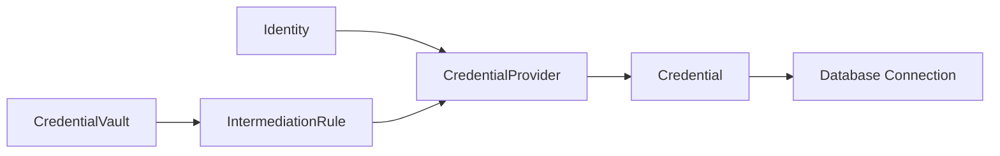
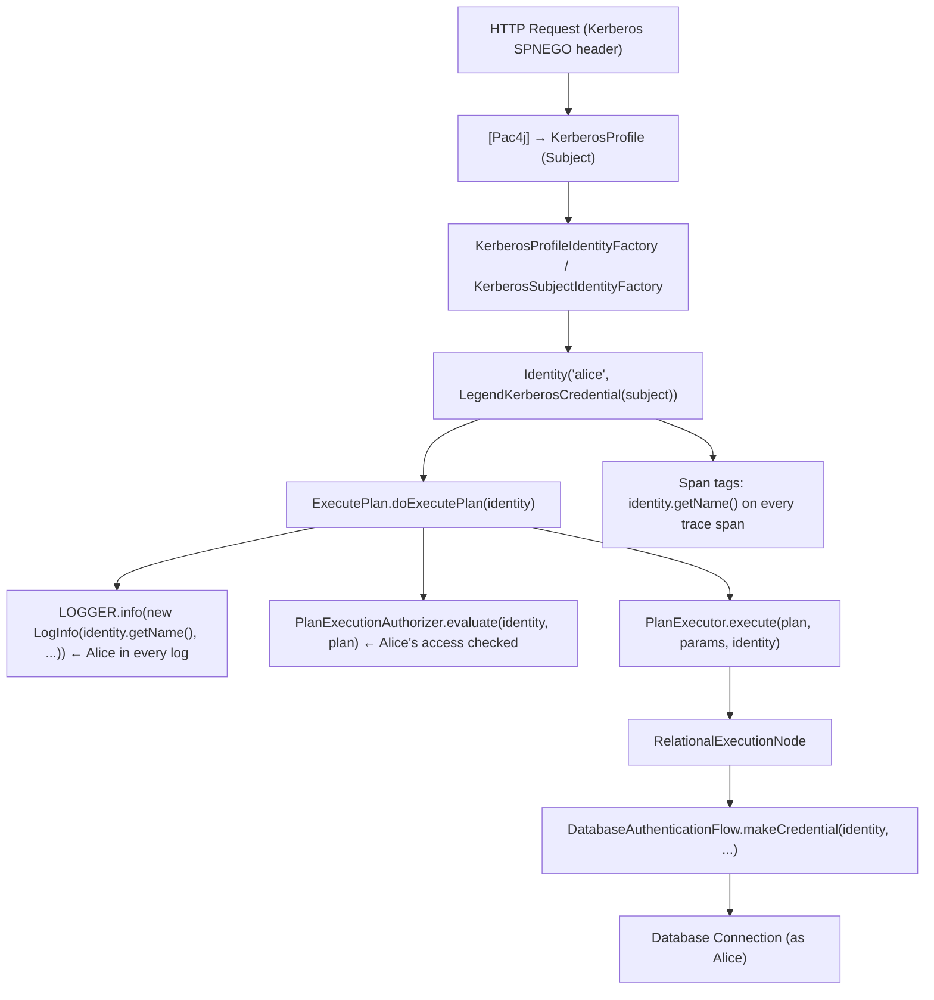
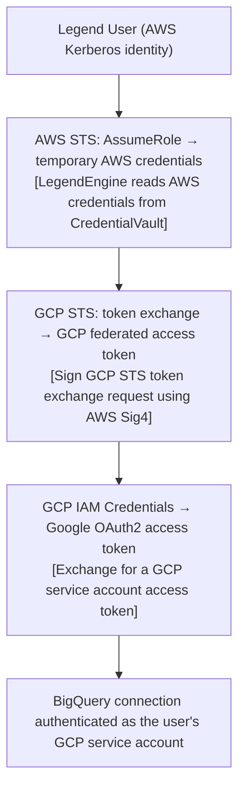
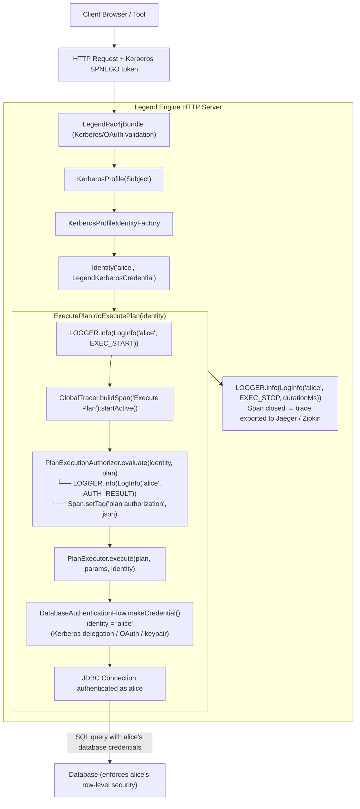

# Legend Engine: Identity, Authentication & Traceability Guide

> **Version**: Legend Engine 4.x  
> **Last Updated**: March 2026  
> **Audience**: Platform engineers, extension contributors, and security-aware integrators

---

## Table of Contents

1. [Overview and Philosophy](#1-overview-and-philosophy)
2. [Identity: The Core Concept](#2-identity-the-core-concept)
3. [Authentication: Establishing Who You Are](#3-authentication-establishing-who-you-are)
4. [Credential Management and Vault Integration](#4-credential-management-and-vault-integration)
5. [Identity Propagation: End-to-End User Context](#5-identity-propagation-end-to-end-user-context)
6. [Authorization and Plan Execution Control](#6-authorization-and-plan-execution-control)
7. [Logging and Traceability](#7-logging-and-traceability)
8. [Distributed Tracing with OpenTracing and OpenTelemetry](#8-distributed-tracing-with-opentracing-and-opentelemetry)
9. [Metrics and Observability](#9-metrics-and-observability)
10. [Authentication Flows for Data Sources](#10-authentication-flows-for-data-sources)
11. [Adding New Authentication Support](#11-adding-new-authentication-support)
12. [Summary: The Full Identity Lifecycle](#12-summary-the-full-identity-lifecycle)

---

## 1. Overview and Philosophy

Legend Engine is built around a fundamental security principle:

> **A user's identity must be established at the boundary of the system and propagated — unmodified and unforgeable — through every layer until it reaches the data source.**

This means that when Alice submits a query, every action taken by Legend Engine on Alice's behalf — compiling, planning, and executing that query against a database — is performed *as Alice*, not as a service account or anonymous process. The data source sees Alice's identity, and every log entry, trace span, and metric is tagged with Alice's name.

This design achieves three goals simultaneously:

| Goal | How Legend achieves it |
|---|---|
| **Security** | Users only access data their own credentials are authorized to access |
| **Auditability** | Every data access is traceable back to a named individual |
| **Compliance** | Row-level security and column masking policies at the data source work correctly |

The sections below explain exactly how each layer of this design works.

---

## 2. Identity: The Core Concept

### 2.1 The `Identity` Class

The root of Legend's security model is the `Identity` class in `legend-engine-identity-core`:

```text
org.finos.legend.engine.shared.core.identity.Identity
```

An `Identity` holds:

- **`name`** – the human-readable username (e.g., `alice`)
- **`credentials`** – a list of one or more `Credential` objects representing proof of who this user is

```java
// Core structure
public class Identity {
    private String name;                    // "alice"
    private final List<Credential> credentials; // [LegendKerberosCredential, ...]
}
```

An `Identity` is **immutable in spirit** — once established at the HTTP boundary it travels through the system without being re-created or substituted. Any attempt to access a resource always requires passing the same `Identity` object all the way to the connection layer.

### 2.2 Credential Types

Credentials are implementations of the `Credential` interface:

```text
org.finos.legend.engine.shared.core.identity.Credential
```

Each credential type corresponds to a different authentication mechanism:

| Credential Class | Module | Description |
|---|---|---|
| `AnonymousCredential` | `legend-engine-identity-core` | Placeholder for unauthenticated contexts (testing, anonymous access) |
| `LegendKerberosCredential` | `legend-engine-xt-identity-kerberos` | Wraps a JAAS `javax.security.auth.Subject` obtained via Kerberos/GSS-API |
| `PlaintextUserPasswordCredential` | `legend-engine-xt-identity-plainTextUserPassword` | Username and password (for service-account flows; never from end users) |
| `PrivateKeyCredential` | `legend-engine-xt-identity-privateKey` | RSA private key, used for key-pair authentication (e.g., Snowflake) |
| `OAuthCredential` | `legend-engine-xts-relationalStore` | OAuth access token obtained via federated identity flows |
| `ApiTokenCredential` | `legend-engine-xts-authentication` | API key / bearer token |

Credentials carry a validity check:

```java
public boolean isValid() {
    // For Kerberos: checks the KerberosTicket is current (not expired)
    Set<KerberosTicket> credentials = subject.getPrivateCredentials(KerberosTicket.class);
    return iterator.hasNext() && iterator.next().isCurrent();
}
```

### 2.3 Creating an Identity: The `IdentityFactory` SPI

Legend uses Java's `ServiceLoader` mechanism to discover `IdentityFactory` implementations at startup. Factories are registered via `META-INF/services/org.finos.legend.engine.shared.core.identity.factory.IdentityFactory`.

```java
public interface IdentityFactory extends LegendExtension {
    Optional<Identity> makeIdentity(Object authenticationSource);
}
```

At the HTTP boundary, a request carries a Pac4j `ProfileManager`. The system calls:

```java
// Extract pac4j profiles from the incoming HTTP request
MutableList<CommonProfile> profiles = ProfileManagerHelper.extractProfiles(pm);

// Delegate to the chain of registered IdentityFactory instances
Identity identity = Identity.makeIdentity(profiles);
```

`Identity.makeIdentity()` iterates all registered factories and returns the first successful result. If no factory can handle the source, it falls back to `Identity.makeUnknownIdentity()` — which has the name `_UNKNOWN_` and an `AnonymousCredential`. This is a safe but restricted state.

**Key built-in factories:**

| Factory | Input | Produced Identity |
|---|---|---|
| `KerberosProfileIdentityFactory` (pac4j) | Pac4j `KerberosProfile` containing a Kerberos `Subject` | `Identity(kerberosUsername, LegendKerberosCredential(subject))` |
| `KerberosSubjectIdentityFactory` | Raw JAAS `Subject` | `Identity(principalName, LegendKerberosCredential(subject))` |

---

## 3. Authentication: Establishing Who You Are

### 3.1 HTTP-Layer Authentication via Pac4j and Kerberos

Legend Engine uses [Pac4j](https://www.pac4j.org/) as its HTTP security framework, integrated via the `LegendPac4jBundle`:

```java
// Server.java
bootstrap.addBundle(new LegendPac4jBundle<>(
    serverConfiguration -> serverConfiguration.pac4j
));
```

Pac4j handles the browser/client-side authentication protocol (Kerberos SPNEGO, OAuth, etc.) and populates a `ProfileManager` that is then made available to every JAX-RS resource via the `@Pac4JProfileManager` annotation:

```java
@POST
@Path("execute")
public Response execute(
    @Pac4JProfileManager @ApiParam(hidden = true) ProfileManager<CommonProfile> pm,
    ...
) {
    MutableList<CommonProfile> profiles = ProfileManagerHelper.extractProfiles(pm);
    Identity identity = Identity.makeIdentity(profiles);
    // identity is now Alice — with a valid Kerberos credential
    ...
}
```

### 3.2 SQL Wire Protocol Authentication

The Postgres wire-protocol endpoint (`legend-engine-xt-sql-postgres-server`) uses its own layered approach:

1. A `SessionsFactory` creates a `Session` for each connection  
2. An `AuthenticationContext` holds the configured `AuthenticationMethod`  
3. Available methods include:
   - `GSSAuthenticationMethod` — Kerberos/GSSAPI; the most common for enterprise deployments
   - `UsernamePasswordAuthenticationMethod` — Basic password challenge
   - `NoPasswordAuthenticationMethod` — Pass-through (for trusted network segments)
   - `AnonymousIdentityProvider` — Anonymous access (testing only)

```java
// AuthenticationContext.java
Identity authenticate() {
    Identity user = authMethod.authenticate(userName, password, connProperties);
    if (user != null) {
        logger.trace("Authentication succeeded user \"{}\" and method \"{}\".",
            user.getName(), authMethod.name());
    }
    return user;
}
```

### 3.3 `AuthenticationSpecification` in the Pure Model

At the model level, Legend uses `AuthenticationSpecification` (a Pure/PURE metamodel class) to declaratively describe *how* to authenticate to a data source. This specification travels with the connection definition:

```pure
// metamodel_base.pure
Class <<typemodifiers.abstract>> 
  meta::pure::runtime::connection::authentication::AuthenticationSpecification
```

Concrete subtypes:

| Pure Class | What it represents |
|---|---|
| `KerberosAuthenticationSpecification` | Delegate the requesting user's Kerberos TGT to the target database |
| `UserPasswordAuthenticationSpecification` | Username + vault-backed password |
| `ApiKeyAuthenticationSpecification` | API key placed in an HTTP header or cookie |
| `EncryptedKeyPairAuthenticationSpecification` | RSA key pair (username + vault-backed private key + passphrase) |

**Example Pure connection definition using Kerberos:**

```pure
###Connection
RelationalDatabaseConnection mySnowflakeConnection
{
  store: store::MyStore;
  type: Snowflake;
  specification: Snowflake {
    name: 'MY_DB';
    account: 'my_account';
    ...
  };
  auth: KerberosAuth;  // delegates the calling user's Kerberos identity
}
```

---

## 4. Credential Management and Vault Integration

### 4.1 The Three-Layer Credential Stack

Once an `Identity` is established, Legend must often *transform* it into credentials the target data source understands. For example:

- An inbound Kerberos `Identity` must become an OAuth token for Snowflake
- A service identity might need a password fetched from a secrets vault

Legend solves this with a three-layer stack:



### 4.2 `CredentialVault` — Secret Storage Abstraction

Vaults provide runtime secret lookup by secret reference. The abstract base is:

```java
// CredentialVault.java
public abstract class CredentialVault<T extends CredentialVaultSecret> {
    public abstract String lookupSecret(T vaultSecret, Identity identity) throws Exception;
}
```

The `Identity` is passed to vault lookups so that future vault implementations can enforce per-user secret access policies.

Built-in vault implementations:

| Vault | Secret Type | Source |
|---|---|---|
| `PropertiesFileCredentialVault` | `PropertiesFileSecret` | A properties file injected at server startup |
| `EnvironmentCredentialVault` | `EnvironmentSecret` | OS environment variables |
| `SystemPropertiesCredentialVault` | `SystemPropertiesSecret` | JVM `-D` system properties |

The Pure model defines these secret reference types:

```pure
// metamodel_vault.pure
Class meta::pure::runtime::connection::authentication::CredentialVaultSecret {}

Class meta::pure::runtime::connection::authentication::PropertiesFileSecret
  extends CredentialVaultSecret {
    propertyName: String[1]; // name of the property containing the secret
}

Class meta::pure::runtime::connection::authentication::EnvironmentSecret
  extends CredentialVaultSecret {
    envVariableName: String[1];
}

Class meta::pure::runtime::connection::authentication::SystemPropertiesSecret
  extends CredentialVaultSecret {
    systemPropertyName: String[1];
}
```

### 4.3 `IntermediationRule` — Credential Transformation

An `IntermediationRule` performs the actual business logic to transform one credential type into another:

```java
// IntermediationRule.java
public abstract class IntermediationRule
    <SPEC extends AuthenticationSpecification,
     INPUT_CRED extends Credential,
     OUTPUT_CRED extends Credential> {

    // spec provides config; cred is what the user has; identity is who the user is
    public abstract OUTPUT_CRED makeCredential(
        SPEC spec, INPUT_CRED cred, Identity identity) throws Exception;
}
```

Built-in rules:

| Rule | Transforms | Output |
|---|---|---|
| `ApiKeyFromVaultRule` | `AnonymousCredential` + vault secret ref | `ApiTokenCredential` |
| `UserPasswordFromVaultRule` | `AnonymousCredential` + vault secret ref | `PlaintextUserPasswordCredential` |
| `EncryptedPrivateKeyFromVaultRule` | `AnonymousCredential` + vault secret refs | `PrivateKeyCredential` |

### 4.4 `CredentialProvider` — Composable Credential Builders

`CredentialProvider` orchestrates a list of `IntermediationRule`s to build a final credential from a user's `Identity`. It is generic over the input `AuthenticationSpecification` and output `Credential`:

```java
// CredentialProvider.java
public abstract class CredentialProvider
    <SPEC extends AuthenticationSpecification, CRED extends Credential> {

    protected FastList<IntermediationRule> intermediationRules = FastList.newList();

    // Implementors define how to acquire the credential
    public abstract CRED makeCredential(SPEC specification, Identity identity) throws Exception;
}
```

**How the pieces fit together at runtime:**

```java
// CredentialBuilder.java — the public entry point
public static Credential makeCredential(
    CredentialProviderProvider providerProvider,
    AuthenticationSpecification authSpec,
    Identity identity) {

    // 1. Find which provider can handle this (spec type, identity credential types)
    ImmutableSet<Class<Credential>> inputTypes =
        identity.getCredentials().collect(c -> c.getClass()).toSet().toImmutable();
    
    CredentialProvider provider =
        providerProvider.findMatchingCredentialProvider(authSpec.getClass(), inputTypes)
            .orElseThrow(() -> new EngineException(
                "No credential provider for spec=" + authSpec.getClass() +
                " input credentials=" + inputTypes,
                ExceptionCategory.USER_CREDENTIALS_ERROR));

    // 2. Execute the provider (which internally applies IntermediationRules)
    return provider.makeCredential(authSpec, identity);
}
```

---

## 5. Identity Propagation: End-to-End User Context

### 5.1 The Propagation Chain

This is the core mechanism that makes identity-aware data access work. The `Identity` object established at the HTTP boundary flows through every stage:



### 5.2 Push-Down vs. Middle-Tier Execution

Legend supports two execution modes, both of which preserve identity:

**Push-Down Execution** (the default):
Alice's actual credential (e.g., Kerberos ticket) is used directly to open a connection to the database. The database enforces its own access controls. Alice's identity is never "elevated" or substituted.

```java
private Response executeAsPushDownPlan(
    PlanExecutor planExecutor, ExecutionRequest request,
    Identity identity, ...) {

    // identity carries Alice's Kerberos credential
    Result result = planExecutor.execute(
        request.getSingleExecutionPlan(), params, null, identity);
    ...
}
```

**Middle-Tier Execution** (for service-managed connections):
A `PlanExecutionAuthorizer` first checks whether Alice is *permitted* to access the resources described in the execution plan. Only if authorization passes does Legend open a connection using a service credential. Even here, Alice's name is always present in logs and traces.

```java
private Response execImpl(
    ExecutionRequest request, Identity identity, ...) throws Exception {

    if (!this.planExecutionAuthorizer.isMiddleTierPlan(plan)) {
        return executeAsPushDownPlan(..., identity, ...);  // Alice connects directly
    }

    // Check Alice is allowed to access these resources
    PlanExecutionAuthorizerOutput auth =
        planExecutionAuthorizer.evaluate(identity, plan, authInput);

    if (!auth.isAuthorized()) {
        LOGGER.info(new LogInfo(identity.getName(),
            LoggingEventType.MIDDLETIER_INTERACTIVE_EXECUTION,
            "Plan failed middle tier authorization"));
        return ExceptionTool.exceptionManager(auth.toJSON(), 403, ...);
    }

    return executeAsMiddleTierPlan(..., identity, ...);
}
```

### 5.3 The `ConnectionProvider` Contract

All connection providers in Legend require the caller's `Identity`:

```java
// ConnectionProvider.java
public abstract T makeConnection(
    ConnectionSpecification connectionSpec,
    AuthenticationSpecification authSpec,
    Identity identity) throws Exception;

// Helper: builds a credential appropriate for this identity and auth spec
public Credential makeCredential(
    AuthenticationSpecification authSpec, Identity identity) throws Exception {
    return CredentialBuilder.makeCredential(
        this.credentialProviderProvider, authSpec, identity);
}
```

**Consequence**: There is no code path in Legend Engine that opens a database connection without an `Identity` parameter. It is architecturally impossible for a connection to be anonymous unless the `Identity` explicitly holds an `AnonymousCredential`.

### 5.4 `DatabaseAuthenticationFlow` — The Push-Down Identity Contract

For relational databases, the `DatabaseAuthenticationFlow` interface is the final step in identity propagation:

```java
// DatabaseAuthenticationFlow.java
public interface DatabaseAuthenticationFlow<D extends DatasourceSpecification,
                                             A extends AuthenticationStrategy> {
    /*
     * A flow produces a database credential from the user's identity.
     * This credential is used to open an actual JDBC/driver connection to the database.
     *
     * Thread safety: flow objects are stateless and shared across threads.
     */
    Credential makeCredential(
        Identity identity,          // Alice's authenticated identity
        D datasourceSpecification,  // WHERE to connect (host, db name, etc.)
        A authenticationStrategy)   // HOW to authenticate (Kerberos, OAuth, keypair...)
        throws Exception;
}
```

A concrete example — Kerberos delegation to Trino:

```java
// TrinoWithDelegatedKerberosFlow.java
public class TrinoWithDelegatedKerberosFlow
    implements DatabaseAuthenticationFlow<TrinoSpec, KerberosAuthenticationStrategy> {

    @Override
    public Credential makeCredential(Identity identity, TrinoSpec spec,
                                     KerberosAuthenticationStrategy auth) throws Exception {
        // Extract Alice's Kerberos Subject from her Identity
        LegendKerberosCredential kerberosCredential =
            identity.getCredential(LegendKerberosCredential.class)
                    .orElseThrow(() -> ...);

        // Use Subject.doAs() to execute actions AS ALICE in the Kerberos realm
        return Subject.doAs(kerberosCredential.getSubject(), () -> {
            // Obtain a service ticket for the Trino service, using Alice's TGT
            return new LegendKerberosCredential(/* delegated subject */);
        });
    }
}
```

This is the moment of **identity propagation**: Alice's Kerberos `Subject` — obtained at the HTTP layer — is used to acquire a database-specific credential. The database receives a connection that is authenticated as Alice, not as the Legend service account.

---

## 6. Authorization and Plan Execution Control

### 6.1 `PlanExecutionAuthorizer`

Before executing a plan that involves middle-tier connections, Legend evaluates authorization:

```java
// PlanExecutionAuthorizer.java
public interface PlanExecutionAuthorizer {
    /*
     * Given (identity, plan, context), produce an authorization decision.
     *
     * Outputs:
     *   ALLOW — one or more connections authorized, echoes the plan (possibly rewritten)
     *   DENY  — one or more connections denied, plan not executed
     */
    PlanExecutionAuthorizerOutput evaluate(
        Identity identity,
        ExecutionPlan executionPlan,
        PlanExecutionAuthorizerInput authorizationInput) throws Exception;

    boolean isMiddleTierPlan(ExecutionPlan executionPlan);
}
```

The authorization result is logged and traced in full:

```java
try (Scope scope = GlobalTracer.get()
        .buildSpan("Authorize Plan Execution").startActive(true)) {
    scope.span().setTag("plan authorization", executionAuthorization.toPrettyJSON());
}
LOGGER.info(new LogInfo(identity.getName(),
    LoggingEventType.MIDDLETIER_INTERACTIVE_EXECUTION,
    "Middle tier plan execution authorization result = " + auth.toJSON()));
```

### 6.2 `ExceptionCategory.USER_CREDENTIALS_ERROR`

Credential failures are classified separately from system errors so that security events can be filtered and alerted on independently:

```java
// CredentialBuilder.java
throw new EngineException(
    "Did not find a credential provider for specification=" + authSpec.getClass() +
    ", input credential types=" + inputCredentialTypes,
    ExceptionCategory.USER_CREDENTIALS_ERROR  // tagged for security monitoring
);
```

---

## 7. Logging and Traceability

### 7.1 Structured Logging with `LogInfo`

Every log entry in Legend Engine is structured using `LogInfo`, which always includes the **user name**. This ensures every log line is traceable back to the requesting user:

```java
// LogInfo fields
public class LogInfo {
    public Date timeStamp;          // When the event occurred
    public DeploymentMode mode;     // PROD / UAT / DEV
    public String user;             // Always populated: Alice's name
    public String eventType;        // One of the LoggingEventType enum values
    public String message;          // Human-readable description
    public Object info;             // Arbitrary structured payload (serialized to JSON)
    public double duration;         // Elapsed time in ms
    public Throwable t;             // Exception (if any)
}
```

**Usage pattern** — every API handler follows this convention:

```java
// Start of operation
LOGGER.info(new LogInfo(identity.getName(),
    LoggingEventType.EXECUTION_PLAN_EXEC_START, "").toString());

// End of operation (with duration)
LOGGER.info(new LogInfo(identity.getName(),
    LoggingEventType.EXECUTE_INTERACTIVE_STOP,
    (double) System.currentTimeMillis() - start).toString());

// Error path (user name still present)
LOGGER.error(new LogInfo(identity.getName(),
    LoggingEventType.EXECUTION_PLAN_EXEC_ERROR, exception).toString());
```

### 7.2 `LoggingEventType` — Standardised Event Vocabulary

`LoggingEventType` is an enum of structured event names that forms a controlled vocabulary for all log events. All operational events follow a `VERB_NOUN_START/STOP/ERROR` pattern:

```java
// A representative sample from LoggingEventType.java
EXECUTION_PLAN_EXEC_START,
EXECUTION_PLAN_EXEC_STOP,
EXECUTION_PLAN_EXEC_ERROR,

EXECUTE_INTERACTIVE_START,
EXECUTE_INTERACTIVE_STOP,
EXECUTE_INTERACTIVE_ERROR,

EXECUTION_RELATIONAL_START,
EXECUTION_RELATIONAL_STOP,
EXECUTION_RELATIONAL_COMMIT,
EXECUTION_RELATIONAL_ROLLBACK,

MIDDLETIER_INTERACTIVE_EXECUTION,

COMPILE_ERROR,
GRAPH_START,
GRAPH_STOP,
```

> **Note**: `LoggingEventType` is marked `@Deprecated` in favour of the `ILoggingEventType` interface. New extensions should implement `ILoggingEventType` directly rather than adding to the enum.

### 7.3 Logging Best Practices for Contributors

When adding new features to Legend Engine, follow these conventions:

1. **Always pass `identity.getName()` as the first argument to `LogInfo`** — never log operations without identifying the requesting user.

2. **Use START/STOP/ERROR triples** — log at the beginning and end of every significant operation, and separately on error paths.

3. **Include structured `info` objects** — pass domain-specific objects to `LogInfo.info`; they are JSON-serialised automatically.

4. **Tag the error on the active trace span** as well as logging it:

   ```java
   // ExceptionTool.java pattern
   Span activeSpan = GlobalTracer.get().activeSpan();
   if (activeSpan != null) {
       Tags.ERROR.set(activeSpan, true);
       activeSpan.setTag("error.message", text);
   }
   LOGGER.error(new LogInfo(user, eventType, error).toString());
   ```

5. **Classify exceptions appropriately** using `ExceptionCategory`:
   - `USER_CREDENTIALS_ERROR` — bad credentials, missing credential provider
   - Other categories — internal/system errors

---

## 8. Distributed Tracing with OpenTracing and OpenTelemetry

Legend Engine uses **two tracing systems** reflecting its evolution:

| System | Where Used | API |
|---|---|---|
| **OpenTracing** (via `GlobalTracer`) | Core engine, execution plan, HTTP API, error handling | `io.opentracing.*` |
| **OpenTelemetry** | SQL Postgres wire-protocol server | `io.opentelemetry.*` |

### 8.1 OpenTracing — Core Engine

The core execution pipeline uses OpenTracing `Scope` and `Span` objects to produce a distributed trace tree:

```java
// ExecutePlan.java — wrapping result serialisation in a span
try (Scope scope = GlobalTracer.get()
        .buildSpan("Manage Results").startActive(true)) {
    LOGGER.info(new LogInfo(identity.getName(),
        LoggingEventType.EXECUTION_PLAN_EXEC_STOP, "").toString());
    return ResultManager.manageResult(identity.getName(), result, format, ...);
}

// Authorization decision is also a span
try (Scope scope = GlobalTracer.get()
        .buildSpan("Authorize Plan Execution").startActive(true)) {
    scope.span().setTag("plan authorization", executionAuthorization.toPrettyJSON());
}
```

**Request body tracing** — `BodySpanDecorator` attaches the (truncated) request body to the active span:

```java
// BodySpanDecorator.java — ReaderInterceptor
if (GlobalTracer.get().activeSpan() != null && is != null) {
    // Reads up to 10KB, truncates with "(truncated)" marker
    GlobalTracer.get().activeSpan().setTag("body", body);
}
```

**Trace propagation over HTTP** — `HttpRequestHeaderMap` bridges Apache HttpClient headers and the OpenTracing `TextMap` propagation format, so trace context (trace-id, span-id) flows through to downstream HTTP calls:

```java
// Inject trace context into outbound HTTP request
GlobalTracer.get().inject(
    GlobalTracer.get().activeSpan().context(),
    Format.Builtin.HTTP_HEADERS,
    new HttpRequestHeaderMap(httpRequest)
);
```

### 8.2 OpenTelemetry — SQL Server (PostgreSQL Wire Protocol)

The SQL server (`legend-engine-xt-sql-postgres-server`) uses OpenTelemetry for richer metrics and traces:

```java
// OpenTelemetryUtil.java — centralised meters and tracer
public class OpenTelemetryUtil {
    private static final String INSTRUMENT_NAME = "legend-sql-server";
    private static final OpenTelemetry OPEN_TELEMETRY = GlobalOpenTelemetry.get();

    // Session lifecycle counters
    public static final LongUpDownCounter ACTIVE_SESSIONS = ...;
    public static final LongCounter TOTAL_SESSIONS = ...;

    // Query execution counters and histogram
    public static final LongUpDownCounter ACTIVE_EXECUTE = ...;
    public static final LongCounter TOTAL_EXECUTE = ...;
    public static final LongCounter TOTAL_SUCCESS_EXECUTE = ...;
    public static final LongCounter TOTAL_FAILURE_EXECUTE = ...;
    public static final DoubleHistogram EXECUTE_DURATION = ...;

    // Metadata request counters
    public static final LongUpDownCounter ACTIVE_METADATA = ...;
    ...

    public static Tracer getTracer() {
        return OPEN_TELEMETRY.getTracer(INSTRUMENT_NAME);
    }

    // Propagate trace context from Postgres protocol headers
    public static TextMapPropagator getPropagators() {
        return OPEN_TELEMETRY.getPropagators().getTextMapPropagator();
    }
}
```

### 8.3 What Gets Traced

The following are always present on trace spans involving user data access:

| Span Tag | Source | Value |
|---|---|---|
| `user` / `identity.name` | `LogInfo.user` | Alice's username |
| `body` | `BodySpanDecorator` | Truncated request payload |
| `plan authorization` | `ExecutePlan.authorizePlan` | Full JSON authorization result |
| `error` | `ExceptionTool` | `true` on error paths |
| `error.message` | `ExceptionTool` | Full error JSON |

---

## 9. Metrics and Observability

### 9.1 Prometheus Metrics

Legend uses [Prometheus Java client](https://github.com/prometheus/client_java) via `ServerMetricsHandler`:

```java
// Key metric names
datapush_operations          // Counter: total data operations started
datapush_operations_completed // Summary: duration of successful operations
datapush_operations_errors    // Summary: duration of error-terminating operations
```

Extensions can register custom metrics:

```java
// Increment a named counter
ServerMetricsHandler.incrementCounter("my_feature_invocations");

// Record operation duration
ServerMetricsHandler.operationComplete(startNanos, endNanos, "my_feature_duration");
```

### 9.2 OpenTelemetry Metrics (SQL Server)

The SQL server exposes fine-grained OTel metrics for:

- **Concurrency**: `active_sessions`, `active_execute_request`, `active_metadata_requests`  
- **Throughput**: `total_sessions`, `total_execute_requests`, `total_metadata_requests`  
- **Success/Failure rates**: `total_success_execute_requests`, `total_failure_execute_requests`  
- **Latency**: `execute_requests_duration` (histogram), `metadata_requests_duration` (histogram)

---

## 10. Authentication Flows for Data Sources

### 10.1 The `DatabaseAuthenticationFlow` Registry

`LegendDefaultDatabaseAuthenticationFlowProvider` registers all supported database authentication combinations at startup. Each entry in the registry is keyed by `(DatabaseType, DatasourceSpecification class, AuthenticationStrategy class)`:

| Database | Datasource Spec | Auth Strategy | Flow |
|---|---|---|---|
| BigQuery | `BigQueryDatasourceSpecification` | GCP Application Default Credentials | `BigQueryWithGCPApplicationDefaultCredentialsFlow` |
| BigQuery | `BigQueryDatasourceSpecification` | GCP Workload Identity Federation | `BigQueryWithGCPWorkloadIdentityFederationFlow` |
| Snowflake | `SnowflakeDatasourceSpecification` | Key Pair | `SnowflakeWithKeyPairFlow` |
| Databricks | `DatabricksDatasourceSpecification` | API Token | `DatabricksWithApiTokenFlow` |
| Trino | `TrinoSpec` | Delegated Kerberos | `TrinoWithDelegatedKerberosFlow` |
| Trino | `TrinoSpec` | Username/Password | `TrinoWithUserPasswordFlow` |
| PostgreSQL | `StaticDatasourceSpecification` | Username/Password | `PostgresStaticWithUserPasswordFlow` |
| PostgreSQL | `StaticDatasourceSpecification` | Middle-tier Username/Password | `PostgresStaticWithMiddletierUserNamePasswordAuthenticationFlow` |
| SQL Server | `StaticDatasourceSpecification` | Username/Password | `SqlServerStaticWithUserPasswordFlow` |
| Redshift | `StaticDatasourceSpecification` | Username/Password | `RedshiftWithUserPasswordFlow` |
| Athena | `AthenaDatasourceSpecification` | Username/Password | `AthenaWithUserNamePasswordFlow` |
| H2 (test) | `StaticDatasourceSpecification` | Test User/Password | `H2StaticWithTestUserPasswordFlow` |

### 10.2 The GCP Workload Identity Federation Flow (Complex Example)

This flow illustrates how multi-hop identity propagation works across cloud boundaries:



Even across this four-hop chain, the originating `Identity` is threaded through and its name appears in every log and trace.

### 10.3 The `RuntimeContext` for Flow Customisation

Flows can receive additional platform context (e.g., vault configuration, feature flags) via `DatabaseAuthenticationFlow.RuntimeContext`:

```java
// DatabaseAuthenticationFlow.java
class RuntimeContext {
    private ImmutableMap<String, String> contextParams;

    // Flows access runtime-injected configuration without polluting the model
    public ImmutableMap<String, String> getContextParams() {
        return contextParams;
    }
}

// Default implementation delegates to the simpler makeCredential()
default Credential makeCredential(Identity identity, D datasourceSpec,
    A authStrategy, RuntimeContext context) throws Exception {
    return this.makeCredential(identity, datasourceSpec, authStrategy);
}
```

---

## 11. Adding New Authentication Support

### 11.1 New `AuthenticationSpecification` (Pure Model)

Define the specification in Pure:

```pure
// my_module/metamodel_myauth.pure
import meta::pure::runtime::connection::authentication::*;

Class {doc.doc = 'Authentication using My Custom Protocol'}
  mycompany::MyCustomAuthenticationSpecification
  extends AuthenticationSpecification
{
    serviceUrl: String[1];
    apiKeySecret: CredentialVaultSecret[1]; // Reference to vault-stored secret
}
```

### 11.2 New `CredentialProvider` + `IntermediationRule`

```java
// MyCustomCredentialProvider.java
public class MyCustomCredentialProvider
    extends CredentialProvider<MyCustomAuthSpec, ApiTokenCredential> {

    public MyCustomCredentialProvider(List<IntermediationRule> rules) {
        super(rules);
    }

    @Override
    public ApiTokenCredential makeCredential(MyCustomAuthSpec spec, Identity identity)
        throws Exception {
        // Delegate to rules; e.g., ApiKeyFromVaultRule
        return (ApiTokenCredential) this.intermediationRules.stream()
            .filter(rule -> rule.consumesInputCredential(identity.getFirstCredential().getClass()))
            .findFirst()
            .orElseThrow()
            .makeCredential(spec, identity.getFirstCredential(), identity);
    }
}
```

### 11.3 New `DatabaseAuthenticationFlow`

```java
// MyDatabaseWithMyAuthFlow.java
public class MyDatabaseWithMyAuthFlow
    implements DatabaseAuthenticationFlow<MyDatasourceSpec, MyAuthStrategy> {

    @Override
    public Class<MyDatasourceSpec> getDatasourceClass() { return MyDatasourceSpec.class; }

    @Override
    public Class<MyAuthStrategy> getAuthenticationStrategyClass() { return MyAuthStrategy.class; }

    @Override
    public DatabaseType getDatabaseType() { return DatabaseType.MyDatabase; }

    @Override
    public Credential makeCredential(Identity identity, MyDatasourceSpec datasource,
                                     MyAuthStrategy auth) throws Exception {
        // ALWAYS use identity — never hard-code a service account here
        Optional<LegendKerberosCredential> kerbCred =
            identity.getCredential(LegendKerberosCredential.class);

        if (kerbCred.isPresent()) {
            // Kerberos-based path: delegate Alice's ticket
            return deriveCredentialFromKerberos(kerbCred.get(), datasource);
        }

        // Fallback to vault-backed service credential if configured
        return deriveCredentialFromVault(auth, identity);
    }
}
```

### 11.4 Register the Flow

Add your flow to your deployment's `DatabaseAuthenticationFlowProvider`:

```java
// MyOrgDatabaseAuthFlowProvider.java
@Override
public void configure(DatabaseAuthenticationFlowProviderConfiguration config) {
    flows().forEach(this::registerFlow);
}

private ImmutableList<DatabaseAuthenticationFlow<?, ?>> flows() {
    return Lists.mutable.of(
        new MyDatabaseWithMyAuthFlow(),
        // ... other flows
    ).toImmutable();
}
```

### 11.5 Logging in New Flows

Always log the user's name in new flows:

```java
private static final Logger LOGGER = LoggerFactory.getLogger(MyDatabaseWithMyAuthFlow.class);

@Override
public Credential makeCredential(Identity identity, ...) throws Exception {
    LOGGER.info("Acquiring credential for user={} database={}",
        identity.getName(), datasource.databaseName);
    try {
        Credential cred = doAcquireCredential(identity, datasource, auth);
        LOGGER.info("Credential acquired successfully for user={}", identity.getName());
        return cred;
    } catch (Exception e) {
        LOGGER.error("Credential acquisition failed for user={}: {}",
            identity.getName(), e.getMessage(), e);
        throw new EngineException(e.getMessage(), e, ExceptionCategory.USER_CREDENTIALS_ERROR);
    }
}
```

---

## 12. Summary: The Full Identity Lifecycle

The following sequence diagram shows the complete lifecycle from HTTP request to data source query, with identity, authentication, logging, and tracing all working together:



### Key Invariants

| Invariant | Enforcement |
|---|---|
| Identity is established once, at the HTTP boundary | `Identity.makeIdentity(profiles)` in every API entry point |
| Identity is never re-created or substituted mid-request | `Identity` is passed by value through the call stack |
| Every log line contains the user's name | `LogInfo` constructor requires `user` as first argument |
| Every trace span can be correlated to a user | Username appears in log entries co-located with each span |
| Credential failures are security-classified | `ExceptionCategory.USER_CREDENTIALS_ERROR` on all auth failures |
| Database connections always carry the user's identity | `DatabaseAuthenticationFlow.makeCredential(identity, ...)` is required |
| No anonymous connections without explicit `AnonymousCredential` | Identity without credentials defaults to `AnonymousCredential` — not silent bypass |

---

## Related Documentation and Source References

| Topic | Location |
|---|---|
| `Identity` class | `legend-engine-identity-core/.../Identity.java` |
| `CredentialProvider` and `IntermediationRule` | `legend-engine-xt-authentication-implementation-core` |
| `DatabaseAuthenticationFlow` | `legend-engine-xt-relationalStore-executionPlan-connection-authentication` |
| Default flow provider | `legend-engine-xt-relationalStore-executionPlan-connection-authentication-default` |
| `LogInfo` and `LoggingEventType` | `legend-engine-shared-core/.../operational/logs/` |
| `ExceptionTool` (tracing + logging on errors) | `legend-engine-shared-core/.../errorManagement/` |
| OpenTracing span decoration (`BodySpanDecorator`) | `legend-engine-server-http-server/.../core/BodySpanDecorator.java` |
| OpenTelemetry metrics for SQL server | `legend-engine-xt-sql-postgres-server/.../utils/OpenTelemetryUtil.java` |
| New connection framework design | `docs/connection/new-connection-framework.md` |
| Pure authentication metamodel | `legend-engine-xt-authentication-pure/src/main/resources/core_authentication/` |
