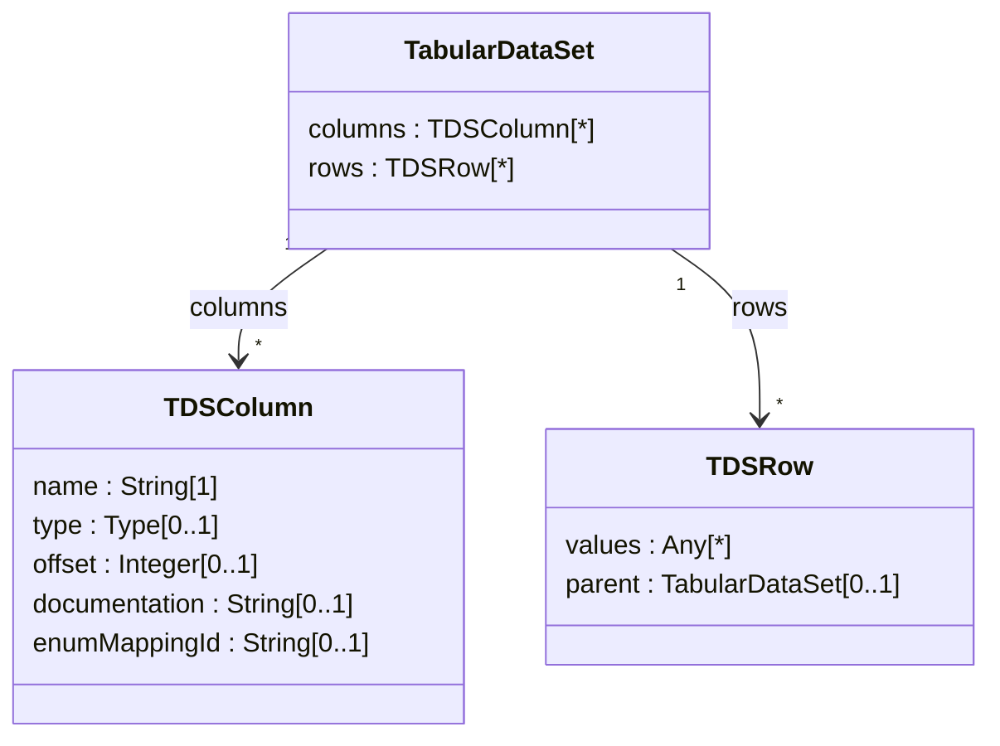
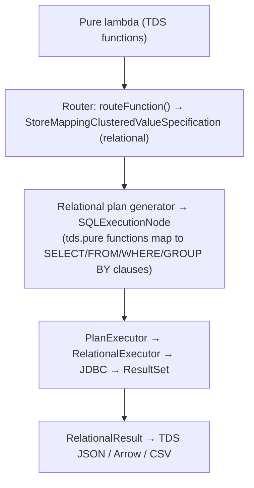
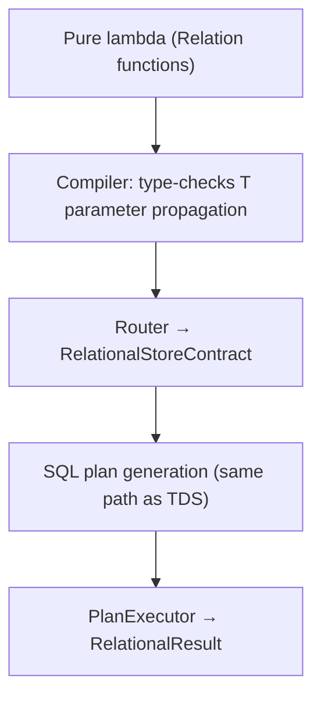

# Legend Engine — TDS and Relation

> **Audience:** Developers who need to understand, write, or extend tabular-data query code in
> Legend Engine. Covers both the older **TDS (Tabular Data Set)** API and the newer, statically-typed
> **Relation** API.
>
> **See also:**
>
> - [Key Pure Areas](../architecture/key-pure-areas.md) — section 6 gives a quick overview.
> - [Router and Pure-to-SQL Pipeline](../architecture/router-and-pure-to-sql.md) — how TDS/Relation operations
>   are translated to SQL.
> - [PCT](../architecture/key-pure-areas.md#11-pct--pure-compatibility-tests) — how Relation functions are
>   cross-store tested.
> - [legend-pure Pure Language Reference](https://github.com/finos/legend-pure/blob/main/docs/reference/pure-language-reference.md) — base collection functions (`filter`, `map`, `groupBy`, etc.) that TDS/Relation functions compose with.

---

## 1. Background: Two Representations for Tabular Data

Legend Engine provides two complementary abstractions for working with rows of typed data:

| Layer | Pure type | Column schema | Introduced |
|---|---|---|---|
| **TDS** | `meta::pure::tds::TabularDataSet` | Runtime `TDSColumn[*]` list | Original API |
| **Relation** | `meta::pure::metamodel::relation::Relation<T>` | Compile-time type parameter `T` | Newer API |

Both layers can be backed by a relational store and both produce `TDSResultType` plan nodes.
Prefer **Relation** for all new code; TDS is retained for backward-compatibility and for
service-layer tooling (e.g. REPL, schema inference) that still inspects column metadata at
runtime.

---

## 2. TDS (Tabular Data Set)

### 2.1 Core Metamodel

**Module:** `legend-engine-core/legend-engine-core-pure/legend-engine-pure-code-compiled-core`

**File:** `core/pure/tds/tds.pure`



`TDSNull` is a sentinel value (not Java `null`) used in the `values` array to represent SQL
`NULL`. Comparison uses `==` thanks to the `<<equality.Key>>` stereotype on its sole `Nil`
field.

`TDSRow` accessor helpers:

```pure
$row.getString('colName')       // cast to String
$row.getInteger('colName')      // cast to Integer
$row.getFloat('colName')        // cast to Float
$row.getDate('colName')         // cast to Date
$row.isNull('colName')          // true if value == TDSNull
$row.get('colName')             // raw Any[1]
```

### 2.2 TDS Functions

All TDS functions live in `meta::pure::tds::*` and operate on `TabularDataSet[1]`.

#### Row-producing (create a TDS)

| Function | Description |
|---|---|
| `project(set, cols)` | Map each object `T` to a row using named column specs |
| `project(set, functions, ids)` | Shorthand with lambda list + name list |
| `project(set, paths)` | Use `Path<T,Any>` expressions as column extractors |
| `project(tds, cols)` | Re-project an existing TDS with new column expressions |

#### Row transformation

| Function | Description |
|---|---|
| `filter(tds, pred)` | Retain only rows matching the predicate |
| `sort(tds, sortInfo)` | Sort by one or more `SortInformation` (`asc`/`desc` helpers) |
| `limit(tds, n)` | Keep first `n` rows |
| `take(tds, n)` | Alias for `limit` |
| `drop(tds, n)` | Discard first `n` rows |
| `slice(tds, start, stop)` | Half-open range `[start, stop)` |
| `paginated(tds, pageNumber, pageSize)` | Return the n-th page |
| `distinct(tds)` | Remove duplicate rows |

#### Column transformation

| Function | Description |
|---|---|
| `extend(tds, newCols)` | Add new computed columns, keeping existing ones |
| `renameColumn(tds, old, new)` | Rename a single column |
| `renameColumns(tds, pairs)` | Rename multiple columns with `Pair<String,String>[*]` |
| `restrict(tds, colNames)` | Drop all columns not in the list |
| `restrictDistinct(tds, colNames)` | `restrict` then `distinct` |

#### Set operations

| Function | Description |
|---|---|
| `concatenate(tds1, tds2)` | Append rows; columns must match |
| `join(tds1, tds2, type, tdsCols)` | SQL-style join on named columns (`INNER`, `LEFT_OUTER`, `RIGHT_OUTER`, `FULL_OUTER`) |
| `join(tds1, tds2, type, condition)` | Join with arbitrary row-pair predicate |

#### Aggregation

| Function | Description |
|---|---|
| `groupBy(tds, columns, aggValues)` | Group rows by column names and aggregate each group |

`AggregateValue<T,U>` is constructed with the `agg(name, mapFn, aggregateFn)` helper:

```pure
$tds->groupBy(
  ['city', 'product'],
  [
    agg('totalRevenue', row | $row.getFloat('revenue'), vals | $vals->plus()),
    agg('count',        row | $row.getInteger('id'),    vals | $vals->size())
  ]
)
```

#### OLAP (Window) functions

`olapGroupBy` computes a window-scoped column without collapsing rows:

```pure
// Partition by 'region', compute running sum of 'sales' ordered by 'date'
$tds->olapGroupBy(
  ['region'],
  ^SortInformation(column='date', direction=SortDirection.ASC),
  func('sales', vals | $vals->plus()),
  'runningSales'
)
```

Key helpers:

- `func(colName, aggregateFn)` — creates a `TdsOlapAggregation`
- `func(rankFn)` — creates a `TdsOlapRank` (e.g. for row-number)
- `col(window, sortInfo, func, name)` — assembles a full `WindowColumnSpecification`
- `window(partitionFunctions)` — builds a `Window<T>` partition
- `sortAsc(col)` / `sortDesc(col)` — `ColumnSort<T>` builders

### 2.3 Schema Inference (`tdsSchema.pure`)

**File:** `core/pure/tds/tdsSchema.pure`

`resolveSchema(f, extensions)` introspects a lambda's return type to infer the output
`TDSColumn[*]` list at compile time, without executing the function. Used by:

- The IDE for auto-completing column names.
- The `/api/pure/v1/analytics/schema` endpoint.
- Validation of downstream column operations in the compiler.

The `SchemaState` class represents an in-flight schema through a chain of TDS operations and
provides methods mirroring the TDS API (`restrict`, `extend`, `groupBy`, `rename`, `join`, etc.)
so that the schema can be inferred step-by-step through any pipeline.

### 2.4 Result Serialisation

When a TDS query is executed, `RelationalResult` streams rows to the client:

| Format | Triggered by |
|---|---|
| TDS JSON (`{"columns":[…],"rows":[…]}`) | Default for service/API calls |
| Arrow / IPC format | Content-type negotiation (`application/x-arrow`) |
| CSV | `CSVStreamingResult` |

Column-type mapping is handled by `RelationalResultHelper` using the per-dialect
`DatabaseManager`.

---

## 3. Relation (typed, compile-time)

### 3.1 Type System

**Module:** `legend-engine-core/legend-engine-core-pure/legend-engine-pure-code-functions-relation`

The `Relation<T>` type is a **native Pure type** backed by `legend-pure`. Its type parameter
`T` encodes the column schema as a record-type literal at compile time:

```pure
// A relation with three columns:
Relation<(id:Integer[0..1], name:String[0..1], salary:Float[0..1])>
```

This allows the compiler to:

- Type-check column accessor expressions (`$row.id` is `Integer[0..1]`).
- Enforce column-subset constraints (`Z⊆T`) in function signatures.
- Propagate the schema through transformations (`T+R`, `T-Z+V`, `Z+R`).

**Key metamodel classes** (in `legend-pure`):

| Class | Purpose |
|---|---|
| `Relation<T>` | Abstract base — represents a row set with schema `T` |
| `TDS<T>` | A materialised `Relation<T>` (used for literal `#TDS … #` blocks) |
| `Column<C,T>` | A typed column — `C` is the column type, `T` the relation schema |
| `ColSpec<Z⊆T>` | Reference to a single column (tilde syntax: `~myCol`) |
| `ColSpecArray<Z⊆T>` | Reference to multiple columns (`~[col1, col2]`) |
| `FuncColSpec<F,Z>` | A column + compute function (lambda) |
| `FuncColSpecArray<F,Z>` | Multiple columns with lambdas |
| `AggColSpec<MapFn, AggFn, R>` | An aggregation spec: map function + reduce function |
| `AggColSpecArray<MapFn, AggFn, R>` | Multiple aggregation specs |
| `SortInfo<Z⊆T>` | Sort direction for a column subset |
| `_Window<T>` | An OLAP window (partition + order + frame) |
| `JoinKind` | `INNER`, `LEFT`, `RIGHT` (enum) |

#### TDS Literal Syntax

The `#TDS … #` block creates an inline `TDS<T>` value with type inferred from the header row:

```pure
let data = #TDS
  id, name, salary
  1, Alice, 95000.0
  2, Bob,   82000.0
#;
// Inferred type: TDS<(id:Integer[0..1], name:String[0..1], salary:Float[0..1])>
```

### 3.2 Column Reference Syntax

Relation functions use the **tilde (`~`) syntax** to refer to columns:

```pure
~salary               // ColSpec — single column named 'salary'
~[id, name]           // ColSpecArray — two columns
~newCol : x  $x.id   // FuncColSpec — column 'newCol' computed from lambda
~[a:x$x.id, b:x$x.name]  // FuncColSpecArray — two computed columns
~newCol : x  $x.id : y  $y->plus()  // AggColSpec — map then aggregate
```

Ascending/descending order:

```pure
~salary->ascending()   // SortInfo (ASC)
~id->descending()      // SortInfo (DESC)
[~grp->ascending(), ~id->descending()]  // multi-column sort
```

### 3.3 Relation Functions

All functions live in `meta::pure::functions::relation::*` and are declared as
`native function <<PCT.function>>` — the actual implementation is provided at runtime by each
store executor. They all return `Relation<…>` and compose via method-chaining (arrow notation).

#### Column selection / projection

| Function | Signature | Description |
|---|---|---|
| `select` | `(r:Relation<T>, cols:ColSpecArray<Z⊆T>):Relation<Z>` | Keep only named columns (schema narrows) |
| `select` | `(r:Relation<T>, col:ColSpec<Z⊆T>):Relation<Z>` | Single-column variant |
| `project` | `(cl:C[*], x:FuncColSpecArray<{C→Any},T>):Relation<T>` | Create a Relation from a class collection |
| `project` | `(r:Relation<T>, fs:FuncColSpecArray<{T→Any},Z>):Relation<Z>` | Re-project a relation |
| `rename` | `(r:Relation<T>, old:ColSpec<Z=(?:K)⊆T>, new:ColSpec<V=(?:K)>):Relation<T-Z+V>` | Rename a column (schema changes) |

#### Filtering and slicing

| Function | Signature | Description |
|---|---|---|
| `filter` | `(r:Relation<T>, f:{T→Boolean}):Relation<T>` | Retain rows matching predicate |
| `distinct` | `(r:Relation<T>):Relation<T>` | Remove duplicate rows |
| `distinct` | `(r:Relation<T>, cols:ColSpecArray<X⊆T>):Relation<X>` | Distinct on specified columns |
| `limit` | `(r:Relation<T>, n:Integer):Relation<T>` | Keep first `n` rows |
| `drop` | `(r:Relation<T>, n:Integer):Relation<T>` | Skip first `n` rows |
| `slice` | `(r:Relation<T>, start, stop):Relation<T>` | Half-open range `[start, stop)` |

#### Sorting

| Function | Signature | Description |
|---|---|---|
| `sort` | `(r:Relation<T>, sortInfo:SortInfo<X⊆T>[*]):Relation<T>` | Sort by one or more columns |

Example:

```pure
$employees
  ->sort([~salary->descending(), ~name->ascending()])
```

#### Extending and aggregating

| Function | Signature | Description |
|---|---|---|
| `extend` | `(r:Relation<T>, f:FuncColSpec<{T→Any},Z>):Relation<T+Z>` | Add a computed column |
| `extend` | `(r:Relation<T>, fs:FuncColSpecArray<{T→Any},Z>):Relation<T+Z>` | Add multiple computed columns |
| `extend` | `(r:Relation<T>, agg:AggColSpec<…,R>):Relation<T+R>` | OLAP aggregation (no window = whole partition) |
| `groupBy` | `(r:Relation<T>, cols:ColSpecArray<Z⊆T>, agg:AggColSpec<…,R>):Relation<Z+R>` | Group and aggregate |
| `groupBy` | `(r:Relation<T>, col:ColSpec<Z⊆T>, agg:AggColSpec<…,R>):Relation<Z+R>` | Single-key variant |
| `aggregate` | `(r:Relation<T>, agg:AggColSpec<…,R>):Relation<R>` | Aggregate entire relation (no grouping) |
| `pivot` | `(r:Relation<T>, cols:ColSpec/ColSpecArray, agg:AggColSpec):Relation<Any>` | Rotate row values into columns |

Examples:

```pure
// Simple extend
$employees->extend(~bonus : e  $e.salary->toOne() * 0.1)

// GroupBy with two aggregations
$employees->groupBy(
  ~[dept, title],
  ~[
    headcount : x  $x.id    : y  $y->count(),
    avgSalary : x  $x.salary : y  $y->average()
  ]
)

// Aggregate full relation
$employees->aggregate(~[
  total : x  $x.salary : y  $y->plus(),
  cnt   : x  $x.id     : y  $y->count()
])
```

#### Joins

| Function | Signature | Description |
|---|---|---|
| `join` | `(r1:Relation<T>, r2:Relation<V>, kind:JoinKind, f:{T,V→Boolean}):Relation<T+V>` | Equi- or theta-join |
| `asOfJoin` | `(r1, r2, match, [join]):Relation<T+V>` | As-of / time-series join |
| `lateral` | `(r1, f:{T→Relation<V>}):Relation<T+V>` | Lateral (correlated) join |

Example:

```pure
$orders->join($customers, JoinKind.LEFT, o_c  $o.customerId == $c.id)
// Result type: Relation<(orderId:…, customerId:…, id:…, name:…, …)>
```

#### Set operations

| Function | Signature | Description |
|---|---|---|
| `concatenate` | `(r1:Relation<T>, r2:Relation<T>):Relation<T>` | Union all (both relations must have same schema) |

#### OLAP / window functions

Window functions require an `_Window<T>` built with `over(…)`:

```pure
// Partition only
over(~dept)
over(~[dept, region])

// Partition + order
over(~dept, ~salary->descending())
over(~[dept], [~hire_date->ascending(), ~name->ascending()])

// Partition + order + frame
over(~dept, ~date->ascending(), rows(meta::pure::functions::relation::unbounded(), 0))
over(~dept, ~date->ascending(), _range(-1, 1))
```

`extend` with a window applies the computation per partition:

```pure
// Running sum of salary within each department, ordered by hire date
$employees->extend(
  over(~dept, ~hireDate->ascending()),
  ~runningSalary : {p, w, r  $r.salary} : y  $y->plus()
)
// Result type: Relation<(…original columns…, runningSalary:Float[0..1])>
```

**Ranking functions** (require a `_Window<T>`):

| Function | Signature | Description |
|---|---|---|
| `rank` | `(r, w:_Window<T>, row:T):Integer` | Rank with gaps (1,1,3,…) |
| `denseRank` | `(r, w:_Window<T>, row:T):Integer` | Rank without gaps (1,1,2,…) |
| `rowNumber` | `(r, row:T):Integer` | Unique sequential row number |
| `ntile` | `(r, w:_Window<T>, row:T, buckets:Integer):Integer` | Bucket assignment |
| `percentRank` | `(r, w:_Window<T>, row:T):Float` | Relative rank (0..1) |
| `cumulativeDistribution` | `(r, w:_Window<T>, row:T):Float` | CDF value (0..1) |

**Navigation functions** (within a window):

| Function | Signature | Description |
|---|---|---|
| `first` | `(r, w:_Window<T>, row:T):T[0..1]` | First row in the window frame |
| `last` | `(r, w:_Window<T>, row:T):T[0..1]` | Last row in the window frame |
| `nth` | `(r, w:_Window<T>, row:T, offset:Integer):T[0..1]` | N-th row in frame |
| `lag` | (via `offset`) | Access preceding row |
| `lead` | (via `$p->lead($r)`) | Access following row |
| `offset` | `(r, row:T, offset:Integer):T[0..1]` | Offset (platformOnly) |

**Frame types:**

- `rows(start, stop)` — physical row offset frame.
- `_range(start, stop)` — value-based range frame.
- `meta::pure::functions::relation::unbounded()` — open-ended boundary.

Example using ranking inside `extend`:

```pure
$employees->extend(
  over(~dept, ~salary->descending()),
  ~[
    deptRank    : {p,w,r  $p->rank($w, $r)},
    deptDenseRk : {p,w,r  $p->denseRank($w, $r)}
  ]
)
```

#### Utility

| Function | Signature | Description |
|---|---|---|
| `size` | `(r:Relation<T>):Integer` | Count rows |
| `columns` | `(r:Relation<T>):Column<Nil,Any>[*]` | Enumerate column metadata (platformOnly) |
| `map` | `(r:Relation<T>, f:{T→V}):V[*]` | Materialise rows as a collection (platformOnly) |
| `write` | `(r:Relation<T>, accessor:RelationElementAccessor<T>):Integer` | Write rows (side-effect) |

---

## 4. TDS → Relation Migration

TDS and Relation are complementary, not exclusive. The engine includes a **protocol
transformation layer** that rewrites TDS function calls to their Relation equivalents when
the `TdsToRelationExtension` feature is active.

### 4.1 Extension Points

**Pure side:**

`meta::pure::tds::toRelation::TdsToRelationExtension_V_X_X` (in
`core/pure/tds/relation/tdsToRelation.pure`) holds a `transfers` function that maps each
TDS `AppliedFunction` protocol node to the equivalent Relation function call. A
relational-store–specific override is registered in
`core_relational/relational/tds/relation/tdsToRelation.pure`.

**Java side:**

`FeatureExtension` in `Extension` carries the TDS→Relation transfer logic. It is enabled by
adding the `TdsToRelationFeature` to the extension list. The transformer rewrites the JSON
protocol representation before compilation, so the compiled `PureModel` already sees
Relation functions.

### 4.2 Mapping Table (TDS → Relation equivalent)

| TDS function | Relation equivalent |
|---|---|
| `project(set, cols)` | `project(set, ~[…])` |
| `project(tds, cols)` | `project(tds, ~[…])` |
| `filter(tds, pred)` | `filter(tds, pred)` |
| `sort(tds, sortInfo)` | `sort(tds, [~col->asc()])` |
| `limit(tds, n)` | `limit(tds, n)` |
| `drop(tds, n)` | `drop(tds, n)` |
| `slice(tds, s, e)` | `slice(tds, s, e)` |
| `distinct(tds)` | `distinct(tds)` |
| `extend(tds, cols)` | `extend(tds, ~[…])` |
| `renameColumn(tds, a, b)` | `rename(tds, ~a, ~b)` |
| `restrict(tds, cols)` | `select(tds, ~[…])` |
| `concatenate(tds1, tds2)` | `concatenate(tds1, tds2)` |
| `join(tds1, tds2, type, cols)` | `join(tds1, tds2, JoinKind, f)` |
| `groupBy(tds, cols, aggs)` | `groupBy(tds, ~[…], ~[…])` |
| `olapGroupBy(tds, cols, sort, op, name)` | `extend(tds, over(…), ~name:…)` |

---

## 5. Execution Path

### 5.1 TDS queries



### 5.2 Relation queries

Relation functions are also routed through the relational store when backed by a database.
Because `Relation<T>` carries full schema information, the compiler can:

1. Validate column references at compile time (no runtime `columnByName` lookups).
2. Infer the output schema of each operation without executing `tdsSchema.pure` inference.
3. Produce exactly the same `SQLExecutionNode` plan nodes as equivalent TDS expressions.



### 5.3 In-memory Relation (`TDS<T>` literals)

When a `#TDS … #` literal is used (or after a `wrapPrimitiveInTDS`) without a store mapping,
the query runs in-process using the compiled Pure runtime. The plan node type is
`PureExpressionPlatformExecutionNode` and the result is materialised in the JVM rather than
fetched from a database.

---

## 6. Schema Inference vs. Compile-time Types

| Aspect | TDS (runtime schema) | Relation (compile-time schema) |
|---|---|---|
| Column existence check | Runtime assertion in `get(colName)` | Compiler error (`ColSpec<Z⊆T>`) |
| Column type check | Runtime cast (`getString`, `getInteger`) | Compiler infers from `T` |
| Schema after `extend` | Computed by `tdsSchema.pure` | Encoded in return type `Relation<T+Z>` |
| Schema after `groupBy` | Computed by `tdsSchema.SchemaState::groupBy` | Encoded in `Relation<Z+R>` |
| IDE auto-complete | Requires `resolveSchema(f, extensions)` call | Direct from type parameter |
| New code guidance | Discouraged for new query code | **Preferred** |

---

## 7. PCT Coverage for Relation Functions

Every `native function <<PCT.function>>` in `meta::pure::functions::relation::*` must be
covered by `<<PCT.test>>` cases that run against each registered store backend.

**PCT test files** live alongside the function definitions (e.g., in `groupBy.pure`,
`extend.pure`, `over.pure`, etc.). Each test function:

1. Builds a `#TDS … #` literal as input.
2. Applies the function under test.
3. Asserts the string representation of the sorted result.

**PCT qualifiers** restrict which stores run a test:

- `<<PCTRelationQualifier.relation>>` — basic relational stores.
- `<<PCTRelationQualifier.aggregation>>` — stores that support `groupBy`/`aggregate`.
- `<<PCTRelationQualifier.olap>>` — stores that support window functions.

**Test matrix example:**

```pure
function <<PCT.test, PCTRelationQualifier.relation, PCTRelationQualifier.aggregation>>
meta::pure::functions::relation::tests::groupBy::testSimpleGroupBy_SingleSingle<Tm>(
  f:Function<{Function<{->T[m]}>[1]->T[m]}>[1]
):Boolean[1]
{
  let expr = {
    #TDS
      id, grp, name
      1, 2, A
      2, 1, B
    #->groupBy(~grp, ~newCol : x  $x.name : y  $y->joinStrings(''))
  };
  let res = $f->eval($expr);
  assertEquals('…', $res->sort(~grp->ascending())->toString());
}
```

The `f` parameter is the store-specific evaluator injected by the JUnit 5 test class
(e.g., `PCTRelational_H2_Test`).

---

## 8. Key File Index

### TDS

| File | Purpose |
|---|---|
| `core/pure/tds/tds.pure` | Core metamodel (`TabularDataSet`, `TDSColumn`, `TDSRow`) and all TDS functions |
| `core/pure/tds/tdsSchema.pure` | Compile-time schema inference (`resolveSchema`, `SchemaState`) |
| `core/pure/tds/tdsExtensions.pure` | Helper utilities (e.g., `firstNotNull`) |
| `core/pure/tds/relation/tdsToRelation.pure` | Protocol transformer: TDS → Relation function rewrites |
| `core_relational/relational/tds/tds.pure` | Relational-specific TDS functions (`join`, etc.) |
| `core_relational/relational/tds/tdsExtension.pure` | Relational-specific TDS extensions |
| `core_relational/relational/tds/relation/tdsToRelation.pure` | Relational join rewrites for TDS→Relation migration |

### Relation

| File | Purpose |
|---|---|
| `core_functions_relation/relation/functions/iteration/filter.pure` | `filter` |
| `core_functions_relation/relation/functions/transformation/select.pure` | `select` |
| `core_functions_relation/relation/functions/transformation/extend.pure` | `extend` (simple, agg, OLAP) |
| `core_functions_relation/relation/functions/transformation/groupBy.pure` | `groupBy` |
| `core_functions_relation/relation/functions/transformation/aggregate.pure` | `aggregate` |
| `core_functions_relation/relation/functions/transformation/join.pure` | `join` |
| `core_functions_relation/relation/functions/transformation/asofjoin.pure` | `asOfJoin` |
| `core_functions_relation/relation/functions/transformation/lateral.pure` | `lateral` |
| `core_functions_relation/relation/functions/transformation/concatenate.pure` | `concatenate` |
| `core_functions_relation/relation/functions/transformation/distinct.pure` | `distinct` |
| `core_functions_relation/relation/functions/transformation/rename.pure` | `rename` |
| `core_functions_relation/relation/functions/transformation/pivot.pure` | `pivot` |
| `core_functions_relation/relation/functions/graph/project.pure` | `project` |
| `core_functions_relation/relation/functions/order/sort.pure` | `sort` |
| `core_functions_relation/relation/functions/order/ascending.pure` | `ascending` helper |
| `core_functions_relation/relation/functions/order/descending.pure` | `descending` helper |
| `core_functions_relation/relation/functions/slice/limit.pure` | `limit` |
| `core_functions_relation/relation/functions/slice/drop.pure` | `drop` |
| `core_functions_relation/relation/functions/slice/slice.pure` | `slice` |
| `core_functions_relation/relation/functions/slice/first.pure` | `first` (window navigation) |
| `core_functions_relation/relation/functions/slice/last.pure` | `last` (window navigation) |
| `core_functions_relation/relation/functions/slice/nth.pure` | `nth` (window navigation) |
| `core_functions_relation/relation/functions/slice/lag.pure` | `lag` (window navigation) |
| `core_functions_relation/relation/functions/slice/lead.pure` | `lead` (window navigation) |
| `core_functions_relation/relation/functions/olap/over.pure` | `over` — builds `_Window<T>` |
| `core_functions_relation/relation/functions/olap/frame/rows.pure` | `rows(…)` frame |
| `core_functions_relation/relation/functions/olap/frame/range.pure` | `_range(…)` frame |
| `core_functions_relation/relation/functions/ranking/rank.pure` | `rank` |
| `core_functions_relation/relation/functions/ranking/denseRank.pure` | `denseRank` |
| `core_functions_relation/relation/functions/ranking/rowNumber.pure` | `rowNumber` |
| `core_functions_relation/relation/functions/ranking/ntile.pure` | `ntile` |
| `core_functions_relation/relation/functions/ranking/percentRank.pure` | `percentRank` |
| `core_functions_relation/relation/functions/ranking/cumulativeDistribution.pure` | `cumulativeDistribution` |
| `core_functions_relation/relation/functions/size/size.pure` | `size` |
| `core_functions_relation/relation/functions/columns.pure` | `columns` (platformOnly) |
| `core_functions_relation/relation/functions/write/write.pure` | `write` (side-effect) |

All paths above are relative to `src/main/resources/` within the respective module.
