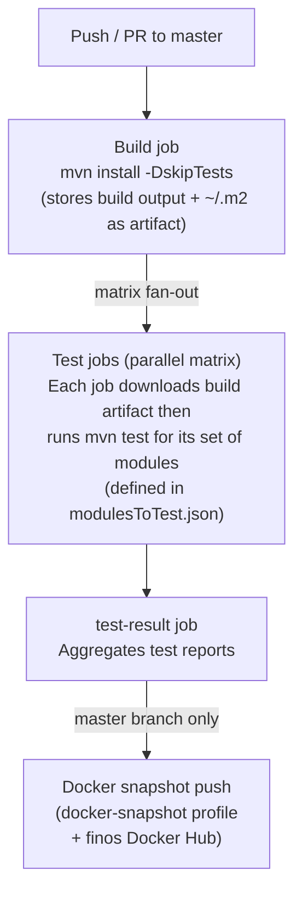

# Legend Engine — Testing Requirements & Strategy

> **Audience:** All contributors.  
> **Related:** [Coding Standards](../standards/coding-standards.md) | [Getting Started](../guides/getting-started.md)

---

## 1. Testing Philosophy

Legend Engine follows a **testing pyramid** with a strong emphasis on unit and integration tests.
End-to-end (server-level) tests exist but are expensive and reserved for smoke-testing critical paths.


**Unit tests** — fast, no external I/O. Test one class in isolation with mocks.  
**Integration tests** — may spin up an H2 in-memory DB, a WireMock HTTP server, or a Testcontainer.  
**E2E tests** — start the full Dropwizard server and send HTTP requests.

---

## 2. Testing Frameworks

| Framework | Version | Use |
|-----------|---------|-----|
| JUnit 5 (`junit-jupiter`) | `5.11.0` | Primary test runner for all new tests |
| JUnit 4 | `4.13.1` | Legacy tests only — do not add new JUnit 4 tests |
| Mockito | `4.4.0` (core), `5.2.0` (inline) | Mocking Java objects |
| Hamcrest | `1.3` | Matcher assertions (used alongside JUnit) |
| JsonUnit | `2.17.0` | JSON equality assertions (`assertJsonEquals`) |
| WireMock | `2.35.2` | Mock HTTP servers for service-store tests |
| Testcontainers | `1.21.4` | Docker-based integration tests (MongoDB, Postgres, etc.) |
| H2 | `2.1.214` | In-process SQL database for relational tests |
| DuckDB | `1.3.0.0` | Local analytical SQL for REPL and PCT tests |

---

## 3. Test Class Naming Conventions

| Pattern | When to use | Example |
|---------|-------------|---------|
| `Test<Subject>` | Unit tests for a single class | `TestPlanExecutor`, `TestRelationalExecutor` |
| `<Subject>Test` | Alternative (existing legacy convention) | `PureGrammarParserTest` |
| `Test<Subject>WithH2` | Relational integration test using H2 | `TestExecutionWithH2` |
| `PCT<Store>_<Dialect>_Test` | Pure Compatibility Test variant | `PCTRelational_H2_Test` |
| `Test<Feature>Integration` | Full integration tests | `TestServiceExecutionIntegration` |

---

## 4. Test Data and Setup

### Inline Pure model snippets

Many tests build a `PureModelContextData` from a string of Legend grammar:

```java
PureModelContextData model = PureGrammarParser.newInstance().parseModel(
    "###Pure\n" +
    "Class my::Person { name: String[1]; }"
);
PureModel pureModel = Compiler.compile(model, DeploymentMode.TEST, Identity.getAnonymousIdentity());
```

### Loading Pure files from classpath

For larger test models, use `.pure` files in `src/test/resources/`:

```java
// In src/test/resources/org/finos/legend/engine/plan/...
String grammar = IOUtils.toString(
    Objects.requireNonNull(getClass().getResourceAsStream("myTestModel.pure")),
    StandardCharsets.UTF_8
);
```

### H2 test configuration

Relational tests that need a live SQL database use H2 via the test helper:

```java
RelationalExecutionConfiguration config = new RelationalExecutionConfiguration(
    new TemporaryTestDbConfiguration(/* H2 port */ 9900)
);
```

The `TemporaryTestDbConfiguration` starts an embedded H2 instance.

### WireMock for service-store tests

```java
@RegisterExtension
static WireMockExtension wireMock = WireMockExtension.newInstance()
    .options(wireMockConfig().dynamicPort())
    .build();
```

### Testcontainers

Annotate the test class:

```java
@Testcontainers
class TestMongoDBExecution {
    @Container
    static MongoDBContainer mongoDBContainer = new MongoDBContainer("mongo:6.0");
}
```

Requires Docker to be running. Tests annotated with `@Testcontainers` are automatically
skipped if Docker is unavailable.

---

## 5. PCT (Pure Compatibility Tests)

PCT is the mechanism that guarantees a Pure function produces the same result on every registered
store backend. The framework — including the `<<PCT.test>>` stereotype, assertion helpers, the
function registry, and how to author PCT test functions in Pure — is defined and documented in
`legend-pure`. See:
> **[legend-pure Testing Strategy §5 — PCT](https://github.com/finos/legend-pure/blob/main/docs/testing/testing-strategy.md)**
> for all Pure-side authoring details.

This section covers only the `legend-engine`-specific concerns: which stores are registered as
PCT targets, how to add a new one, and how PCT fits into the CI pipeline.

### Stores registered as PCT targets in legend-engine

| Store / dialect | Module | CI profile |
|-----------------|--------|------------|
| H2 (in-memory relational) | `legend-engine-xt-relationalStore-h2-PCT` | Default (all PRs) |
| DuckDB | `legend-engine-xt-relationalStore-duckdb-PCT` | Default (all PRs) |
| Postgres | `legend-engine-xt-relationalStore-postgres-PCT` | `pct-cloud-test` |
| Snowflake | `legend-engine-xt-relationalStore-snowflake-PCT` | `pct-cloud-test` |
| BigQuery | `legend-engine-xt-relationalStore-bigquery-PCT` | `pct-cloud-test` |
| Databricks | `legend-engine-xt-relationalStore-databricks-PCT` | `pct-cloud-test` |
| Spanner | `legend-engine-xt-relationalStore-spanner-PCT` | `pct-cloud-test` |
| MemSQL | `legend-engine-xt-relationalStore-memsql-PCT` | `pct-cloud-test` |
| Java platform binding | `legend-engine-pure-runtime-java-extension-compiled-*` | Default (all PRs) |

### Adding a new store as a PCT target

1. Create a `<dialect>-PCT` module alongside the store's other modules.
2. Implement a JUnit test class that extends the relevant PCT base class and declares the store
   adapter. Use an existing module (e.g. `legend-engine-xt-relationalStore-h2-PCT`) as a template.
3. If the store requires cloud credentials, add the module under the `pct-cloud-test` Maven profile
   in the root `pom.xml`.
4. Add the new module to `.github/workflows/resources/modulesToTest.json` under the appropriate
   CI group.

### Writing a new PCT test function

PCT test functions are authored in Pure. For syntax and conventions see
[legend-pure Contributor Workflow](https://github.com/finos/legend-pure/blob/main/docs/guides/contributor-workflow.md).
The short form: annotate a Pure function `<<PCT.test>>` and add `{PCT.exclude=[...]}` tags for
any stores that legitimately do not support the function.

### Running PCT tests

**All default-profile PCT targets (H2, DuckDB, Java binding) — runs on every PR:**

```bash
# Run a single dialect's PCT suite
mvn test -pl legend-engine-xts-relationalStore/legend-engine-xt-relationalStore-dbExtension/legend-engine-xt-relationalStore-h2/legend-engine-xt-relationalStore-h2-PCT

# Run the full relational PCT suite (all default-profile dialects)
mvn test -pl legend-engine-xts-relationalStore/legend-engine-xt-relationalStore-PCT
```

**Cloud-store PCT targets — requires credentials (Snowflake, BigQuery, Databricks, etc.):**

```bash
mvn test -P pct-cloud-test
```

This profile is only active in CI when the PR is from the `finos/legend-engine` repo itself
(secrets are not available on fork PRs).

**Run a single PCT test function across all registered stores:**

```bash
mvn test -pl legend-engine-xts-relationalStore/legend-engine-xt-relationalStore-PCT \
  -Dtest="PCTRelational_H2_Test#<functionName>"
```

---

## 6. How to Run Tests

### Run all unit tests

```bash
mvn test
```

### Run a specific test class

```bash
mvn test -pl <module-path> -Dtest=TestClassName
# or with JUnit 5 method filter:
mvn test -pl <module-path> -Dtest="TestClassName#testMethodName"
```

### Run integration tests (requires Docker)

```bash
mvn verify -Pintegration-test
```

### Run just the server integration tests

```bash
mvn test -pl legend-engine-config/legend-engine-server/legend-engine-server-integration-tests
```

### Run the full CI test matrix locally (approximately)

```bash
# Build first
mvn install -DskipTests -T 4

# Then test core
mvn test -pl legend-engine-core/legend-engine-core-pure/legend-engine-pure-code-compiled-core
```

For PCT tests see [§5 — Running PCT tests](#running-pct-tests).

### Skip tests during development iteration

```bash
mvn install -DskipTests
# or skip only running (still compile test sources):
mvn install -DskipITs
```

---

## 7. CI/CD Pipeline Overview

The CI pipeline is defined in `.github/workflows/build.yml`.

### Pipeline stages



### Test matrix groups (from `modulesToTest.json`)

| Group name | Key modules |
|------------|-------------|
| `server` | `legend-engine-server-http-server` |
| `core` | Pure compiled-core, function extensions |
| `javaBinding` | Java platform binding PCT |
| `sql` | SQL grammar, pure, HTTP API, reverse-PCT |
| `relational` | Relational store execution, H2 dialect |
| `relationalDialects` | Postgres, Oracle, Snowflake, BigQuery, etc. dialects |
| `graphQL` | GraphQL compiler, pure, HTTP API |
| `service` | Service DSL, execution, test runner |
| `persistence` | Persistence DSL and test runner |
| `analytics` | Analytics APIs |
| `changeToken` | Change-token compiler and tests |
| `authentication` | Authentication grammar and implementation |
| ... | (others) |

### Code quality

Sonar cloud quality checks run on `workflow_dispatch` (manually triggered). Configuration
is in `.github/workflows/code-quality.yml`. SonarCloud project key: `legend-engine`.

---

## 8. Coverage

JaCoCo is configured in the root `pom.xml` (version `0.8.10`). Reports are generated at:
`target/site/jacoco/`.

There is currently **no enforced minimum coverage threshold** project-wide. Individual modules
may add their own thresholds via `<jacoco:check>` goals if desired.

**Generating a coverage report:**

```bash
mvn test jacoco:report -pl <module>
# Open: <module>/target/site/jacoco/index.html
```

---

## 9. Testing Conventions Checklist

When adding tests, ensure:

- [ ] Use JUnit 5 (`@Test` from `org.junit.jupiter.api`) for all new tests.
- [ ] Test class is in the same package as the class under test (placed in `src/test/java/`).
- [ ] Test resources (`.pure` files, JSON) go in `src/test/resources/` mirroring the production package path.
- [ ] Mockito mocks use `@ExtendWith(MockitoExtension.class)` with `@Mock` fields.
- [ ] Use `JsonUnit.assertJsonEquals` for JSON comparison — not `String.equals`.
- [ ] Pure test resources have the Apache 2.0 copyright header (Checkstyle checks `.pure` files too).
- [ ] Testcontainer tests have a Docker availability guard or are in an integration-test profile.
- [ ] PCT functions include a `{doc.doc='...'}` annotation describing what is being tested.
- [ ] H2 port numbers used in tests do not conflict (check `TemporaryTestDbConfiguration` usages).
