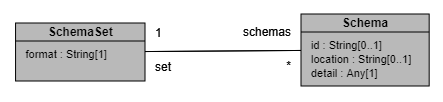

# ExternalFormat

ExternalFormat lets users define formal schema (eg : XSD, Json-Schema) of their data using PURE DSL.  
Users can model these schema in Legend ecosystem within `ExternalFormat` section of PURE DSL using PackageableElement - `SchemaSet`.

## Where does External Format fit in Legend/Pure modeling?

External Format models the formal schema of a data. In this sense it is similar to a store which also defines structure/schema of data in its physical counterpart.
To provide an example :

- **Database** : Database is defined within `Relational` section in PURE DSL and it models the schema/structure of data in Relational Database
- **SchemaSet** : SchemaSet is defined within `ExternalFormat` section in PURE DSL and it models the schema/structure of data in some source (like file).

### Store v/s External Format

There are certain similarities between ExternalFormat and Store, though there are concrete differences between these and hence they are modeled and addressed separately.  
Few of those differences are listed below -

| External Format                                                                                     | Store                                                                                                                              |
|-----------------------------------------------------------------------------------------------------|------------------------------------------------------------------------------------------------------------------------------------|
| External Format models the schema of data                                                           | Store models the schema of a physical entity storing the data                                                                      |
| External Format does not represent a physical entity                                                | Store represents a physical entity                                                                                                 | 
| External Format does not have any execution capabilities                                            | Store models physical entity powered with execution capabilities                                                                   |
| Responsibility of users to fetch data aligning with   modeled schema and feed it to the platform | Responsibility of platform to connect with store (using connection   modeled by user) and query data using store's query engine |

## Use cases

External Format should be used when users have data which aligns with some schema and they want to deserialize and write transformations on top of it.  
It can be used in following scenario's for example -

- Deserializing data in format A and serializing it back to format B
- Deserializing data in format A and validating data against modelled constraints
- Deserializing data in format A and filtering records based on some modelled condition

Legend ecosystem also allows users to use external format with store and exploit their combined power

- Deserializing data in format A and transforming records using M2M mapping
- Deserializing data fetched via a REST Api (via Service Store) / Serializing body as part of executing a Http request (via ServiceStore)
- Leveraging SemiStructured data in Relational Store (ex: VARIANT column in Snowflake)

## External Format metamodel and concepts

External Formats are modeled in Legend Ecosystem within `###ExternalFormat` section via `SchemaSet`.

### Schema Set

SchemaSet is a type of packageable element in legend ecosystem. It aligns with a particular format (ex: XSD, JSON Schema) and is modeled to hold a set of Schema's of that format.  
The schemas in a set must be of the same type and should be related, for example where schemas refer to each other for inclusion. Unrelated schemas should be in different SchemaSets.

### Schema

Schema hosts the formal schema definition of a single entity, users can also optionally define id & location for this schema.

- `Id` which if given must be unique within the schema set. It is used to reference a specific schema within the set (for example in a Binding).
- `Location` associates a location with the schema which is used when resolving schema references. For example when resolving include/import/redefine elements for XSDs.
- `Content` the text of the schema

### Schema Detail

Schema Detail is an abstract model which is sub typed by each and every External Format in legend ecosystem. Each format is free to define its own structure for its schema content.

### Diagram

## How to introduce a new external format

Legend ecosystem acknowledges the fact that there are tons of external formats that users work with and new ones are being developed even more rapidly.  
To incorporate this, external format framework in legend is developed in an extensible fashion to help us scale better and address our users use-case.  
If you need/wish to contribute a new external format to legend ecosystem, reviewing these [steps](./steps-to-add-new-external-format.md) might be helpful 
