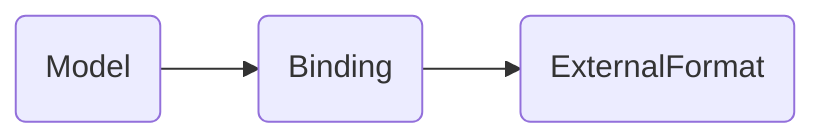
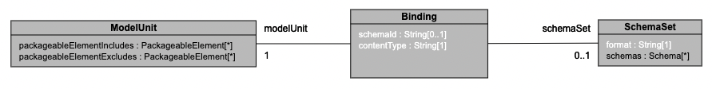
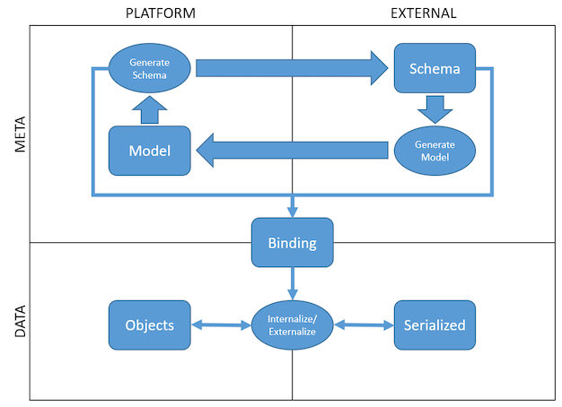

# Binding

`Binding` links External Format (via SchemaSet) to pure models. If a binding is modeled and added to a legend project it provides compile time validations and ensure linked pure models and external format schema's remain in sync.  
It is used in context of query to declare an internalize/externalize (deserialization/serialisation) relationship between data in some format and a model.

## Binding metamodel and concepts

Bindings are modeled in Legend Ecosystem within `###ExternalFormat` section via `Binding`.

### Binding

Binding is a type of packageable element in legend ecosystem. It aligns with a contentType and links pure models to external format schemas.  
Each binding defines:

- `contentType` : specifies the format of the serialized data (ex : application/json).
- `schemaSet` : specifies the SchemaSet holding the schema. If given the SchemaSet must define schemas compatible with the content type. If not provided SchemaSet is inferred based on set of platform conventions.
- `schemaId` : specifies the id of the schema within the SchemaSet. It is an optional field.
- `modelUnit` : defines the classes, enums and associations that make up the model

### Diagram

### Concepts

Internal to the platform we have the data model to describe the data structurally and instances of it to represent data values.  
Their external equivalents are the schema (for example a JSON Schema) and the serialized form of the data (for example a JSON document).

Models can be generated from schemas and vice versa.

