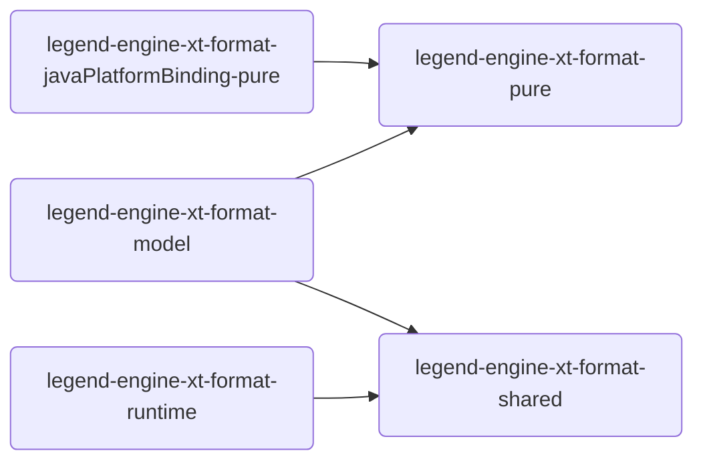

# Defining a new external format

This page describes steps required to add support for a new external format.

## Contributions Required

### Pure

- Implement [ExternalFormatContract](../../legend-engine-pure-code-compiled-core/src/main/resources/core/pure/binding/externalFormat/externalFormatContract.pure) : External Format Contract defines your format and links all its offered features and configurations
    - `id` : Provide id
    - `contentTypes` : Provide content types
    - `externalFormatMetamodel` : Define Metamodel for External Format
        - This metamodel is the formal definition of ExternalFormat Schema and is mandatory for every ExternalFormat in legend ecosystem. <br> Each metamodel should extend SchemaDetail.
    - Everything except id and schema metamodel is optional for defining an external format. You may choose to add features you need with your external format in parts and as you need them. <br> Each external format can choose to implement following features -
        - `externalFormatToPureDescriptor` : Pure Model generation from External Format Schema
            - This is needed when you want to allow users of your external format to generate Pure models from external format schema
            - To add support for this you need to implement [ExternalFormatToPureDescriptor](../../legend-engine-pure-code-compiled-core/src/main/resources/core/pure/binding/externalFormat/externalFormatContract.pure). This requires you to -
                - Model SchemaToModelConfiguration for your external format
                - Implement a function which takes in an instance of SchemaSet and modeled configuration and generates packageable elements
                - Provide a default config for your SchemaToModelConfiguration
        - `externalFormatFromPureDescriptor` : External Format Schema generation from Pure Model
            - This is needed when you want to allow users of your external format to generate external format schema from authored pure models
            - To add support for this you need to implement [ExternalFormatFromPureDescriptor](../../legend-engine-pure-code-compiled-core/src/main/resources/core/pure/binding/externalFormat/externalFormatContract.pure). This requires you to -
                - Model ModelToSchemaConfiguration for your external format
                - Implement a function which takes in an instance of ModelUnit and modeled configuration and generates SchemaSet
                - Provide a default config for your ModelToSchemaConfiguration
        - `externalFormatBindingValidator` : Ability to validate SchemaSet against linked PureModels (via binding)
            - This is needed when you want your users to have flexibility to develop both schema and pure models simultaneously and get compile time feedback if those get out of sync.
            - This is also needed to integrate your external format with other features of the platform (ex: ServiceStore)
            - To add support for this feature you need to implement a function which takes in Binding and generates a BindingDetail
        - `externalizeConfig` : Defines configurations needed to serialize instances into data aligning with external format
            - This is needed when you want to allow users to serialize instances into your external format
            - This is used at plan generation/execution time.
            - To add support for this you need to -
                - Model [ExternalFormatExternalizeConfig](../../legend-engine-pure-code-compiled-core/src/main/resources/core/pure/binding/externalFormat/externalFormatContract.pure)
                - Author algorithm to dynamically generate platform binding requirements (for JAVA see below)
        - `internalizeConfig` : Defines configurations needed to deserialize data aligning with external format into instances.
            - This is needed when you want to allow users to deserialize data aligning with external format into instances to be used with legend ecosystem
            - This is used at plan generation/execution time.
            - To add support for this you need to -
                - Model [ExternalFormatInternalizeConfig](../../legend-engine-pure-code-compiled-core/src/main/resources/core/pure/binding/externalFormat/externalFormatContract.pure)
                - Author algorithm to dynamically generate platform binding requirements (for JAVA see below)
        - `sourceRecordTree` : Defines structure of each record for your external format
            - This is needed when you want to allow users to work with checked results and offer them record level lineage


- Implement [ExternalFormatLegendJavaPlatformBindingDescriptor](../../legend-engine-xt-javaPlatformBinding-pure/src/main/resources/core_java_platform_binding/legendJavaPlatformBinding/binding/descriptor.pure) : ExternalFormatLegendJavaPlatformBindingDescriptor is a description of algorithms required to integrate your format with JAVA implementation of Legend query engine
    - `externalFormatContract` : Link your ExternalFormatContract defined above
    - `enginePlatformDependencies` : Inject Engine Dependencies for your format into JAVA Platform Binding conventions
    - Now you can choose to implement either or both of serialization/deserialization support for your format
        - `externalizeDescriptor` : Description of algorithms required to generate code to support serialization. To add this feature you need to -
            - Provide instance of [ExternalFormatExternalizeBindingDescriptor](../../legend-engine-xt-javaPlatformBinding-pure/src/main/resources/core_java_platform_binding/legendJavaPlatformBinding/binding/descriptor.pure)
                - `externalizeGenerator` : Author a function which takes in ExternalFormatExternalizeExecutionNode, Path, GenerationContext, DebugContext and return GeneratedCode
                - `externalizePreparator` : You may optionally need to provide an implementation to inject some types into TypeInfoSet to support your generations. Based on basic analysis of query certain types are injected into TypeInfoSet for every ExternalFormatContract
        - `internalizeDescriptor` : Description of algorithms required to generate code to support deserialization. To add this feature you need to -
            - Provide instance of [ExternalFormatInternalizeBindingDescriptor](../../legend-engine-xt-javaPlatformBinding-pure/src/main/resources/core_java_platform_binding/legendJavaPlatformBinding/binding/descriptor.pure)
                - `internalizeGenerator` : Author a function which takes in ExternalFormatInternalizeExecutionNode, Path, GenerationContext, DebugContext and return GeneratedCode
                - `internalizePreparator` : You may optionally need to provide an implementation to inject some types into TypeInfoSet to support your generations. Based on basic analysis of query certain types are injected into TypeInfoSet for every ExternalFormatContract

### Engine

- Generate/Author JAVA classes for metamodel : This is needed to integrate with certain features (parser/composers/compilers) of legend ecosystem
    - If you believe these classes would be exact 1-1 with their PURE counterparts, we provide you a functionality to auto generate these classes as part of your maven pipeline
        - To auto generate java classes you can use this plugin in your pom.xml
          ```xml
                <plugin>
                    <groupId>org.codehaus.mojo</groupId>
                    <artifactId>exec-maven-plugin</artifactId>
                    <executions>
                        <execution>
                            <id>generate metamodel</id>
                            <phase>generate-sources</phase>
                            <goals>
                                <goal>java</goal>
                            </goals>
                            <configuration>
                                <includePluginDependencies>true</includePluginDependencies>
                                <mainClass>org.finos.legend.engine.protocol.generation.GenerateMetaClasses</mainClass>
                                <arguments>
                                    <argument>${package containing your metamodel classes}</argument>
                                    <argument>${java package path}</argument>
                                    <argument>${project.build.directory}/generated-sources/</argument>
                                </arguments>
                                <classpathScope>test</classpathScope>
                            </configuration>
                        </execution>
                    </executions>
                    <dependencies>
                        <dependency>
                            <groupId>org.finos.legend.engine</groupId>
                            <artifactId>legend-engine-protocol-generation</artifactId>
                            <version>${project.version}</version>
                        </dependency>
                        <dependency>
                            <groupId>org.finos.legend.engine</groupId>
                            <artifactId>legend-engine-xt-{format}-pure</artifactId>  // module containing pure code for your metamodel
                            <version>${project.version}</version>
                        </dependency>
                    </dependencies>
                </plugin>
          ```
    - Once you have authored/generated java classes for your schema, you can add following features to integrate with legend ecosystem
        - Parser : Ability to parse PURE grammar string into instances of JAVA classes. Legend uses Antlr to efficiently achieve this.
        - Composer : Ability to serialize instances of JAVA classes into PURE grammar.
        - Compiler : Ability to transform instances of JAVA classes into instances of metamodel classes to use other functionalities with your external format.

- Implement [ExternalFormatExtension](../../legend-engine-external-shared-format-model/src/main/java/org/finos/legend/engine/external/shared/format/model/ExternalFormatExtension.java) : Extension required to use external format in legend ecosystem
    - Each and every external format need to provide implementation for this interface to integrate the format with legend ecosystem.
    - To implement this interface you need to provide implementation for following 3 functions -
        - `getExternalFormatContract` : Link ExternalFormatContract modeled in PURE
        - `compileSchema` : Implement algorithm to generate instances of metamodel classes from schema content/grammar. You should use parser/compiler defined in previous step
        - `metamodelToText` : Implement algorithm to generate PURE grammar from instances of metamodel classes. You should use composer defined in previous step.
    - Define service file with your implementation class, so that your implementation is picked via ServiceLoaders

- Implement [ExternalFormatSchemaGenerationExtension](../../legend-engine-external-shared-format-model/src/main/java/org/finos/legend/engine/external/shared/format/model/transformation/fromModel/ExternalFormatSchemaGenerationExtension.java): Extension required to integrate your format with Legend schema generation capabilities
    - Implement this to integrate with Legend's schema generation.
    - This extends [ExternalFormatExtension](../../legend-engine-external-shared-format-model/src/main/java/org/finos/legend/engine/external/shared/format/model/ExternalFormatExtension.java)
    - To implement this interface you need to implement following functionality in addition to those listed above
        - `compileModelToSchemaConfiguration` :  Compiles instances of JAVA classes for ModelToSchemaConfiguration into its metamodel counterpart
            - Author ModelToSchemaConfiguration in JAVA aligning with what you would have implemented in PURE
            - Implement algorithm to translate instances of JAVA classes for ModelToSchemaConfiguration into its metamodel counterpart
    - `Prerequiste` : You need to implement `externalFormatFromPureDescriptor` in PURE contract for your format

- Implement [ExternalFormatModelGenerationExtension](../../legend-engine-external-shared-format-model/src/main/java/org/finos/legend/engine/external/shared/format/model/transformation/toModel/ExternalFormatModelGenerationExtension.java): Extension required to integrate your format with Legend model generation capabilities
    - Implement this to integrate with Legend's model generation.
    - This extends [ExternalFormatExtension](../../legend-engine-external-shared-format-model/src/main/java/org/finos/legend/engine/external/shared/format/model/ExternalFormatExtension.java)
    - To implement this interface you need to implement following functionality in addition to those listed above
        - `compileSchemaToModelConfiguration` :  Compiles instances of JAVA classes for SchemaToModelConfiguration into its metamodel counterpart
            - Author SchemaToModelConfiguration in JAVA aligning with what you would have implemented in PURE
            - Implement algorithm to translate instances of JAVA classes for SchemaToModelConfiguration into its metamodel counterpart
    - `Prerequiste` : You need to implement `externalFormatToPureDescriptor` in PURE contract for your format

- Implement [ExternalFormatRuntimeExtension](../../legend-engine-external-shared-format-runtime/src/main/java/org/finos/legend/engine/external/shared/runtime/ExternalFormatRuntimeExtension.java) : Extension to integrate your format with Legend's query execution engine
    - Implement this to allow your users to use serialization/deserialization feature with your external format.
    - To implement this interface you need to provide implementation for following functions -
        - `getContentTypes` : Provide contentTypes for your format
        - `executeInternalizeExecutionNode` : You need to provide implementation for this if you want to support deserialization with your external format
            - Users use `internalize` functions to leverage deserialization which is transformed into `ExternalFormatInternalizeExecutionNode`.
            - This functionality implements algorithm to execute this node
            - `Prerequiste` : You need to implement `internalizeDescriptor` in PURE platform binding contract for your format
        - `executeExternalizeExecutionNode` : You need to provide implementation for this if you want to support serialization with your external format
            - Users use `externalize` functions to leverage serialization which is transformed into `ExternalFormatExternalizeExecutionNode`.
            - This functionality implements algorithm to execute this node
            - `Prerequiste` : You need to implement `externalizeDescriptor` in PURE platform binding contract for your format
    - Define service file with your implementation class, so that your implementation is picked via ServiceLoaders

## Recommended Path

We recommend you follow following path while authoring your contributions

- Start with a partial implementation of ExternalFormatContract in PURE
    - Define id, contentTypes and metamodel for schema
- Either Generate java classes for the metamodel as mention above or author these in JAVA
- Author parser (grammar to java classes), composer (java classes to grammar) translations in JAVA
    - At this stage you should be able to write grammar roundtrip tests to validate your changes
- Either generate compiler (java classes to metamodel) translations or author these
    - At this stage you should be able to write compiler tests and validate your changes
- Enrich external format contract with features you want. Do try to validate your changes with tests
    - Schema To Model generation
    - Model To Schema generation
    - Java code generation for serialization
    - Java code generation for deserialization
- If you added serialization/deserialization functionality, implement ExternalFormatRuntimeExtension to provide runtime logic to execute necessary nodes. <br> Add roundtrip tests to validate your changes

## Suggested Module structure

We recommend following module structure as a starting point -

- legend-engine-xt-{format}-shared : Light weight module to host code to be shared between compile/transformation/validation and execution code (ex: java classes for schema metamodel)
- legend-engine-xt-{format}-pure : Module to host pure code for ExternalFormatContract
- legend-engine-xt-{format}-javaPlatformBinding-pure : Module to host pure code for generation of java code to support execution on java engine. Implementation of ExternalFormatLegendJavaPlatformBindingDescriptor is defined here.
- legend-engine-xt-{format}-model : Module to host implementation of ExternalFormatExtension, ExternalFormatSchemaGenerationExtension, ExternalFormatModelGenerationExtension
- legend-engine-xt-{format}-runtime : Module to host implementation of ExternalFormatRuntimeExtension

#### Dependency Graph



As mentioned these are recommendations at best. Please feel free to diverge from this. Please feel free to explore existing formats to understand the structure more

## Existing External Formats

- [FlatData](./extensions/FlatData)
- [JsonSchema](./extensions/JSONSchema)
- [XSD](./extensions/XSD)