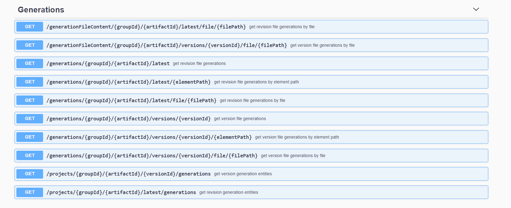

### Artifact Generation 

`Artifact Generations` allow you to generate artifacts per Packagable element. This is 
especially useful when you want to run extra analytics on your elements to artifacts and leverage them in other applications.   
Currently, artifact generations are created by implementing the [Legend Engine](https://github.com/finos/legend-engine) through `ArtifactGenerationExtension` interface.
These implementations have been wired throughout the rest of the [Legend](https://github.com/finos/legend) framework. This is done by [Legend SDLC](https://github.com/finos/legend-sdlc) running the 
artifact generation for each [Legend Studio](https://github.com/finos/legend-studio) project and publish it as part of the file generation jar. [Legend Depot](https://github.com/finos/legend-depot)
reads these artifacts and cached them to provide rich apis for users to query. 


### Defining ArtifactGenerationExtension
To begin you should start by defining your artifact generation extension by implementing `ArtifactGenerationExtension`. 
Each extension requires a `key` which must be unique inside your server instance. We will validate this in all usages of 
this extension.  The main method of this extension is the `generate` method which defines the generation 
logic for your element and returns artifacts to publish.

```JAVA
public interface ArtifactGenerationExtension
{
    /**
     * Gives the key for the extension
     *
     * @return string
     */
    String getKey();

    /**
     * Determines whether a packageable element can generate artifacts
     *
     * @return boolean flag indicating if the extension can generate artifacts
     */
    boolean canGenerate(PackageableElement element);

    /**
     * Generates artifacts given a packageable element. Methods assumes element can generate
     * artifacts
     *
     * @return a list of GenerationOutput
     * @throws RuntimeException if unable to generate artifacts.
     */
    List<Artifact> generate(PackageableElement element, PureModel pureModel,
        PureModelContextData data, String clientVersion);

}
```

You should define your extension in its own module with specific tests to test the generation code. Additionally, your module should be added to the dependencies of
`legend-engine-server` (to be loaded up to the engine server for the artifact generation api), `legend-engine-extensions-collection-generation` (added as a dependency to studio projects to be leveraged in 
build pipeline and depot). When adding it to `legend-engine-extensions-collection-generation`, update `TestExtensions`, specifically the `testExpectedArtifactGenerationExtensionsArePresent` method with your artifact generation extension.
For an example see `DataSpaceAnalyticsArtifactGenerationExtension`, used to analysis information about 
a DataSpace which is later leveraged by Legend Query to increase performance.

### File Generation Jar
For each [Legend Studio](https://github.com/finos/legend-studio) project there is a build pipeline defined and maintained through code in [Legend SDLC](https://github.com/finos/legend-sdlc)
through the project structure logic. Each project structure version has a structure of maven modules as well as build steps for each version.
Artifact Generation extensions are processed as part of the [FileGenerationMojo](https://github.com/finos/legend-sdlc/blob/master/legend-sdlc-generation-file-maven-plugin/src/main/java/org/finos/legend/sdlc/generation/file/FileGenerationMojo.java). This maven mojo compiles your entities
into the `PureModel` graph as well as loads all your ArtifactGenerationExtensions and runs all generations from the extensions. 

It then packages the generated artifacts into the file-generation-jar and publishes it depending on the maven repo defined in your project. 
When packaging the files, the element's name, extension key and artifact file name are used as followed. 
`{elementFilePath}/{extensionKey}}/fileName`. 
An `elementFilePath`is calculated by using each package as a folder with the last folder being the element name. 
For example, say we add an ArtifactGenerationExtension with the key 'example' that runs on an element called
'model::MyElement', which produces file `Generaton.txt`. This file would be packaged into a file with path
`model/MyElement/example/Generation.txt`. 

**IMPORTANT**
Legend Depot expects each artifact it reads and provides via its apis, through the file-generation-jar, to 
be produced by one of the entities in the project. This is why the artifacts are packaged by [Legend SDLC](https://github.com/finos/legend-sdlc) in this manner. 
To calculate `elementFilePath` the function `org.finos.legend.pure.m3.navigation.PackageableElement.PackageableElement.getUserPathForPackageableElement`
is leveraged which uses the compiled `PureModel` to get the element full path. Although there are compilation checks to verify your element has name and path, you should ensure your element
produces the correct elementFilePath with this function as all those checks have not been checked in yet. 


### Legend Depot

[Legend Depot](https://github.com/finos/legend-depot) provides rich apis to be able to access your generated artifacts.  During a version update,
[Legend Depot](https://github.com/finos/legend-depot) processes all the artifacts published in your maven repo and provides them through the Generation Apis. 
As seen below these apis, allows users to query their Artifacts by `filePath` or even the `elementPath` representing the element that generated these artifacts.

