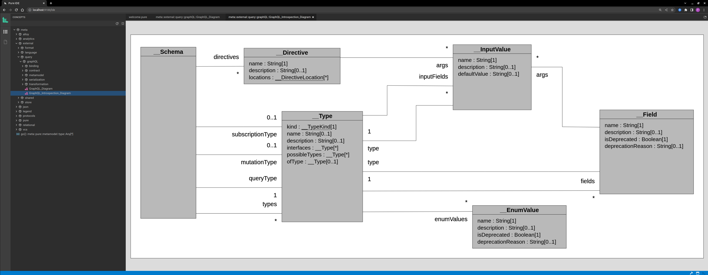

&nbsp;&nbsp;&nbsp;&nbsp;&nbsp;&nbsp;&nbsp;&nbsp;&nbsp;&nbsp;&nbsp;&nbsp;&nbsp;&nbsp;&nbsp;

## GraphQL / Legend Integration

<a href='https://legend.finos.org/'>Legend</a> provides a modeling environment that helps users:
- Build <a href='https://github.com/finos/legend-engine/blob/94cd0aff3b314e568e830773f7200c8245baa09b/legend-engine-xt-relationalStore-pure/src/main/resources/core_relational/relational/tests/modelWithConstraints.pure#L1-L37'>concept graphs</a> (implementing <a href='https://en.wikipedia.org/wiki/Class_diagram'>UML class diagram</a>)
- <a href='https://github.com/finos/legend-engine/blob/94cd0aff3b314e568e830773f7200c8245baa09b/legend-engine-xt-relationalStore-pure/src/main/resources/core_relational/relational/tests/mapping/sqlFunction/testSqlFunctionsInMapping.pure#L1225-L1294'>Map</a>  concepts to <a href='https://github.com/finos/legend-engine/blob/94cd0aff3b314e568e830773f7200c8245baa09b/legend-engine-xt-relationalStore-pure/src/main/resources/core_relational/relational/tests/mapping/sqlFunction/testSqlFunctionsInMapping.pure#L1201-L1223'>data sources</a>
- Define <a href='https://github.com/finos/legend-engine/blob/94cd0aff3b314e568e830773f7200c8245baa09b/legend-engine-xt-relationalStore-pure/src/main/resources/core_relational/relational/tests/advanced/testQueryStructure.pure#L363-L371'>queries</a> leveraging concepts (and have the platform execute them by translating them to data source queries)

Queries are built using a proprietary language that supports, among other things, <a href='https://github.com/finos/legend-engine/blob/94cd0aff3b314e568e830773f7200c8245baa09b/legend-engine-pure-code-compiled-core/src/main/resources/core/pure/graphFetch/tests/testCrossStoreGraphFetch.pure#L184-L203'>'graph fetch'</a> within the concept graph. It was thus natural to think about building a bridge to the GraphQL protocol which provides a popular standard alternative!

This document describes the process followed to build this integration, and to make Legend a GraphQL compliant end-point for 'query' ('mutation' and 'subscription' coming later).

The diagram below displays the different modules supporting this feature and their dependencies. Atomicity of functionality is an important design concern; it enables the possibility of consuming isolated parts of the system. For example, the grammar parser that builds a Java object tree out of a GraphQL document can be leveraged without pulling any superfluous dependencies.
 
 
 

Legend engine XT graphQL modules

 
 
 

### Metamodel

The GraphQL metamodel was built by reading the <a href='https://spec.graphql.org/October2021/'>GraphQL specification</a> and by translating it into a <a href='https://github.com/finos/legend-engine/tree/master/legend-engine-xt-graphQL-pure-metamodel/src/main/resources/core_external_query_graphql_metamodel'>Pure model</a>. The screenshot below has been taken from the Pure Light IDE which can be started using this java <a href="https://github.com/finos/legend-engine/blob/94cd0aff3b314e568e830773f7200c8245baa09b/legend-engine-pure-ide-light/src/main/java/org/finos/legend/engine/ide/PureIDELight.java#L36">main</a> method.

GraphQL proposes two different 'Type System' metamodels depending on whether the data is stored on disk (SDL) or whether it is dynamically retrieved from the server (Introspection).

###### SDL

The SDL model is broken into two main sections: the type system (on the left) and the executable (on the right).

GraphQL SDL metamodel

 

###### Introspection

The introspection model is itself expressed using the SDL and, jumping a little ahead, it has been added to Legend using the following <a href="https://github.com/finos/legend-engine/blob/master/legend-engine-xt-graphQL-pure/src/test/java/org/finos/legend/engine/code/core/GenerateIntrospectionPureModel.java">generation</a>.
 
 

GraphQL introspection metamodel

 
 
 

### Protocol

The protocol module only contains a POM file invoking a <a href='https://github.com/finos/legend-engine/blob/94cd0aff3b314e568e830773f7200c8245baa09b/legend-engine-xt-graphQL-protocol/pom.xml#L32-L88'>maven plugin</a> that generates Java POJOs from the metamodel. They are enabled with:
- A <a href="https://en.wikipedia.org/wiki/Visitor_pattern">visitor</a> for each inheritance tree
- The appropriate JAXB annotation for JSON serialization.

The generator is written in <a href="https://github.com/finos/legend-engine/blob/94cd0aff3b314e568e830773f7200c8245baa09b/legend-engine-pure-code-compiled-core/src/main/resources/core/pure/protocol/generation/java/generation.pure#L25">Pure code</a> leveraging our Java generation framework.

The code below illustrates the Java class generation for the 'Selection' Pure class:

    package org.finos.legend.engine.protocol.graphQL.metamodel.executable;

    import com.fasterxml.jackson.annotation.JsonSubTypes;
    import com.fasterxml.jackson.annotation.JsonTypeInfo;
    import com.fasterxml.jackson.annotation.JsonSubTypes.Type;
    import com.fasterxml.jackson.annotation.JsonTypeInfo.Id;
    
    @JsonTypeInfo
    (
        use = Id.NAME,
        property = "_type"
    )

    @JsonSubTypes
    (
        {
            @Type(
                value = Field.class,
                name = "field"
            ),
            @Type(
                value = FragmentSpread.class,
                name = "fragmentSpread"
            ),
            @Type(
                value = InLineFragment.class,
                name = "inLineFragment"
            )
        }
    )

    public abstract class Selection
    {
        public Selection()
        {
        } 

        public abstract <T> T accept(SelectionVisitor<T> var1);
    }

 
 
 

### Grammar & Composer

The GraphQL grammar was found in this <a href="https://github.com/antlr/grammars-v4/blob/master/graphql/GraphQL.g4">repository</a> and slightly <a href="https://github.com/finos/legend-engine/blob/master/legend-engine-xt-graphQL-grammar/src/main/antlr4/org/finos/legend/engine/language/graphQL/grammar/from/antlr4/GraphQL.g4">modified</a> to account for some edge use case.

The <a href='https://github.com/finos/legend-engine/blob/94cd0aff3b314e568e830773f7200c8245baa09b/legend-engine-xt-graphQL-grammar/src/main/java/org/finos/legend/engine/language/graphQL/grammar/from/GraphQLGrammarParser.java#L177'>grammar parser</a> instantiates the generated Protocol classes.

The <a href='https://github.com/finos/legend-engine/blob/94cd0aff3b314e568e830773f7200c8245baa09b/legend-engine-xt-graphQL-grammar/src/main/java/org/finos/legend/engine/language/graphQL/grammar/to/GraphQLGrammarComposer.java#L79'>composer</a> is built using the visitor capability of the protocol classes to transform the protocol back to the GraphQL string form.

Both the parser and the composer were developed by writing <a href="https://github.com/finos/legend-engine/blob/94cd0aff3b314e568e830773f7200c8245baa09b/legend-engine-xt-graphQL-grammar/src/test/java/org/finos/legend/engine/language/graphQL/grammar/test/roundtrip/TestGraphQLRoundtrip.java#L106-L120">roundtrip tests</a> in quick iterations.

 
 
 

### Compiler

The compiler is the place where the Protocol (which is by nature fully serializable and flat) is transformed into a connected graph.

This operation is usually done by instantiating the Pure metamodel classes, so that meta-programs like transpilers can be expressed using the Pure language.

Because of its native Protocol nature, the GraphQL metamodel is fully serializable; thus we don't have to resolve pointers into edge connections, and thus the 'compiler' can be fully generated (using this <a href='https://github.com/finos/legend-engine/blob/94cd0aff3b314e568e830773f7200c8245baa09b/legend-engine-pure-code-compiled-core/src/main/resources/core/pure/protocol/generation/java/generation.pure#L10'>code</a>).

This POM <a href='https://github.com/finos/legend-engine/blob/94cd0aff3b314e568e830773f7200c8245baa09b/legend-engine-xt-graphQL-compiler/pom.xml#L32-L78'>section</a> handles the generation.

The generated code is taking this shape, taking a protocol object and transforming it into a Pure graph class.

    public Root_meta_external_query_graphQL_metamodel_sdl_Definition translate(Definition definition, PureModel pureModel)
    {
    ...
    }

 
 
 

### Integration

The integration module enables the usage of GraphQL expression directly within the Pure language. It makes the GraphQL expression a ValueSpecification which brings two benefits:
- Using the GraphQL language in a Service specification in Legend Studio
- The capability of writing transpiler tests in the Pure IDE Light environment

In Legend Studio:

    let x = #GQL{type ok{id : String}}#;

In Pure IDE Light:

    let x = meta::legend::compileVS('#GQL{type ok{id : String}}#');

    let x = meta::legend::compileVS(readFile('core/file.gql')->toOne());

 

> The Pure system is the 'original' version of Legend and while they share the same language, they have a different compiler. The <a href='https://github.com/finos/legend-engine/blob/94cd0aff3b314e568e830773f7200c8245baa09b/legend-engine-pure-runtime-compiler/src/main/resources/core_external_compiler/compiler.pure#L21'>meta::legend::compileVS(s:String[1]):Any[1]</a> Pure function invokes the Legend compiler and provides the built model in the 'execution' memory instead of inserting the built concepts in the Pure compiled graph.

 
 
 

### Transpiler

Now that we can parse GraphQL expression in the Pure IDE Light, we can start writing some transpilers.

The different use cases are:

###### Type system transformations

- <a href='https://github.com/finos/legend-engine/blob/master/legend-engine-xt-graphQL-pure/src/main/resources/core_external_query_graphql/binding/toPure/sdl/toPure_sdl.pure'>SDL -> Pure</a> &nbsp;&nbsp;&nbsp;&nbsp; -> enables loading GraphQL SDL from file system into Studio
- <a href='https://github.com/finos/legend-engine/blob/master/legend-engine-xt-graphQL-pure/src/main/resources/core_external_query_graphql/binding/fromPure/sdl/fromPure_sdl.pure'>Pure -> SDL</a> &nbsp;&nbsp;&nbsp;&nbsp; -> enables producing GraphQL SDL from Legend specification from within a build pipeline
- <a href='https://github.com/finos/legend-engine/blob/master/legend-engine-xt-graphQL-pure/src/main/resources/core_external_query_graphql/binding/toPure/introspection/toPure_introspection.pure'>Introspection -> Pure</a>  &nbsp;&nbsp;&nbsp;&nbsp; -> enables dynamically loading GraphQL models from server endpoints into Studio
- <a href='https://github.com/finos/legend-engine/blob/master/legend-engine-xt-graphQL-pure/src/main/resources/core_external_query_graphql/binding/fromPure/introspection/fromPure_Introspection.pure'>Pure -> Introspection</a> &nbsp;&nbsp;&nbsp;&nbsp; -> enables Legend as GraphQL endpoint, servicing its model to GraphQL clients

###### Execution directive transformation

- <a href='https://github.com/finos/legend-engine/blob/master/legend-engine-xt-graphQL-pure/src/main/resources/core_external_query_graphql/transformation/transformation_graphFetch.pure'>Execution -> GraphFetch</a>

The 'execution' transpiler transforms a GraphQL executable definition into a Legend Pure GraphFetch tree (metamodel below).
 

Target GraphFetch Metamodel

 
 
Given the model below:
 
 

Test Model

 
Defined in the Legend modeling language (Pure) this way:
 

    Class demo::Query
    {
        allFirms() {demo::Firm.all()}: demo::Firm[*];
        firmByLegalName(l: String[1]) {demo::Firm.all()->filter(f|$f.legalName == $l)->first()}: demo::Firm[0..1];
    }

    Class demo::Firm
    {
        legalName: String[1];
    }

The graphQL query:

    query MyQuery {
        allFirms {
            legalName
        }
    }

Would translate to the following GraphFetch, in grammar form:

    #{
        demo::Query{
            allFirms{
                legalName
            }
        }
    }#

Or as below, in JSON form, showing the instantiation of the GraphFetch metamodel:

    {
        "_type": "rootGraphFetchTree",
        "class": "demo::Query",
        "subTrees": [
            {
                "_type": "propertyGraphFetchTree",
                "parameters": [],
                "property": "allFirms",
                "subTrees": [
                    {
                        "_type": "propertyGraphFetchTree",
                        "parameters": [],
                        "property": "legalName",
                        "subTrees": []
                    }
                ]
            }
        ]
    }

The Query class is actually 'synthetic' (as it doesn't map to a set of instances), so leveraging the implementation of 'allFirms()', the query can be rewritten this way:

    demo::Firm.all()->graphFetch(
        #{
           demo::Firm{
             legalName
           }
        }#
    )

 
 
 

### Plan Generation & Execution

Given the generated function, a mapping and a runtime, Legend can generate an execution plan, using the legacy <a href='https://github.com/finos/legend-engine/blob/de1d6c0966670a4a6a09753b498e2a642d5dfc84/legend-engine-pure-code-compiled-core/src/main/resources/core/pure/executionPlan/executionPlan_generation.pure#L37-L40'>function</a>  

    let tree = #{
       demo::Firm{
         legalName
       }
    }#

    meta::pure::executionPlan::executionPlan(
        |demo::Firm.all()->graphFetch($tree)->serialize($tree),
        demo::Mapping,
        demo::Runtime,
        meta::pure::extension::defaultExtensions()
    )

or with the more <a href='https://github.com/finos/legend-engine/blob/de1d6c0966670a4a6a09753b498e2a642d5dfc84/legend-engine-pure-code-compiled-core/src/main/resources/core/pure/executionPlan/executionPlan_generation.pure#L22-L25'>strategic</a> one (embedding the mapping and runtime within a 'from' marker function):

    meta::pure::executionPlan::executionPlan(
        |demo::Firm.all()->graphFetch($tree)->from(demo::Mapping, demo::Runtime)->serialize($tree),
        meta::pure::extension::defaultExtensions()
    )

The generated plan looks like:

    PureExp
    (
        type = String
        expression =  -> serialize(#{demo::Firm {legalName}}#)
        (
            GlobalGraphFetch
            (
                type = PartialClass[impls=[(demo::Firm | Mapping.demo_Firm)], propertiesWithParameters = [legalName]]
                resultSizeRange = *
                store = demo::MyDB
                localGraphFetchExecutionNode =
                RelationalGraphFetch
                (
                    type = PartialClass[impls=[(demo::Firm | Mapping.demo_Firm)], propertiesWithParameters = [legalName]]
                    nodeIndex = 0
                    relationalNode =
                    SQL
                    (
                        type = meta::pure::metamodel::type::Any
                        resultColumns = [("pk_0", INT), ("legalName", VARCHAR(200))]
                        sql = select "root".id as "pk_0", "root".legal_name as "legalName" from FirmTable as "root"
                        connection = RelationalDatabaseConnection(type = "H2")
                    )
                    children = [
                    ]
                    implementation
                    (
                        calls = _pure.plan_ID.plan.root.n1.localGraph.Execute
                    )
                )
                children = [
                ]
            )
        )
        implementation
        (
            calls = _pure.plan_ID.plan.root.Serialize
        )
    )
    globalImplementationSupport
    (
            ...
    )

 
 
 

### Query

###### Services

The query module provides rest endpoints integrating all the components in order to support the GraphQL protocol.

The development URL requires:
- a projectId and branch (to fetch the metadata)
- a path (within the metadata) to the 'Query' entry type
- paths (within the metadata) to the mapping and runtime 
 

    /api/graphQL/v1/execution/execute/dev/{projectId}/{branch}/query/{queryClassPath}/mapping/{mappingPath}/runtime/{runtimePath}

The production URL requires the maven coordinates of the released metadata (groupId, artifact, version).

    /api/graphQL/v1/execution/execute/prod/{groupId}/{artifact}/{version}/query/{queryClassPath}/mapping/{mappingPath}/runtime/{runtimePath}

###### External Format

The query module also contains the 'external format' <a href='https://github.com/finos/legend-engine/blob/master/legend-engine-xt-graphQL-query/src/main/java/org/finos/legend/engine/query/graphQL/api/format/GraphQLFormatExtension.java'>plugin integration</a> which enables Studio to parse and generate GraphQL schemas.   

 
 
 

