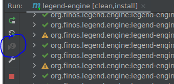

# Final Steps
As the final step of your development, you should run the ```Test_*_PCT.java``` tests which will also pick-up and run the new PCT tests you
defined in earlier steps. Below steps describe one method of running these tests while building.

## Important
> **_Obligatory Warning:_**
The next section should be the **Final Step** and should only happen Once. 
> 
***Maven builds are expensive and should be avoided until absolutely necessary.***

## To Proceed
Run mvn clean install with tests in order to identify any potential tests that could fail due to your new module.
Command for maven clean install:
```
mvn clean install
```

Whenever you run across a failing test:
1. Determine whether the test is an expected failure. If it is expected (e.g. we don't yet support the function on that target),
update the expectedFailures to exclude that test.
   - Add AdapterQualifier argument to the expectedFailure (e.g. `one("testFunctionName", "errorMessage", AdapterQualifier)`).
     - AdapterQualifier.needsInvestigation: used for functions that need to be investigated if they can be supported or unknown if they can be supported
     - AdapterQualifier.unsupportedFeature: used for functions that are known to not be supported on the target platform
     - AdapterQualifier.assertErrorMismatch: used for functions that used assertError but the error message is not matching the expected error message
     - AdapterQualifier.needsImplementation: used for functions that are not yet implemented on the target platform

2. If the failure is unexpected, fix the failure. 

3. Once failure is fixed or excluded via expectedFailures, use the ```Resume Build From Specified Module``` button
   to continue the mvn clean install from where you left off. See image below for the location of the button.



Once it is successfully built, you are ready to submit your PR. Note that if your change is relied upon by downstream repos you 
will need to import and test the SNAPSHOT build in the downstream repos. 


