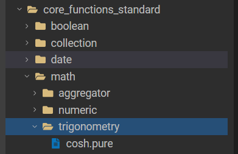
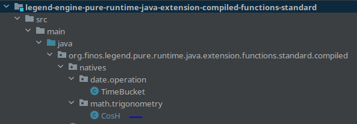

# Contributing Java (aka Native) Platform Functions
This guide assumes you have already:
- [ ] completed the [Dev Setup](overview.md#development-setup),
- [ ] identified the function you want to add,
- [ ] identified where in the [taxonomy](taxonomy.md) it belongs,

In this guide, we will use the addition of the native "**cosh**" function, and subsequent wiring to be able to cross-compile
to target databases, as the example for our walkthrough.

## Determine and Define the Pure Function Signature
All platform functions have a function signature defined in Pure. A Java platform function (also referred to as a "*native*" function),
will differ in two ways:
1. The Java function's Pure Function Signature will have the keyword "native" in it.
2. This function signature will not have a function body written in Pure. The *.pure file will only contain the function signature but no implementation.

Follow steps 1-3 in [the Pure Function How-To Guide](purefunction-howto.md) to create the pure file and function signature for your new function.

##### Example
For "**cosh**", we created a *.pure file here:



The function signature in the file looks like this:
```Java
native function
    <<PCT.function>>
        {
            doc.doc='cosh returns the hyperbolic cosine of a number'
        }
meta::pure::functions::math::trigonometry::cosh(number:Number[1]):Float[1];
```

## How to Run your Native Function
Before we dig into the implementation of the function, it is important to know how can use Pure to call your native function
while you are developing the code in *Java*.

### TestHelper files
There are two *TestFunction_TestHelper_* files in the ```legend-engine-pure-code-functions-standard``` package to help you run Pure code without re-compiling the PureIDE. 
Re-compiling the PureIDE to pick up new Java changes can be slow, it is faster to run your code via:
- ```TestFunction_TestHelper_Interpreted``` - run Pure code in the *Interpreted* execution mode.
- ```TestFunction_TestHelper_Compiled``` - run Pure code in the *Compiled* execution mode.

###### IDE: IntelliJ

If you are unfamiliar, see the [Platform Concepts](concepts-glossary.md#pure-runtime-code-paths) page for an explainer on the Legend code execution modes.

#### Let's take a look at the example Pure code in TestHelper
There is a ```resources/testHelperScratch.pure``` plaintext file for each of the TestHelpers (*compiled* and *interpreted*). 
You can edit, play with, and **execute Pure code directly from IntelliJ by editing this file**!

##### Example
Going back to our **cosh** example, we can call it from the testHelper via editing ```resources/testHelperScratch.pure``` 
to contain pure code that calls the function signature we've defined:
```Java
import meta::pure::functions::math::*;
function test():Any[*]
{
    meta::pure::functions::math::cosh(.5);
}
```

Building and running this unit test will result in the following error:

```Execution error at (resource:testHelper.pure line:4 column:30), "The function 'cosh_Number_1__Float_1_' is not supported by this execution platform"```

This is good. If we can fix these errors and enable our simple snippet to succeed, we will have completed the native Java implementation of our new platform function!

*Note: TestHelpers will not have access to the full universe of Pure functions (e.g. dependencies which core_functions_standard was not built with).
However, it will enable you to complete your native function for the 2 code paths.*

## Adding the Java (native) implementation
Recall that there are two execution modes (interpreted, and compiled) for Legend engine.

### Adding the *"Compiled"* code path
Within the package: ```legend-engine-pure-runtime-java-extension-compiled-functions-standard```, you will need to make changes in 3 places:
1. in the ```natives``` package, add a *.java file, while following the same directory hierarchy as for the *.pure code for your function.
2. ```StandardFunctionsHelper.java``` - Contains the java implementation of the function
3. ```StandardFunctionsExtensionCompiled.java``` - you must import and register your Java implementation here.

##### Example
See **cosh** PR [here](https://github.com/finos/legend-engine/pull/3604/files#diff-e8aa7c61ce30513ab14d1bc07ba10d0a5d57cf7fe62baecaf2272a6255a31dc0)
for modifications to the 3 files mentioned above.



###### Let's take a look at natives/math/trigonometry/CosH.java
Within this Java file, you will add boilerplate code to enable the Legend platform to pick up this new implementation. The key line in the file is:

```Java
super("StandardFunctionGen.cosh", new Class[]{Number.class}, "cosh_Number_1__Float_1_");
```
You will see that there are three params:
1. ```StandardFunctionGen.cosh``` - refers to the function defined in ```StandardFunctionsHelper.java```
2. the second param indicates the Type(s) of the params accepted by the function
3. the last param is the function signature of the new function (*Hint* - we can get this from the TestHelper error output we saw in the earlier step)

To refine our implementation and ensure proper registration, use ```TestFunction_TesterHelper_Compiled``` to execute the pure code (defined in the respective ```testHelperScratch.pure```) that calls
your native function.

### Adding the *"Interpreted"* code path
Within the package: ```legend-engine-pure-runtime-java-extension-interpreted-functions-standard```, you will need to make changes in 2 places:
1. in the ```natives``` package, add a *.java file, while following the same directory hierarchy as for the *.pure code for your function.
2. ```StandardFunctionsExtensionInterpreted.java``` - you must import and register your Java implementation here.

See **cosh** PR [here](https://github.com/finos/legend-engine/pull/3604/files#diff-60ddd057c70f86c5eeb758b771022f16c7ad82e8640a26b6d424d34f2834189b) for the modifications to the 2 files mentioned above.

> **_Note:_** This example has a very simple (one-line) implementation in Java. For more complex logic, the
```legend-engine-pure-runtime-java-extension-shared-functions-standard``` package can be leveraged to ensure that the common
parts of the implementation are not duplicated across execution modes. See [TimeBucketShared.java in the timeBucket PR](https://github.com/finos/legend-pure/pull/943/files#diff-aab5b1a4b8acf90017761a5798f01ea3542a2afd62bac761e69074bf6073e678)
> for an example that leverages the "shared-functions-standard" utility package.

## Adding PCT Tests
Within the same *.pure* file where you defined the pure function signature, you can use the *PureIDE* to write PCT Tests. 
Look at existing functions tagged with stereotype ```<<PCT.test>>``` to get inspiration. Also, check [PCT Test Conventions](conventions.md#pct-tests) for useful tips and a refresher on best practices.
- *If no java changes needed* - In PureIDE, use welcome.pure to execute your tests using the InMemory Adapter and refine your tests.
- *If iterating on java code* - In IntelliJ, use the ```TestHelper``` files (for interpreted and compiled) to run your pure code without recompiling PureIDE

##### Example
```Java
function go():Any[*]
{
  // the below calls the PCT Tests, passing the inmemoryadapter as the param
  let inmemoryadapter = meta::pure::test::pct::testAdapterForInMemoryExecution_Function_1__X_o_;
  meta::pure::functions::math::tests::trigonometry::cosh::testCosH_Identities($inmemoryadapter);
  meta::pure::functions::math::tests::trigonometry::cosh::testCosH_Integers($inmemoryadapter);
  meta::pure::functions::math::tests::trigonometry::cosh::testCosH_Floats($inmemoryadapter);
  meta::pure::functions::math::tests::trigonometry::cosh::testCosH_Eval($inmemoryadapter);
  meta::pure::functions::math::tests::trigonometry::cosh::testCosH_EvalFuncSig($inmemoryadapter);
}
```

### Example PR
The resulting code for [*cosh.pure* can be seen in this PR.](https://github.com/finos/legend-engine/pull/3604/files#diff-e3bc3198a3951d9ac9fd31d38d4de7be98a92d5b31d648ad806d7c35b72d2ac0)

## Next Steps
The next step is to wire your function to run on Relational Database targets. We must instruct the platform on how to "wire" (aka cross-compile) the function
to the target database runtime. See the [Wiring How-To](wiring-howto.md) guide for how to determine what changes are necessary, and the steps to take.