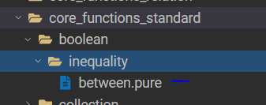
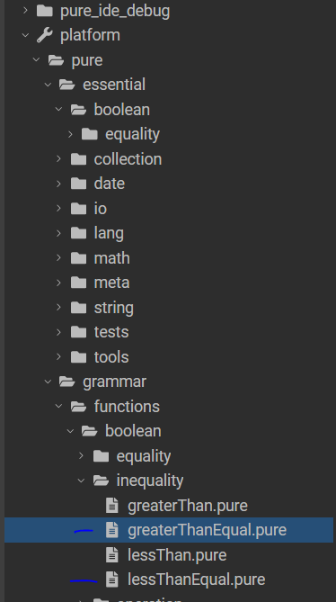

# Contributing Non-native Pure Functions
This guide assumes you have already:
- [ ] completed the [Dev Setup](overview.md#development-setup),
- [ ] identified the function you want to add, 
- [ ] and identified where in the [taxonomy](taxonomy.md) it belongs.

In this guide, we will use the addition of the "**between**" non-native Pure function as an example walkthrough.

## Determine the Function Signature
1. Understand the function contract - parameters, and output. To do this, it is useful to look at the behavior of the the function on at least two target databases. 
E.g. for the "**between**" function, we referenced: 
```
Snowflake - https://docs.snowflake.com/en/sql-reference/functions/between
DuckDb - https://duckdb.org/docs/stable/sql/expressions/comparison_operators.html#between-and-is-not-null
```

## PureIDE
2. Use PureIDE to create a *.pure file in the (taxonomytype)-pure package, e.g. for *BETWEEN*, this file was created here:



3. You can now use PureIDE to edit the file you created in step 2 to add the function signature determined in Step 1. E.g.
```Java
function
    <<PCT.function>>
    {
        doc.doc='between returns true if the value is between inputs lower and upper; all inputs are cast to the same type'
    }
    meta::pure::functions::boolean::between(value:Any[1], lower:Any[1], upper:Any[1]):Boolean[1];
```
4. To help develop the logic for the function body, you can look at similar existing pure functions. Some of these may even be leveraged to implement your new function! E.g. looking at the "essential" functions in PureIDE, we see some similar foundational operators we can use to implement "**between**":



At this step, you can already call your function from welcome.pure! e.g. the below code can be called via F9 in PureIDE

```Java
function go():Any[*]
{
  print(meta::pure::functions::boolean::between(5, 0, 2)->toString());
}
```

5. Once you have the pure logic for your function, add some PCT Tests. You can look at existing functions tagged with stereotype ```<<PCT.test>>``` to get inspiration. Also, check [PCT Test Conventions](conventions.md#pct-tests) for a refresher on best practices.

6. Use welcome.pure to execute your tests using the InMemory Adapter and refine your tests. E.g.

```Java
let inmemoryadapter = meta::pure::test::pct::testAdapterForInMemoryExecution_Function_1__X_o_;

// the below calls the PCT Tests, passing the inmemoryadapter as the param
let inmemoryadapter = meta::pure::test::pct::testAdapterForInMemoryExecution_Function_1__X_o_;
meta::pure::functions::boolean::tests::inequalities::between::testBetween_Number($inmemoryadapter);
meta::pure::functions::boolean::tests::inequalities::between::testBetween_Date($inmemoryadapter);
meta::pure::functions::boolean::tests::inequalities::between::testBetween_String($inmemoryadapter);
meta::pure::functions::boolean::tests::inequalities::between::testBetween_Boolean($inmemoryadapter);
```

### Example PR
The resulting code for [*between.pure* can be seen in this PR.](https://github.com/finos/legend-engine/pull/3560/files#diff-da50cd7ef6784ef2d49ba5994b83b3a18563940b10e0927a265d61f3c5fdcfec)

## Next Step
The next step is to wire your function to run on Relational Database targets. We must instruct the platform on how to "wire" (aka cross-compile) the function
to the target database runtime. See the [Wiring How-To](wiring-howto.md) guide for how to determine what changes are necessary, and the steps to take.
