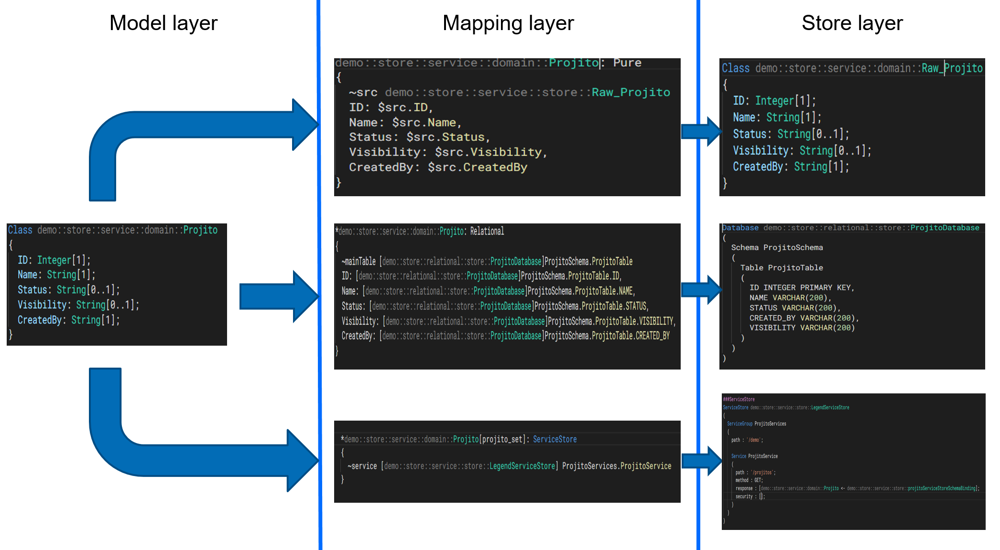
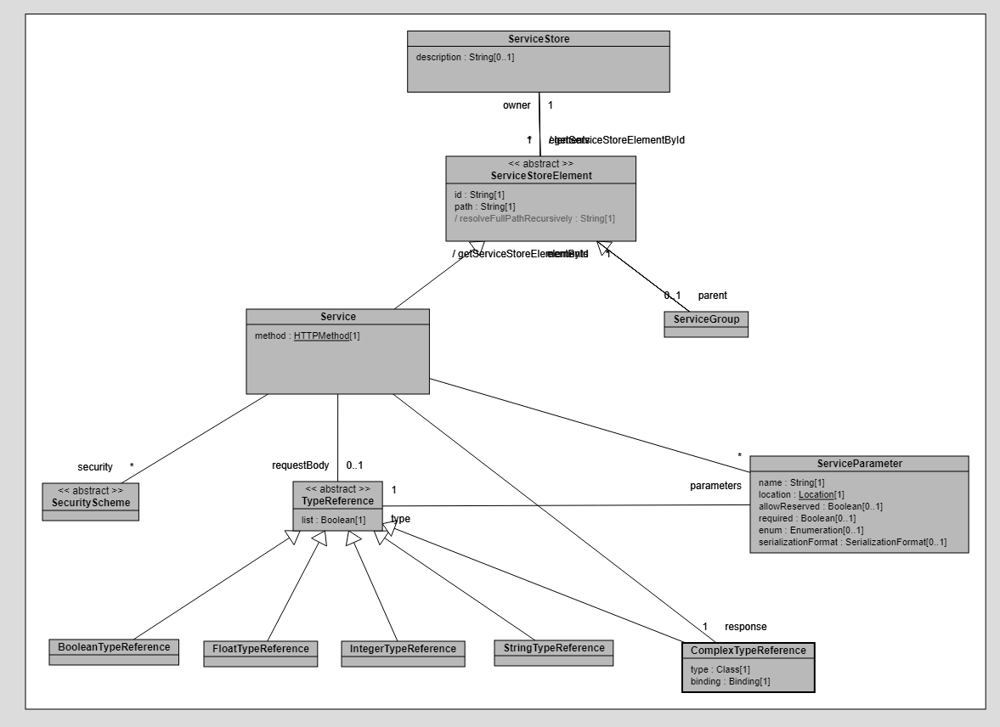
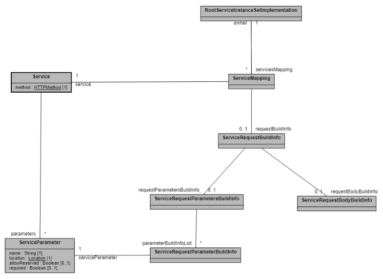
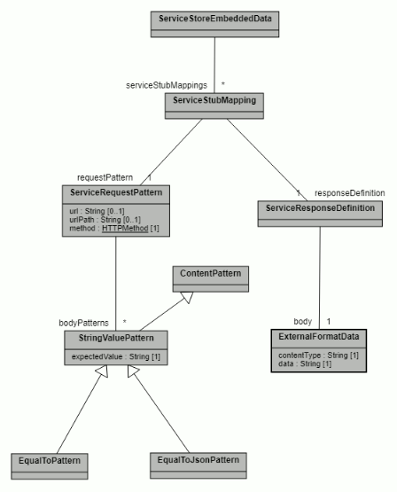

# Service store

Service store is a collection of service definitions. These service definitions correspond to the user's REST endpoints. You can use the service store to model your REST endpoints as stores in Legend, map them to their models, and author Legend services on these models.

## Where does service store fit in Legend/PURE modeling?

Service store is a *type* of store that fits in the store layer, along with a relational (database) and model store.



## Use cases

Service store should be used when users want to transform or model data consumed via REST APIs. Service store allows users to:

- Fetch data from REST APIs and perform transformations on top of it.
- Enrich data from REST APIs by merging it with data fetched from another API/store (e.g. enriching with relational database data) using cross-store/union.

## Restrictions

- Service store only works with graph fetch queries.
- Queries written on top of models mapped to service store can have limited operations in filter expression, as the REST API doesn't allow push-down. Valid operations are:
    - equality (==): Users can equate a model property with a constant value or query parameter. This equality resolves parameters required for executing REST APIs.
    - logical-and (&&): Users can use logical-and to club multiple equalities.

## Service store metamodel and concepts

A single service store definition should contain definitions of all REST APIs hosted by a single server (very similar to a swagger page).

REST APIs hosted by different servers should be defined in different service store.

## Structure

- **Service store**: Service store is a collection of service store elements (defined below). It's modeled with two properties:
    - description: `String`[0..1] : Description for service store.
    - elements :`ServiceStoreElement`[*] :Service store can have multiple service store elements.
- **Service Store Element**:May consist of either Service Group or Service types (defined below). Service store elements define the following two properties (along with additional properties) based on their types:
    - id : `String`[1] : The ID that uniquely identifies the service store element within a scope (defined by Service Group or Service Store). Used for referring to the element in service store mapping (details below).
    - path : `String`[1] : Generates the URL for a REST API. Defines the relative path of an element within the context of its parent.
- **Service Group**:Provides a mechanism to logically group similar services together. Service group path is prefixed to all of its children when generating the URL for the REST API. It's a collection of `ServiceStoreElement` modeled with one property other than the inherited ID and path.
    - elements : `ServiceStoreElement`[*] : Can be another `ServiceGroup` or `Service` which allows for nested service groups. Service store can have multiple nested service store elements.
- **Service**: Models a single REST API definition with the below properties (similar to swagger):
    - id : `String`[1] : Inherited from the Service Store Element.
    - path : `String`[1] : Generates the URL for the REST API. Inherited from Service Store Element.
    - service path: Contains references to all path parameters. See the flow for URL generation below.
    - method : `HTTPMethod`[1] : The HTTP method for the request. Can be one of the following: `GET` or `POST`.
    - parameters : `ServiceParameter`[*] : Defines the structure of path, query, header, and other REST API parameters.
    - requestBody :`TypeReference`[0..1] : Defines a schema to use for the body of a POST request to the API. This shouldn't be defined for GET requests.
    - response :`ComplexTypeReference`[1] : Defines a schema along with deserialization strategy to use for data returned from the request to the REST API. Follows the grammar required to define`ComplexTypeReference` as described below.
    - security : `SecurityScheme`[*] : Defines the security scheme used to guard the REST API (for example, Basic).
- **ServiceParameter**:Service Parameter lets you model parameters of your REST API. It's modelled with these below properties:
    - name : `String`[1] : The name of your parameter.
    - type :`TypeReference`[1] : Specifies the schema of your parameter value.
    - location : `Location`[1] : Specifies location of your parameter (path, query, header, etc).
    - enum :`Enumeration`<Any>[0..1] : Lets you link your service parameter with enum.
    - allowReserved: `Boolean`[0..1] : This is an optional parameter with default value `false`. This should be set to `true` when you don't want Legend platform to use URL encoding for this parameter.
    - required: `Boolean`[0..1]: This is an optional parameter with default value `false`. This should be set to `true` when this parameter is required by the API. Setting this to `true` enforces compilation checks that mapping using the service provides value for this parameter.
    - serializationFormat :`SerializationFormat`[0..1] : If your service parameter takes in a list of values or a non-primitive value, you need to specify the serialization format using style and explode.
    - Details can be found [here](https://swagger.io/docs/specification/serialization/).
- **TypeReference**: TypeReference lets you define schema's for different parts of your service. There are essentially two types:
    - primitive : String, Integer, Float, Boolean. These can specified just by writing the type (Ex: String).
    - complex : For non-primitive parameters you are required to specify the model (explaining the type) and it's serialization scheme using binding concept (e.g. demo:ModelA <- demo:BindingA). Here, BindingA defines the serialization format (JSON/XML/flatdata) and `serializationSchema` for modelA, which is the type. The value should be de-serialized to or serialized from.

  You can specify the schema to accept array for both primitive and complex values just by enclosing them within square brackets. For example:[Integer],[demo:ModelA <- demo:BindingA].
- **SecurityScheme**: Security Scheme lets you define ways to authenticate against the API. 


## Recommendations while modelling your service store

- We recommend grouping REST APIs model into logical groups using Service Group concept.
- We recommend modelling your query parameters in parameters section instead of hardcoding query param into the path.

### Service URL inference

Service URL is generated by appending the following pieces:

- baseUrl - defined in ServiceStoreConnection explained below.
- service group's paths.
- service path.
- service parameters.

`Url => baseUrl + [ordered service group paths]* + service path + serialized service parameter`

#### Example

```java
ServiceStore demo::store::ExampleServiceStore
(
   description : 'ExampleServiceStore';

   // Group1 is the ID of the ServiceGroup
   ServiceGroup Group1																			
   (
      // '/group1' is relative path of the group
      path : '/group1';																			
        
      ServiceGroup Group2
      (
          path : '/group2';

      	  Service RestApi
          (
             // Assuming base url specified in connection is https://myBaseUrl
             // Url for this service will be -> https://myBaseUrl/group1/group2/rest_api
             path : '/rest_api';
             method : GET;
             security : [];
    	     response : [Response <- Binding];
          )
      )
   )
)
```

## Diagram



## Examples

### Example 1

```java
###ServiceStore
ServiceStore meta::external::store::service::showcase::store::TradeProductServiceStore
(
   description : 'Showcase Service Store';

   ServiceGroup TradeServices
   (
      path : '/trades';

      Service AllTradeService
      (
         path : '/allTradesService';
         method : GET;
         security : [];
         response : [meta::external::store::service::showcase::domain::S_Trade <- meta::external::store::service::showcase::store::tradeServiceStoreSchemaBinding];
      )
   )

   ServiceGroup ProductServices
   (
      path : '/products';

      Service ProductByIdService
      (
         path : '/getProductById/{id}';
         method : GET;
         parameters :
         (
            id : String (location = path)
         );
         security : [];
         response : [meta::external::store::service::showcase::domain::S_Product <- meta::external::store::service::showcase::store::prodServiceStoreSchemaBinding];
      )

      Service ProductByIdsService
      (
         path : '/getProductById/{id}';
         method : GET;
         parameters :
         (
            ids : [String] (location = path, style = simple, explode = false)
         );
         security : [];
         response : [meta::external::store::service::showcase::domain::S_Product <- meta::external::store::service::showcase::store::prodServiceStoreSchemaBinding];
      )

      Service ProductByNameService
      (
         path : '/getProductByName';
         method : GET;
         parameters :
         (
            name : String (location = header, required = true)
         );
         security : [];
         response : [meta::external::store::service::showcase::domain::S_Product <- meta::external::store::service::showcase::store::prodServiceStoreSchemaBinding];
      )

      Service ProductByNameAndDescriptionService
      (
         path : '/getProductByNameAndDescription';
         method : GET;
         parameters :
         (
            name        : String (location = query),
            description : String (location = query, allowReserved = true)
         );
         security : [];
         response : [meta::external::store::service::showcase::domain::S_Product <- meta::external::store::service::showcase::store::prodServiceStoreSchemaBinding];
      )
   )
)

###ExternalFormat
Binding meta::external::store::service::showcase::store::tradeServiceStoreSchemaBinding
{
  contentType   : 'application/json';
  modelIncludes : [ meta::external::store::service::showcase::domain::S_Trade ];
}

Binding meta::external::store::service::showcase::store::prodServiceStoreSchemaBinding
{
  contentType   : 'application/json';
  modelIncludes : [ meta::external::store::service::showcase::domain::S_Product, meta::external::store::service::showcase::domain::S_Synonym ];
}
```

## Service store connection

Service store connection has a one-to-one relationship between a serviceStore. In addition to this link, you only need to specify the baseUrl.

### Structure

Service store connection is modelled with two properties:

- store : reference to a service store.
- baseUrl : baseUrl of the host hosting your REST APIs.

### Example

```java
###Connection
ServiceStoreConnection demo::connection::serviceStoreConnection
{
    store   : meta::external::store::service::showcase::store::TradeProductServiceStore;
    baseUrl : 'http://127.0.0.1:6060';
}
```

## Service store mapping

### Structure

#### RootServiceInstanceSetImplementation (a.k.a ServiceClassMapping)

`RootServiceInstanceSetImplementation` lets you map a model to your REST APIs. Service Class Mapping is modelled keeping in mind that an Legend model can be sourced from multiple REST APIs (e.g.- : model Product can be sourced from the following three services using the same class mapping):

- `/getAllProducts` : API which fetches all products.
- `/getProductById?id=xyz` : API which fetches product details for a particular product based on ID.
- `/getProductByName?name=xyz` : API which fetches product details for a particular product based on name.

Which API is used is inferred based on context of the query that the mapping is used with. Using the example of the above three APIs, these can be mapped to the following three queries:

| PURE Query | API used | Comments |
| ------ | ------ | ------ |
| Product.all()->graphFetch(... | /getAllProducts | Since the query has no filter, what the user has essentially specified is to fetch all the products. |
| Product.all()->filter(p &#124; $p.productId == 'xyz')->graphFetch(... | /getProductById?id=xyz | Since the query has a filter on productId, we infer that the user wants a product with that ID and use second API. Note: Assuming that propertyproductId is mapped to parameter ID |
| Product.all()->filter(p &#124; $p.productName == 'xyz')->graphFetch(... | /getProductByName?name=xyz | Since the query has a filter on productName, we infer that the user wants a product with that name and use third API. Note: Assuming that propertyproductName is mapped to parameter name |

`RootServiceInstanceSetImplementation `is modelled with following two properties:

- `servicesMapping` : ServiceMapping[*] : Each service mapping maps the model to one unique service endpoint. Each Service Mapping should map a unique set of properties to service parameters. This is required so that we can infer which API should be used in context of query. Details of service mapping can be found below.
- `localProperties` : Property[*] : `localProperties` are properties of model which are defined/valid only in the context of mapping. These are particularly useful for defining XStore relationships, when the concept that's required for defining this XStore relationships can't be added in logical model. These local properties can be used as a source of parameter. Examples can be found below.

### Service mapping

Service mapping lets you map one service to a model. Each service mapping is modelled with following properties:

- `service` : Service[1] : This is a mandatory field and identifies the API source for this service mapping.
- `pathOffset`: Path[0..1]: This is an optional field which can be used to provide an offset path indicating offset with respect to the response where the data should be read from. This is particularly useful when your API returns data in streaming fashion, but the stream data is wrapped in with some metadata.

#### Example

```java
If the response from an API has the following structure, we can use diff paths to read diff data.
Eg -
1. Firm data can be read with path - `$service.response.firms2`. 
2. Employee data can be read with path - `$service.response.employees`.
```

```json
{
  "metadata":
  {
    "noOfRecords": 3
  },
  "employees" [
  {
    "firstName": "Nancy",
    "lastName": "Fraher",
    "dateOfBirth": "1970-12-13",
    "firmId": 1,
    "isAlive": false,
    "heightInMeters": 1.71
  },
  {
    "firstName": "Jason",
    "lastName": "Schlichting",
    "dateOfBirth": "1968-03-05",
    "isAlive": true,
    "firmId": 2,
    "heightInMeters": 1.82
  },
  {
    "firstName": "Jason2",
    "lastName": "Schlichting",
    "dateOfBirth": "1968-03-05",
    "isAlive": true,
    "firmId": 3,
    "heightInMeters": 1.82
  }],
  "firms": [
  {
    "firmName": "Firm A",
    "firmId": 1,
    "address": [
    {
      "street": "Firm A address"
    }]
  },
  {
    "firmName": "Firm B",
    "firmId": 2,
    "address": [
    {
      "street": "Firm B address 1"
    },
    {
    "street": "Firm B address 2"
    }]
  },
  {
    "firmName": "Firm c",
    "firmId": 3,
    "address": []
  }]
}
```

- `requestBuildInfo`: `ServiceRequestBuildInfo`[0..1]: This is an optional field which is used to model how HTTP requests should be built and populated. It models information about parameter and request body values. Details about this mentioned below.

Each service mapping is validated against the following:

- Response of the service (with offset considered if pathOffset is provided) should match with the model this `serviceMapping` maps to.
- `requestBuildInfo` should contain build information about the request body and required parameters.

### ServiceRequestBuildInfo

`ServiceRequestBuildInfo` models information about how to build requests for your REST API. This models information about generating values for your API parameter, request body, and so on. It's modelled with the following two properties:

- `requestParametersBuildInfo`: `ServiceRequestParametersBuildInfo`[0..1] : This models logic for populating values for your parameters. This is a list of `ServiceRequestParameterBuildInfo` which you can use to model logic/transform for generating value for a particular parameter (more details on `ServiceRequestParameterBuildInfo` below). This list should contain logic for all required parameters.
- `requestBodyBuildInfo`: `ServiceRequestBodyBuildInfo`[0..1] : This models logic for generating value for your API request body. This should be provided if your API is POST and requires `requestBody`. More information about specifying this logic below.

### ServiceRequestParameterBuildInfo

`ServiceRequestParameterBuildInfo` lets you define the source of a parameter value. You have the following four options to choose a source for a parameter value:

- Constant Value -> Ex : 'xyz'
- Model Property -> Ex : $this.productId
- Local Property -> Ex : $this.localProductId
- Transform      -> Ex : $this.productId->split(':')->at(0) + '_123'

### ServiceRequestBodyBuildInfo

`ServiceRequestBodyBuildInfo` lets you define the source for your request body. This should be specified only when you have a POST service requiring request body. You can define the source using PURE grammar, for example:

```pure
    ^TradeDetails(id = '1',
                  product = ^Product(productId = '30', productName = 'Product 30', description = 'Product 30 description'),
                  trader = ^Trader(kerberos = 'dummy', id = 1234))
```

We'll use the binding you linked in your service store to transform this PURE instance into a serialized string.

## Diagram



### Example 1

```java
###Mapping
Mapping meta::external::store::service::showcase::mapping::ServiceStoreMapping
(
  *meta::external::store::service::showcase::domain::S_Trade[s_trade_set]: ServiceStore
  {
     ~service [meta::external::store::service::showcase::store::TradeProductServiceStore] TradeServices.AllTradeService

     ~service [meta::external::store::service::showcase::store::TradeProductServiceStore] TradeServices.TradeByIdService
     (
         ~request
         (
            parameters
            (
                "trade id" = $this.s_tradeId
            )
         )
     )

     ~service [meta::external::store::service::showcase::store::TradeProductServiceStore] TradeServices.TradeByTradeDetailsService
     (
         ~request
         (
            parameters
            (
                "trade.details" = $this.s_tradeDetails
            )
         )
     )

     ~service [meta::external::store::service::showcase::store::TradeProductServiceStore] TradeServices.TradeByTraderDetailsService
     (
         ~request
         (
            parameters
            (
                "trader.details" = $this.s_traderDetails
            )
         )
     )
  }

  *meta::external::store::service::showcase::domain::S_Product[s_prod_set]: ServiceStore
  {
     +s_tradeId: String[1];

     ~service [meta::external::store::service::showcase::store::TradeProductServiceStore] ProductServices.ProductByIdService
     (
         ~request
         (
            parameters
            (
                id = $this.s_tradeId->split(':')->at(0)
            )
         )
     )

     ~service [meta::external::store::service::showcase::store::TradeProductServiceStore] ProductServices.ProductByIdService
     (
         ~request
         (
            parameters
            (
                id = $this.s_productId
            )
         )
     )

     ~service [meta::external::store::service::showcase::store::TradeProductServiceStore] ProductServices.ProductByNameService
     (
         ~request
         (
            parameters
            (
                name = 'product 30'
            )
         )
     )

     ~service [meta::external::store::service::showcase::store::TradeProductServiceStore] ProductServices.ProductByNameAndDescriptionService
     (
         ~request
         (
            parameters
            (
                name = $this.s_productName,
                description = $this.s_description
            )
         )
     )

     ~service [meta::external::store::service::showcase::store::TradeProductServiceStore] ProductServices.ProductByNameAndDescriptionService
     (
         ~request
         (
            parameters
            (
                name = 'product 30',
                description = $this.s_description
            )
         )
     )
  }

  *meta::external::store::service::showcase::domain::Firm[firm_set]: ServiceStore
  {
     ~service [meta::external::store::service::showcase::store::TradeProductServiceStore] FirmServices.FirmByName
     (
         ~request
         (
            parameters
            (
                name = $this.name
            )
         )
     )

     ~service [meta::external::store::service::showcase::store::TradeProductServiceStore] FirmServices.FirmsByNames
     (
         ~request
         (
            parameters
            (
                name = ['FirmA', 'FirmB', 'FirmC']
            )
         )
     )
  }


  meta::external::store::service::showcase::domain::S_Trade_S_Product[s_cross_set]: XStore
  {
    s_product[s_trade_set, s_prod_set]: $this.s_tradeDetails == $that.s_tradeId
  }
)
```

### Example 2

```java
###Mapping
Mapping meta::external::store::service::showcase::mapping::ServiceStoreMapping
(
    *meta::external::store::service::showcase::domain::Person[person_set]: ServiceStore
    {
        ~service [meta::external::store::service::showcase::store::EmployeesServiceStore] EmployeesService
        (
            ~path $service.response.employees
        )
    }

    *meta::external::store::service::showcase::domain::Firm[firm_set]: ServiceStore
    {
        ~service [meta::external::store::service::showcase::store::EmployeesServiceStore] EmployeesService
        (
            ~path $service.response.firms
        )
    }

    meta::external::store::service::showcase::domain::Person[person_set2]: ServiceStore
    {
        +firmId : Integer[1];

        ~service [meta::external::store::service::showcase::store::EmployeesServiceStore] EmployeesServiceByFirmId
        (
            ~path $service.response.employees

            ~request
            (
               parameters
               (
                   firmId = $this.firmId
               )
            )
        )
    }

    *meta::external::store::service::showcase::domain::Employment: XStore
    {
        employees[firm_set, person_set2] : $this.firmId == $that.firmId
    }
)
```

### Example 3

```java
###Mapping
Mapping meta::external::store::service::showcase::mapping::ServiceStoreMapping
(
    *meta::external::store::service::showcase::domain::S_Trade[s_trade_set]: Operation
    {
        meta::pure::router::operations::special_union_OperationSetImplementation_1__SetImplementation_MANY_(s_trade_set1, s_trade_set2)
    }

    meta::external::store::service::showcase::domain::S_Trade[s_trade_set1]: ServiceStore
    {
        ~service [meta::external::store::service::showcase::store::TradeProductServiceStore] TradeServices.AllTradeService1
    }

    meta::external::store::service::showcase::domain::S_Trade[s_trade_set2]: ServiceStore
    {
        ~service [meta::external::store::service::showcase::store::TradeProductServiceStore] TradeServices.AllTradeService2
    }

    *meta::external::store::service::showcase::domain::S_Product[s_product_set]: Operation
    {
        meta::pure::router::operations::special_union_OperationSetImplementation_1__SetImplementation_MANY_(s_product_set1, s_product_set2)
    }

    meta::external::store::service::showcase::domain::S_Product[s_product_set1]: ServiceStore
    {
        ~service [meta::external::store::service::showcase::store::TradeProductServiceStore] ProductServices.AllProductsService1

        ~service [meta::external::store::service::showcase::store::TradeProductServiceStore] ProductServices.ProductByIdService1
        (
             ~request
             (
                parameters
                (
                    id = $this.s_productId
                )
             )
        )
    }

    meta::external::store::service::showcase::domain::S_Product[s_product_set2]: ServiceStore
    {
        ~service [meta::external::store::service::showcase::store::TradeProductServiceStore] ProductServices.AllProductsService2

        ~service [meta::external::store::service::showcase::store::TradeProductServiceStore] ProductServices.ProductByIdService2
        (
             ~request
             (
                parameters
                (
                    id = $this.s_productId
                )
             )
        )
    }

    *meta::external::store::service::showcase::domain::Person[person_set]: Operation
    {
        meta::pure::router::operations::special_union_OperationSetImplementation_1__SetImplementation_MANY_(person_set1, person_set2)
    }

    meta::external::store::service::showcase::domain::Person[person_set1]: ServiceStore
    {
        ~service [meta::external::store::service::showcase::store::EmployeeServiceStore] EmployeeService
    }

    meta::external::store::service::showcase::domain::Person[person_set2]: Pure
    {
        ~src meta::external::store::service::showcase::domain::Person

        firstName : $src.firstName,
        lastName  : $src.lastName,
        firmId    : $src.firmId
    }
)
```

### Example 4

```java
###Mapping
Mapping meta::external::store::service::showcase::mapping::ServiceStoreMapping
(
  *Product[prod_set]: ServiceStore
  {
     ~service [meta::external::store::service::showcase::store::ServiceStoreWithPostServices] ProductServices.ProductBySynonymService
     (
        ~request
        (
            body = ^Synonym(name = 'ABC', type = 'CUSIP')
        )
     )

     ~service [meta::external::store::service::showcase::store::ServiceStoreWithPostServices] ProductServices.ProductBySynonymService
     (
        ~request
        (
            body = ^Synonym(name = $this.productName, type = 'CUSIP')
        )
     )
  }

  *Trade[trade_set]: ServiceStore
  {
     ~service [meta::external::store::service::showcase::store::ServiceStoreWithPostServices] TradeServices.TradesByDetailsService
     (
        ~request
        (
            body = ^TradeDetails(id = '1',
                                 product = ^Product(productId = '30', productName = 'Product 30', description = 'Product 30 description'),
                                 trader = ^Trader(kerberos = 'dummy', id = 1234))
        )
     )
  }


  *Firm[firm_set]: ServiceStore
  {
     ~service [meta::external::store::service::showcase::store::ServiceStoreWithPostServices] FirmServices.FirmDetailsByName
     (
        ~request
        (
            body = ^FirmSearch(legalNames = ['Firm A', 'Firm B', 'Firm C', 'Firm D'])
        )
     )

     ~service [meta::external::store::service::showcase::store::ServiceStoreWithPostServices] FirmServices.FirmDetailsByName
     (
         ~request
         (
             body = ^FirmSearch(legalNames = $this.legalName)
         )
     )
  }

  *Employee[employee_set]: ServiceStore
  {
     +firmName: String[1];

     ~service [meta::external::store::service::showcase::store::ServiceStoreWithPostServices] EmployeeServices.EmployeeDetailsById
     (
         ~request
         (
             body = ^EmployeeSearch(ids = $this.id,
                                    designationsToSearch = ['A', 'B', 'C', 'D'])
         )
     )

     ~service [meta::external::store::service::showcase::store::ServiceStoreWithPostServices] EmployeeServices.EmployeeDetailsByFilters
     (
         ~request
         (
             body = ^EmployeeSearchByFilters
                     (
                        nameFilters = ^NameFilter(firstName = $this.firstName, lastName = $this.lastName),
                        designationFilters = ^DesignationFilter(designation = $this.designation),
                        idFilters = ^IdFilter(id = $this.id)
                     )
         )
     )

     ~service [meta::external::store::service::showcase::store::ServiceStoreWithPostServices] EmployeeServices.EmployeeDetailsById
     (
         ~request
         (
             body = ^EmployeeSearch
                     (
                        ids = $this.id,
                        designationsToSearch = ['A', 'B', 'C', 'D']
                     )
         )
     )

     ~service [meta::external::store::service::showcase::store::ServiceStoreWithPostServices] EmployeeServices.EmployeeDetailsByFirm
     (
         ~request
         (
             body = ^FirmSearch(legalNames = $this.firmName)
         )
     )
  }

  *Employment[firm_set]: XStore
  {
     employees[firm_set, employee_set]: $this.legalName == $that.firmName
  }
)
```

## Service store test data

While building Legend services or using service store for your use case, we highly recommend safe-guarding your use case with tests. To build tests, you can model your test data using the `ServiceStoreEmbeddedData` concept explained below.

### Structure

#### ServiceStoreEmbeddedData

`ServiceStoreEmbeddedData` is the top-level model to help you model your test data for API endpoints. It's modelled as a collection of `ServiceStubMappings` defined below. When you model your test data for an API, you're expected to provide a path only, without the baseUrl (as we spawn a local HTTP server with your test data).

#### ServiceStubMapping

`ServiceStubMapping` models test data for a single `requestPattern`. `requestPattern` is a key word here, as it suggests you can reuse the same service stub mapping for multiple endpoints, if required.

This is modelled with the following two fields:

- `requestPattern` : `ServiceRequestPattern`[1] : Each stub mapping should provide the request pattern modelling when this stub mapping should be triggered.
- `responseDefinition` : `ServiceResponseDefinition`[1] : Each stub mapping should provide the response definition modelling the response to be sent when this stub mapping is triggered.

#### ServiceRequestPattern

`ServiceRequestPattern` models when a particular stub mapping should be triggered for an API call. It models part of an HTTP request, which is matched when the request hits the test HTTP server.

It's modelled with the following fields:

- `httpMethod`: `HTTPMethod`[1] : Each service request pattern should be associated with an http Method indicating type of request it should intercept.
- `url`: `String`[0..1] : url specifies the complete path for this endpoint. It's matched against the incoming request URL. If your API accepts query parameters, URL would be matched with query parameters.
- `urlPath`: `String`[0..1] : urlPath is similar to `url` defined above, except it doesn't include query parameters while matching with incoming http request. Query Parameters are matched by rules specified in the `queryParams` field defined below.
- `headerParams`: `Map`<String, StringValuePattern>[0..1]: This field helps you model rules for your header parameter. It's modelled as a map with parameter name as a the key and rule for matching as value defining rule to match the incoming request parameter. This matching rule is modelled using `StringValuePattern` defined below.
- `queryParams`: `Map`<String, StringValuePattern>[0..1]: This field helps you model rules for your query parameter. It's modelled as a map with parameter name as the key and rule for matching as value defining rule to match incoming request parameter. This matching rule is modelled using `StringValuePattern` defined below.
- `bodyPatterns`: `StringValuePattern`[*]: This field lets you model matching rules to match contents of request body of incoming http request. It's also modelled as `StringValuePattern` defined below.

**Contract**: Each `ServiceRequestPattern` should either have `url` or `urlPath`.

**Recommendations**: You should use `urlPath` when your API accepts `queryParameters`.

### ContentPattern

`ContentPattern` is an abstract concept which defines a rule/pattern which is validated while matching contents of a field with contents in an actual request. It has one subType - `StringValuePattern`.

### StringValuePattern

`StringValuePattern` is a subType of `ContentPattern` which defines rules/patterns to match string contents of a request. It's also an abstract model extended by the following concrete rules:

- `EqualToPattern`: This should be used when you want an exact string match between expected string value and actual string value.

- `EqualToJsonPattern`: This should be used when you want a JSON string match between expected string value and actual string value.

### ServiceResponseDefinition

`ServiceResponseDefinition` lets you model your response when a particular stub mapping is triggered. This is modelled using the `ExternalFormatData` concept defined below.

### ExternalFormatData

`ExternalFormatData` lets you model contents in an external format. It's composed of the following two fields:

- `contentType`: `String`[1] : It indicates the type of data it models (for example, application/json, application/xml).
- `data`: `String`[1] : This is the actual data in string you want to store.

## Diagram



### Example

```java
###Data
Data meta::data::MyData
{
  ServiceStore
  #{
    [
      {
        request:
        {
          method: GET;
          urlPath: '/employees1';
          queryParameters:
          {
            id:
              EqualTo
              #{
                expected: '123';
              }#,
            name:
              EqualTo
              #{
                expected: 'FirstName A';
              }#
          };
        };
        response:
        {
          body:
            ExternalFormat
            #{
              contentType: 'application/json';
              data: '[{"firstName": "FirstName A","lastName": "LastName A","firmId": "A"}]';
            }#;
        };
      },
      {
        request:
        {
          method: GET;
          url: '/employees2';
          headerParameters:
          {
            name:
              EqualTo
              #{
                expected: 'FirstName A';
              }#
          };
        };
        response:
        {
          body:
            ExternalFormat
            #{
              contentType: 'application/json';
              data: '[{"firstName": "FirstName A", "lastName": "LastName A", "firmId": "A"},{"firstName": "FirstName B", "lastName": "LastName B", "firmId": "B"}]';
            }#;
        };
      },
      {
        request:
        {
          method: POST;
          urlPath: '/employees3';
          headerParameters:
          {
            headerParam:
              EqualTo
              #{
                expected: 'FirstName A';
              }#
          };
          queryParameters:
          {
            id:
              EqualTo
              #{
                expected: '123';
              }#
          };
          bodyPatterns:
          [
            EqualToJson
            #{
              expected:'{"name": "FirstName A"}';
            }#
          ];
        };
        response:
        {
          body:
            ExternalFormat
            #{
              contentType: 'application/json';
              data: '[{"firstName": "FirstName A", "lastName": "LastName A", "firmId": "A"},{"firstName": "FirstName B", "lastName": "LastName B", "firmId": "B"}]';
            }#;
        };
      },
      {
        request:
        {
          method: POST;
          url: '/employees4';
          bodyPatterns:
          [
            EqualToJson
            #{
              expected:'{"name": "FirstName A"}';
            }#
          ];
        };
        response:
        {
          body:
            ExternalFormat
            #{
              contentType: 'application/json';
              data: '[{"firstName": "FirstName A", "lastName": "LastName A", "firmId": "A"},{"firstName": "FirstName B", "lastName": "LastName B", "firmId": "B"}]';
            }#;
        };
      }
    ]
  }#
}
```
