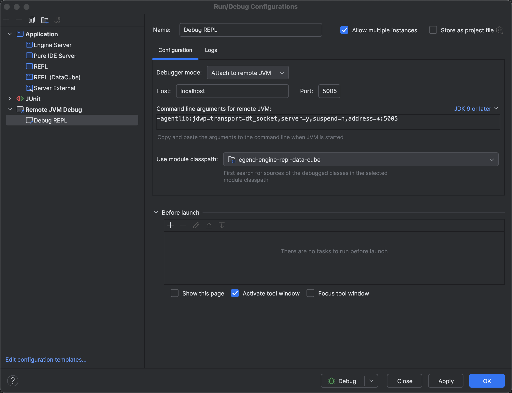
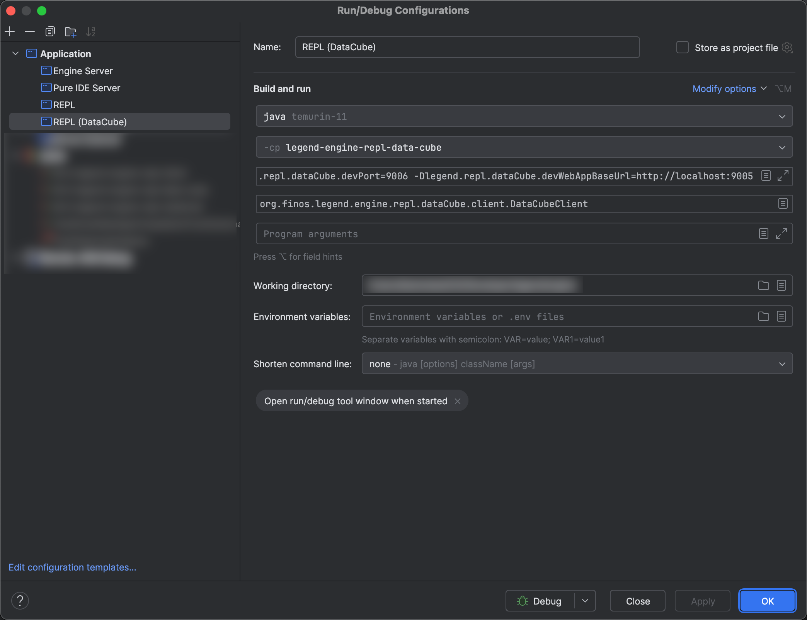

# Legend REPL

## Quick Start

Run the REPL either in IDE (IntelliJ) or assembling a JAR and run the JAR. Within the REPL, to start

> For autocomplete to work properly, it is recommended to run the REPL in a terminal; integrated terminal
> in IDE often override hotkeys / keybindings that are used by the REPL. _Developers are also recommended
> to work in a terminal to better test the interactions._

```sh
help # to see the list of commands

# first load a CSV file into local DuckDB
load data.csv local::DuckDuckConnection test1
# then show the data
#>{local::DuckDuckDatabase.test1}#->sort([])->from(local::DuckDuckRuntime)

# to show the result grid in DataCube
show
# to debug when error occurs, toggle debug mode
debug
```

## Configuration

```shell
java \
  # Specify ag-grid license key for full enterprise functionalities support
  -Dlegend.repl.dataCube.gridLicenseKey=YOUR_LICENSE_KEY \
  
  # [DEVELOPMENT] Specify the base URL for the development instance of the web application
  # this is needed to bypass CORS
  -Dlegend.repl.dataCube.devWebAppBaseUrl=http://localhost:9005 \
  
  # [DEVELOPMENT] By default, the port is randomized, but for development, the port needs
  # to be fixed to allow the web application to connect to the REPL
  -Dlegend.repl.dataCube.devPort=9006 \
  
  -jar legend-engine-repl.jar
```

## Developer Guide

### REPL Development Setup

To debug the REPL, you can either run it in Debug mode in IntelliJ, which would compromise certain features, such as autocomplete
or you can run the REPL in a terminal. You can then setup a Remote JVM Debugger from IntelliJ to attach to the REPL instance.
The exact command to run it can be copied from the command run by IntelliJ (and removing some IntelliJ specifics from the classpath), for example:

```shell
# NOTE: this command has a very long classpath!
java -Dfile.encoding=UTF-8 -classpath ... -Xdebug -agentlib:jdwp=transport=dt_socket,server=y,suspend=n,address=0.0.0.0:5005 org.finos.legend.engine.repl.dataCube.client.DataCubeClient
```

Then, in IntelliJ, start the Remote JVM Debug session with the specified port (5005 like in command above).



### DataCube Development Setup

Configure `legend.repl.dataCube.devWebAppBaseUrl` and `legend.repl.dataCube.devPort`. See screenshot below for an example of
how to configure the REPL in IntelliJ



Or if in a terminal

```shell
# NOTE: this command has a very long classpath!
java -Dfile.encoding=UTF-8 -classpath ... -Dlegend.repl.devPort=9006 -Dlegend.repl.devWebAppBaseUrl=http://localhost:9005 org.finos.legend.engine.repl.dataCube.client.DataCubeClient
```